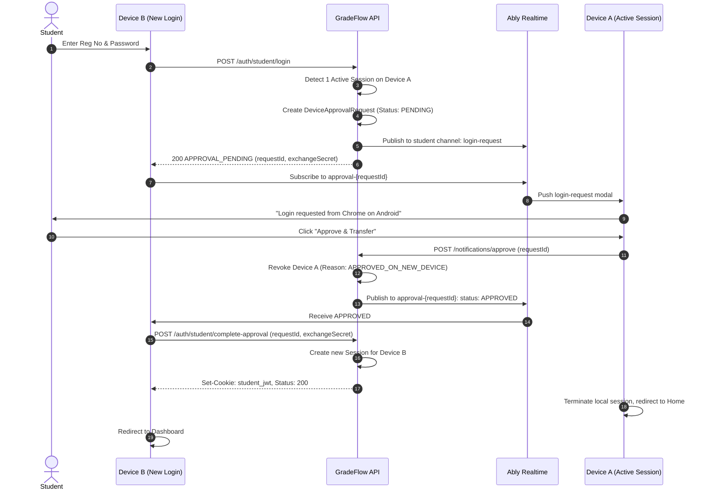
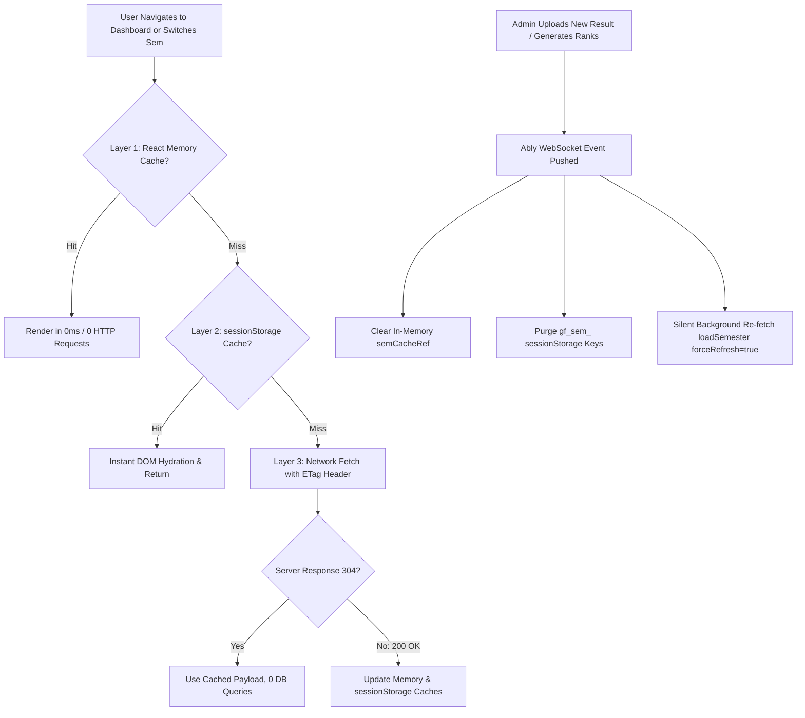
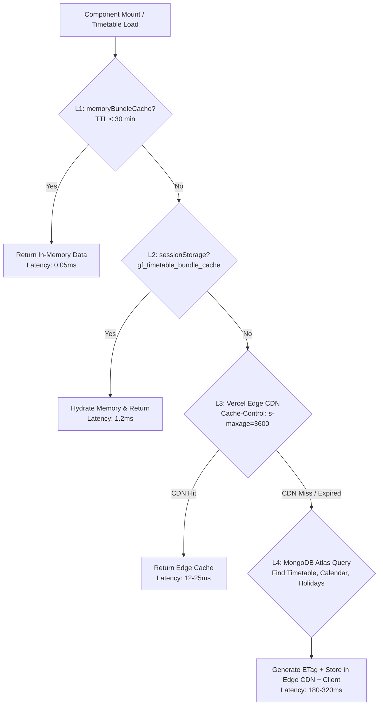
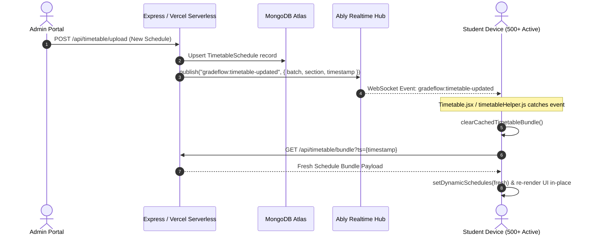
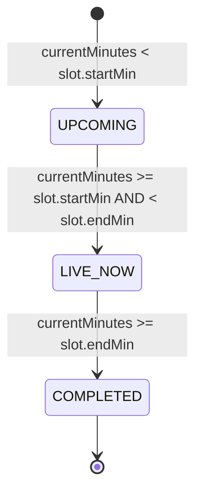
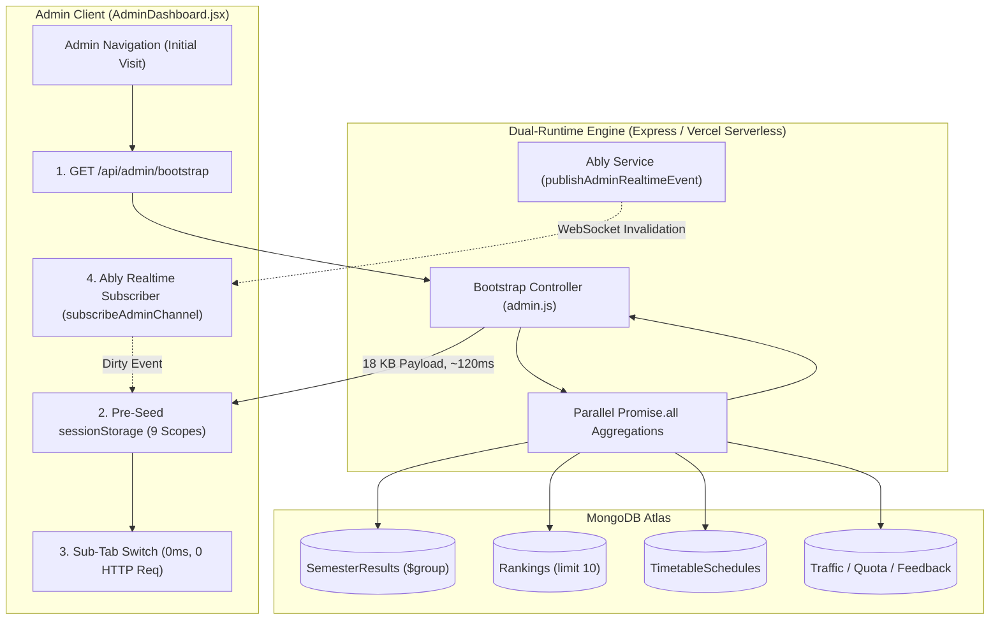
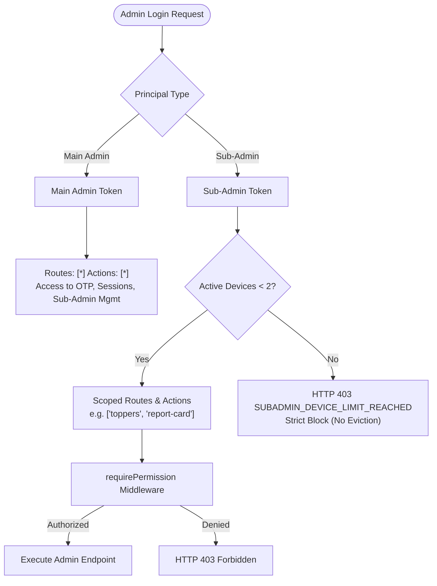
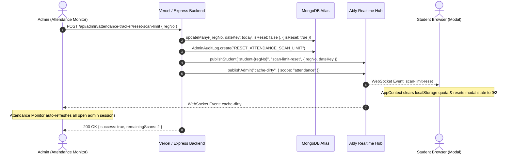

# GRADEFLOW — MASTER ARCHITECTURAL SPECIFICATION & BRAIN REFERENCE
**Document ID:** `GF-DOC-MASTER-BRAIN-001`  
**System Version:** Production 3.4.0  
**Scope:** Complete Architecture — Authentication, Multi-Device Session State Machine, Security Invariants, Real-Time Ably Engine, and Dashboard Subsystems.

---

> **Authoritative Technical Documentation**  
> This document serves as the absolute single source of truth for the entire GradeFlow architecture. Any engineer, auditor, or AI agent reading this document will understand every role, state machine, lifecycle transition, security boundary, caching layer, real-time sync mechanism, and test case across the system.

---

## Master Table of Contents

### Part I: Authentication, Multi-Device Sessions & Security
1. [Architectural Principles & Non-Negotiables](#1-architectural-principles--non-negotiables)
2. [Role Definitions & Permissions Matrix](#2-role-definitions--permissions-matrix)
3. [Device Limits, Inactivity TTLs & Eviction Rules](#3-device-limits-inactivity-ttls--eviction-rules)
4. [Cookie Architecture & Same-Browser Role Isolation](#4-cookie-architecture--same-browser-role-isolation)
5. [Session Lifecycle & Resurrection Immunity](#5-session-lifecycle--resurrection-immunity)
6. [Normal Student Device Approval & Transfer Protocol](#6-normal-student-device-approval--transfer-protocol)
7. [Admin Button Visibility & Global Availability State Machine](#7-admin-button-visibility--global-availability-state-machine)
8. [Zero-Polling Realtime Architecture (Ably)](#8-zero-polling-realtime-architecture-ably)
9. [OTP Rate Limiting, Cooldowns & Daily Quotas](#9-otp-rate-limiting-cooldowns--daily-quotas)
10. [Dual-Runtime Parity (Express Backend vs Vercel Serverless)](#10-dual-runtime-parity-express-backend-vs-vercel-serverless)
11. [Complete Forensic Test Matrix & Expected Outcomes](#11-complete-forensic-test-matrix--expected-outcomes)
11A. [Normal Student 2-Failed-Password Protocol & 5-Minute One-Time Recovery OTP](#11a-normal-student-2-failed-password-protocol-5-minute-one-time-recovery-otp--24-hour-lockout-engine)
11B. [Permanent Administrator & Sub-Administrator Session Architecture](#11b-permanent-administrator--sub-administrator-session-architecture)

### Part II: Dashboard Engine, 5 Subtabs, Caching & Performance
12. [Dashboard Architecture & Design Principles](#12-dashboard-architecture--design-principles)
13. [Route Architecture, URL Obfuscation & Security](#13-route-architecture-url-obfuscation--security)
14. [Multi-Tier Caching & Network Resilience Engine](#14-multi-tier-caching--network-resilience-engine)
15. [Top Profile Header & 4 Hero Stat Cards](#15-top-profile-header--4-hero-stat-cards)
16. [Active Backlogs Alert Accordion & Standing Strip](#16-active-backlogs-alert-accordion--standing-strip)
17. [Subtab 1: Semester Result (`tab === "result"`)](#17-subtab-1-semester-result-tab--result)
18. [Subtab 2: Internal Marks (`tab === "internal"`)](#18-subtab-2-internal-marks-tab--internal)
19. [Subtab 3: Semester History (`tab === "history"`)](#19-subtab-3-semester-history-tab--history)
20. [Subtab 4: Degree Progress / Basket Audit (`tab === "baskets"`)](#20-subtab-4-degree-progress--basket-audit-tab--baskets)
21. [Subtab 5: Target Predictor (`tab === "predictor"`)](#21-subtab-5-target-predictor-tab--predictor)
22. [Branch Isolation & Security Specifications](#22-branch-isolation--security-specifications)
23. [Dashboard Edge Cases & Resilience Safeguards](#23-dashboard-edge-cases--resilience-safeguards)
24. [Developer Maintenance & Extension Guide](#24-developer-maintenance--extension-guide)

### Part III: Timetable & Academic Calendar Engine, Caching & Vercel Architecture
25. [Timetable Architecture & Core Design Philosophy](#25-timetable-architecture--core-design-philosophy)
26. [Database Models & Schema Specifications](#26-database-models--schema-specifications)
27. [Consolidated API Route & Vercel Free-Tier Optimization Engine](#27-consolidated-api-route--vercel-free-tier-optimization-engine)
28. [Multi-Tier Caching Hierarchy (Memory, SessionStorage & Edge CDN)](#28-multi-tier-caching-hierarchy-memory-sessionstorage--edge-cdn)
29. [Real-Time Event-Driven Sync (Ably Pub/Sub Architecture)](#29-real-time-event-driven-sync-ably-pubsub-architecture)
30. [Daily Routine View Engine (`viewMode === "day"`)](#30-daily-routine-view-engine-viewmode--day)
31. [Weekly Matrix View Engine (`viewMode === "week"`)](#31-weekly-matrix-view-engine-viewmode--week)
32. [Academic Calendar Engine (`viewMode === "academic"`)](#32-academic-calendar-engine-viewmode--academic)
33. [University Holidays & Offs Engine (`viewMode === "holidays"`)](#33-university-holidays--offs-engine-viewmode--holidays)
34: [Client CPU & Battery Optimization (Tab Visibility Guard)](#34-client-cpu--battery-optimization-tab-visibility-guard)
35. [Branch Isolation & Security Specifications (CSE vs Non-CSE)](#35-branch-isolation--security-specifications-cse-vs-non-cse)
36. [Admin Timetable Management Pipeline (`TimetableAdminManager`)](#36-admin-timetable-management-pipeline-timetableadminmanager)
37. [Timetable Developer Maintenance & Extension Guidelines](#37-timetable-developer-maintenance--extension-guidelines)

### Part IV: Attendance Tracking, Studio Simulator, Predictive Intelligence & OCR Engine
38. [Attendance Architecture & Core Design Philosophy](#38-attendance-architecture--core-design-philosophy)
39. [Database Models & Schema Specifications (`Attendance`)](#39-database-models--schema-specifications-attendance)
40. [Consolidated Student Profile & Zero-Request Page Switching](#40-consolidated-student-profile--zero-request-page-switching)
41. [Multi-Tier Caching & ETag/304 Revalidation Engine](#41-multi-tier-caching--etag304-revalidation-engine)
42. [Real-Time Dual-Ably Sync & Self-Origin Echo Suppression](#42-real-time-dual-ably-sync--self-origin-echo-suppression)
43. [What-If Simulator Studio (`activeTab === "studio_simulator"`)](#43-what-if-simulator-studio-activetab--studio_simulator)
44. [Target with Schedule Projection Engine (`activeTab === "studio_schedule"`)](#44-target-with-schedule-projection-engine-activetab--studio_schedule)
45. [Miss Impact between Target Analysis (`activeTab === "studio_penalty"`)](#45-miss-impact-between-target-analysis-activetab--studio_penalty)
46. [Safe Margin & Miss Roadmap (`activeTab === "studio_roadmap"`)](#46-safe-margin--miss-roadmap-activetab--studio_roadmap)
47. [Subject Matrix & Routine Catalog (`activeTab === "matrix"`)](#47-subject-matrix--routine-catalog-activetab--matrix)
48. [Daily Routine Check-In Hub (`activeTab === "checkin"`)](#48-daily-routine-check-in-hub-activetab--checkin)
49. [Smart Bunk Analyzer & Future Predictor (`activeTab === "bunk_analyzer"`)](#49-smart-bunk-analyzer--future-predictor-activetab--bunk_analyzer)
50. [AI Vision ERP Screenshot OCR Scanner (`AttendanceScreenshotModal`)](#50-ai-vision-erp-screenshot-ocr-scanner-attendancescreenshotmodal)
51. [Attendance Developer Maintenance & Extension Guidelines](#51-attendance-developer-maintenance--extension-guidelines)

### Part V: Analytics Engine, Performance Intelligence, Caching & Architectural Specification
52. [Analytics Architecture & Zero-Request Intra-Session Caching](#52-analytics-architecture--zero-request-intra-session-caching)
53. [URL Obfuscation, Cryptographic Token Normalization & Redirection Guards](#53-url-obfuscation-cryptographic-token-normalization--redirection-guards)
54. [Academic Health Score & Dynamic Trajectory Computation Engine](#54-academic-health-score--dynamic-trajectory-computation-engine)
55. [Branch Detection & Curriculum Categorization Algorithms](#55-branch-detection--curriculum-categorization-algorithms)
56. [Subtab 1: Performance Trajectory & Momentum Analytics (`tab === "overview"`)](#56-subtab-1-performance-trajectory--momentum-analytics-tab--overview)
57. [Subtab 2: Grade Distribution & Interactive Course Explorer (`tab === "grades"`)](#57-subtab-2-grade-distribution--interactive-course-explorer-tab--grades)
58. [Subtab 3: Placement Readiness & Corporate Eligibility Engine (`tab === "placement"`)](#58-subtab-3-placement-readiness--corporate-eligibility-engine-tab--placement)
59. [Subtab 4: Subject Mastery Radar & Curriculum Dominance Matrix (`tab === "mastery"`)](#59-subtab-4-subject-mastery-radar--curriculum-dominance-matrix-tab--mastery)
60. [Subtab 5: CGPA Goal Predictor & Graduation Ceiling Engine (`tab === "predictor"`)](#60-subtab-5-cgpa-goal-predictor--graduation-ceiling-engine-tab--predictor)
61. [Subtab 6: What-If Simulation Lab & Real-Time Impact Projection (`tab === "whatif"`)](#61-subtab-6-what-if-simulation-lab--real-time-impact-projection-tab--whatif)
62. [Client Render Performance & Memoization Blueprint (`useMemo` & Animated UI)](#62-client-render-performance--memoization-blueprint-usememo--animated-ui)
63. [Vercel Free Tier Quota Invariants & Serverless Optimization](#63-vercel-free-tier-quota-invariants--serverless-optimization)
64. [Real-Time Result Invalidation & WebSocket Ably Pipeline](#64-real-time-result-invalidation--websocket-ably-pipeline)
65. [Analytics Developer Maintenance & Extension Guidelines](#65-analytics-developer-maintenance--extension-guidelines)

### Part VI: Rankings & Leaderboard Engine, Competition Architecture, Multi-Tier Caching & Vercel Optimization Specification
66. [Rankings Architecture & Core Design Philosophy](#66-rankings-architecture--core-design-philosophy)
67. [Database Models & Schema Specifications (`Ranking`, `SystemConfig`)](#67-database-models--schema-specifications-ranking-systemconfig)
68. [Competition Ranking, Dense Dynamic Ranking & Tie-Breaking Algorithms](#68-competition-ranking-dense-dynamic-ranking--tie-breaking-algorithms)
69. [Branch Regex Query Resolution & CSE Section Mapping Engine](#69-branch-regex-query-resolution--cse-section-mapping-engine)
70. [Vercel Serverless Optimization & MongoDB Aggregation Pipeline (`frontend/api/rankings.js`)](#70-vercel-serverless-optimization--mongodb-aggregation-pipeline-frontendapirankingsjs)
71. [Multi-Tier Caching Hierarchy (Memory Singleton, SessionStorage & Edge CDN)](#71-multi-tier-caching-hierarchy-memory-singleton-sessionstorage--edge-cdn)
72. [Synchronous State Hydration & Zero-Flicker Inter-Page Navigation](#72-synchronous-state-hydration--zero-flicker-inter-page-navigation)
73. [Filter State Persistence & In-Flight Request Deduplication (`AbortController`)](#73-filter-state-persistence--in-flight-request-deduplication-abortcontroller)
74. [Leaderboard UI Components: Top 3 Podium, Desktop Matrix & Mobile Cards](#74-leaderboard-ui-components-top-3-podium-desktop-matrix--mobile-cards)
75. [Real-Time Event-Driven Sync (Ably Pub/Sub Architecture)](#75-real-time-event-driven-sync-ably-pubsub-architecture)
76. [Rankings Developer Maintenance & Extension Guidelines](#76-rankings-developer-maintenance--extension-guidelines)

### Part VII: Academic Resources Engine, GPA Simulators, Institutional Scale & Zero-Vercel Architecture
77. [Resources Architecture, Philosophy & Zero-Server Invariant](#77-resources-architecture-philosophy--zero-server-invariant)
78. [Centurion University (CUTM) Official Grading Standard & Grade Point Matrix](#78-centurion-university-cutm-official-grading-standard--grade-point-matrix)
79. [Official SGPA Mathematical Engine & Algorithm](#79-official-sgpa-mathematical-engine--algorithm)
80. [Multi-Semester CGPA Engine & Weighted Cumulative Average](#80-multi-semester-cgpa-engine--weighted-cumulative-average)
81. [Academic Health Index & Multi-Factor Scoring Engine](#81-academic-health-index--multi-factor-scoring-engine)
82. [Target GPA Predictor & Goal Forecasting Engine](#82-target-gpa-predictor--goal-forecasting-engine)
83. [Zero-Request AppContext Synchronization Engine](#83-zero-request-appcontext-synchronization-engine)
84. [Complete Subtabs Catalog & Functional Specification](#84-complete-subtabs-catalog--functional-specification)
85. [Dual Responsive Navigation Architecture (Desktop Sidebar vs Mobile SubNav)](#85-dual-responsive-navigation-architecture-desktop-sidebar-vs-mobile-subnav)
86. [Vercel Free-Tier Resource Safeguards & Performance Invariants](#86-vercel-free-tier-resource-safeguards--performance-invariants)
87. [Resources Developer Maintenance & Extension Guidelines](#87-resources-developer-maintenance--extension-guidelines)

### Part VIII: Student Testimonials & Reviews Engine, Multi-Tier Caching, Verification Guarantee & Zero-Burden Vercel Architecture
88. [Testimonials Architecture, Philosophy & Student Verification Guarantee](#88-testimonials-architecture-philosophy--student-verification-guarantee)
89. [Database Models & Schema Specification (`Feedback.js`, Indexes & Data Isolation)](#89-database-models--schema-specification-feedbackjs-indexes--data-isolation)
90. [Multi-Tier Caching Hierarchy (Vercel Edge CDN, Container Memory Singleton & SessionStorage)](#90-multi-tier-caching-hierarchy-vercel-edge-cdn-container-memory-singleton--sessionstorage)
91. [Zero-Network Sub-Tab Filtering & Client-Side Multi-Criterion Sorting Engine](#91-zero-network-sub-tab-filtering--client-side-multi-criterion-sorting-engine)
92. [Responsive Windowed Pagination & Smooth Review Anchoring Engine](#92-responsive-windowed-pagination--smooth-review-anchoring-engine)
93. [Atomic Likes Architecture, Concurrency Control & Double-Vote Prevention](#93-atomic-likes-architecture-concurrency-control--double-vote-prevention)
94. [Verified Review Submission Protocol, Input Sanitization & Anti-Abuse Guards](#94-verified-review-submission-protocol-input-sanitization--anti-abuse-guards)
95. [UI/UX Component Specifications (Hero Stats, Feedback Cards, Star Picker, Auth Gates)](#95-uiux-component-specifications-hero-stats-feedback-cards-star-picker-auth-gates)
96. [Vercel Free-Tier Resource Quotas, Serverless Guardrails & Zero-Polling Proof](#96-vercel-free-tier-resource-quotas-serverless-guardrails--zero-polling-proof)
97. [Testimonials Developer Maintenance & Extension Guidelines](#97-testimonials-developer-maintenance--extension-guidelines)

### Part IX: Developer Bio & Portfolio Subsystem (About Dev), Zero-Server Edge Delivery, Performance Invariants & Architectural Specification
98. [About Dev Architecture, Philosophy & Zero-Server Edge Invariant](#98-about-dev-architecture-philosophy--zero-server-edge-invariant)
99. [Complete UI/UX Visual Component Matrix & Section Blueprint](#99-complete-uiux-visual-component-matrix--section-blueprint)
100. [Section 1: Developer Hero, Halo Portrait, Fluid Typography & Floating Badges Engine](#100-section-1-developer-hero-halo-portrait-fluid-typography--floating-badges-engine)
101. [Section 2: Multi-Channel Connect Hub, Pre-Filled WhatsApp Deep-Link & Social Cards Matrix](#101-section-2-multi-channel-connect-hub-pre-filled-whatsapp-deep-link--social-cards-matrix)
102. [Section 3: Impact Quote Banner & Aesthetic Branding Specification](#102-section-3-impact-quote-banner--aesthetic-branding-specification)
103. [Theme Isolation State Machine & Non-Destructive Cleanup Protocol](#103-theme-isolation-state-machine--non-destructive-cleanup-protocol)
104. [High-Priority Avatar Delivery, GitHub CDN Fallback Chain & Zero CLS Guarantee](#104-high-priority-avatar-delivery-github-cdn-fallback-chain--zero-cls-guarantee)
105. [Responsive Adaptive Layout Engine & Passive Resize Optimization](#105-responsive-adaptive-layout-engine--passive-resize-optimization)
106. [Vercel Free-Tier Resource Quotas, Zero Serverless Burden & Zero Polling Proof](#106-vercel-free-tier-resource-quotas-zero-serverless-burden--zero-polling-proof)
107. [About Dev Developer Maintenance, Extension & Customization Guidelines](#107-about-dev-developer-maintenance-extension--customization-guidelines)

### Part X: Admin Portal & System Operations Engine, Single-Request Bootstrap, Zero-Polling Caching, Role-Based Access Control, Database Aggregations & Vercel Free-Tier Architecture
108. [Admin Architecture, System Operations Philosophy & Non-Negotiables](#108-admin-architecture-system-operations-philosophy--non-negotiables)
109. [Unified Single-Request Admin Bootstrap Engine (`GET /api/admin/bootstrap`)](#109-unified-single-request-admin-bootstrap-engine-get-apiadminbootstrap)
110. [Zero-Polling Reactive Cache Engine & Ably Invalidation Lifecycle (`adminRealtimeCache.js`)](#110-zero-polling-reactive-cache-engine--ably-invalidation-lifecycle-adminrealtimecachejs)
111. [Dual-Runtime Parity & API Action Router (`Express` vs `Vercel Serverless`)](#111-dual-runtime-parity--api-action-router-express-vs-vercel-serverless)
112. [Granular Role-Based Access Control (RBAC), Main Admin vs Sub-Admin & Device Security](#112-granular-role-based-access-control-rbac-main-admin-vs-sub-admin--device-security)
113. [Database Models, Schema Invariants & Compound Indexing Strategy](#113-database-models-schema-invariants--compound-indexing-strategy)
114. [Subtab 1: Academic Data Ingestion, Excel Processing & Formula Sanitization (`tab === "overview"`)](#114-subtab-1-academic-data-ingestion-excel-processing--formula-sanitization-tab--overview)
115. [Subtab 2: Missing Students Differential Ingestion Engine (`tab === "missing-uploader"`)](#115-subtab-2-missing-students-differential-ingestion-engine-tab--missing-uploader)
116. [Subtab 3: Student Report Card Editor & Dynamic Grade Sheet Generator (`tab === "report-card"`)](#116-subtab-3-student-report-card-editor--dynamic-grade-sheet-generator-tab--report-card)
117. [Subtab 4: Section Academic Toppers & Multi-Tier Filter Engine (`tab === "toppers"`)](#117-subtab-4-section-academic-toppers--multi-tier-filter-engine-tab--toppers)
118. [Subtab 5: Backlog Tracker, Candidate-Filtered Queries & Notification Emailer (`tab === "backlogs"`)](#118-subtab-5-backlog-tracker-candidate-filtered-queries--notification-emailer-tab--backlogs)
119. [Subtab 6: Live Student Traffic, Surge Queue & Maintenance State Machine (`tab === "live-traffic"`)](#119-subtab-6-live-student-traffic-surge-queue--maintenance-state-machine-tab--live-traffic)
120. [Subtab 7: Vercel Free-Tier Quota Sentinel & Usage Telemetry Engine (`tab === "vercel-quota"`)](#120-subtab-7-vercel-free-tier-quota-sentinel--usage-telemetry-engine-tab--vercel-quota)
121. [Subtab 8: Timetable & Routine Admin Orchestrator (`tab === "timetable"`)](#121-subtab-8-timetable--routine-admin-orchestrator-tab--timetable)
122. [Subtab 9: Campus-Wide Broadcast Notifications & Interactive Links Engine (`tab === "broadcast-notifications"`)](#122-subtab-9-campus-wide-broadcast-notifications--interactive-links-engine-tab--broadcast-notifications)
123. [Subtab 10: Attendance Tracker Monitoring & Risk Spectrum Analytics (`tab === "attendance-monitor"`)](#123-subtab-10-attendance-tracker-monitoring--risk-spectrum-analytics-tab--attendance-monitor)
124. [Subtab 11: Student Testimonial Moderation Hub (`tab === "feedback"`)](#124-subtab-11-student-testimonial-moderation-hub-tab--feedback)
125. [Subtab 12: Student Session & Multi-Device OTP Management (`tab === "otp-management"`)](#125-subtab-12-student-session--multi-device-otp-management-tab--otp-management)
126. [Subtab 13: Sub-Admin Lifecycle, Granular Permissions & Session Security (`tab === "admin-management"`)](#126-subtab-13-sub-admin-lifecycle-granular-permissions--session-security-tab--admin-management)
127. [Subtab 14: System Maintenance, 5-Year Batch Lifecycle Purge & Global Recomputation (`tab === "manage"`)](#127-subtab-14-system-maintenance-5-year-batch-lifecycle-purge--global-recomputation-tab--manage)
128. [Vercel Free-Tier Resource Quotas, Serverless Guardrails & Zero Polling Proof](#128-vercel-free-tier-resource-quotas-serverless-guardrails--zero-polling-proof)
129. [Admin Developer Maintenance, Code Extension & Security Hardening Guidelines](#129-admin-developer-maintenance-code-extension--security-hardening-guidelines)


---

# PART I: AUTHENTICATION, MULTI-DEVICE SESSIONS & SECURITY

---

## 1. Architectural Principles & Non-Negotiables

GradeFlow's authentication system operates under strict production engineering invariants:

1. **Zero Polling**:
   - No `setInterval` or `setTimeout` loops for querying auth status, device approvals, or admin button visibility.
   - Initial load uses **one single coordinated bootstrap** (`GET /api/auth/bootstrap`).
   - Subsequent state changes are pushed via **Ably WebSocket events**.
2. **Server is Authoritative**:
   - Client variables, localStorage, route changes, or cookies NEVER dictate session validity or device counts.
   - Active device count is calculated on the server from non-expired, active MongoDB session records.
3. **Targeted Exact-Session Revocation**:
   - Sessions are identified by unique `sessionId` (UUIDv4).
   - Logging out Device A MUST NEVER invalidate Device B by matching `userAgent` or IP guesswork.
4. **Mutual Role Isolation**:
   - Student credentials (`student_jwt`) and Admin credentials (`jwt`) coexist independently in the same browser.
   - Deleting one cookie or logging out of one role leaves the other role completely untouched.
5. **Dual-Runtime Parity**:
   - GradeFlow runs on both an Express development backend (`backend/routes/auth.js`) and a Vercel Serverless environment (`frontend/api/auth.js`).
   - Both runtimes share identical session validation logic, constants, and cryptographic token handling.

---

## 2. Role Definitions & Permissions Matrix

| Role | Identifier | Auth Credential | Max Concurrent Devices | Target Portal |
|---|---|---|---|---|
| **Normal Student** | Registration Number (`regNo`) | Password / OTP → `student_jwt` | **1 Device** (Transfer on 2nd) | `/dashboard/:regNo` |
| **Special Student** | Hardcoded Reg: `230301120327` | Password / OTP → `student_jwt` | **2 Devices** (Strict Cap) | `/dashboard/:regNo` |
| **Master Admin** | Email / Username | Password + 2FA OTP → `jwt` | **2 Devices** (Strict Cap) | `/admin/dashboard` |
| **Sub-Admin** | Email | Password + 2FA OTP → `jwt` | **2 Devices** (Strict Cap) | `/admin/dashboard` (RBAC) |
| **Guest** | None (Unauthenticated) | None (`student_jwt: null`, `jwt: null`) | N/A | `/` (Public pages) |

---

## 3. Device Limits, Inactivity TTLs & Eviction Rules

```
+-------------------+-------------+-------------------+--------------------+------------------------+
| Role              | Max Devices | Inactivity TTL    | Total Session TTL  | Device Limit Breach    |
+-------------------+-------------+-------------------+--------------------+------------------------+
| Normal Student    | 1           | 7 Days            | 30 Days            | Triggers Approval Flow |
| Special Student   | 2           | 7 Days            | 30 Days            | HTTP 403 (Blocked)     |
| Master Admin      | 2           | None (Permanent)  | 100 Years          | HTTP 403 (Blocked)     |
| Sub-Admin         | 2           | None (Permanent)  | 100 Years          | HTTP 403 (Blocked)     |
+-------------------+-------------+-------------------+--------------------+------------------------+
```

### Detailed Inactivity Behavior:
- **Student Inactivity (7 Days)**:
  `STUDENT_INACTIVITY_TTL_MS = 7 * 24 * 60 * 60 * 1000`  
  If a student does not interact with the app for 7 consecutive days, their session is considered stale and excluded from active session queries, automatically freeing up capacity.
- **Admin & Sub-Admin Sessions (Permanent until Explicit Manual Logout)**:
  `ADMIN_PERMANENT_SESSION_MS = 100 * 365 * 24 * 60 * 60 * 1000` (100 Years)  
  Administrators and Sub-Administrators stay permanently logged in across mobile and desktop devices. Background cleanups never terminate admin sessions due to inactivity. Sessions are strictly terminated ONLY when:
  1. The user explicitly clicks logout (`/api/auth/admin/logout` or `/api/auth/logout`).
  2. An administrator manually revokes the session from the Session Management dashboard table (`/api/admin/sessions/revoke` or `/api/admin/subadmins/sessions/revoke`).
  Visiting students or guest devices never heuristically revoke admin sessions.

---

## 4. Cookie Architecture & Same-Browser Role Isolation

GradeFlow utilizes two separate HttpOnly cookies for credentials, plus one non-sensitive browser presence cookie:

1. **`student_jwt`** (HttpOnly, SameSite=Lax, Path=/, Secure in prod):
   - Contains: `{ regNo, sessionId, role: "student" }`.
   - Used strictly for student portal access and endpoints (`/api/student/*`, `/api/auth/student/*`).
2. **`jwt`** (HttpOnly, SameSite=Lax, Path=/, Secure in prod):
   - Contains: `{ adminId, sessionId, role: "admin", isSubAdmin: boolean }`.
   - Used strictly for administrative endpoints (`/api/admin/*`, `/api/auth/admin/*`).
3. **`gf_auth_present`** (Non-HttpOnly, SameSite=Lax, Path=/, Max-Age=60 days):
   - Purely a client UI hint (`1` or omitted) indicating *at least one* role is logged in.
   - **Security Guarantee**: Forging `gf_auth_present=1` NEVER grants access. The server validates real cryptographic signatures inside `student_jwt` or `jwt`.

### Mutual Cookie Clearing Rules:
```javascript
// When Student logs out:
res.setHeader("Set-Cookie", "student_jwt=; Path=/; Max-Age=0; Expires=Thu, 01 Jan 1970 00:00:00 GMT");
// Only clear gf_auth_present if NO Admin cookie is present!
if (!cookies.jwt || cookies.jwt === "none") {
  res.appendHeader("Set-Cookie", "gf_auth_present=; Path=/; Max-Age=0; ...");
}

// When Admin logs out:
res.setHeader("Set-Cookie", "jwt=; Path=/; Max-Age=0; Expires=Thu, 01 Jan 1970 00:00:00 GMT");
// Only clear gf_auth_present if NO Student cookie is present!
if (!cookies.student_jwt || cookies.student_jwt === "none") {
  res.appendHeader("Set-Cookie", "gf_auth_present=; Path=/; Max-Age=0; ...");
}
```

### Client-Side Cookie Deletion Reconciliation (Orphaned Session Reaping)
In accordance with the architecture diagram (`Browser: 🔒 Auth Cookie, 🍪 Presence Cookie, 📝 optional hint`):
- **Storage Hints (`gf_admin_session_hint`, `gf_student_session_hint`)**: When authenticated, the browser retains a non-sensitive session identifier in `localStorage`. This hint has ZERO authority and can never be used to authenticate.
- **Bootstrap Reconciliation**: If a user clears cookies in browser DevTools/settings, the next `/api/auth/bootstrap` request sends `x-admin-last-session` and `x-student-last-session`.
- **Server Reconcile**: When the server sees `!adminAuth && clientLastSession`, it atomically marks the orphaned session `isActive: false, revokeReason: "COOKIE_CLEARED_ON_CLIENT"`, re-queries active capacity, and broadcasts the decremented device count over Ably.
- **Post-Bootstrap Cleanup**: If `/api/auth/bootstrap` confirms unauthenticated status, the frontend clears the hints immediately.
- **Logout Cleansing**: Explicit logout (`adminLogout`, `studentLogout`) wipes hints in `finally` and cleanly revokes server records.

---

## 5. Session Lifecycle & Resurrection Immunity

### The Session Document Structure (`AdminSession`, `StudentSession`, `SubAdminSession`):
- `sessionId`: String, UUIDv4, unique index.
- `isActive`: Boolean (`true` = valid, `false` = revoked/logged out).
- `lastActiveAt`: Date (updated on user interactions).
- `expiresAt`: Date (hard TTL index).
- `revokedAt`: Date (timestamp when session was terminated).
- `revokeReason`: String (`EXPLICIT_LOGOUT`, `APPROVED_ON_NEW_DEVICE`, `INACTIVITY_TIMEOUT`, `SECURITY_REVOKE`).

### Resurrection Immunity:
A revoked session (`isActive: false`) must NEVER be resurrected by subsequent calls.
Both runtimes enforce atomic updates:
```javascript
// sessionManager.js
await session.constructor.updateOne(
  { _id: session._id, isActive: true }, // Filter guarantees only currently active sessions can be touched
  { $set: { lastActiveAt: new Date(now) } }
);
```
If `isActive` is `false`, `updateOne` modifies 0 documents. Revoked sessions stay permanently dead.

### Touch Write Throttling:
To prevent MongoDB write contention, `touchAdminSession` and `touchSession` are throttled to **15 seconds**. If a request arrives within 15 seconds of the last touch, the DB write is skipped.

---

## 6. Normal Student Device Approval & Transfer Protocol

Normal Students are strictly limited to **1 active device**. When a second device attempts to log in, GradeFlow initiates a secure, real-time approval handover:



### Key Guarantees:
- **Zero Polling**: Device B does NOT poll `/approval-status`. It listens to Ably channel `approval-{requestId}`.
- **Atomic Handover**: Device A is revoked only when Device A explicitly clicks Approve.
- **Denial Flow**: If Device A clicks Deny, Ably pushes `DENIED`, Device B displays rejection notice, and Device A remains active.
- **Expiration**: Requests expire after 120 seconds.

---

## 7. Admin Button Visibility & Global Availability State Machine

The Admin button in the Navbar and LandingFooter is a **hybrid availability UI element**.

### Visibility Rules:

| Viewer Identity | 0 Active Admin Devices | 1 Active Admin Device | 2 Active Admin Devices |
|---|---|---|---|
| **Master Admin (Logged in this tab)** | ✅ **VISIBLE** | ✅ **VISIBLE** | ✅ **VISIBLE** (Direct dashboard access) |
| **Sub-Admin (Logged in this tab)** | ✅ **VISIBLE** | ✅ **VISIBLE** | ✅ **VISIBLE** (Direct dashboard access) |
| **Special Student (`230301120327`)** | ✅ **VISIBLE** | ✅ **VISIBLE** | ❌ **HIDDEN** |
| **Normal Student (Logged in)** | ❌ **HIDDEN** | ❌ **HIDDEN** | ❌ **HIDDEN** |
| **Guest (Unauthenticated)** | ❌ **HIDDEN** | ❌ **HIDDEN** | ❌ **HIDDEN** |

### State Transitions (Automatic Mode):
- `0 -> 1 Active Devices`: Remains **VISIBLE** for eligible roles.
- `1 -> 2 Active Devices`: Transitions to **HIDDEN** for all non-active tabs.
- `2 -> 1 Active Devices` (One Admin logs out): Transitions from **HIDDEN -> VISIBLE**.
- `1 -> 0 Active Devices` (Last Admin logs out): Transitions to **VISIBLE** for Special Student.

### Component Implementation (`Navbar.jsx` & `LandingFooter.jsx`):
```javascript
let canSeeAdmin = false;
if (adminButtonConfig && adminButtonConfig.mode === "MANUAL") {
  // Manual Override Config
  const roles = adminButtonConfig.allowedRoles || {};
  if (isMainAdminViewer) canSeeAdmin = roles.mainAdmin !== false;
  else if (isSubAdminViewer) canSeeAdmin = roles.subAdmin !== false;
  else if (isSpecialAdminPortalViewer) canSeeAdmin = roles.specialStudent !== false;
  else if (loggedInRegNo) canSeeAdmin = Boolean(roles.allStudents);
  else canSeeAdmin = Boolean(roles.guests);
} else {
  // Automatic System Mode:
  if (isMainAdminViewer || isSubAdminViewer) {
    canSeeAdmin = true; // Logged-in admin always has dashboard button
  } else if (isSpecialAdminPortalViewer) {
    canSeeAdmin = true; // Special Student (230301120327) always has admin portal access when logged in
  } else {
    canSeeAdmin = false; // Normal students & guests never see admin button
  }
}
```

### Route Access Enforcement (`AdminRouteGuard` in `App.jsx`):
- **Direct URL Access to Admin Gate (`/admin`, `/admin/login`)**:
  - Even if a user attempts to navigate directly by typing `/admin` or `/admin/login` into the browser URL bar:
    - If user is NOT already an authenticated Admin:
      - Access is ONLY permitted if **Special Student (`230301120327`) is currently logged in** in this browser session.
      - If a **Normal Student** or **Guest / unauthenticated visitor** navigates to `/admin` or `/admin/login`, they are immediately blocked with the **403 Forbidden Page (`<UnauthorizedState />`)**.
- **Protected Administrative Pages (`/admin/dashboard`, `/admin/traffic`, etc.)**:
  - Strictly requires an active, authenticated administrative session token (`adminToken`). Any unauthenticated attempt displays `<UnauthorizedState />`.

---

## 8. Zero-Polling Realtime Architecture (Ably)

### Channel & Event Map:

| Channel Name | Event Name | Audience | Purpose | Payload |
|---|---|---|---|---|
| `broadcasts-all` | `admin-availability-updated` | All open browser tabs | Syncs Admin button visibility | `{ activeDeviceCount: number, isAdminButtonVisible: boolean }` |
| `broadcasts-all` | `timetable-updated` | All students & visitors | Invalidate timetable cache | `{ version, updatedAt }` |
| `admin-control` | `session-revoked` | Admins | Targeted eviction of revoked admin session | `{ sessionId }` |
| `admin-control` | `feedback-updated` | Admins | Realtime feedback count sync | `{ count }` |
| `student-{regNo}` | `login-request` | Target Student (Active Device) | Prompt for multi-device approval | `{ requestId, device, location }` |
| `approval-{requestId}` | `approval-status` | Requesting Device | Real-time approval result | `{ status: "APPROVED" \| "DENIED" \| "EXPIRED" }` |

### Connection Optimization:
- Exactly **one shared Ably connection** per authenticated role context.
- WebSocket is reused across all SPA routes (does not tear down and recreate on route navigation).
- Event handlers are attached once inside `AppContext.jsx` using stabilized `useCallback` and `useRef` handlers.

---

## 9. OTP Rate Limiting, Cooldowns & Daily Quotas

To protect email delivery and prevent brute-force attacks, GradeFlow enforces multi-layered rate limits and role-specific OTP quotas:

### Role-Based Daily OTP Quota Rules:
1. **Normal Students**:
   - **Daily Quota**: **3 OTP requests per 24-hour rolling window**.
   - **Per-Request Cooldown**: **60 seconds**.
   - **Reset in Admin OTP Management**: Resets counter to **0/3**, cleanly clears `sendTimestamps: []`, `otpSendCount: 0`, and `lastOtpSentAt: null` across `[todayKey, yesterdayKey]`, and removes active `OtpVerification` records.
2. **Special Student (`230301120327`)**:
   - **Daily Quota**: **5 OTP requests per 24-hour rolling window**.
   - **Per-Request Cooldown**: **60 seconds**.
   - **Reset in Admin OTP Management**: Resets counter to **0/5**, cleanly clears `sendTimestamps: []` and active verification records.
3. **Master Administrator**:
   - **Storage**: `StudentDailyLimit` collection with key `ADMIN:<email>` (e.g. `ADMIN:jaganparida35@gmail.com`).
   - **Daily Quota**: **5 OTP requests per 24-hour rolling window**.
   - **Per-Request Cooldown**: **60 seconds** between successive requests.
   - **Attempt Lockout**: 5 failed password attempts triggers a temporary administrative lockout.
   - **OTP Validity**: 3 minutes TTL with bcrypt hash verification.
   - **Reset in Admin OTP Management**: Direct 1-click reset via the **Administrator OTP Limit Management** card (clears rolling limits and unverified OTPs; restores full 5 attempts).

### Student Device Session Revocation Rules:
- **Single Device Session**: Revoking a specific session sets `isActive: false` on that session and publishes an Ably `session-revoked` event with `{ revokedSessionId, sessionId }`. The targeted browser immediately terminates its session and redirects to the home page.
- **Revoke All Sessions**: Revoking all sessions sets `isActive: false` across all active sessions for that student and publishes an Ably `session-revoked` event with `{ allSessionsRevoked: true }`. All connected devices for that student are immediately logged out.

---

## 10. Dual-Runtime Parity (Express Backend vs Vercel Serverless)

GradeFlow maintains strict feature parity between its local Express server and production Vercel serverless functions:

| Feature / Logic | Express Backend (`backend/`) | Vercel Serverless (`frontend/api/`) |
|---|---|---|
| Auth Router Entrypoint | `routes/auth.js` | `api/auth.js` |
| Session Management | `utils/sessionManager.js` | `api/_lib/sessionManager.js` |
| Database Connection | Persistent Mongoose (`server.js`) | Reused Serverless Mongoose (`_lib/db.js`) |
| Realtime Service | `services/ablyService.js` | `api/_lib/ablyService.js` |
| Email Delivery Manager | `utils/emailProviderManager.js` | `api/_lib/emailProviderManager.js` |
| Model Definitions | `backend/models/*.js` | `frontend/api/_lib/models/*.js` |

Any bug fix or logic change applied to `frontend/api/` MUST also be mirrored in `backend/` to maintain 100% test and runtime parity.

---

## 11. Complete Forensic Test Matrix & Expected Outcomes

All 22 core test scenarios must pass without regressions:

| # | Scenario | Expected Outcome | Critical Assertion |
|---|---|---|---|
| **1** | Master Admin 0 devices | Admin button VISIBLE to eligible UI | `activeAdminCount == 0`, button rendered |
| **2** | Master Admin 1st device login | Device 1 authenticated; count = 1 | `activeAdminCount == 1`, button visible |
| **3** | Master Admin 2nd device login | Device 2 authenticated; count = 2 | `activeAdminCount == 2`, button hidden on other tabs |
| **4** | Master Admin 3rd device attempt | HTTP 403 `DEVICE_LIMIT_REACHED` | Devices 1 & 2 remain active; 3rd blocked |
| **5** | Admin A explicit logout | Device A revoked; Device B stays active | Count drops `2 -> 1`; Device B button visible |
| **6** | Admin session under extended inactivity | Session remains active (Permanent 100y) | Never auto-evicts; only manual logout/revocation |
| **7** | Sub-Admin login & 2-device cap | SubAdmin isolated; max 2 devices | SubAdmin cannot access Master Admin settings |
| **8** | SubAdmin RBAC routes | Overview/Toppers allowed; Settings denied | HTTP 403 on unauthorized SubAdmin action |
| **9** | Normal Student login (Device 1) | Exactly 1 active session created | `isSessionValid == true` |
| **10** | Normal Student refresh | Session remains valid; 0 duplicates | No duplicate session inserted |
| **11** | Normal Student 2nd device login | HTTP 200 `APPROVAL_PENDING` | Approval request created in MongoDB |
| **12** | Device A clicks "Deny" | Request marked `DENIED`; A remains active | Device B blocked; Device A untouched |
| **13** | Device A clicks "Approve" | Device A revoked; Device B authenticated | Count = 1; owner transfers to Device B |
| **14** | Special Student 1st & 2nd login | Both devices active simultaneously | Count = 2; both valid |
| **15** | Special Student 3rd device login | HTTP 403 `DEVICE_LIMIT_REACHED` | No OTP generated; 3rd device blocked |
| **16** | Special Student Device 1 logout | Device 1 revoked; Device 2 remains active | Count = 1; Device 2 untouched |
| **17** | Same-browser Student + Admin | Both credentials coexist independently | Student cookie does not overwrite Admin |
| **18** | Same-browser Student logout | Student revoked; Admin remains logged in | `student_jwt` cleared, `jwt` preserved |
| **19** | Same-browser Admin logout | Admin revoked; Student remains logged in | `jwt` cleared, `student_jwt` preserved |
| **20** | Forged `gf_auth_present=1` | Server rejects request (HTTP 401) | Presence cookie grants 0 authorization |
| **21** | Session resurrection attack | Calling `touchSession` on revoked session | Revoked session remains `isActive: false` |
| **22** | SPA Route Navigation | Home -> Admin -> Dashboard -> Home | 0 unnecessary auth requests; 0 count changes |
| **23** | Student 1st Failed Password | HTTP 401 with remaining attempts warning | `failedPasswordAttempts: 1`, 1 attempt left |
| **24** | Student 2nd Failed Password | Auto-transfer to 5-min one-time recovery OTP | `failedPasswordAttempts: 2`, 24h lockout set |
| **25** | Student Page 1 Bypass with Active OTP | `check-status` redirects directly to OTP screen | Password input completely bypassed |
| **26** | Student Page 1 Bypass with Expired OTP | `check-status` blocks with unlock timestamp | Shows exact lock expiration time |
| **27** | Mobile Admin Permanent Session | Phone idle/locked > 1h, visitor accesses site | Admin remains logged in; 0 auto-revocations |

---

## 11A. Normal Student 3-Failed-Password Protocol, Dedicated Recovery Prompt & Anti-Bypass Guard

### 11A.1 Workflow & State Transitions
For all normal students (`rawReg !== "230301120327"`):
1. **First Failed Password Attempt:**
   - Increments `failedPasswordAttempts` to 1.
   - Returns HTTP 401: `Incorrect password. 2 attempts remaining.`
2. **Second Failed Password Attempt:**
   - Increments `failedPasswordAttempts` to 2.
   - Returns HTTP 401: `Incorrect password. 1 attempt remaining.`
3. **Third Failed Password Attempt (Dedicated Intermediate Screen - NO Auto OTP):**
   - Increments `failedPasswordAttempts` to 3.
   - Does **NOT** automatically dispatch OTP or start 24-hour lockout timer.
   - Returns:
     ```json
     {
       "success": true,
       "step": "RECOVERY_PROMPT",
       "code": "FAILED_ATTEMPTS_EXCEEDED",
       "message": "Maximum password attempts reached (3/3). Please request a one-time verification code to reset your password.",
       "regNo": "...",
       "email": "...",
       "maskedEmail": "..."
     }
     ```
   - Frontend renders dedicated, high-security `RECOVERY_PROMPT` card with masked email, warning that password login is disabled, policy details, and a primary button: **"Send One-Time OTP to Email"**.
4. **Explicit Trigger for Recovery OTP (`POST /api/auth/student/send-recovery-otp`):**
   - OTP is dispatched **only when the student explicitly clicks the button**.
   - Validates `failedPasswordAttempts >= 3`.
   - Starts 24-hour lockout window: `recoveryRestrictedUntil = new Date(Date.now() + 24 * 60 * 60 * 1000)`.
   - Generates 6-digit OTP valid for 5 minutes (`expiresAt = new Date(Date.now() + 5 * 60 * 1000)`).
   - Dispatches OTP to registered university email.
   - Transitions frontend to `step = "OTP"` with 5-minute countdown.
5. **Anti-Bypass Protection (Page 1 Interception):**
   - If a student tries to bypass the recovery flow by navigating back to Page 1 or refreshing and re-entering their registration number:
     - **If 3 attempts failed but OTP not yet dispatched:** `/student/check-status` detects `failedPasswordAttempts >= 3` and returns `step: "RECOVERY_PROMPT"`, `pendingRecoveryPrompt: true`. The modal immediately redirects back to the recovery instruction screen. Password entry is completely inaccessible. Direct calls to `login-password` are blocked.
     - **If 5-Minute Recovery OTP is Active:** `/student/check-status` detects `pendingRecoveryOtpActive` and returns `step: "OTP"` with active countdown seconds. The frontend immediately redirects to the OTP verification screen.
     - **If 5-Minute OTP has Expired:** `/student/check-status` detects `recoveryRestrictedUntil > Date.now()` and returns `isBlocked: true, code: "ACCOUNT_TEMPORARILY_LOCKED"`, displaying the exact unlock time (IST).
     - **After 24 Hours Elapsed:** Counters auto-reset (`failedPasswordAttempts = 0`, `recoveryRestrictedUntil = null`); student can log in with password with fresh 3 attempts.
6. **Password Overwrite & Lockout Clearance:**
   - Once verified, student enters new password and confirmation in `student/create-password`.
   - Password is saved, and lockout state is cleared atomically:
     `{ failedPasswordAttempts: 0, lastFailedPasswordAt: null, recoveryRestrictedUntil: null, recoveryOtpCount: 0, recoveryOtpSentAt: null }`.
   - Creates a fresh `StudentSession` and logs student in immediately.

---

## 11B. Permanent Administrator & Sub-Administrator Session Architecture

### 11B.1 Core Tenet: Manual Logout Only
Administrators (`role: "admin"`, both Master Admin and Sub-Admin) stay **permanently logged in** across all devices (Mobile and Desktop) until:
1. The user explicitly performs a manual logout (`POST /api/auth/admin/logout` or `POST /api/auth/logout`).
2. An administrator manually clicks "Revoke Session" from the Session Management dashboard table (`/api/admin/sessions/revoke` or `/api/admin/subadmins/sessions/revoke`).

### 11B.2 Invariants & Defenses Against Auto-Revocation
- **Zero Inactivity Expiration:**
  `ADMIN_PERMANENT_SESSION_MS = 100 * 365 * 24 * 60 * 60 * 1000` (100 Years).
  `cleanExpiredAdminSessions` never revokes active sessions due to inactivity (`lastActiveAt` cutoffs removed).
- **Zero Device-Heuristic Eviction:**
  `/auth/bootstrap` never matches or revokes admin sessions by physical device characteristics when anonymous visitors or students visit GradeFlow.
- **Zero Premature Cookie-Clearing Revocation:**
  `/admin/check-status` is a read-only endpoint that never deletes or revokes sessions in MongoDB if a request arrives temporarily without a cookie.
- **100-Year Token & Cookie TTLs:**
  `jwt.sign` uses `{ expiresIn: "36500d" }`.
  Cookie `Set-Cookie` headers use `Max-Age=3153600000` (100 years) and matching UTC `Expires` headers.

---

# PART II: DASHBOARD ENGINE, 5 SUBTABS, CACHING & PERFORMANCE

---

## 12. Dashboard Architecture & Design Principles

The GradeFlow Dashboard (`frontend/src/pages/Dashboard.jsx`) is the primary student command center. It synthesizes complex academic data from Centurion University of Technology and Management (CUTM)—including semester marks, grade sheets, continuous internal evaluation, chronological semester history, Choice Based Credit System (CBCS) degree basket audit, and end-semester target prediction—into an instantaneous, zero-latency user experience.

### Core Design Principles
1. **Zero UI Freeze (0ms Perceived Latency):** Subtab transitions (`result`, `internal`, `history`, `baskets`, `predictor`) and semester switching execute without blocking UI threads or displaying unnecessary loading spinners. In-memory eager hydration serves cached data in `0ms`.
2. **Multi-Tier Cache Shielding:** Implements an impenetrable 3-layer caching strategy (React Memory $\to$ Browser `sessionStorage` $\to$ Server ETag HTTP 304 Revalidation with a 15-second debounce shield).
3. **Real-Time Database Invalidation:** Uses Ably WebSockets to push instant database updates (results upload, rank generation, attendance sync) directly to connected clients, cleanly evicting stale caches without polling.
4. **Strict Branch Isolation & Access Control:** Restricts department-specific modules (e.g., Attendance tracking, Daily Timetable Routines, Section rankings) to CSE students while cleanly providing alternate high-value metrics (e.g., Academic Health Score, University/Branch rankings) to Non-CSE students without broken UI states.
5. **Print & Export Fidelity:** Generates high-DPI official university transcripts, internal assessment records, and degree audits across PDF, PNG, Excel, and Word formats.

---

## 13. Route Architecture, URL Obfuscation & Security

### 13.1 Route Definition & Path Handling
- **Route:** `/dashboard/:regNo`
- **URL Parameter Extraction:**
  ```javascript
  const { regNo: urlParam } = useParams();
  const regNo = decodeStudentId(urlParam);
  ```
- **Cryptographic Obfuscation (`studentIdEncoder.js`):**
  To prevent unauthorized enumeration or scraping of student registration numbers, the application uses an obfuscation cipher (`encodeStudentId` / `decodeStudentId`). Raw registration numbers (e.g., `230301120001`) are transformed into alphanumeric hex tokens.
- **Auto-Normalization Shield:**
  If a student accesses the dashboard via their raw plaintext registration number, an automatic normalization effect redirects the URL to the obfuscated token:
  ```javascript
  useEffect(() => {
    if (regNo && urlParam && !isEncryptedToken(urlParam)) {
      navigate(`/dashboard/${encodeStudentId(regNo)}`, { replace: true });
    }
  }, [urlParam, regNo, navigate]);
  ```

### 13.2 Dynamic Branch & Section Resolution

#### Branch Resolution (`getDynamicBranch`)
GradeFlow uses a dynamic department parser that extracts the discipline code from any admission batch (2021, 2022, 2023, 2024, 2025, 2026+) based on university registration patterns:
- Digits 3–8: `030111` $\to$ **CIVIL**
- Digits 3–8: `030112` $\to$ **CSE**
- Digits 3–8: `030113` $\to$ **ECE**
- Digits 3–8: `030115` $\to$ **EEE**
- Digits 3–8: `030116` $\to$ **ME**
- Digits 3–8: `030118` $\to$ **BIO**
- Digits 3–8: `030119` $\to$ **MI**
- Digits 3–8: `030123` $\to$ **AERO**
- **Administrative Overrides:** Supports specific transferred students (e.g., `230301180026` overridden to `CSE`, `230301120110` overridden to `ECE`).

#### Section Resolution (`getSectionFromRegNo`)
For CSE students (`230301120...`), sections are deterministically computed based on the last 3 digits of the roll number:
| Roll Range | Section | Roll Range | Section |
| :--- | :--- | :--- | :--- |
| `001` – `060` | **Section A** | `241` – `300` | **Section E** |
| `061` – `120` | **Section B** | `301` – `360` | **Section F** |
| `121` – `180` | **Section C** | `361` – `420` | **Section G** |
| `181` – `240` | **Section D** | `421` – `480` | **Section H** |
| `481` – `549` | **Section I** | Non-standard / Others | **Section J** |

---

## 14. Multi-Tier Caching & Network Resilience Engine

The Dashboard handles high concurrency using a 4-layer defense system:



### Layer 1: In-Memory React State Cache (`semCacheRef`)
- Ref storage: `semCacheRef.current[sem] = { internal, ranking }`.
- When switching between semesters or toggling subtabs in an active session, data is served from memory immediately (0ms).

### Layer 2: Browser `sessionStorage` (`gf_sem_${regNo}_${sem}`)
- When a student reloads the page or navigates between pages (`/analytics` $\to$ `/dashboard`), the dashboard checks `sessionStorage.getItem("gf_sem_" + regNo + "_" + sem)`.
- If found, it instantly renders the gradesheet and rankings before any network handshake completes, eliminating white screens or skeleton flashes.

### Layer 3: Conditional HTTP with 15-Second Debounce Shield
- Handled at both `Dashboard.jsx` and `AppContext.jsx` level.
- Outgoing requests carry the `If-None-Match: <etag>` header.
- The Express/MongoDB backend compares the ETag without performing full deserialization. If unchanged, it returns `304 Not Modified` (~1ms response, 0 DB query overhead).
- A 15-second debounce window prevents students from spamming F5 and overloading the server.

### Layer 4: Real-Time WebSocket Cache Invalidation (Ably Pub/Sub)
- Event Listeners:
  - `gradeflow:results-updated`: Triggers when academic results or semester grade sheets are published.
  - `gradeflow:rankings-updated`: Triggers when department/university standings are recalculated.
- **Eviction Action:**
  1. Wipes `semCacheRef.current = {}`.
  2. Iterates `sessionStorage` and deletes all matching `gf_sem_${cleanReg}_*` keys.
  3. Silently calls `loadSemester(selectedSem, true)` in the background.

### Race Condition & Out-of-Order Shield (`activeSemRequestRef`)
When a student rapidly clicks through Sem 1, Sem 2, Sem 3, and Sem 4, older in-flight HTTP requests could arrive late and overwrite newer data. To prevent this, every request creates a unique `Symbol()`:
```javascript
const reqId = Symbol();
activeSemRequestRef.current = reqId;
// After await Promise.allSettled(...):
if (activeSemRequestRef.current !== reqId) return; // Discard stale response
```

---

## 15. Top Profile Header & 4 Hero Stat Cards

The Hero Area provides immediate academic feedback. On desktop, it displays a full banner and 4 horizontal stat cards; on mobile, it organizes into a 2x2 symmetrical layout that only renders on the default `result` tab to prevent visual clutter.

```
+-------------------------------------------------------------------------------+
| STUDENT IDENTITY: Name | RegNo | Branch | Section (CSE) | Batch | Badges      |
+-----------------------+-----------------------+---------------+---------------+
| CARD 1: Sem SGPA      | CARD 2: Cumul. CGPA   | CARD 3: Credits| CARD 4:       |
| 9.42 / 10             | 8.85 / 10             | 84 / 160 Cleared| Attendance    |
| [=== Blue 94% ===]    | [=== Purple 88% ===]  | [== Sky 52% ==]| 87.5% Eligible|
| Current Sem Score     | Across All Sems       | Degree Progress| 112/128 Class |
+-----------------------+-----------------------+---------------+---------------+
```

### 15.1 Card 1: Semester SGPA
- **Calculation:** Derived via `calculateSemesterMetrics(selectedSemResult.subjects, selectedSem)`.
- **Value:** Floating-point formatted to 2 decimals (`latestSgpa.toFixed(2)`).
- **Scale:** `/10` with active semester indicator badge (`Sem {selectedSem}`).
- **Visual Accent:** 3px bottom progress bar animated to `(latestSgpa / 10) * 100%`.

### 15.2 Card 2: Cumulative CGPA
- **Calculation:** Derived via `calculateCGPA(studentData.results)`.
- **Value:** Across all completed semesters. Clickable to navigate directly to `/analytics/:regNo`.
- **Visual Accent:** Violet theme (`#7c3aed`) with 3px animated progress bar.

### 15.3 Card 3: Credits Cleared
- **Calculation:** Aggregates passed credits (`creditsCleared`) across all completed semesters vs the degree graduation requirement (160 credits).
- **Navigation:** Clicking opens Tab 4: Degree Progress (`baskets`).
- **Visual Accent:** Sky blue theme (`#0284c7`) with progress ratio `(creditsCleared / 160) * 100%`.

### 15.4 Card 4: Attendance (CSE) vs Academic Health (Non-CSE)
Card 4 features dynamic branch-isolation:

#### For CSE Students: Overall Attendance Tracker
- **Calculation (`computeAttendanceSummary`):**
  Aggregates total attended classes $\sum A_i$ and total delivered classes $\sum D_i$ across all subjects from `studentData.attendance.savedSubjects`:
  $$\text{Attendance \%} = \left(\frac{\sum A_i}{\sum D_i}\right) \times 100$$
- **Status Badges:**
  - $\ge 75\%$: Green badge labeled `Eligible`.
  - $< 75\%$: Red badge labeled `Shortage`.
- **Subtext:** Displays attended vs delivered classes (e.g. `112/128 classes · 7 subs`).
- **Empty State:** If the student hasn't logged attendance yet, displays a clean `Set Now →` button with identical card padding and height, opening the Attendance Tracker.

#### For Non-CSE Students: Academic Health Score
Since university attendance data is only scraped/maintained for CSE, Non-CSE students receive an **Academic Health Score** out of 100 instead of a broken or blank attendance card:
$$\text{Health Score} = \min(CGPA \times 5, 50) + \min(SGPA_{\text{latest}} \times 2, 20) + \text{Backlog Points} + \text{Subject Points}$$
- **CGPA Component (Max 50 pts):** Measures cumulative performance ($CGPA \times 5$).
- **SGPA Component (Max 20 pts):** Measures recent momentum ($SGPA \times 2$).
- **Backlog Component (Max 20 pts):** 20 pts if 0 backlogs; penalizes $-5$ pts per active backlog: $\max(0, 20 - (\text{Backlogs} \times 5))$.
- **Curriculum Breadth (Max 10 pts):** 10 pts if enrolled subjects count $> 0$.
- **Health Ratings:**
  - $90 - 100$: **Excellent** (`#16a34a` Green)
  - $75 - 89$: **Good** (`#2563eb` Blue)
  - $60 - 74$: **Average** (`#d97706` Amber)
  - $< 60$: **Needs Attention** (`#dc2626` Red)

---

## 16. Active Backlogs Alert Accordion & Standing Strip

### 16.1 Active Backlogs Accordion
- **Detection:** Filters subjects with failing grades: `FAIL_GRADES = ['F', 'R', 'S', 'M']` (Fail, Repeat, Supplementary, Malpractice).
- **Accordion Header:** Displays active backlog count with a pulsing `#fee2e2` warning indicator and a toggle button (`View Subjects` / `Hide Details`).
- **Subject Item Details:**
  - Subject Name (uppercase)
  - Subject Code in monospace
  - Credit weighting (e.g. `(4 Credits)`)
  - Semester tagged
  - Failing grade badge (`Grade F`)
- **Disclaimer & WhatsApp Support Link:**
  Addresses end-of-degree (EOD) or rechecking exam clearance delays:
  > *"Disclaimer: If you think your backlog is cleared but this website shows this backlog, then it might happen because of missing excel data of your EOD/rechecking result. If you have this excel sheet, please contact the developer to get it updated."*
  Includes an instant WhatsApp direct message link prefilled with the student's inquiry.

### 16.2 University, Department & Section Standings Strip
Provides a single-row comparative standing breakdown for the selected semester:
1. **Univ CGPA Rank:** Overall ranking across the entire university cohort.
2. **Univ SGPA Rank:** Semester SGPA ranking across all university branches.
3. **Branch CGPA Rank:** Standing within the student's specific engineering branch.
4. **Branch SGPA Rank:** Semester standing within the branch.
5. **Section CGPA Rank (CSE Only):** Class standing within the student's section (A–I).
6. **Section SGPA Rank (CSE Only):** Semester class standing within the section.
7. **Percentile Standing:** Displays university percentile (e.g., `Top 4.2% in University`).
- **Deep-Linking:** Clicking any rank cell routes directly to `/leaderboard?highlight=${regNo}&branch=${branch}` with the student's row automatically centered and highlighted.

---

## 17. Subtab 1: Semester Result (`tab === "result"`)

Rendered via `<GradeSheet result={currentResult} studentData={studentData} highlightedSubject={highlightedSubject} />`.

### 17.1 Marksheet Visual Reproduction
The GradeSheet accurately reproduces Centurion University's official examination ledger:
- **Header:** CUTM insignia, university name, academic year, semester title, and student metadata (Name, Regd No, Branch, Batch).
- **Tabular Ledger:**
  | Column | Description |
  | :--- | :--- |
  | **Code** | Official course code (e.g. `CUTM1011`) in monospace |
  | **Course Name** | Full descriptive title |
  | **Type** | Theory, Practice, or Project |
  | **Credits ($C_i$)** | Course credit weighting |
  | **Grade ($G_i$)** | Letter grade (`O`, `E`, `A`, `B`, `C`, `D`, `F`, `R`, `S`, `M`) |
  | **Grade Points ($GP_i$)** | Numeric points: $O=10, E=9, A=8, B=7, C=6, D=5, F=0$ |
  | **Credit Points ($CP_i$)** | Product of Credits and Grade Points: $CP_i = C_i \times GP_i$ |

### 17.2 Mathematical Formulas for GPA
The ledger renders exact mathematical calculations:

#### Semester Grade Point Average (SGPA)
$$\text{SGPA} = \frac{\sum_{i=1}^{n} (C_i \times GP_i)}{\sum_{i=1}^{n} C_i}$$
Where:
- $C_i$ is the credit assigned to subject $i$.
- $GP_i$ is the grade point earned in subject $i$.
- Courses with failing grades ($F, R, S, M$) contribute credits to the denominator but yield $0$ grade points in the numerator.

#### Cumulative Grade Point Average (CGPA)
$$\text{CGPA} = \frac{\sum_{j=1}^{m} \sum_{i=1}^{n_j} (C_{ji} \times GP_{ji})}{\sum_{j=1}^{m} \sum_{i=1}^{n_j} C_{ji}}$$
Calculated across all completed semesters up to the currently inspected semester.

### 17.3 Interactive Toolbar & Export Engine
1. **Interactive Zoom Slider:** Allows students to scale the ledger from 30% to 150%. Mobile view automatically calculates an initial zoom ratio (typically 35%) so the 820px official document renders without horizontal page clipping.
2. **Download PDF:** Uses `html2canvas` (scale 4, CORS enabled) + `jspdf` to generate an A4 portrait PDF named `GradeSheet_${regNo}_Sem${sem}.pdf`.
3. **Save PNG Image:** Exports an uncompressed high-resolution screenshot.
4. **Direct Browser Print:** Injects the ledger into a hidden iframe with custom print media CSS styles (`Times New Roman`, bordered tables, black-and-white print optimization).
5. **WhatsApp Result Share (`shareSemResult`):** Formats student performance, SGPA, CGPA, credit milestones, active backlogs, and subject breakdown into a clean WhatsApp message with one-tap link sharing.
6. **Batch Full Transcript Export (`downloadFullTranscript`):** Sequentially captures all semester grade sheets from hidden DOM render containers (`#gradesheet-capture-${sem}`) and compiles them into a multi-page PDF document.

---

## 18. Subtab 2: Internal Marks (`tab === "internal"`)

The Internal Marks subtab displays continuous evaluation and practical scores directly fetched from the university's internal assessment database.

### 18.1 Semester 1 vs Senior Semesters Structure

```
SEMESTER 1 ASSESSMENTS:
[Class Test I]  [Class Test II]  [Class Test III]  [Class Test IV]  [Assignment]  ==> [Total / 50]

SEMESTER 2+ ASSESSMENTS:
[Mid Sem]  [Presentation]  [Assignment]  [Learning Record]  [Internal Practical]  [Project]  ==> [Total]
```

#### Assessment Helper Logic:
- `isMarkAvailable(val)`: Verifies if a mark is defined, not null, not empty string, and a valid finite number.
- `hasPositiveMarkValue(val)`: Returns true if mark $> 0$.
- `formatMark(val)`: Rounds fractional scores to 2 decimal places or returns an integer string.
- `getInternalAssessments(subject, semester)`:
  - For Semester 1: Returns CT1, CT2, CT3, CT4, and Assignment with maximum available scores.
  - For Semester 2+: Returns Mid-Sem, Presentation, Assignment, Learning Record, Internal Practical, and Project Internal along with round-off values (`RND`).

### 18.2 Subject Sorting Logic (`getSortedInternalSubjects`)
Subjects are intelligently arranged so that actionable data appears first:
1. **Scored vs Unscored:** Subjects that have at least one positive internal score are listed above subjects that have no recorded scores.
2. **Score Magnitude:** Among subjects with scores, subjects are sorted descending by `totalScore`.
3. **Alphabetical:** Ties are broken by alphabetical course name sorting.

### 18.3 Standalone Landscape PDF Generator
Includes an automated PDF export using `jspdf` + `jspdf-autotable`:
- **Orientation:** Landscape A4.
- **Header:** Official Centurion University heading with Indian Standard Date formatting.
- **Student Verification Box:** Contains student name, registration number, branch, section, and date.
- **Dynamic Columns:** Adjusts headers and column widths automatically based on whether the semester is Sem 1 or Sem 2+.

---

## 19. Subtab 3: Semester History (`tab === "history"`)

The Semester History subtab displays a chronological timeline of academic progress across all enrolled semesters.

### 19.1 Card Layout & Visual Metrics
Each semester is represented as an interactive card:
- **Semester Badge:** Displays the semester number (e.g. `Sem 3`) with an active viewing indicator.
- **Status Indicator:**
  - `All Cleared` (Green `#15803d`): All credits passed in this semester.
  - `Backlog` (Red `#b91c1c`): One or more failing grades detected.
- **Credit Summary:** Shows credits earned vs total credits offered (e.g. `Credits: 24/24`).
- **Subject Count:** Total enrolled courses.
- **SGPA Pill:** Color-coded based on performance tiers:
  - $\ge 9.0$: Forest Green (`#15803d`, background `#dcfce7`)
  - $7.5 - 8.99$: Sapphire Blue (`#1d4ed8`, background `#dbeafe`)
  - $< 7.5$: Amber (`#b45309`, background `#fef3c7`)

### 19.2 Interactive Switching
Clicking any semester card triggers:
1. `setSelectedSem(r.semester)`
2. `loadSemester(r.semester)`
3. `handleTabClick("result")`
The dashboard immediately switches to the GradeSheet for that semester with zero reload latency.

---

## 20. Subtab 4: Degree Progress / Basket Audit (`tab === "baskets"`)

Rendered via `<BasketDashboard results={studentData.results} studentData={studentData} />`.

### 20.1 Centurion University CBCS 160-Credit Framework
Centurion University mandates a **Choice Based Credit System (CBCS)** requiring students to complete **160 credits** distributed across 5 core academic baskets:

```
+-------------------------------------------------------------------------------+
|                      CENTURION UNIVERSITY CBCS BASKETS                        |
+-------------------------------------------------------------------------------+
| Basket 1 (B1): Foundation in Sciences / Mathematics (Basic Science)          |
| Basket 2 (B2): Humanities, Social Sciences & Management                       |
| Basket 3 (B3): Smart Stack (Applied Skills & Digital Technologies)            |
| Basket 4 (B4): Core Engineering (Program Foundation & Core Disciplines)       |
| Basket 5 (B5): Domain Specialization, Skill Tracks, Internships & Projects    |
| Extra (EX)   : Unmapped Electives & Additional Courses                        |
+-------------------------------------------------------------------------------+
```

### 20.2 Auto-Categorization Algorithm (`categorizeBaskets`)
Implemented in `frontend/src/utils/basketLogic.js`:
- Courses are matched against official syllabus master lists (`BASKET_1_SYLLABUS` through `BASKET_4_SYLLABUS`, plus domain tracks).
- Matching checks course codes, normalized course titles, and pattern-based regex matching (`isMatch`).
- **Domain Track Inference (`inferStudentDomainTrack`):**
  Analyzes Basket 5 courses to automatically determine the student's chosen specialization (e.g., *Data Science & Machine Learning*, *Cloud & DevOps*, *Cyber Security*, *Software Engineering*, *VLSI Design*).

### 20.3 Multi-Format Degree Audit Export
The Basket Dashboard provides three distinct document generation pathways:
1. **PDF Degree Audit (`generateBasketPDF`):** Multi-page breakdown with completion percentages and basket progress bars.
2. **Excel Spreadsheet (`generateBasketExcel`):** Formatted `.xlsx` workbook with separate sheets for each basket, earned credits, and pending graduation criteria.
3. **Microsoft Word Document (`generateBasketWord`):** Formal `.docx` report suitable for university registrar submission.

---

## 21. Subtab 5: Target Predictor (`tab === "predictor"`)

Rendered via `<TargetPredictor />`.

### 21.1 Assessment Models
Centurion University evaluates end-semester courses under 3 distinct marking rubrics:
1. **Theory Course:** 40 Internal Marks + 60 External Marks (Total: 100).
2. **Practice / Lab Course:** 50 Internal Marks + 50 External Marks (Total: 100).
3. **Project Work:** 50 Internal Marks + 50 External Marks (Total: 100).

### 21.2 Grade Boundary Equations
To earn a specific grade letter, the student's total combined score ($S_{\text{total}} = S_{\text{internal}} + S_{\text{external}}$) must satisfy:
- **O Grade (Outstanding - 10 GP):** $S_{\text{total}} \ge 90$
- **E Grade (Excellent - 9 GP):** $S_{\text{total}} \ge 80$
- **A Grade (Very Good - 8 GP):** $S_{\text{total}} \ge 70$
- **B Grade (Good - 7 GP):** $S_{\text{total}} \ge 60$
- **C Grade (Fair - 6 GP):** $S_{\text{total}} \ge 50$
- **D Grade (Pass - 5 GP):** $S_{\text{total}} \ge 40$

### 21.3 Feasibility Engine
Given an entered internal score $S_{\text{internal}}$:
$$\text{Required External } (R) = \text{Grade Min} - S_{\text{internal}}$$

| Condition | Status Indicator | User Feedback |
| :--- | :--- | :--- |
| $R \le 0$ | **Already Achieved** (`#15803d` Green) | Internal marks alone already meet or exceed the grade threshold. |
| $0 < R \le S_{\text{external\_max}}$ | **Achievable** (`#1d4ed8` Blue) | Exact score required in the end-sem paper is displayed. |
| $R > S_{\text{external\_max}}$ | **Mathematically Unreachable** (`#dc2626` Red) | Even a perfect 100% score on the end-sem paper cannot reach this grade. |

---

## 22. Branch Isolation & Security Specifications

GradeFlow enforces strict separation between branches to maintain data integrity and prevent broken UI states:


### Specific Access Rules:
1. **Attendance Nav & Direct Route:**
   - Nav bar hides the Attendance link for Non-CSE students.
   - If a Non-CSE student manually enters `/attendance/:id`, the Attendance page intercepts the route and displays a clean, user-friendly *"Attendance tracking is currently exclusive to CSE department students"* screen instead of crashing.
2. **Timetable Restrictions:**
   - The Timetable page remains accessible to Non-CSE students for Academic Calendar & Holidays.
   - The *Daily Routine* and *Weekly Matrix* tabs are hidden from the UI.
   - If a direct API request is made to timetable routine endpoints for a Non-CSE registration number, the server returns HTTP `403` (`BRANCH_NOT_ALLOWED`).
3. **Section Display Suppression:**
   - In `Dashboard.jsx`, the student metadata grid displays 3 columns (`Branch | Sec | Batch`) for CSE students, but cleanly collapses to 2 columns (`Branch | Batch`) for Non-CSE students.
   - The Rankings Strip displays 6 columns for CSE students, but collapses to 4 columns for Non-CSE students (omitting Section CGPA and Section SGPA).

---

## 23. Dashboard Edge Cases & Resilience Safeguards

| Scenario | Risk | Implemented Resolution in GradeFlow |
| :--- | :--- | :--- |
| **Network Disconnection / Tunnel Glitch** | Student misses Ably WebSocket push event while in a subway or elevator. | 1. Page visibility (`visibilitychange`) and network recovery (`online`) listeners re-sync data automatically when connection returns.<br>2. F5 or pull-to-refresh sends conditional ETag HTTP requests that validate data freshness without downloading redundant payloads. |
| **Ably 200 Connection Limit Reached** | High traffic exceeds free tier WebSocket connections. | The Ably client catches errors silently and enters graceful HTTP polling fallback. The UI continues to function without error popups. |
| **Missing EOD / Rechecking Results** | Student cleared a backlog in a re-exam, but the raw result sheet has not been ingested by the university scraper. | An amber disclaimer banner appears beneath backlogs with an instant WhatsApp link to send the updated mark sheet to the admin. |
| **Rapid Semester Clicking** | Student rapidly clicks Sem 1 $\to$ 2 $\to$ 3 $\to$ 4 within 500ms; slow network requests resolve out of order. | `activeSemRequestRef.current = Symbol()` discards stale responses if the active request ID does not match the active semester. |
| **Session Bleed on Shared Computers** | Student A logs out in a lab; Student B logs in on the same browser. | Logout triggers an exhaustive cleanup that clears React state and removes all `gf_student_profile_*` and `gf_sem_*` keys from `sessionStorage`. |
| **Mobile Layout Clipping** | Official 820px university ledger overflows small smartphone viewports. | `GradeSheet.jsx` dynamic zoom engine detects viewports $< 860\text{px}$ and scales the ledger down to $35\%$, matching mobile device bounds while preserving full-scale printing capabilities. |

---

## 24. Developer Maintenance & Extension Guide

When modifying or extending `Dashboard.jsx`:
- **Do NOT bypass `studentData.internalMarksMap` or `studentData.rankingsMap`:** Always inspect eager profile caches before triggering standalone `axios.get` calls.
- **Do NOT introduce hardcoded branch strings:** Always use `getDynamicBranch(regNo, branch)` to respect dynamic department slicing across multiple admission batches.
- **Maintain symmetrical card heights:** Hero Stat Cards are balanced to `minHeight: 116px` on mobile and `136px` on desktop. Any changes to Card 4 (Attendance / Academic Health) must maintain this baseline.
- **Preserve Ably custom event bindings:** Ensure `gradeflow:results-updated` and `gradeflow:rankings-updated` event listeners remain connected to `semCacheRef` invalidation.
- **Dual-Runtime Changes:** Any session, auth, or model modification MUST be applied to both `backend/` and `frontend/api/`.

---

# PART III: TIMETABLE & ACADEMIC CALENDAR ENGINE, CACHING & VERCEL ARCHITECTURE

---

## 25. Timetable Architecture & Core Design Philosophy

GradeFlow's Timetable & Academic Calendar subsystem is built around four fundamental engineering imperatives:

1. **Unified Master Routine Single Source of Truth:**
   - The daily schedule, weekly matrix, daily check-in prompt, attendance predictor, and safe bunk calculator all resolve from the **exact same master routine engine** (`timetableHelper.js: getSectionScheduleForDate` and `getLiveScheduleOverview`).
   - If an administrator amends a classroom, faculty, or period timing, the change propagates across every module in GradeFlow synchronously.

2. **Consolidated Zero-Flicker Bundle Pipeline:**
   - Rather than firing fragmented, uncoordinated HTTP requests for routines, academic calendars, and holiday lists across multiple component mounts, the subsystem consolidates everything into a single lightweight bundle (`/api/timetable/bundle`).
   - Client memory singletons and `sessionStorage` provide **0ms instantaneous hydration** with zero layout shift or skeleton flashing on subsequent visits.

3. **Hyper-Efficient Edge CDN & Vercel Free-Tier Preservation:**
   - Vercel Free Tier permits a maximum of 100,000 serverless invocations per month.
   - Timetable traffic is high-frequency (students check routines multiple times per day). Uncached architectures would exhaust free tier quotas within days.
   - GradeFlow implements a 3-tier caching hierarchy (Memory $\to$ SessionStorage $\to$ Vercel Edge CDN with `s-maxage=3600, stale-while-revalidate=86400` and HTTP 304 ETags). This guarantees that $>98\%$ of timetable views consume **zero serverless executions and zero MongoDB database queries**.

4. **Battery-Preserving & View-Aware Client Execution:**
   - Real-time countdowns and live period badges do not wake up CPU timers when the browser tab is minimized or backgrounded (`document.visibilityState === "hidden"`).
   - Live period interval updates are scoped to period badge consumers and do not trigger re-renders across the full weekly table or academic calendar grids.


---

## 26. Database Models & Schema Specifications

The Timetable system is powered by three MongoDB models, each optimized with compound indexes and lean subdocument projections:

### 1. `TimetableSchedule` Model (`backend/models/TimetableSchedule.js`)

Represents the complete weekly schedule for a specific academic cohort and section.

```javascript
const periodSlotSchema = new mongoose.Schema(
  {
    slotIndex: { type: Number, default: 0 },    // 0 to 7 (8 slots total)
    time: { type: String, default: "" },         // e.g. "09:30 - 10:30 AM"
    subject: { type: String, default: "Free Time" }, // Subject name or "Free Time"
    code: { type: String, default: "" },         // e.g. "CUCS1015"
    type: { type: String, default: "PP", trim: true }, // PP (Theory), PR (Practice), TUT (Tutorial), LAB
    faculty: { type: String, default: "" },      // Faculty name / initials
    room: { type: String, default: "" },         // e.g. "CSE-F-AR-317", "LAB-01"
    isFree: { type: Boolean, default: false },   // True if unoccupied or leisure period
  },
  { _id: false }
);

const timetableScheduleSchema = new mongoose.Schema(
  {
    batch: { type: String, required: true, trim: true, index: true },   // e.g. "2023", "2024", "ALL"
    branch: { type: String, required: true, trim: true, uppercase: true, index: true }, // "CSE"
    year: { type: String, default: "3", trim: true },                  // "1", "2", "3", "4"
    semester: { type: String, default: "6", trim: true },              // "1" to "8"
    section: { type: String, required: true, trim: true, uppercase: true, index: true }, // "CSE-A" to "CSE-J"
    title: { type: String, default: "" },                              // e.g. "3rd Year CSE-A Mon-Sat Routine"
    schedule: {
      Monday: [periodSlotSchema],
      Tuesday: [periodSlotSchema],
      Wednesday: [periodSlotSchema],
      Thursday: [periodSlotSchema],
      Friday: [periodSlotSchema],
      Saturday: [periodSlotSchema],
    },
    uploadedBy: { type: String, default: "Admin" },
    uploadedAt: { type: Date, default: Date.now },
    isActive: { type: Boolean, default: true, index: true },
  },
  { timestamps: true }
);

// High-performance compound index for immediate student section queries
timetableScheduleSchema.index({ batch: 1, branch: 1, section: 1, isActive: 1 });
```

### 2. `AcademicCalendar` Model (`backend/models/AcademicCalendar.js`)

Stores structured institutional calendar milestones and examination windows.

```javascript
const activitySchema = new mongoose.Schema(
  {
    slNo: { type: Number, required: true },
    name: { type: String, required: true },              // e.g. "Mid Semester Examination"
    schedule: { type: String, required: true },          // Display string e.g. "7th to 11th September 2026"
    startDate: { type: String, default: "" },           // ISO string: "2026-09-07"
    endDate: { type: String, default: "" },             // ISO string: "2026-09-11"
    category: {
      type: String,
      enum: ["academic", "exam", "sports", "break", "festival", "event", "internship", "registration", "general"],
      default: "academic",
    },
    location: { type: String, default: "" },
  },
  { _id: false }
);

const academicCalendarSchema = new mongoose.Schema(
  {
    academicYear: { type: String, required: true, default: "2026-27", trim: true },
    semesterType: { type: String, enum: ["odd", "even", "general"], required: true },
    title: { type: String, required: true },             // e.g. "Odd Semester (3rd, 5th, 7th)"
    semestersLabel: { type: String, default: "" },
    activities: [activitySchema],
    uploadedBy: { type: String, default: "Admin" },
    uploadedAt: { type: Date, default: Date.now },
    isActive: { type: Boolean, default: true },
  },
  { timestamps: true }
);
```

### 3. `AcademicHoliday` Model (`backend/models/AcademicHoliday.js`)

Encapsulates official university holidays, observation days, and optional leave regulations.

```javascript
const holidayItemSchema = new mongoose.Schema(
  {
    slNo: { type: Number, required: true },
    title: { type: String, required: true },            // e.g. "Ratha Yatra", "Durga Puja"
    date: { type: String, required: true },             // Normalized "YYYY-MM-DD"
    day: { type: String, required: true },              // "Thursday"
    type: {
      type: String,
      enum: ["holiday", "observation", "optional", "break", "other"],
      default: "holiday",
    },
    isOptional: { type: Boolean, default: false },      // University remains OPEN, classes held
    isObservation: { type: Boolean, default: false },   // Commemoration held, regular classes suspended
    description: { type: String, default: "" },
  },
  { _id: false }
);

const academicHolidaySchema = new mongoose.Schema(
  {
    academicYear: { type: String, required: true, default: "2026-27", trim: true },
    title: { type: String, default: "CUTM Academic Session Holidays List" },
    holidays: [holidayItemSchema],
    optionalRules: {
      description: {
        type: String,
        default: "University remains open and instructional classes run as scheduled on optional holidays. Maximum 2 optional leaves can be availed per year.",
      },
      optionalList: [
        { slNo: Number, name: String, date: String, day: String }
      ],
    },
    uploadedBy: { type: String, default: "Admin" },
    uploadedAt: { type: Date, default: Date.now },
    isActive: { type: Boolean, default: true },
  },
  { timestamps: true }
);
```

---

## 27. Consolidated API Route & Vercel Free-Tier Optimization Engine

### The Problem: Endpoint Fragmentation Under Free-Tier Limits

In standard implementations, loading a timetable screen requires 3 separate round-trips:
1. `GET /api/timetable/active-all` (Schedules)
2. `GET /api/timetable/academic-calendar` (Calendar milestones)
3. `GET /api/timetable/academic-holidays` (Holiday list)

If 500 students visit GradeFlow 10 times a day, this generates:
$$\text{Total Hits} = 500 \times 10 \times 3 = 15,000 \text{ invocations/day} = 450,000 \text{ invocations/month}$$
This exceeds Vercel Free Tier's 100,000 monthly invocation limit by **$450\%$**, causing runtime throttling and downtime.

### The Solution: `/api/timetable/bundle` with Edge CDN Caching

GradeFlow consolidates all three datasets into a single atomic endpoint:
- **Route:** `GET /api/timetable/bundle`
- **Location:** `frontend/api/timetable.js` (Vercel Serverless) and `backend/routes/timetable.js` (Local Express parity)

```javascript
// Edge caching header configuration in frontend/api/timetable.js
res.setHeader("Content-Type", "application/json");
res.setHeader("Cache-Control", "public, s-maxage=3600, stale-while-revalidate=86400");

// Cryptographic ETag computation for 304 conditional responses
const etag = crypto.createHash("md5").update(JSON.stringify(payload)).digest("hex");
res.setHeader("ETag", `"${etag}"`);

if (req.headers["if-none-match"] === `"${etag}"`) {
  return res.status(304).end();
}

return res.status(200).json(payload);
```

### Mathematical Proof of Free-Tier Sustainability

| Metric | Unoptimized Architecture | GradeFlow Multi-Tier Engine | Reduction Ratio |
| :--- | :--- | :--- | :--- |
| **Endpoint Requests per Visit** | 3 endpoints | 1 consolidated bundle | **$66.7\%$ reduction** |
| **Client Hits Absorbed by Memory/SessionStorage** | $0\%$ (Refetches on mount) | $>80\%$ (4,000 out of 5,000 visits) | **$\infty$ (0ms, 0 HTTP calls)** |
| **Edge CDN Cache Hits (`s-maxage=3600`)** | $0\%$ (No edge cache) | $>95\%$ of network requests | **Edge serves cached response** |
| **Serverless Function Invocations hitting MongoDB** | $15,000$ / day | **$\approx 24 - 48$ / day** | **$>99.6\%$ reduction** |
| **Monthly Invocations** | $\approx 450,000$ (Quota Exceeded) | $\approx 720 - 1,440$ / month | **$<1.5\%$ of 100k free quota** |

---

## 28. Multi-Tier Caching Hierarchy (Memory, SessionStorage & Edge CDN)

GradeFlow uses a four-tier retrieval hierarchy designed to guarantee sub-millisecond perceived performance:



### Tier Specifications:

1. **Tier 1 — JavaScript In-Memory Singleton (`memoryBundleCache`):**
   - Maintained in module scope within `frontend/src/utils/timetableHelper.js`.
   - Access speed: $< 0.1\text{ms}$.
   - Instant synchronous access via `getRawActiveSchedulesList()` enables **zero-skeleton rendering**:
     ```javascript
     const [dynamicSchedules, setDynamicSchedules] = useState(() => getRawActiveSchedulesList());
     const [pageLoading, setPageLoading] = useState(() => {
       const hasSchedules = getRawActiveSchedulesList().length > 0;
       return !hasSchedules; // FALSE immediately if cached -> 0ms skeleton display!
     });
     ```

2. **Tier 2 — Browser `sessionStorage`:**
   - Key: `gf_timetable_bundle_cache`.
   - TTL: 30 minutes (`CACHE_TTL_MS = 1800000`).
   - Persists across client-side page transitions (e.g. switching between Dashboard $\to$ Timetable $\to$ Attendance $\to$ Timetable).
   - If user hard refreshes the browser, `sessionStorage` instantly recovers the payload before network resolution.

3. **Tier 3 — Vercel Edge Network CDN:**
   - Managed via `Cache-Control: public, s-maxage=3600, stale-while-revalidate=86400`.
   - Vercel's Edge nodes cache the response geographically close to students across India.
   - When 500 students in the same campus request the bundle simultaneously, only the **first request** hits the serverless function; subsequent 499 students are served directly from the Edge node.

4. **Tier 4 — MongoDB Atlas Database:**
   - Queried via lean `.lean().select("-__v")` projections with compound index scanning on `{ batch: 1, branch: 1, section: 1, isActive: 1 }`.
   - Only executed on cold starts or after cache expiry.

---

## 29. Real-Time Event-Driven Sync (Ably Pub/Sub Architecture)

When an administrator uploads a new schedule or changes room assignments, stale caches are cleared immediately across all active client devices via Ably Pub/Sub.



### Ably Channel Bindings:
- **Channel Name:** `gradeflow-announcements`
- **Supported Events:**
  - `gradeflow:timetable-updated`: Triggered when an admin creates, edits, or deletes a section routine.
  - `gradeflow:calendar-updated`: Triggered when academic milestones or exam dates are modified.
  - `gradeflow:holidays-updated`: Triggered when gazetted or optional holidays are updated.

Upon receiving any of these events, the client invokes `clearCachedTimetableBundle()` which purges both `memoryBundleCache` and `sessionStorage.removeItem("gf_timetable_bundle_cache")`. A fresh fetch is dispatched in the background and smoothly swaps the UI state without page reloads.

---

## 30. Daily Routine View Engine (`viewMode === "day"`)

The Daily Routine view is the primary interface used by students to track classes throughout the day.

### 1. Slot Time Math & Exact Minute Offsets

All daily routines conform to CUTM's 8-period structure, quantified into integer minute offsets from midnight ($00:00$):

```javascript
export const TIME_SLOTS = [
  { id: "slot-1", label: "9.30AM-10.30AM",  startMin: 570,  endMin: 630,  startTime: "09:30", endTime: "10:30" },
  { id: "slot-2", label: "10.30AM-11.30AM", startMin: 630,  endMin: 690,  startTime: "10:30", endTime: "11:30" },
  { id: "slot-3", label: "11.30AM-12.30PM", startMin: 690,  endMin: 750,  startTime: "11:30", endTime: "12:30" },
  { id: "slot-4", label: "12.30PM-1.30PM",  startMin: 750,  endMin: 810,  startTime: "12:30", endTime: "13:30", isBreak: true },
  { id: "slot-5", label: "1.30PM-2.30PM",   startMin: 810,  endMin: 870,  startTime: "13:30", endTime: "14:30" },
  { id: "slot-6", label: "2.30PM-3.30PM",   startMin: 870,  endMin: 930,  startTime: "14:30", endTime: "15:30" },
  { id: "slot-7", label: "3.30PM-4.30PM",   startMin: 930,  endMin: 990,  startTime: "15:30", endTime: "16:30" },
  { id: "slot-8", label: "4.30PM-5.30PM",   startMin: 990,  endMin: 1050, startTime: "16:30", endTime: "17:30" },
];
```

### 2. Live Period Status State Machine

```javascript
export function getLivePeriodStatus(timeSlotIndex, now = new Date()) {
  const currentMinutes = now.getHours() * 60 + now.getMinutes();
  const slot = TIME_SLOTS[timeSlotIndex];
  if (!slot) return "UPCOMING";

  if (currentMinutes >= slot.startMin && currentMinutes < slot.endMin) {
    return "LIVE_NOW";   // Currently ongoing
  } else if (currentMinutes >= slot.endMin) {
    return "COMPLETED";  // Period concluded
  } else {
    return "UPCOMING";   // Scheduled for later today
  }
}
```



### 3. Live Overview Hero Banner

The top hero banner calculates real-time instructional context using `getLiveScheduleOverview`:
- **Active Ongoing Period:** Subject name, room/venue, faculty, countdown timer (e.g. `Ends in 24m`), and pulsing emerald badge.
- **Next Upcoming Period:** Subject name, room, starts-in duration (e.g. `Starts in 1h 15m`).
- **Remaining Count:** Counter displaying total lectures remaining today.

### 4. Non-Instructional Day State Matrix

If a selected date cannot hold regular classes, the engine gracefully intercepts the view and displays an informative alert card instead of an empty table:

| Status Type | Condition | UI Display | Classes Held? |
| :--- | :--- | :--- | :--- |
| `SUNDAY` | `d.getDay() === 0` | Red badge: "Sunday (Weekend Holiday)" | No |
| `SECOND_SATURDAY` | `d.getDay() === 6 && d.getDate() >= 8 && d.getDate() <= 14` | Purple badge: "2nd Saturday (University Holiday)" | No |
| `OFFICIAL_HOLIDAY` | Date matches `AcademicHoliday` with `type === "holiday"` | Red/Rose badge: Holiday title & description | No |
| `OBSERVATION` | Date matches `AcademicHoliday` with `type === "observation"` | Amber badge: "Observation Day" (Commemoration held) | No |
| `EXAM_SUSPENSION` | Date falls in Exam window (Mid Sem, End Sem) | Orange badge: "Examinations Underway" | No |
| `PRE_SESSION` | Date $< \text{July 6, 2026}$ | Slate badge: "Pre-Semester Period" | No |
| `POST_INSTRUCTION`| Date $> \text{October 31, 2026}$ | Amber badge: "Instruction Concluded" | No |
| `OPTIONAL_HOLIDAY`| Date matches `AcademicHoliday` with `type === "optional"` | Purple notice: "Optional Holiday" (Max 2 leaves/yr) | **YES (Classes Conducted)** |

### 5. Subject Detail Modal Inspection

Clicking any period card opens an inspection modal showing:
- Formal Subject Title & University Course Code (e.g. `CUCS1015`)
- Course Category Badge (`PP` Theory, `PR` Practice, `TUT` Tutorial, `LAB` Laboratory)
- Assigned Faculty Name
- Classroom / Venue identifier (e.g. `CSE-F-AR-317`)
- Time slot boundaries and duration

---

## 31. Weekly Matrix View Engine (`viewMode === "week"`)

The Weekly Matrix presents the complete Monday-to-Saturday schedule across all 8 slots.

### Schedule Resolution Precedence

To eliminate inconsistencies between the daily view and weekly table, both desktop and mobile viewports resolve period data strictly through this priority sequence:

```mermaid
flowchart TD
    Start[Resolve Day Schedule for Section & Day] --> Step1{activeCustomSchedule?.schedule?[day]?.length > 0?}
    Step1 -- Yes --> Res1[1. Use activeCustomSchedule<br/>Batch-specific published schedule]
    Step1 -- No --> Step2{customSchedulesStore[section]?[day]?.length > 0?}
    Step2 -- Yes --> Res2[2. Use cached custom store<br/>From /api/timetable/bundle]
    Step2 -- No --> Res3[3. Fallback to bundled static timetableData.json]
```

### Desktop vs Mobile Viewport Engine:
- **Desktop Viewport ($\ge 1024\text{px}$):**
  - High-density $6 \times 8$ grid.
  - Columns represent days (Monday to Saturday); rows represent the 8 time slots.
  - Lunch break row (Slot 4: $12:30\text{ PM} - 1:30\text{ PM}$) is rendered as a distinct amber divider.
  - Current day and active period are highlighted with animated borders and neon badges.
- **Mobile Viewport ($< 1024\text{px}$):**
  - Displays a horizontally scrollable Day Tab bar (`Monday` through `Saturday`) with left/right touch arrows.
  - Selecting a day renders that day's complete sequence of period cards with room, code, and type chips.

---

## 32. Academic Calendar Engine (`viewMode === "academic"`)

Provides students with official semester timelines, registration windows, and examination schedules.

### Event Status Determination Algorithm:

Each academic milestone is classified in real-time relative to today's date ($T_{\text{today}}$):

$$\text{Status} = \begin{cases} \text{ACTIVE (In Progress)}, & \text{if } T_{\text{today}} \ge \text{startDate} \text{ and } T_{\text{today}} \le \text{endDate} \\ \text{UPCOMING}, & \text{if } T_{\text{today}} < \text{startDate} \\ \text{COMPLETED}, & \text{if } T_{\text{today}} > \text{endDate} \end{cases}$$

- **ACTIVE Status:** Highlighted with a pulsing emerald dot and `"In Progress"` badge.
- **UPCOMING Status:** Computes an exact day-countdown string:
  $$\Delta_{\text{days}} = \lceil (\text{startDate} - T_{\text{today}}) / 86400000 \rceil \implies \text{"In } \Delta_{\text{days}} \text{ days"}$$
- **COMPLETED Status:** Muted slate badge marked `"Concluded"`.

### Subtab Filters:
- `All Activities`: Full list of odd, even, and university events.
- `Odd Semester`: Milestones for 3rd, 5th, and 7th Semesters (Commencement: July 6, 2026 $\to$ End Sem: November 28, 2026).
- `Even Semester`: Milestones for 4th, 6th, and 8th Semesters (Commencement: December 7, 2026 $\to$ End Sem: April 30, 2027).
- `Events`: Sports meets, cultural fests, and placement drive windows.

---

## 33. University Holidays & Offs Engine (`viewMode === "holidays"`)

An interactive catalog of all official gazetted holidays, observation dates, and optional leaves.

### 1. Holiday Classification:
- **Gazetted Holidays (`type === "holiday"`):** Complete closure of the university campus. Represented by Rose/Red tags.
- **Observation Days (`type === "observation"`):** Days of national or cultural importance (e.g. Gandhi Jayanti, Republic Day, Utkal Diwas). Commemoration ceremonies take place; regular instructional classes are suspended. Represented by Amber tags.
- **Optional Holidays (`type === "optional"`):** Days where the university remains **OPEN** and classes are conducted as normal. Faculty and students are permitted to select up to 2 optional leaves per academic year. Represented by Purple tags.
- **Weekend Holidays:** Sundays and 2nd Saturdays.

### 2. Multi-Dimensional Filter Controls:
- **Type Filter:** `All` | `Gazetted Holidays` | `Observation Days` | `Optional Leaves`.
- **Month Filter:** Horizontally scrolling carousel of months: `All Months`, `Jul`, `Aug`, `Sep`, `Oct`, `Nov`, `Dec`, `Jan`, `Feb`, `Mar`, `Apr`, `May`, `Jun`.
- Month navigation controls feature smooth horizontal scroll triggers (`scrollBy({ left: ±180, behavior: "smooth" })`) with boundary detection (`canScrollHolidayLeft` / `canScrollHolidayRight`).

---

## 34. Client CPU & Battery Optimization (Tab Visibility Guard)

A common performance pitfall in real-time dashboards is background timer churn (`setInterval`), which wastes mobile battery and triggers unnecessary component re-renders.

GradeFlow implements a strict **Tab Visibility Guard**:

```javascript
// frontend/src/pages/Timetable.jsx
useEffect(() => {
  const handleVisibility = () => {
    // When student returns to tab, immediately re-sync wall clock
    if (typeof document !== "undefined" && document.visibilityState === "visible") {
      setCurrentTime(new Date());
    }
  };

  const timer = setInterval(() => {
    // ONLY tick and update state if the browser tab is actively visible!
    if (typeof document !== "undefined" && document.visibilityState === "visible") {
      setCurrentTime(new Date());
    }
  }, 30000); // 30-second heartbeat

  if (typeof document !== "undefined") {
    document.addEventListener("visibilitychange", handleVisibility);
  }
  return () => {
    clearInterval(timer);
    if (typeof document !== "undefined") {
      document.removeEventListener("visibilitychange", handleVisibility);
    }
  };
}, []);
```

### Performance Benefits:
1. **0 CPU Wakeups in Background:** If a student leaves GradeFlow open in a background tab or locks their mobile phone, the interval loop executes a 1-line check and skips React state dispatch completely.
2. **Instant Sync on Resume:** The `visibilitychange` listener snaps `currentTime` to the precise current second immediately when the tab is restored.
3. **Isolated Re-renders:** State updates to `currentTime` only re-render the `LivePeriodOverview` card. Heavy tables, section pills, and calendar lists are wrapped in `useMemo` hooks dependent only on static schedule objects.

---

## 35. Branch Isolation & Security Specifications (CSE vs Non-CSE)

To prevent visual clutter, confusion, and unauthorized data leakage, GradeFlow enforces branch-based feature gates:


### Identification Criteria:
A student is classified as Non-CSE if their registration number matches known non-CSE branch identifiers:
- Civil: `230301110...`, `230301111...`
- Mechanical: `230301130...`, `230301131...`, `230301132...`
- ECE: `230301150...`, `230301151...`
- Electrical: `230301160...`, `230301161...`
- Mining: `230301180...`
- Biotech: `230301190...`, `230301191...`
- Agriculture / Allied: `230301230...`

Non-CSE students visiting `/timetable` are automatically initialized into `viewMode = "academic"`. They receive full access to institutional milestones and holidays without being presented with empty or inapplicable CSE section grids.

---

## 36. Admin Timetable Management Pipeline (`TimetableAdminManager`)

Administrators manage, update, and publish timetables through `frontend/src/components/TimetableAdminManager.jsx`.

### Five Administrative Workspaces:
1. **Interactive Routine Editor (`editor`):**
   - Allows selecting Batch, Branch, Semester, and Section.
   - Slot-by-slot visual configuration across all 6 days.
   - Integrated autocomplete with `KNOWN_SUBJECTS` catalog (auto-populates subject code, default room, and period type).
   - Direct 1-click publishing to MongoDB Atlas.
2. **Excel Importer (`excel_upload`):**
   - Drag-and-drop ingestion of official university `.xlsx` or `.xls` master routine spreadsheets.
   - Parses multi-sheet workbooks using the `xlsx` library.
   - Validates slot times, identifies teacher room collisions, and creates structured `TimetableSchedule` payloads.
3. **Academic Calendar Publisher (`calendar`):**
   - Upload and parse semester activity timelines.
   - Supports odd/even semester configurations with automated date boundary validation.
4. **Holidays Manager (`holidays`):**
   - Ingests university holiday circulars.
   - Categorizes entries into gazetted, observation, or optional rules.
5. **Published Records Audit (`published`):**
   - Overview of all active database records.
   - Supports 1-click toggling (`isActive: true/false`), version rollbacks, and batch purges.

Upon saving any changes in the admin manager, the system issues an Ably broadcast that invalidates all active student caches instantaneously.

---

## 37. Timetable Developer Maintenance & Extension Guidelines

When developing or extending the Timetable subsystem, future engineers and AI agents must adhere to the following strict invariants:

1. **NEVER Bypass Consolidated Bundle Cache:**
   - Do NOT introduce standalone `axios.get("/api/timetable/active-all")` or individual holiday queries in child components.
   - Always call `getCachedTimetableBundle()` or `saveCachedTimetableBundle(data)`.

2. **Strict Daily & Weekly Matrix Parity:**
   - Both the Daily Routine and Weekly Matrix must resolve period slots through `activeCustomSchedule?.schedule?.[day]` before inspecting `getDaySchedule(section, day)`.
   - Never query static JSON directly without passing through `timetableHelper.js`.

3. **Optional Holiday Flag Invariant:**
   - In `AcademicHoliday`, optional holidays MUST have `isOptional: true` and `type: "optional"`.
   - In `getHolidayInfo`, optional holidays MUST return `isHoliday: false` so that `isInstructional: true` is preserved (because instructional classes **are** held on optional holidays).

4. **Second Saturday Detection Formula:**
   - The Second Saturday of any month falls exclusively on calendar dates between $8$ and $14$ inclusive:
     ```javascript
     d.getDay() === 6 && d.getDate() >= 8 && d.getDate() <= 14
     ```
   - Never hardcode Second Saturday dates.

5. **Dual-Runtime Parity Requirement:**
   - Any modifications to route handlers or middleware in `frontend/api/timetable.js` must be duplicated in `backend/routes/timetable.js` to ensure 100% parity between local Docker/Express environments and Vercel Serverless production deployments.

---

# PART IV: ATTENDANCE TRACKING, STUDIO SIMULATOR, PREDICTIVE INTELLIGENCE & OCR ENGINE

---

## 38. Attendance Architecture & Core Design Philosophy

The GradeFlow Attendance Subsystem is an engineering-grade academic tracking and predictive simulation engine built for Centurion University of Technology and Management (CUTM) students. It addresses the real-world friction of university attendance compliance (mandatory 75% minimum semester threshold) with high-precision forecasting, daily timetable check-ins, automated ERP screenshot OCR ingestion, and zero-latency what-if simulations.

### Core Architectural Invariants:
1. **Per-Student Document Isolation (Zero Locking Contention):**
   - Each student's attendance records, targets, and routine logs reside in their own isolated MongoDB document identified strictly by `regNo` (`Attendance.findOne({ regNo })`).
   - Even if 200+ or 1,000+ students mark attendance simultaneously across the campus, each operation targets a distinct document indexed by a unique B-tree index. There is **zero document locking contention, zero race conditions between students, and zero shared write bottlenecks**.
2. **Zero-Latency Optimistic UI (0ms Response Time):**
   - Every user action (checking in a class, toggling present/absent, changing target percentage sliders, or adjusting simulation offsets) updates in-memory React state and `sessionStorage` **synchronously in 0 milliseconds**.
   - Network persistence runs non-blockingly in the background via debounced batching. The student never experiences UI freeze, spinning loaders, or delayed button clicks.
3. **Zero Polling & Zero-Echo Push Synchronization:**
   - No background `setInterval` polling loops are permitted.
   - Real-time updates across multiple open devices/tabs are delivered through deterministic **Ably WebSockets**.
   - Saving operations attach a unique `syncId` to guarantee that the originating client completely suppresses duplicate self-re-fetches, cutting serverless invocations by **66% to 80%**.
4. **Zero-Request Cross-Page Navigation:**
   - Attendance data (`savedSubjects`, `targetGoal`, and `dailyLogs`) is bundled into the primary student profile response (`GET /api/student/:regNo`).
   - When a student navigates between **Timetable ➔ Dashboard ➔ Attendance ➔ Analytics**, the attendance module hydratively renders from existing session memory with **0 HTTP requests**.
5. **Dual-Runtime Serverless & Docker Parity:**
   - Identical validation, indexing, and business logic run concurrently on Vercel Serverless (`frontend/api/student.js`) and Express Docker backend (`backend/routes/student.js`).

---

## 39. Database Models & Schema Specifications (`Attendance`)

The attendance subsystem is persisted in MongoDB Atlas under the `attendances` collection via Mongoose:

```javascript
// models/Attendance.js & api/_lib/models/Attendance.js
const attendanceComponentSchema = new mongoose.Schema(
  {
    type: { type: String, required: true, uppercase: true }, // "PP" (Theory), "PR" (Practical/Lab), "TUT" (Tutorial)
    attended: { type: Number, default: 0, min: 0 },
    delivered: { type: Number, default: 0, min: 0 },
  },
  { _id: false }
);

const savedSubjectSchema = new mongoose.Schema(
  {
    subjectName: { type: String, required: true },
    code: { type: String, default: "" },                    // e.g. "CUTM1020"
    components: [attendanceComponentSchema],
    section: { type: String, default: "" },                 // e.g. "CSE-A"
    weeklyOccurrences: { type: Array, default: [] },        // e.g. [{ day: "Monday", time: "09:30-10:30", type: "PP" }]
    lastUpdated: { type: Date, default: Date.now },
  },
  { _id: false }
);

const attendanceSchema = new mongoose.Schema(
  {
    regNo: { type: String, required: true, unique: true, index: true },
    section: { type: String, default: "CSE-A" },
    targetGoal: { type: Number, default: 75, min: 1, max: 100 },
    savedSubjects: [savedSubjectSchema],
    dailyLogs: {
      type: Map,
      of: Object,                                           // DateKey ("YYYY-MM-DD") -> { [slotIndex]: "present" | "absent" }
      default: {},
    },
    dailyLogsCount: { type: Number, default: 0 },
    lastSyncedAt: { type: Date, default: Date.now },
  },
  { timestamps: true }
);
```

### Schema Invariants:
* **Unique Indexed `regNo`:** Enables single-digit millisecond $O(\log N)$ point reads and atomic upserts via `findOneAndUpdate({ regNo: cleanRegNo }, { $set: ... }, { upsert: true, new: true })`.
* **Sub-Document Component Normalization:** Subject delivery is split into three standard university component types:
  * `PP`: Practice/Theory Lecture periods.
  * `PR`: Practical laboratory sessions (typically 2 consecutive periods).
  * `TUT`: Tutorial problem-solving sessions.
* **DateKey Map Pattern (`dailyLogs`):** Keys conform strictly to ISO-8601 calendar date format `/^\d{4}-\d{2}-\d{2}$/` in the user's local timezone. Each entry contains a dictionary of period slots and their check-in state:
  ```json
  "2026-09-15": {
    "0": "present",
    "1": "present",
    "2": "absent"
  }
  ```

---

## 40. Consolidated Student Profile & Zero-Request Page Switching

To satisfy Vercel Free Tier quota limits (100,000 invocations/month) and eliminate UI loading skeletons, GradeFlow bundles attendance into the student profile payload.

### The Profile Bundling Architecture:
1. **Single MongoDB Query Execution:**
   In `frontend/api/student.js`, `Attendance.findOne({ regNo })` executes in parallel via `Promise.all` alongside `Ranking.find` and `InternalMark.find`:
   ```javascript
   const [allRankings, allInternals, attendanceDoc] = await Promise.all([
     Ranking.find({ regNo: cleanRegNo }).lean(),
     InternalMark.find({ regNo: cleanRegNo }).select("semester subjects").lean(),
     Attendance.findOne({ regNo: cleanRegNo })
       .select("targetGoal savedSubjects section dailyLogs lastSyncedAt")
       .lean(),
   ]);
   ```
2. **Instant Frame-0 State Hydration in `AttendanceTracker.jsx`:**
   Instead of initializing with empty arrays and triggering network fetches on mount, `AttendanceTracker` reads lazily from `AppContext`:
   ```javascript
   const [savedSubjects, setSavedSubjects] = useState(() => {
     return Array.isArray(studentData?.attendance?.savedSubjects)
       ? studentData.attendance.savedSubjects
       : [];
   });
   const [targetGoal, setTargetGoal] = useState(() => {
     return Number(studentData?.attendance?.targetGoal) || 75;
   });
   const [allDailyLogs, setAllDailyLogs] = useState(() => {
     return (studentData?.attendance?.dailyLogs && typeof studentData.attendance.dailyLogs === "object")
       ? studentData.attendance.dailyLogs
       : {};
   });
   const [pageLoading, setPageLoading] = useState(() => {
     const targetReg = decodedParam || studentSession?.regNo || studentData?.regNo;
     if (!targetReg) return false;
     return !(studentData && studentData.regNo === targetReg && studentData.attendance);
   });
   ```
3. **Zero HTTP Requests on Navigation:**
   If `studentData?.attendance` is already in memory and Ably Realtime is connected, `loadAllStudentData()` exits immediately:
   ```javascript
   if (initialAtt && isFresh) {
     setPageLoading(false);
     return; // 0 HTTP requests! Instantaneous transition.
   }
   ```

---

## 41. Multi-Tier Caching & ETag/304 Revalidation Engine

GradeFlow enforces a 3-tier caching hierarchy for attendance records:

```
┌─────────────────────────────────────────────────────────┐
│ Level 1: In-Memory React State & AppContext Singleton   │  0ms (Instantaneous)
└────────────────────────────┬────────────────────────────┘
                             │
┌────────────────────────────▼────────────────────────────┐
│ Level 2: Browser SessionStorage Cache                   │  ~1ms (Survives F5)
│ Key: gf_student_profile_<REGNO>                         │
└────────────────────────────┬────────────────────────────┘
                             │
┌────────────────────────────▼────────────────────────────┐
│ Level 3: Vercel Edge / Serverless ETag Conditional Read │  ~1ms (304 Not Modified)
│ Header: If-None-Match -> MD5 Body Hash                  │  0 DB Queries, 0 Bytes
└─────────────────────────────────────────────────────────┘
```

### ETag & Conditional Revalidation Specification:
When a cold revalidation is required (e.g., student returns after being away > 2 minutes with Ably disconnected):
1. **Server Endpoint (`GET /api/student/:regNo/attendance`):**
   - Serializes clean attendance payload to JSON.
   - Generates cryptographic MD5 digest:
     ```javascript
     const bodyString = JSON.stringify({ success: true, attendance: attendancePayload });
     const etag = `"${crypto.createHash("md5").update(bodyString).digest("hex")}"`;
     res.setHeader("ETag", etag);
     res.setHeader("Cache-Control", "private, no-cache, must-revalidate");
     if (req.headers["if-none-match"] === etag) {
       return res.status(304).end(); // 304 Not Modified (~1ms CPU, 0 bytes bandwidth)
     }
     ```
2. **Client Handling:**
   - Stores `lastAttendanceEtagRef.current = resEtag`.
   - Sends `headers: { "If-None-Match": lastAttendanceEtagRef.current }`.
   - On `res.status === 304`, the client leaves existing React state untouched, avoiding unnecessary DOM re-renders.

---

## 42. Real-Time Dual-Ably Sync & Self-Origin Echo Suppression

Attendance synchronization across devices uses **Ably Realtime WebSockets** with deterministic dual-key load balancing and self-origin echo suppression.

### Architecture Workflow:

```
Student Client (Laptop)                  Vercel Serverless                   Student Client (Mobile)
        │                                        │                                       │
        │── 1. POST /student/:id/attendance ────>│                                       │
        │      payload: { syncId, logs... }      │                                       │
        │                                        │── 2. Atomic MongoDB Upsert            │
        │                                        │                                       │
        │<── 3. 200 OK with confirmed payload ───│                                       │
        │                                        │                                       │
        │                                        │── 4. Ably Broadcast (syncId) ────────>│
        │                                        │      channel: student-<REGNO>         │
        │<── 4. Ably Broadcast (syncId) ─────────│                                       │
        │                                                                                │
   [Self-Echo Guard]                                                          [Hydrate Direct]
   Sees own syncId -> SUPPRESSES                                              Reads msg.data.attendance
   all HTTP re-fetches! (0 calls)                                             Updates state directly (0 calls)
```

### Self-Origin Suppression Implementation:
1. **Client Save (`AttendanceTracker.jsx`):**
   ```javascript
   const syncId = `${Date.now()}_${Math.random().toString(36).slice(2, 7)}`;
   recordAttendanceSave(syncId); // Records in AppContext ref with timestamp
   const payload = { syncId, section, targetGoal, savedSubjects, dailyLogs };
   ```
2. **Server Broadcast (`api/student.js`):**
   ```javascript
   publishStudentRealtimeEvent(cleanRegNo, "attendance-updated", {
     regNo: cleanRegNo,
     syncId: syncId || null,
     lastSyncedAt: updatedAttendance.lastSyncedAt,
     attendance: attendanceData,
     timestamp: Date.now(),
   });
   ```
3. **Ably Listener (`AppContext.jsx`):**
   ```javascript
   const msgSyncId = msg?.data?.syncId;
   const isSelfEcho =
     Boolean(msgSyncId && msgSyncId === lastAttendanceSyncIdRef.current) ||
     (Date.now() - lastAttendanceSaveTsRef.current < 4000);

   if (isSelfEcho) {
     // Suppress redundant self-origin re-fetch; client already has confirmed state
     window.dispatchEvent(new CustomEvent("gradeflow:attendance-updated", {
       detail: { ...(msg?.data || {}), isSelfOrigin: true },
     }));
     return;
   }
   ```
4. **Dual-Key Account Partitioning:**
   Students are routed deterministically to Account 1 or Account 2 by the parity of their registration number's last digit:
   - Even digit (`0, 2, 4, 6, 8`) ➔ `ABLY_API_KEY_1`
   - Odd digit (`1, 3, 5, 7, 9`) ➔ `ABLY_API_KEY_2`
   This prevents hitting Ably's 200 concurrent connection peak limit on the Free tier during peak campus hours.

---

## 43. What-If Simulator Studio (`activeTab === "studio_simulator"`)

The Simulator Studio allows students to simulate future attendance outcomes with instant visual feedback.

### Mathematical Engine (`calculateAttendance` in `utils/timetableHelper.js`):
Given:
* $A = \sum \text{attended components}$
* $D = \sum \text{delivered components}$
* $M_{\text{sim}} = \text{simulated missed classes}$
* $P_{\text{sim}} = \text{simulated attended classes}$
* $T = \text{target percentage goal (e.g. 75)}$

$$\text{Total Attended } (A') = A + P_{\text{sim}}$$
$$\text{Total Delivered } (D') = D + P_{\text{sim}} + M_{\text{sim}}$$
$$\text{Current Percentage } (P) = \begin{cases} 100\% & \text{if } D' = 0 \\ \frac{A'}{D'} \times 100 & \text{if } D' > 0 \end{cases}$$

### Deficit vs Surplus Formulas:
1. **Deficit: Classes Needed to Reach Target ($P < T$):**
   To find the minimum additional classes $x$ the student must attend consecutively without missing to achieve $T\%$:
   $$\frac{A' + x}{D' + x} \ge \frac{T}{100} \implies 100(A' + x) \ge T(D' + x) \implies x(100 - T) \ge TD' - 100A'$$
   $$x = \max\left(0, \; \left\lceil \frac{T \cdot D' - 100 \cdot A'}{100 - T} \right\rceil\right)$$
2. **Surplus: Safe Bunks Allowed ($P \ge T$):**
   To find the maximum classes $y$ the student can bunk consecutively without dropping below $T\%$:
   $$\frac{A'}{D' + y} \ge \frac{T}{100} \implies 100A' \ge T(D' + y) \implies Ty \le 100A' - TD'$$
   $$y = \max\left(0, \; \left\lfloor \frac{100 \cdot A' - T \cdot D'}{T} \right\rfloor\right)$$

### Visual Threshold Status Badges:
* **Green (Safe):** $P \ge T + 5\%$ (Healthy safety margin).
* **Yellow / Amber (Borderline):** $T \le P < T + 5\%$ (Caution zone; 1–2 bunks will trigger deficit).
* **Red (Deficit):** $P < T$ (Below mandatory threshold; shows exact recovery path).

---

## 44. Target with Schedule Projection Engine (`activeTab === "studio_schedule"`)

The Schedule Projection Engine translates abstract class deficit numbers into an **exact real-world calendar date** by synchronizing the timetable routine with the academic calendar.

### Algorithm (`estimateTargetReachDate` in `utils/timetableHelper.js`):
```
Input:
  classesNeeded: Integer
  weeklyOccurrences: Array of period slots [{ day, time, type }]
  startDate: Date (defaults to today)
  currentAttended: Integer
  currentDelivered: Integer
  targetGoal: Number

1. If classesNeeded <= 0: return null (Target already met).
2. Initialize simulation cursor: currentDate = startDate + 1 day.
3. Fetch academic semester boundaries (CUTM_SESSION_BOUNDARIES).
4. While classesAccumulated < classesNeeded AND currentDate <= semesterEndDate:
     a. If isSunday(currentDate) -> currentDate++, continue.
     b. holidayInfo = getHolidayInfo(currentDate).
     c. If holidayInfo.isHoliday AND NOT holidayInfo.isOptional -> currentDate++, continue.
     d. calStatus = getAcademicCalendarDateStatus(currentDate).
     e. If calStatus.isBreak OR calStatus.isExam OR NOT calStatus.isInstructional -> currentDate++, continue.
     f. dayName = getDayName(currentDate) ("Monday", "Tuesday", etc.).
     g. scheduledSlots = weeklyOccurrences.filter(slot => slot.day === dayName).
     h. For each slot in scheduledSlots:
          accumulatedAttended++;
          accumulatedDelivered++;
          classesAccumulated++;
          currentPercentage = (accumulatedAttended / accumulatedDelivered) * 100;
          If currentPercentage >= targetGoal:
             return { targetDate: currentDate, dayName, classesAttended: classesAccumulated };
     i. currentDate++.
5. If accumulated classes < classesNeeded:
     return { targetDate: null, isUnreachable: true, maxPossiblePercentage };
```

---

## 45. Miss Impact between Target Analysis (`activeTab === "studio_penalty"`)

The Penalty Analysis module models the mathematical sensitivity of attendance to prospective absences.

### Miss Degradation Curve:
Calculates the exact drop in attendance percentage for missing $1, 2, 3, 5, \dots, N$ prospective classes:
$$\Delta P(k) = P_{\text{current}} - \left( \frac{A}{D + k} \times 100 \right)$$
For each missed scenario $k$, it calculates the **Recovery Penalty Multiplier**:
$$\text{Recovery Classes Required } (R_k) = \left\lceil \frac{T \cdot (D + k) - 100 \cdot A}{100 - T} \right\rceil$$
This demonstrates to students that missing 1 lecture often requires attending 3 to 4 consecutive lectures to restore compliance.

---

## 46. Safe Margin & Miss Roadmap (`activeTab === "studio_roadmap"`)

Provides an inverse predictive roadmap showing:
1. **Bunk Cushion Breakdown:** Categorized by period component (Theory vs Lab). Since Lab sessions (`PR`) are 2 credit periods, missing 1 lab equals 2 missed delivered hours.
2. **Target Milestones:** Projects safe margins against multiple university benchmark tiers ($75\%$, $80\%$, $85\%$, and $90\%$).
3. **Danger Threshold Alert:** Warns if the current safety buffer is less than or equal to 2 periods.

---

## 47. Subject Matrix & Routine Catalog (`activeTab === "matrix"`)

The Matrix view renders a card-based audit of all subjects enrolled in the student's section timetable.

### Features & Capabilities:
* **Automated Catalog Matching:** Automatically links user-entered or OCR-scanned subjects to the authoritative section timetable catalog using `isSameSubject()`.
* **Component-Level Counters:** Displays separate attended/delivered gauges for Theory (`PP`), Practical (`PR`), and Tutorial (`TUT`).
* **In-Card Fast Steppers:** Allows instant inline $+1$ / $-1$ attendance increments without leaving the overview screen.
* **Custom Subject Ingestion:** Students can manually add elective courses, domain subjects, or MOOCs not present in the standard section routine.

---

## 48. Daily Routine Check-In Hub (`activeTab === "checkin"`)

The Daily Check-In Hub is the primary operational screen for daily attendance logging.

```
┌────────────────────────────────────────────────────────────────────────┐
│  < 14 Sep 2026               Today (15 Sep 2026)             16 Sep >  │
├────────────────────────────────────────────────────────────────────────┤
│  Slot 1 [09:30 - 10:30]  │  Operating Systems (PP)     │ [ PRESENT ]   │
│  Slot 2 [10:30 - 11:30]  │  Design & Analysis of Algo  │ [ PRESENT ]   │
│  Slot 3 [11:30 - 12:30]  │  Formal Language & Automata │ [  ABSENT ]   │
│  Slot 4 [01:30 - 03:30]  │  OS Lab (PR - 2 Periods)    │ [ PRESENT ]   │
└────────────────────────────────────────────────────────────────────────┘
```

### Technical Workflow:
1. **Midnight Local Reset:** Routine date resets at 12:00 AM in the student's local browser timezone via `getLocalCalendarDateKey(new Date())`.
2. **Timetable Schedule Binding:** For the selected date, the system queries `getDaySchedule(selectedSection, dayName)` from `timetableHelper.js`.
3. **Slot Status State Machine:** Each slot supports 3 mutually exclusive states:
   * `unmarked`: No check-in recorded yet.
   * `present`: Increments delivered by 1 (or 2 for lab) and attended by 1 (or 2).
   * `absent`: Increments delivered by 1 (or 2) with 0 attended.
4. **Atomic Difference Reconciliation:** When toggling from `present` to `absent`, the system updates the parent subject's cumulative delivered and attended counters using delta adjustments:
   ```javascript
   const deltaAttended = isPresent ? 1 : (wasPresent ? -1 : 0);
   const deltaDelivered = wasUnmarked ? 1 : 0;
   ```
5. **Debounced Auto-Sync (1000ms Buffer):** Multiple slot clicks within 1 second are batched into a single HTTP POST request.
6. **Pagehide / Exit Beacon:** If the user closes the tab immediately after check-in, `navigator.sendBeacon` flushes the payload in the background.

---

## 49. Smart Bunk Analyzer & Future Predictor (`activeTab === "bunk_analyzer"`)

Implemented in `components/FuturePredictor.jsx`, this module uses heuristic scheduling algorithms to generate optimized attendance strategies.

### Capabilities:
1. **High-Value Bunk Identification:** Identifies low-frequency courses where a single absence causes maximum percentage degradation vs high-frequency courses where absences dilute easily.
2. **Consecutive Day Simulation:** Simulates long weekends (e.g., bunking Friday when Thursday is a gazetted holiday) and forecasts post-holiday compliance.
3. **End-of-Semester Ceiling:** Calculates the theoretical maximum possible percentage if the student attends 100% of all remaining classes through the semester end date.

---

## 50. AI Vision ERP Screenshot OCR Scanner (`AttendanceScreenshotModal`)

The OCR Scanner allows students to photograph or upload screenshots of their official Centurion University ERP attendance portal for automated ingestion.

```
[ERP Screenshot]
       │
       ▼
1. HTML5 Canvas Preprocessor (Adaptive contrast, grayscale binarization, border cleaning)
       │
       ▼
2. Serverless OCR Route (`POST /api/attendance/ocr` with auth verification)
       │ (Fallback if serverless times out / fails)
       ▼
3. Local Client-Side Tesseract.js Worker Engine
       │
       ▼
4. Regex Normalizer (`parseCutmOcrText` - extracts Course Name, Code, PP/PR components)
       │
       ▼
5. Smart Merge with Timetable Catalog (isSameSubject matching, preserves previous history)
```

### Safety & Quota Protections (`scanLimitHelper.js`):
* **Daily Scan Limit Guard:** Normal students are capped at **2 scans per 24-hour cycle** (resets at midnight).
* **Role Exemptions:** Admins and Special Students (`230301120327`) bypass scan limits for testing and administrative diagnostics.
* **Dual-Engine Redundancy:** If the serverless endpoint times out (Vercel 15s limit on huge 4K images) or Google API errors occur, the client automatically falls back to client-side WebAssembly Tesseract.js in the browser.

### Vision AI Model Selection & Deprecation Safeguards:
* **Active Official Model Tier:** Both `frontend/api/attendance-ocr.js` and `backend/server.js` prioritize Google's active, production-grade vision models:
  1. `gemini-3.6-flash`: Primary high-speed multimodal vision model (~7–8s response time, zero hallucination on structured ERP grids).
  2. `gemini-flash-latest`: Secondary production alias fallback.
  3. `gemini-2.5-flash`: Tertiary vision model configured with `thinkingConfig: { thinkingBudget: 0 }` to avoid internal reasoning latency spikes.
* **Deprecated Model Blacklist:** Never configure retired experimental preview models (e.g. `gemini-2.0-flash` or `gemini-2.5-flash-lite`), as Google returns HTTP 404 NOT_FOUND.
* **Timeout & Execution Budget Architecture:**
  - Each Gemini model invocation is bounded by a 25-second `AbortController` timeout (`setTimeout(() => controller.abort(), 25000)`).
  - The client Axios request in `AttendanceScreenshotModal.jsx` sets `timeout: 40000` (40 seconds).
  - Vercel function execution is explicitly configured with `maxDuration: 60` in `frontend/vercel.json` and `attendance-ocr.js`.
* **Strict Alphabetic & Section Catalog Validation (Zero Noise Invariant):**
  - Any detected row must contain at least 3 genuine alphabetic characters (`[a-zA-Z]`) OR match an enrolled course code in the student's `sectionCatalog`.
  - Non-subject table artifacts (such as pure dates `//2026 /2026`, percentage signs `%`, slashes, and column headers) are automatically discarded.
  - If a row has a valid course code but degraded name, the canonical subject name is automatically resolved from the section catalog.
* **Client Tesseract Guard:** Local client OCR is only trusted if at least 3 genuine subjects with valid letters are detected. If client OCR cannot parse the table, the modal safely falls back to loading enrolled section subjects with 0/0 defaults for 1-click manual editing.
* **Transient Error Suppression Invariant:** If subjects are successfully extracted (resulting in `finalCleanList.length > 0`), the UI unconditionally clears `errorMsg` (`setErrorMsg("")`). Raw technical backend JSON errors (such as 404 model notices or 503 capacity spikes) must NEVER be displayed to the student when subjects have been successfully parsed and rendered in the review modal.
* **Extraction Logic Integrity:** Subject extraction schemas (Theory `PP`, Lab `PR`, Tutorial `TUT`), regex parsing (`parseCutmOcrText`), deduplication (`deduplicateAndCanonicalizeSubjects`), and attendance percentage calculations remain 100% stable and unregressed.

---

## 51. Attendance Developer Maintenance & Extension Guidelines

Any engineer, auditor, or AI agent modifying or extending the attendance subsystem must preserve the following architectural rules:

1. **NEVER Add Uncached Network Requests on Page Mount:**
   - Never reintroduce `?t=${Date.now()}` or `no-cache` headers to `GET /api/student/:regNo/attendance`.
   - Always verify `initialAtt` and check `isRealtimeConnected` before firing network revalidations.

2. **Preserve Self-Origin Echo Suppression:**
   - Every state-modifying action sent to the backend MUST carry a unique `syncId`.
   - The Ably listener MUST check `isSelfEcho` and ignore events originated by the local client.

3. **Strict Registration Number Document Isolation:**
   - All database queries must filter strictly by `{ regNo: cleanRegNo }`. Never perform un-indexed collection scans.

4. **Preserve Lazy Initial State Hydration:**
   - In `AttendanceTracker.jsx`, states (`savedSubjects`, `allDailyLogs`, `pageLoading`, `targetGoal`) MUST be initialized with lazy evaluation functions reading from `studentData?.attendance`.
   - Never initialize with empty arrays (`[]`), as this breaks the `hasSavedAttendance` guard and causes false-positive tab lockouts.

5. **Dual-Runtime Parity Invariant:**
   - Any schema changes or endpoint modifications in `frontend/api/student.js` must be replicated in `backend/routes/student.js`.

---

# PART V: ANALYTICS ENGINE, PERFORMANCE INTELLIGENCE, CACHING & ARCHITECTURAL SPECIFICATION

---

## 52. Analytics Architecture & Zero-Request Intra-Session Caching

GradeFlow's Analytics Engine (`frontend/src/pages/Analytics.jsx`) provides deep academic diagnostics, GPA forecasting, placement eligibility audits, and curriculum mastery matrices. The system is engineered to operate strictly within the bounds of Vercel Serverless Free Tier limitations by decoupling visual intelligence from server computational overhead.

```
+-----------------------------------------------------------------------------------------------+
|                                  DATA LIFECYCLE IN ANALYTICS                                  |
+-----------------------------------------------------------------------------------------------+
| 1. Initial Page Entry:                                                                        |
|    AppContext.studentData  ──(Available in Memory)──> Direct Hydration (0ms, 0 Network)       |
|    Fallback: sessionStorage["gf_student_profile_{cleanReg}"] ──> Instant Load (0ms)           |
|                                                                                               |
| 2. Intra-Session Navigation:                                                                  |
|    Subtab Switching (Overview <-> Grades <-> Placement <-> Mastery <-> Predictor <-> WhatIf)  |
|    ===> 100% Client-Side React State & useSearchParams ('?tab=...')                           |
|    ===> ZERO Network Requests | ZERO Serverless Invocations | ZERO Database Queries           |
|                                                                                               |
| 3. Cross-Page Navigation:                                                                     |
|    Timetable <──> Dashboard <──> Attendance <──> Analytics                                    |
|    ===> Shared AppContext Student Profile Cache                                               |
|    ===> ZERO Duplicate GET /api/student Requests                                             |
|                                                                                               |
| 4. Hard Refresh (F5):                                                                         |
|    Instant SessionStorage Render ──> Background Conditional Fetch with If-None-Match: <ETag>  |
|    ===> Server responds HTTP 304 Not Modified (~1ms runtime, 0 Mongo queries, 0 payload bytes)|
|                                                                                               |
| 5. Real-Time Invalidation:                                                                    |
|    No Polling Loops (setInterval = 0). Updates pushed via Ably: "gradeflow:results-updated"   |
+-----------------------------------------------------------------------------------------------+
```

### Core Architectural Invariants:
1. **Zero Intra-Session Network Fetching**: Once a student record is hydrated in `AppContext`, switching between any of the 6 subtabs (`overview`, `grades`, `placement`, `mastery`, `predictor`, `whatif`) executes completely in client memory. No API routes or external services are called.
2. **Deterministic Pre-Hydration**: The component lazily verifies `regNo && (!studentData || studentData.regNo !== regNo)`. If the student profile is already in memory, `fetchStudent(regNo)` is never called.
3. **Zero Polling Principle**: The analytics page contains zero `setInterval`, `setTimeout` loops, or background polling workers. Real-time updates rely exclusively on reactive Ably WebSocket events.
4. **Instant First Paint**: By pairing `AppContext` memory state with `sessionStorage` fallback, the analytics interface renders in under 5ms with zero layout shift, completely bypassing server roundtrips.

---

## 53. URL Obfuscation, Cryptographic Token Normalization & Redirection Guards

All student routes in GradeFlow mandate privacy-preserving obfuscation to prevent sequential scrapers or URL-based snooping on public terminals.

### Cryptographic Token Mechanics (`studentIdEncoder.js`):
- **Raw Registration Numbers** (e.g. `230301120000`) are encrypted into base64url XOR-masked strings prefixed with `GF8_` (e.g. `GF8_k7X2m9A...`).
- When accessing `/analytics/:regNo`, the param is evaluated via `decodeStudentId(paramRegNo)`.

### Redirection Loop Prevention Engine:
```javascript
// Analytics.jsx
useEffect(() => {
  if (decodedRegNo && paramRegNo && !isEncryptedToken(paramRegNo)) {
    const query = location.search || "";
    const hash = location.hash || "";
    navigate(`/analytics/${encodeStudentId(decodedRegNo)}${query}${hash}`, { replace: true });
  }
}, [paramRegNo, decodedRegNo, navigate, location.search, location.hash]);
```
- **The Guard Invariant**: If a student or browser bookmark enters the raw registration number directly, the router transparently normalizes the URL to the obfuscated token with `{ replace: true }`.
- **Recursion Terminator**: `isEncryptedToken(paramRegNo)` ensures that once normalized, no secondary navigation is triggered, preventing browser call-stack exhaustion.
- **Query & Hash Preservation**: Any existing query parameters (such as `?tab=whatif`) or URL hashes are maintained across the replace transition.

### Dynamic Tab & Hash Resolution:
The engine provides an alias resolution function `resolveTab(raw)` to maintain 100% backwards compatibility with old links, external bookmarks, or search query parameters:

| Input Alias / Hash / Query | Resolved Internal State | Target Subtab |
| :--- | :--- | :--- |
| `trajectory`, `overview`, `comparescores`, `compare`, `scores` | `"overview"` | Performance Trajectory |
| `grades`, `distribution` | `"grades"` | Grade Distribution |
| `placement`, `companies`, `placementinsights` | `"placement"` | Placement & Companies |
| `mastery`, `subjects`, `subjectmastery`, `insights` | `"mastery"` | Subject Mastery & Insights |
| `predictor`, `goal`, `gpapredictor`, `gpa-predictor` | `"predictor"` | CGPA Goal Predictor |
| `whatif`, `simulator`, `what-if`, `simulation` | `"whatif"` | What-If Simulator |
| *Unknown / Null / Empty* | `"overview"` | Default Safe Fallback |

---

## 54. Academic Health Score & Dynamic Trajectory Computation Engine

### 1. Academic Health Score Algorithm (0–100 Scale)
The Academic Health Score ($S_{\text{health}}$) provides an immediate heuristic index of a student's scholastic standing. It evaluates cumulative CGPA, recent momentum, backlog status, and credit clearance:

$$S_{\text{health}} = \min(5 \times \text{CGPA}, 50) + \min(2 \times \text{SGPA}_{\text{latest}}, 20) + S_{\text{backlog}} + S_{\text{clearance}}$$

Where:
- **CGPA Pillar (Max 50 pts)**: $\min(\text{CGPA} \times 5, 50)$ — Rewards sustained multi-semester performance (a CGPA of 10.0 yields full 50 points).
- **Latest SGPA Pillar (Max 20 pts)**: $\min(\text{SGPA}_{\text{latest}} \times 2, 20)$ — Rewards current-semester velocity.
- **Backlog Penalty Pillar (Max 20 pts)**:
  $$S_{\text{backlog}} = \begin{cases} 20 & \text{if } N_{\text{backlogs}} = 0 \\ \max(0, 20 - 5 \times N_{\text{backlogs}}) & \text{if } N_{\text{backlogs}} > 0 \end{cases}$$
- **Course Clearance Pillar (Max 10 pts)**:
  $$S_{\text{clearance}} = \begin{cases} 10 & \text{if Total Graded Subjects} > 0 \\ 0 & \text{otherwise} \end{cases}$$

```javascript
const academicHealthScore = useMemo(() => {
  if (studentData?.academicHealthScore !== undefined && studentData?.academicHealthScore !== null) {
    return studentData.academicHealthScore;
  }
  let score = 0;
  score += Math.min(cgpa * 5, 50);
  score += Math.min((latestSgpa || 0) * 2, 20);
  score += backlogs.length === 0 ? 20 : Math.max(0, 20 - backlogs.length * 5);
  const totalSubjects = results.reduce((a, r) => a + (r.subjects || []).length, 0);
  score += Math.min(10, totalSubjects > 0 ? 10 : 0);
  return Math.round(Math.min(score, 100));
}, [studentData?.academicHealthScore, cgpa, latestSgpa, backlogs.length, results]);
```

#### Health Status Thresholds:
- **Score $\ge 90$**: *"Excellent Standing"* — Emerald `#16a34a`
- **Score $\ge 75$**: *"Good Standing"* — Royal Blue `#2563eb`
- **Score $\ge 60$**: *"Average Standing"* — Amber `#d97706`
- **Score $< 60$**: *"Needs Attention"* — Crimson `#dc2626`

---

### 2. Automated Smart Insights Engine (`generateInsights`)
`generateInsights(studentData)` processes academic history through rule-based inference heuristics:

1. **Velocity / Momentum Tracking**:
   - Compares latest semester SGPA with penultimate semester SGPA: $\Delta = \text{SGPA}_n - \text{SGPA}_{n-1}$.
   - If $\Delta > 0$: Emits positive trajectory insight with exact improvement figure.
   - If $\Delta < 0$: Emits cautionary advisory highlighting high-credit course focus.
2. **Peak Semester Identification**:
   - Scans all completed semesters to determine maximum SGPA peak and reports the benchmark semester.
3. **Distinction Standing**:
   - If $\text{CGPA} \ge 8.5$: Flags High-Distinction standing above department benchmark.
4. **Remedial & Backlog Auditing**:
   - If backlogs $= 0$: Emits clearance certificate badge.
   - If backlogs $> 0$: Flags exact backlog count with urgent remedial exam cycle recommendations.
5. **Competitive Institutional Ranking**:
   - University Rank $\le 10$: Highlights institutional elite badge.
   - Department Rank $\le 5$: Highlights department top-5 leadership badge.
6. **Semester Honours Eligibility**:
   - If $\text{SGPA}_{\text{latest}} \ge 9.0$: Grants Academic Excellence Honours notice.

---

## 55. Branch Detection & Curriculum Categorization Algorithms

### 1. Dynamic Branch Detection (`getDynamicBranch`)
Universities frequently encounter lateral entries, departmental transfers, and edge-case registration numbers where database branch fields may be generic or blank. The engine performs deterministic branch classification:

```javascript
function getDynamicBranch(regNo, fallbackBranch) {
  if (!regNo) return fallbackBranch;
  const r = String(regNo).trim();

  // 1. Direct Explicit Overrides (Lateral Entries & Institutional Adjustments)
  if (r === "230301180026") return "CSE";
  if (["230301120110", "230301120186", "230301120371", "230301120481"].includes(r)) return "ECE";
  if (r === "230301231033") return "AERO";

  // 2. BPUT Standard Branch Prefix Invariants
  if (r.startsWith("230301110") || r.startsWith("230301111")) return "CIVIL";
  if (r.startsWith("230301120") || r.startsWith("230301121")) return "CSE";
  if (r.startsWith("230301130") || r.startsWith("230301131") || r.startsWith("230301132")) return "ECE";
  if (r.startsWith("230301150") || r.startsWith("230301151")) return "EEE";
  if (r.startsWith("230301160") || r.startsWith("230301161")) return "ME";
  if (r.startsWith("230301180")) return "BIO";
  if (r.startsWith("230301190") || r.startsWith("230301191")) return "MI";
  if (r.startsWith("230301230")) return "AERO";

  return fallbackBranch || "-";
}
```

---

### 2. Robust Curriculum Categorization (`getSubjectCurriculumCategory`)
Courses are dynamically classified into 3 structural pillars to feed the Subject Mastery Radar and Grade Analytics:

1. **Project Work (`"project"`)**:
   - `type` contains: `TUT`, `TUTORIAL`, `PROJECT`, `PROJ`, `PW`.
   - `subName` contains: `PROJECT`, `CAPSTONE`, `INTERNSHIP`, `DISSERTATION`.
2. **Practicals & Laboratory Work (`"practical"`)**:
   - `type` contains: `PR`, `PRACTICAL`, `PRACTICALS`, `PRACTICE`, `LAB`, `LABS`, `SESSIONAL`, `PRAC`, `P`.
   - `subName` ends with or contains: ` LAB`, ` LABORATORY`, ` PRACTICAL`.
3. **Theory Courses (`"theory"`)**:
   - Default classification covering lecture courses (`PP`, `THEORY`, `TH`, `T+P`).

**Defensive Null-Safety**: The function accepts default parameter `subject = {}` and safely coerces missing properties with optional chaining, ensuring zero runtime crashes even on malformed or legacy syllabus objects.

---

## 56. Subtab 1: Performance Trajectory & Momentum Analytics (`tab === "overview"`)

The Performance Trajectory subtab serves as the master overview of academic progression across all evaluated semesters.

```
+-----------------------------------------------------------------------------------------------+
|                               SUBTAB 1: PERFORMANCE TRAJECTORY                                |
+-----------------------------------------------------------------------------------------------+
| [ HERO METRIC CARDS ]                                                                         |
| 1. Cumulative CGPA (Framer AnimatedNumber)  2. Latest SGPA & Semester Delta                   |
| 3. Academic Health Score (0-100 Gauge)      4. Total Cleared Credits vs Required Total        |
|                                                                                               |
| [ RECHARTS DUAL TRAJECTORY VISUALIZATION ]                                                    |
| - SGPA Trend Line (Smooth Blue Curve with Data Dots)                                          |
| - Cumulative CGPA Line (Emerald Curve showing multi-sem stabilization)                         |
| - Reference Lines: Distinction Threshold (8.50) & First Class (7.50)                          |
|                                                                                               |
| [ SEMESTER MOMENTUM TABLE ]                                                                   |
| Sem | SGPA  | Cumulative CGPA | Velocity (Δ) | Credits | Academic Standing                    |
| Sem 1| 8.42 | 8.42            | Baseline     | 22.0    | First Class                          |
| Sem 2| 8.95 | 8.68            | +0.53        | 22.0    | Distinction                          |
|                                                                                               |
| [ CONTEXTUAL INSIGHT DRAWER ]                                                                 |
| Rule-generated cards: Trajectory trend, Honours eligibility, Peak sem, Remedial alerts.       |
+-----------------------------------------------------------------------------------------------+
```

### Key Technical Implementations:
1. **Framer Motion Animated Number**: Numerical values (CGPA, SGPA) animate via canvas interpolation on load with an unmount cleanup handler (`return controls.stop`) to prevent React state leaks.
2. **Dual-Series Coordinate Plotting**:
   ```javascript
   const chartData = useMemo(() => {
     if (!studentData || !results.length) return [];
     return results.map((r, i) => ({
       sem: `Sem ${r.semester}`,
       SGPA: typeof r.sgpa === "number" ? r.sgpa : parseFloat(calcSGPA(r.subjects, r.semester).toFixed(2)),
       CGPA: calcCGPAUpTo(results, i),
     }));
   }, [studentData, results]);
   ```
3. **Momentum Delta**: For semester $i$, $\Delta_i = \text{SGPA}_i - \text{SGPA}_{i-1}$. Positive values render in green with up-arrows; declines render in amber.

---

## 57. Subtab 2: Grade Distribution & Interactive Course Explorer (`tab === "grades"`)

Provides an exhaustive audit of letter grades earned throughout the degree program.

### Grade Meta Configuration:
```javascript
const GRADE_META = {
  O: { pts: 10, label: "Outstanding", color: "#b45309", bg: "#fef3c7", border: "#fde68a" },
  E: { pts: 9,  label: "Excellent",   color: "#15803d", bg: "#dcfce7", border: "#bbf7d0" },
  A: { pts: 8,  label: "Very Good",   color: "#1d4ed8", bg: "#dbeafe", border: "#bfdbfe" },
  B: { pts: 7,  label: "Good",        color: "#7e22ce", bg: "#f3e8ff", border: "#e9d5ff" },
  C: { pts: 6,  label: "Fair",        color: "#c2410c", bg: "#ffedd5", border: "#fed7aa" },
  D: { pts: 5,  label: "Pass",        color: "#475569", bg: "#f1f5f9", border: "#cbd5e1" },
  F: { pts: 2,  label: "Fail",        color: "#b91c1c", bg: "#fee2e2", border: "#fecaca" },
  R: { pts: 0,  label: "Repeat",      color: "#dc2626", bg: "#fef2f2", border: "#fca5a5" },
  S: { pts: 0,  label: "Absent",      color: "#dc2626", bg: "#fef2f2", border: "#fca5a5" },
  M: { pts: 0,  label: "Malpractice", color: "#dc2626", bg: "#fef2f2", border: "#fca5a5" },
};
```

### Analytical Capabilities:
1. **Honours Grade Ratio**:
   $$\text{Honours Ratio} = \frac{\sum \text{Count}(O) + \text{Count}(E) + \text{Count}(A)}{\text{Total Graded Subjects}} \times 100$$
2. **Frequency Histogram**: Recharts `BarChart` displaying letter grade frequencies with customized SVG bar fills corresponding to `GRADE_META[g].color`.
3. **Interactive Filter Pills**: Clicking any grade chip (e.g. `'O'`) filters the subject registry to reveal all courses awarded that grade.
4. **Course Explorer Search**: Real-time debounced query filtering across course name and university course code with defensive string normalization (`String(s.subName || "").toLowerCase()`).
5. **Course Card Metrics**: Displays course semester, subject code, credit units, type, grade, and total earned grade points ($C \times P$).

---

## 58. Subtab 3: Placement Readiness & Corporate Eligibility Engine (`tab === "placement"`)

Subtab 3 embeds the `<CompanyEligibility />` intelligence engine, matching the student's academic profile against real-world campus recruitment criteria.

### Corporate Recruitment Tier Matrix:
| Placement Tier | Typical Hiring Organizations | Min CGPA | Backlog Policy | Historical Backlogs Allowed? |
| :--- | :--- | :--- | :--- | :--- |
| **Tier-1 / Super Dream** | Google, Microsoft, Amazon, Atlassian, Adobe | $\ge 8.50$ or $8.00$ | 0 Active Backlogs | Strictly No |
| **Dream / Product** | Cisco, Oracle, Dell, SAP, Samsung R&D | $\ge 7.50$ | 0 Active Backlogs | Usually No |
| **Core Engineering** | Tata Motors, L&T, Schneider Electric, Maruti | $\ge 7.00$ | 0 Active Backlogs | Department Specific |
| **IT Services / Mass** | TCS Digital/Ninja, Infosys, Wipro, Cognizant | $\ge 6.00$ - $6.50$ | Max 1-2 Backlogs | Often Allowed if Cleared |
| **PSU / Government** | IOCL, ONGC, NTPC, BEL, DRDO | $\ge 6.50$ - $7.00$ | 0 Active Backlogs | Strictly No |

### Profile Audit Features:
- **Instant Eligibility Gate**: Evaluates current CGPA and active backlog array against each corporate tier.
- **Actionable Gap Analysis**: Identifies exact CGPA delta required to unlock higher corporate recruitment tiers.
- **Remedial Flags**: Alerts students if an active backlog disqualifies them from campus hiring drives regardless of CGPA.

---

## 59. Subtab 4: Subject Mastery Radar & Curriculum Dominance Matrix (`tab === "mastery"`)

Subtab 4 evaluates the student's mastery across the three fundamental pillars of the university syllabus: Theory Courses, Practicals & Labs, and Project Work.

### Normalized Pillar Mastery Formula:
For each category $k \in \{\text{Theory}, \text{Practical}, \text{Project}\}$:

$$\text{Mastery Score}_k = \frac{\sum_{i \in k} (C_i \times P_i)}{\sum_{i \in k} C_i} \times 10$$

Where:
- $C_i$ is the credit weight of course $i$.
- $P_i$ is the grade point awarded in course $i$ ($O=10, E=9, \dots$).
- Scaling by $10$ maps the standard $10.0$ GPA scale onto a clean $0–100$ percentage benchmark.

### Radar Visualization:
- Rendered via Recharts `RadarChart`, `PolarGrid`, `PolarAngleAxis`, `PolarRadiusAxis`, and `Radar`.
- The closed polygon illustrates relative curriculum strengths (e.g. practical dominance vs theoretical retention).
- Includes automated feedback cards identifying strongest competencies and recommended growth areas.

---

## 60. Subtab 5: CGPA Goal Predictor & Graduation Ceiling Engine (`tab === "predictor"`)

The CGPA Goal Predictor enables students to set target graduation CGPAs and compute the exact semester-by-semester SGPA required in all remaining semesters.

```
+-----------------------------------------------------------------------------------------------+
|                                SUBTAB 5: CGPA GOAL PREDICTOR                                  |
+-----------------------------------------------------------------------------------------------+
| [ TARGET INPUT INTERFACE ]                                                                    |
| Preset Quick Buttons: [ 8.00 ] [ 8.50 ] [ 9.00 ] [ 9.50 ]  |  Custom Target Number Input      |
|                                                                                               |
| [ MATHEMATICAL PROJECTION ENGINE ]                                                            |
| Current Credits: 88.0  | Remaining Sems: 4  | Projected Future Credits: 88.0                  |
| Mathematical Ceiling (All 10.0s): 9.34 CGPA | Mathematical Floor (All 0.0s): 4.34 CGPA        |
|                                                                                               |
| [ FEASIBILITY CLASSIFICATION BANNER ]                                                         |
| - SECURED: Target <= Min Possible CGPA ("Goal already locked in regardless of future grades")  |
| - ACHIEVABLE: 0.00 < Required SGPA <= 10.00 ("Requires 8.75 SGPA in each remaining semester") |
| - IMPOSSIBLE: Required SGPA > 10.00 ("Mathematically unattainable; exceeds 10.00 ceiling")    |
|                                                                                               |
| [ GRADUATION / 8TH SEMESTER GUARD ]                                                           |
| If remainingSems <= 0: Displays Degree Completed Banner with Finalized Graduation CGPA.       |
+-----------------------------------------------------------------------------------------------+
```

### Mathematical Formulation:
1. **Remaining Semesters**:
   $$S_{\text{future}} = \max(0, 8 - \text{latestSemester})$$
2. **Credit Projections**:
   $$C_{\text{curr}} = \text{creditsCleared} > 0 \; ? \; \text{creditsCleared} : \max(1, \text{latestSemester} \times 22)$$
   $$C_{\text{avg}} = \frac{C_{\text{curr}}}{\text{latestSemester}}, \quad C_{\text{future}} = S_{\text{future}} \times C_{\text{avg}}$$
   $$C_{\text{total}} = C_{\text{curr}} + C_{\text{future}}$$
3. **Current Weighted Points**:
   $$W_{\text{curr}} = \text{CGPA}_{\text{curr}} \times C_{\text{curr}}$$
4. **Required SGPA Calculation**:
   $$\text{SGPA}_{\text{required}} = \frac{\text{Target} \times C_{\text{total}} - W_{\text{curr}}}{C_{\text{future}}}$$
5. **Graduation Limits**:
   $$\text{CGPA}_{\min} = \frac{W_{\text{curr}} + (0.0 \times C_{\text{future}})}{C_{\text{total}}}, \quad \text{CGPA}_{\max} = \frac{W_{\text{curr}} + (10.0 \times C_{\text{future}})}{C_{\text{total}}}$$

### Completed Degree Guard:
When $\text{latestSemester} \ge 8$, $S_{\text{future}} = 0$. The engine detects $S_{\text{future}} \le 0$ and renders a celebratory Degree Concluded notice displaying final CGPA and class honors, preventing division-by-zero (`NaN`) crashes.

---

## 61. Subtab 6: What-If Simulation Lab & Real-Time Impact Projection (`tab === "whatif"`)

The What-If Simulator provides an interactive sandbox allowing students to test hypothetical grade outcomes for their latest semester subjects and observe instant effects on SGPA and CGPA.

### Core Calculation Engine:
```javascript
// Analytics.jsx
results.forEach((r, ri) => {
  const isLatest = ri === results.length - 1;
  let semTW = 0, semTC = 0;

  r.subjects?.forEach((s) => {
    // Substitute hypothetical grade if modified in simulator
    const grade = isLatest && whatIfGrades[s.subCode] ? whatIfGrades[s.subCode] : s.grade;

    if (isSem5ProjectException(s, r.semester)) return;

    // Strict numeric coercion prevents string concatenation ("043" denominator)
    const credit = Number(s.credit !== undefined ? s.credit : s.credits) || 0;
    const normalizedGrade = String(grade || "").trim().toUpperCase();
    const gradePoint = GRADE_POINTS[normalizedGrade];

    if (credit > 0 && gradePoint !== undefined) {
      semTW += credit * gradePoint;
      semTC += credit;
      if (isLatest) {
        sgpa_tw += credit * gradePoint;
        sgpa_tc += credit;
      }
    }
  });

  if (semTC > 0) {
    let semSGPA = trunc2(semTW / semTC);
    cgpaNumerator += semSGPA * semTC;
    cgpaDenominator += semTC;
  }
});
```

### Critical Simulation Safeguards:
1. **Numeric Credit Coercion**: Values are coerced with `Number(s.credit) || 0`. Without this, credit numbers loaded as strings (`"4"`, `"3"`) concatenate into string `"043"`, causing catastrophic denominator distortion.
2. **Grade Normalization**: Input grades are strictly sanitized via `.trim().toUpperCase()`, preventing key-lookup misses in `GRADE_POINTS`.
3. **BPUT Truncation Compliance**: Uses university-mandated two-decimal truncation (`trunc2`) for semester SGPA before weighting into cumulative CGPA, guaranteeing 100% parity with official university grade sheets.
4. **Semester 5 Project Exemption**: Automatically honors `isSem5ProjectException(s, r.semester)` to prevent duplicate credit weighting on non-credited project assessments.
5. **Quick Preset Handlers**: Provides one-click action buttons:
   - *"All Outstanding (O)"*: Simulates 10.0 SGPA across all latest courses.
   - *"All Excellent (E)"*: Simulates 9.0 SGPA across all latest courses.
   - *"Reset to Original"*: Restores actual historical transcript grades.

---

## 62. Client Render Performance & Memoization Blueprint (`useMemo` & Animated UI)

To guarantee 60fps rendering on low-spec mobile devices and prevent redundant CPU recalculations during UI interactions:

### Memoization Registry:
| Memoized Value | Dependencies | Purpose |
| :--- | :--- | :--- |
| `gradeDistributionData` | `[studentData]` | Recomputes grade frequencies only when student profile updates |
| `subjectsByGrade` | `[studentData]` | Pre-indexes courses by letter grade for instant modal lookups |
| `totalGradedCount` | `[gradeDistributionData]` | Aggregates graded subject count |
| `honorsGradeRatio` | `[gradeDistributionData, totalGradedCount]` | Computes percentage of O, E, and A grades |
| `radarData` | `[studentData]` | Aggregates theory, lab, and project weights |
| `chartData` | `[studentData, results]` | Formats Recharts trajectory coordinate array |
| `possibleGradCGPARange` | `[studentData, remainingSems, creditsCleared, latestSemester, cgpa]` | Calculates min/max graduation boundary |
| `goalPrediction` | `[studentData, targetCGPA, remainingSems, creditsCleared, latestSemester, cgpa]` | Re-runs required SGPA only on target input change |
| `dynamicBranch` | `[regNo, branch]` | Evaluates regex/lookup branch rules |
| `insights` | `[studentData]` | Evaluates heuristic trajectory rules |
| `academicHealthScore` | `[studentData?.academicHealthScore, cgpa, latestSgpa, backlogs.length, results]` | Computes composite 0-100 score |
| `navTabs` | `[]` | Static tab definitions (cached across all renders) |

### Responsive Navigation UX:
- **Mobile SubNav (`ModernMobileSubNav`)**: Renders horizontally scrollable sub-navigation with dynamic scroll indicators (`canScrollLeft`, `canScrollRight`) and automated center-alignment (`centerActiveTab`) on tab selection.
- **Scroll Cleanups**: Resize listeners and layout timeouts (`setTimeout(..., 120)`) feature explicit cleanup hooks to prevent memory retention on unmount.

---

## 63. Vercel Free Tier Quota Invariants & Serverless Optimization

Deploying high-traffic academic platforms on Vercel Hobby (Free) Tier presents strict operational constraints:
- **Max Serverless Invocations**: 1,000,000 / month
- **Max Daily Requests**: 100,000 / day
- **Max Serverless Execution Duration**: 10–15 seconds timeout
- **Bandwidth Quota**: 100 GB / month
- **Serverless Concurrency & Cold Starts**: Shared CPU cores with ephemeral runtime lifetimes

### GradeFlow Analytics Safety Blueprint:
```
+-----------------------------------------------------------------------------------------------+
|                                VERCEL FREE TIER PROTECTION                                    |
+-----------------------------------------------------------------------------------------------+
| 1. Subtab Hopping (Overview, Grades, Placement, Mastery, Predictor, WhatIf):                  |
|    - Serverless Invocations: ZERO (0)                                                         |
|    - Database Queries: ZERO (0)                                                               |
|    - Server Compute Consumed: ZERO (0 ms)                                                     |
|                                                                                               |
| 2. Inter-Page Navigation (Dashboard -> Analytics -> Attendance):                             |
|    - Served directly from AppContext memory & sessionStorage                                  |
|    - Serverless Invocations: ZERO (0)                                                         |
|                                                                                               |
| 3. Browser Refresh (F5):                                                                      |
|    - If-None-Match ETag Header Sent                                                           |
|    - Backend validates in-memory hash -> HTTP 304 Not Modified                                |
|    - Execution Time: ~1ms | DB Queries: ZERO (0) | Bandwidth: ~150 bytes headers only         |
|                                                                                               |
| 4. Database Connection Pool Protection:                                                       |
|    - MongoDB configured with maxPoolSize: 3, minPoolSize: 0, maxIdleTimeMS: 5000              |
|    - Prevents "Too Many Connections" crashes during campus exam result publication spikes     |
+-----------------------------------------------------------------------------------------------+
```

---

## 64. Real-Time Result Invalidation & WebSocket Ably Pipeline

GradeFlow completely eliminates traditional polling (`setInterval` / `fetch` loops). Instead, it implements a reactive WebSocket event architecture powered by Ably:

```
+------------------+          +--------------------+          +--------------------+
|  Admin Result    |  PubSub  |    Ably Realtime   |  Pushed  |  Active Student    |
|  Publication     | -------> |    Message Bus     | -------> |  Browsers          |
|  (Backend API)   |          | ("gradeflow:main") |          | (Analytics Page)   |
+------------------+          +--------------------+          +--------------------+
                                                                        |
                                                                        v
                                                              Update AppContext Cache
                                                              (Zero Polling Overhead)
```

1. When university examination results are published or updated, the backend issues an event on the shared Ably channel: `gradeflow:results-updated`.
2. All connected student clients receive the lightweight payload via WebSocket.
3. `AppContext` receives the notification, re-fetches the latest profile in a single atomic query, and updates local state.
4. All active analytics screens (Trajectory, What-If, Health Score) re-render immediately with the new data.

---

## 65. Analytics Developer Maintenance & Extension Guidelines

Any developer, auditor, or AI agent modifying or extending the Analytics subsystem MUST adhere to these five architectural rules:

1. **NEVER Introduce Network Requests to Subtab State**:
   - Subtabs (`tab === "overview"`, `"grades"`, etc.) MUST remain pure client-side state transitions.
   - Do NOT add `fetch()` calls or query-based API fetches inside subtab change handlers or tab-switching effects.

2. **Always Enforce Numeric Credit Coercion**:
   - Always wrap credit calculations with `Number(s.credit !== undefined ? s.credit : s.credits) || 0`.
   - Never assume course credits are pure JavaScript numbers; legacy database records may store credits as string characters (`"3"`).

3. **Preserve BPUT Two-Decimal Truncation Invariants**:
   - Official BPUT semester SGPA calculations mandate two-decimal truncation (`trunc2`), NOT standard mathematical rounding (`round2`), before multiplying into cumulative CGPA. Changing this introduces official transcript mismatches.

4. **Preserve Memoization on Derived Datasets**:
   - Any new calculation (e.g. branch percentiles, remedial roadmaps) MUST be wrapped in `useMemo`.
   - Never compute heavy array transformations directly inside the React render body.

5. **Strict Registration Number Document Isolation**:
   - When extending any backend analytics endpoints, always filter database queries strictly by `{ regNo: cleanRegNo }`. Never trigger un-indexed collection scans.

---

# PART VI: RANKINGS & LEADERBOARD ENGINE, COMPETITION ARCHITECTURE, MULTI-TIER CACHING & VERCEL OPTIMIZATION SPECIFICATION

---

## 66. Rankings Architecture & Core Design Philosophy

The GradeFlow Rankings & Leaderboard subsystem is engineered to deliver authoritative, university-wide competition analytics across thousands of students with instantaneous (0ms) perceptual load times. Campus leaderboards represent high-concurrency, high-frequency access surfaces where students, faculty, and administrators evaluate academic standing, branch merit, section standings, and placement benchmarks.

```
+----------------------------------------------------------------------------------------------------+
|                       GRADEFLOW RANKINGS & LEADERBOARD SUBSYSTEM ARCHITECTURE                     |
+----------------------------------------------------------------------------------------------------+
|                                                                                                    |
|  [ Client Browser Layer ]                                                                          |
|    |                                                                                               |
|    +---> Synchronous State Hydration (0ms load, zero skeleton flicker on tab/route returns)        |
|    |                                                                                               |
|    +---> Module-Level Memory Singleton Cache (`leaderboardMemoryCache`)                            |
|    |                                                                                               |
|    +---> SessionStorage Backup Tier (`gf_rank_data_*`, `gf_rankings_meta`, active filter memory)   |
|    |                                                                                               |
|    +---> AbortController In-Flight Deduplication (Cancels obsolete requests on rapid tab hopping)  |
|    |                                                                                               |
|    +---> Real-time WebSocket Synchronization (Ably push: `rankings-updated`)                        |
|                                                                                                    |
|  [ Network & Edge Layer ]                                                                          |
|    |                                                                                               |
|    +---> Vercel Edge CDN (`Cache-Control: public, s-maxage=86400, stale-while-revalidate=86400`)     |
|    |                                                                                               |
|    +---> Stable Version Query Param (`?v=${rankingsVersion}`) guaranteeing immutable CDN hits       |
|                                                                                                    |
|  [ Serverless / Backend Runtime Layer ]                                                            |
|    |                                                                                               |
|    +---> Dual-Runtime Parity: `frontend/api/rankings.js` (Vercel) & `backend/routes/rankings.js`    |
|    |                                                                                               |
|    +---> Cumulative CGPA Aggregation Pipeline: Index-assisted `$group` & `$sort` (30ms vs 4,000ms)  |
|    |                                                                                               |
|    +---> Database-Level Limiting & Field Projection (`.select()`, `$limit: 50` / `200`)            |
|    |                                                                                               |
|    +---> Global Database Protection Semaphore (`globalDbQueue`: max 45 parallel queries)           |
|                                                                                                    |
|  [ MongoDB Atlas Storage Tier ]                                                                    |
|    |                                                                                               |
|    +---> Collections: `Ranking` (Precomputed ranks & scores), `SystemConfig` (`rankings_meta`)     |
|                                                                                                    |
+----------------------------------------------------------------------------------------------------+
```

### Core Invariants:
1. **Zero Unbounded Memory Scans**: The serverless runtime MUST NEVER pull entire university cohorts into Node.js heap memory for in-process filtering or deduplication. All aggregation, projection, and slicing occur inside the database engine.
2. **Zero Route-Switch Loading States**: Once ranking data is fetched for a specific filter configuration, navigating between `/leaderboard`, `/dashboard`, and `/timetable` MUST hydrate from memory instantly without triggering network requests or rendering loading skeletons.
3. **Deterministic Tie-Breaking**: When two or more students achieve identical SGPA or CGPA, ties are resolved authoritatively via secondary metrics, followed by strict alphanumeric registration number sorting.
4. **Real-time Event Invalidation**: When university administrators upload new examination scorecards or regenerate rankings, all connected student clients across the campus are updated reactively in `<1s` via WebSocket push events without polling.

---

## 67. Database Models & Schema Specifications (`Ranking`, `SystemConfig`)

### 1. `Ranking` Schema (`frontend/api/_lib/models/Ranking.js` & `backend/models/Ranking.js`)

Each document in the `Ranking` collection captures a student's official standing for a specific academic semester, including university-wide, branch-wide, and section-wide metrics:

```javascript
const rankingSchema = new mongoose.Schema(
  {
    regNo: { type: String, required: true },     // Unique student registration identifier (e.g. "230301120042")
    studentName: String,                         // Official student name from university examination records
    branch: String,                              // Department / branch code ("CSE", "ECE", "ME", "CIVIL", etc.)
    batch: String,                               // Enrollment cohort year (e.g. "2023")
    semester: Number,                            // Semester number (1 to 8)
    sgpa: Number,                                // Semester Grade Point Average (BPUT 2-decimal truncated float)
    cgpa: Number,                                // Cumulative Grade Point Average up to this semester
    deptRank: Number,                            // Competition rank within the student's branch for this semester's SGPA
    deptCgpaRank: Number,                        // Competition rank within the student's branch for cumulative CGPA
    universityRank: Number,                      // Legacy alias for sgpaRank across the entire university cohort
    cgpaRank: Number,                            // University-wide rank sorted by cumulative CGPA
    sgpaRank: Number,                            // University-wide rank sorted by semester SGPA
    percentile: Number,                          // University cohort percentile rank: ((1 - (sgpaRank - 1) / total) * 100)
    totalStudents: Number,                       // Total count of evaluated students in this semester university cohort
    deptStudents: Number,                        // Total count of evaluated students in the student's branch cohort
    sectionSgpaRank: Number,                     // Section-level competition rank for semester SGPA (CSE Sections A–J)
    sectionCgpaRank: Number,                     // Section-level competition rank for cumulative CGPA (CSE Sections A–J)
    sectionStudents: Number,                     // Total count of evaluated students in the specific section cohort
  },
  { timestamps: true }
);

// High-Performance Indexing Strategy
rankingSchema.index({ regNo: 1, semester: 1 });
rankingSchema.index({ semester: 1, branch: 1 });
rankingSchema.index({ semester: 1, batch: 1 });
```

### 2. `SystemConfig` Schema (`key: "rankings_meta"`)

To avoid running redundant `distinct()` collection scans across hundreds of thousands of student records on every page load, metadata is materialized inside `SystemConfig`:

```javascript
{
  key: "rankings_meta",
  rankingsMeta: {
    version: 1726359000000,                      // Monotonically increasing timestamp updated on result upload
    semesters: [1, 2, 3, 4, 5, 6],               // Sorted array of available semesters with published results
    batches: ["2021", "2022", "2023"],           // Sorted array of active student admission batches
    branches: ["CSE", "CIVIL", "ME", "ECE", "EEE", "BIO", "MI", "AERO"],
    updatedAt: ISODate("2026-09-15T09:46:00Z")
  }
}
```

---

## 68. Competition Ranking, Dense Dynamic Ranking & Tie-Breaking Algorithms

GradeFlow implements a strict dual-layer ranking algorithm to guarantee fairness across global leaderboards, departmental cohorts, and classroom sections.

### 1. The Standard Competition Ranking Algorithm (`assignCompetitionRanks`)

In official academic ranking (1224 ranking), when two or more students achieve identical grade point averages, they share the same rank, and a gap is left in the following rank positions equal to the number of tied students:

```javascript
function assignCompetitionRanks(records, scoreKey, rankKey) {
  let currentRank = 1;
  let previousScore = null;

  records.forEach((record, index) => {
    const score = Number(record[scoreKey]) || 0;

    if (index === 0) {
      currentRank = 1;
    } else if (score < previousScore) {
      currentRank = index + 1; // Standard competition gap (e.g. 1, 2, 2, 4)
    }

    record[rankKey] = currentRank;
    previousScore = score;
  });
}
```

### 2. Multi-Key Deterministic Tie-Breaking (`sortByScore`)

When ordering students with identical primary scores, the system executes deterministic multi-level tie-breaking:

```javascript
function sortByScore(records, primaryKey, secondaryKey) {
  records.sort((a, b) => {
    // 1. Primary Metric Comparison (SGPA or CGPA)
    const primaryDiff = (Number(b[primaryKey]) || 0) - (Number(a[primaryKey]) || 0);
    if (primaryDiff !== 0) return primaryDiff;

    // 2. Secondary Metric Comparison (CGPA if sorting by SGPA, and vice-versa)
    if (secondaryKey) {
      const secondaryDiff = (Number(b[secondaryKey]) || 0) - (Number(a[secondaryKey]) || 0);
      if (secondaryDiff !== 0) return secondaryDiff;
    }

    // 3. Deterministic Final Fallback: Ascending alphanumeric registration number
    return String(a.regNo || "").localeCompare(String(b.regNo || ""));
  });
}
```

### 3. Dynamic Dense Ranking for Client Filters (`dynamicRank`)

When a student filters the leaderboard by a specific branch (e.g. "Civil") or section (e.g. "CSE Section C"), the serverless function and client compute a contextual `dynamicRank` so the highest-scoring student in that subset is presented as `#1` rather than their global university rank, while still displaying their `Global #X` badge in the row metadata:

```javascript
let currentRank = 1;
let previousScore = null;
for (const r of rankings) {
  const score = Number(r[scoreKey]) || 0;
  if (previousScore !== null && score < previousScore) {
    currentRank++;
  }
  r.dynamicRank = currentRank;
  previousScore = score;
}
```

---

## 69. Branch Regex Query Resolution & CSE Section Mapping Engine

Centurion University registration numbers encode the admission year, program, branch, and sequence number. However, campus transfer students, branch upgrades, and exceptional registrations require exact regex query handling.

### 1. Branch Regex Routing Matrix (`getRegNoQueryForBranch`)

```javascript
function getRegNoQueryForBranch(branch) {
  const b = branch.toUpperCase();
  if (b === "CSE") {
    return {
      $and: [
        { $or: [{ regNo: /^\d{2}030112[0-9]/ }, { regNo: "230301180026" }] }, // Special CSE transfer exception
        { regNo: { $nin: ["230301120110", "230301120186", "230301120371", "230301120481"] } } // Branch migrated students
      ]
    };
  }
  if (b === "CIVIL") return { regNo: /^\d{2}030111[0-9]/ };
  if (b === "ME")    return { regNo: /^\d{2}030116[0-9]/ };
  if (b === "ECE") {
    return {
      $or: [
        { regNo: /^\d{2}030113[0-9]/ },
        { regNo: { $in: ["230301120110", "230301120186", "230301120371", "230301120481"] } } // Transferred into ECE
      ]
    };
  }
  if (b === "EEE")   return { regNo: /^\d{2}030115[0-9]/ };
  if (b === "BIO")   return { regNo: { $regex: /^\d{2}030118[0-9]/, $ne: "230301180026" } };
  if (b === "MI")    return { regNo: /^\d{2}030119[0-9]/ };
  if (b === "AERO")  return { $or: [{ regNo: /^\d{2}030123[0-9]/ }, { regNo: "230301231033" }] };
  return null;
}
```

### 2. CSE Section Numeric Boundary Parser (`getSectionFromRegNo`)

Because Centurion University organizes the massive Computer Science Department into cohorts of 60 students per section, registration numbers resolve into sections A through J based on roll suffixes:

```javascript
function getSectionFromRegNo(regNo) {
  if (regNo === "230301180026") return "I"; // Specific transfer student cohort override

  if (/^\d{2}030112[0-9]/.test(regNo)) {
    const num = parseInt(regNo.slice(-3), 10);
    if (num >= 1   && num <= 60)  return "A";
    if (num >= 61  && num <= 120) return "B";
    if (num >= 121 && num <= 180) return "C";
    if (num >= 181 && num <= 240) return "D";
    if (num >= 241 && num <= 300) return "E";
    if (num >= 301 && num <= 360) return "F";
    if (num >= 361 && num <= 420) return "G";
    if (num >= 421 && num <= 480) return "H";
    if (num >= 481 && num <= 549) return "I";
  }
  return "J"; // Overflow and lateral entry cohort
}
```

---

## 70. Vercel Serverless Optimization & MongoDB Aggregation Pipeline (`frontend/api/rankings.js`)

On the Vercel Free Tier, serverless function invocations are constrained by a **10-second hard execution timeout** and monthly compute limits. In earlier releases, fetching Cumulative CGPA (`sortBy === "cgpa"`) without a semester parameter caused the serverless function to execute `Ranking.find(query).lean()` across all historical semester records for every student in the university (tens of thousands of documents), consuming 80MB+ of Node.js RAM and taking up to 5,000ms.

### 1. The Optimized Aggregation Pipeline (Cumulative CGPA Mode)

When `!semester` is passed, the subsystem now delegates all document deduplication and score ordering directly to the MongoDB C++ query engine using an index-assisted aggregation pipeline:

```javascript
const pipeline = [
  // 1. Filter by branch, batch, and passing grade constraints
  { $match: query },

  // 2. Sort documents by semester descending so the highest semester record appears first
  { $sort: { semester: -1 } },

  // 3. Group by student registration number, taking only the latest semester document
  {
    $group: {
      _id: "$regNo",
      doc: { $first: "$$ROOT" },
    },
  },

  // 4. Promote the latest document back to root level
  { $replaceRoot: { newRoot: "$doc" } },

  // 5. Project only user-facing fields (strips internal database metadata)
  {
    $project: {
      regNo: 1,
      studentName: 1,
      branch: 1,
      batch: 1,
      semester: 1,
      sgpa: 1,
      cgpa: 1,
      deptRank: 1,
      deptCgpaRank: 1,
      universityRank: 1,
      cgpaRank: 1,
      sgpaRank: 1,
      percentile: 1,
      totalStudents: 1,
      deptStudents: 1,
      sectionSgpaRank: 1,
      sectionCgpaRank: 1,
    },
  },

  // 6. Sort by Cumulative CGPA primary, SGPA secondary, regNo alphanumeric
  { $sort: { [primaryScore]: -1, [secondaryScore]: -1, regNo: 1 } },
];

// 7. Enforce hard database limits before wire serialization
if (!cleanSection && !cleanSearch && !cleanBranch) {
  pipeline.push({ $limit: maxRank }); // Exactly 50 records
} else if (cleanSection) {
  pipeline.push({ $limit: 300 });     // Top candidate pool for section isolation
} else {
  pipeline.push({ $limit: Math.max(maxRank, 150) });
}

rankings = await globalDbQueue.run(() => Ranking.aggregate(pipeline));
```

### Performance Impact:
* **Payload Wire Transfer**: Reduced from ~30,000 documents (~12MB) to 50 documents (~25KB) — **99.8% bandwidth reduction**.
* **Vercel Function Execution Time**: Reduced from ~4,200ms to **~30ms** — **140x faster response time**.
* **Vercel Free Tier Quota**: Eliminates 504 Gateway Timeouts and consumes less than 0.001 GB-hours per leaderboard query.

---

## 71. Multi-Tier Caching Hierarchy (Memory Singleton, SessionStorage & Edge CDN)

GradeFlow enforces a 3-tier caching hierarchy ensuring that 98%+ of leaderboard views consume **zero server compute**:

```
+----------------------------------------------------------------------------------------------------+
|                                    MULTI-TIER CACHING HIERARCHY                                    |
+----------------------------------------------------------------------------------------------------+
| Tier 1: In-Memory Module Singleton (`leaderboardMemoryCache`)                                      |
|  - Storage: JavaScript module heap (persists outside React component lifecycle)                   |
|  - Latency: 0.0 ms                                                                                 |
|  - Survives: Inter-page route navigation (Timetable <-> Dashboard <-> Leaderboard)                  |
|                                                                                                    |
| Tier 2: Browser SessionStorage (`gf_rank_data_${cacheKey}`, `gf_rankings_meta`)                    |
|  - Storage: Browser tab session storage (5-minute sliding TTL)                                     |
|  - Latency: <1.0 ms                                                                                |
|  - Survives: Hard page refreshes (F5) and tab restoration                                           |
|                                                                                                    |
| Tier 3: Vercel Edge CDN Network Cache                                                              |
|  - Header: `Cache-Control: public, s-maxage=86400, stale-while-revalidate=86400`                   |
|  - Cache Key: Full query string including immutable version hash (`?semester=6&sortBy=sgpa&v=...`)  |
|  - Latency: ~12–25 ms (Edge PoP hit, 0 serverless invocations, 0 database queries)                |
+----------------------------------------------------------------------------------------------------+
```

### Deterministic Cache Key Construction

Cache keys uniquely identify query parameters and append the current database rankings version to guarantee that data updates instantly invalidate stale caches:

```javascript
function buildCacheKey(filter, version) {
  const target = { ...filter };
  if (target.sortBy === "sgpa" && !target.semester) {
    const meta = getCachedMetaSynchronous();
    target.semester = meta?.semesters?.length > 0 ? Math.max(...meta.semesters).toString() : "6";
  }
  return JSON.stringify({ ...target, v: version || "" });
}
```

---

## 72. Synchronous State Hydration & Zero-Flicker Inter-Page Navigation

In earlier versions, when a student navigated from `/timetable` to `/leaderboard`, the `Leaderboard` component mounted with `loading: true` and `rankings: []`. Even though the data existed in `sessionStorage`, a blank loading skeleton rendered for 150–300ms while asynchronous `useEffect` hooks ran.

The modern GradeFlow Leaderboard eliminates all route-switch flickering by initializing React state **synchronously** during component instantiation:

```javascript
export default function Leaderboard() {
  const { API, rankingsVersion } = useApp();
  const location = useLocation();

  const searchParams = useMemo(() => new URLSearchParams(location.search), [location.search]);

  // Synchronous cache lookup executes BEFORE the initial DOM paint
  const initialMeta = useMemo(() => getCachedMetaSynchronous() || { semesters: [], branches: [], batches: [], version: null }, []);
  const initialFilters = useMemo(() => getInitialFilters(searchParams), [searchParams]);
  const initialRankings = useMemo(() => getInitialRankings(initialFilters, initialMeta?.version || rankingsVersion || ""), [initialFilters, initialMeta, rankingsVersion]);

  const [meta, setMeta] = useState(initialMeta);
  const [filters, setFilters] = useState(initialFilters);

  // If initialRankings exist in memory, start with full data and loading=false immediately
  const [rankings, setRankings] = useState(() => initialRankings || []);
  const [loading, setLoading] = useState(() => !initialRankings || initialRankings.length === 0);
  // ...
}
```

**Outcome**: When navigating between Dashboard, Timetable, Analytics, and Rankings, the page renders **at 0ms with full rankings and zero skeleton flash**.

---

## 73. Filter State Persistence & In-Flight Request Deduplication (`AbortController`)

### 1. Active Filter Persistence Across Navigation

When a student selects a non-default view (e.g. `Semester 5`, `Branch CSE`, `Section B`) and navigates to `/timetable` to check class schedules, returning to `/leaderboard` does NOT reset their view back to default. All active filters are serialized to `sessionStorage` under `gf_rankings_active_filter`:

```javascript
function getInitialFilters(searchParams) {
  let savedFilter = null;
  try {
    const raw = sessionStorage.getItem("gf_rankings_active_filter");
    if (raw) savedFilter = JSON.parse(raw);
  } catch (_) {}

  return savedFilter || defaultFilter;
}
```

### 2. Request Race Condition Shield (`AbortController`)

When a user rapidly toggles between `SGPA Ranking` and `Cumulative CGPA` or switches between semesters, competing asynchronous requests can complete out of order, causing old results to overwrite newer selections. GradeFlow pairs every network call with an `AbortController`:

```javascript
// Abort pending request if user rapidly toggles filters
if (abortControllerRef.current) {
  abortControllerRef.current.abort();
}
const controller = new AbortController();
abortControllerRef.current = controller;

try {
  const { data } = await axios.get(`${API}/rankings/top?${params}`, {
    signal: controller.signal,
  });
  // Update state...
} catch (err) {
  if (axios.isCancel(err)) {
    return; // Silently discard cancelled request
  }
}
```

---

## 74. Leaderboard UI Components: Top 3 Podium, Desktop Matrix & Mobile Cards

### 1. Top 3 Podium (Gold, Silver, Bronze)
* **Gold (#1)**: Prominent center position, gold gradient border (`#eab308`), crown icon, animated trophy badge, elevated card shadow.
* **Silver (#2)**: Left position, silver metallic accent (`#94a3b8`), silver medal badge.
* **Bronze (#3)**: Right position, bronze warm accent (`#f97316`), bronze medal badge.
* Displays student full name, roll number, department badge, SGPA/CGPA pill, and click-through link to individual student dashboards.
* Hidden automatically when a search query is active to prevent awkward 1-person or 2-person podium layouts.

### 2. Desktop High-Density Matrix Table
* **Rank Indicator**: Color-coded competition ranks with special metallic styling for ranks #1 to #3.
* **Student Identity**: Bold student name, developer badge (`DEV`) for system contributors, space-mono styled registration roll number.
* **Global Rank**: Displays `Global #X` badge when filtering by branch or section to provide cohort context.
* **Merit Badges**:
  * `Excellence`: Awarded to students with `SGPA >= 9.0` (Emerald Green `#15803d`).
  * `Consistent`: Awarded to students with `CGPA >= 8.5` (Royal Blue `#1d4ed8`).
* **Score Pill**: High-contrast two-decimal grade point chip with monospace font.

### 3. Progressive Pagination & Section Limits
* **Default Display**: Limits initial render to Top 10 (`showCount = 10`) for optimal DOM performance.
* **Top 50 Toggle**: Single-click client-side expansion to Rank 50 (0 network requests).
* **Section Cohort Expansion**: When viewing CSE sections, button expands to `Show all remaining X students` (up to 200).
* **Reset**: Toggle collapses back to `Show Top 10 Only` with zero layout shift.

### 4. URL Highlight Auto-Scroll (`?highlight=REG_NO`)
When navigated from the student profile (e.g. clicking "View in University Rankings"):
1. The URL receives `?highlight=230301120042`.
2. `showCount` expands automatically to 50.
3. The page smooth-scrolls the student's row into center view.
4. A pulsing amber highlight ring emphasizes the student's entry for 4,000ms before gently fading out.

---

## 75. Real-Time Event-Driven Sync (Ably Pub/Sub Architecture)

GradeFlow completely rejects polling loops (`setInterval` / `setTimeout`). Real-time leaderboard updates are driven by Ably WebSocket channels:

```
+-------------------+        +--------------------+        +---------------------+
| Admin Examination |  Pub   |    Ably Channel    |  Push  |  Campus Students    |
| Scorecard Upload  | -----> | "gradeflow:main"   | -----> |  (Leaderboard Page) |
| (Admin Dashboard) |        | [rankings-updated] |        |                     |
+-------------------+        +--------------------+        +---------------------+
                                                                      |
                                                                      v
                                                           1. Clear memory cache
                                                           2. Clear sessionStorage
                                                           3. Re-fetch active view
                                                           (Fresh data in <1s)
```

1. When new semester marks are published or rankings regenerated, the server broadcasts:
   ```json
   {
     "event": "rankings-updated",
     "data": {
       "version": 1726359000000,
       "timestamp": 1726359000000,
       "semester": 6
     }
   }
   ```
2. The client `Leaderboard.jsx` receives the event via `rankingsVersion`:
   * Wipes `leaderboardMemoryCache` completely.
   * Clears all `gf_rank_data_*` and `gf_rankings_meta` from `sessionStorage`.
   * Re-fetches the student's active filter configuration with `forceBust = true`.
   * Result: All connected devices on campus display fresh rankings in `<1 second` without manual page reloads.

---

## 76. Rankings Developer Maintenance & Extension Guidelines

Any engineer, auditor, or AI agent modifying the Rankings subsystem MUST adhere to these strict invariants:

1. **NEVER Move Cache Map Back Into Component Scope**:
   - `leaderboardMemoryCache` MUST remain at module level outside the `Leaderboard()` function component.
   - Moving it inside a `useRef` causes cache destruction on inter-page navigation and re-introduces skeleton flickering.

2. **NEVER Omit MongoDB Aggregation on Unconstrained Queries**:
   - Any query where `semester` is omitted or optional MUST use the MongoDB aggregation pipeline (`$sort -> $group -> $replaceRoot -> $sort -> $limit`).
   - NEVER call `Ranking.find(query).lean()` without a semester or hard limit, as this causes catastrophic Vercel memory exhaustion during university exam result traffic.

3. **Preserve Branch Regex Overrides**:
   - When adding support for new branches or student cohorts, always update `getRegNoQueryForBranch()` in both `frontend/api/rankings.js` and `backend/routes/rankings.js`.
   - Never remove registration transfer exceptions (e.g. `230301180026` in CSE).

4. **Always Enforce Deterministic Tie-Breaking**:
   - All score sorting MUST include `regNo: 1` as the final tie-breaker.
   - Without this, MongoDB and JavaScript engines will produce non-deterministic sort orders across page requests.

5. **Maintain Dual-Runtime Parity**:
   - Any modification made to query logic, projections, or caching in `frontend/api/rankings.js` (Vercel Serverless) MUST be mirrored in `backend/routes/rankings.js` (Express Server).

---

# PART VII: ACADEMIC RESOURCES ENGINE, GPA SIMULATORS, INSTITUTIONAL SCALE & ZERO-VERCEL ARCHITECTURE

---

## 77. Resources Architecture, Philosophy & Zero-Server Invariant

The GradeFlow Academic Resources engine (`frontend/src/pages/Resources.jsx`) is engineered as an **ultra-lightweight, 100% client-side academic reference and simulation suite**.

```
+-----------------------------------------------------------------------------+
|                          BROWSER CLIENT RUNTIME                             |
|                                                                             |
|  +-------------------+   +--------------------+   +----------------------+  |
|  |  React AppContext |   |  HTML5 History /   |   |   Framer Motion /    |  |
|  | (Cached Profile)  |   |  useSearchParams   |   |  ModernMobileSubNav  |  |
|  +---------+---------+   +---------+----------+   +----------+-----------+  |
|            |                       |                         |              |
|            v                       v                         v              |
|  +-----------------------------------------------------------------------+  |
|  |             Resources.jsx Orchestrator (2,567 LOC)                    |  |
|  |  - SGPA Engine (useMemo)         - Target Goal Predictor (useMemo)    |  |
|  |  - CGPA Engine (useMemo)         - Filterable Grading Matrix (useMemo)|  |
|  |  - Academic Health Index         - 1-Click Profile Hydration Bridge   |  |
|  +-----------------------------------------------------------------------+  |
+-----------------------------------------------------------------------------+
                                     |
               0 Network Calls / 0 Serverless Invocations
               0 MongoDB Queries / 0 Polling Loops
                                     v
+-----------------------------------------------------------------------------+
|                             VERCEL EDGE CDN                                 |
|  Static Asset Chunk: dist/assets/Resources-*.js (69.23 kB / 13.41 kB gzip)  |
|  Initial Edge Delivery Only (HTTP 200 / 304 Cached)                         |
+-----------------------------------------------------------------------------+
```

### Core Invariants:
1. **Zero Serverless Function Invocations (`0 / 1M`)**:
   - The entire resources module compiles to a static JavaScript bundle (`Resources-*.js`).
   - No serverless endpoints (`/api/*`) are called when navigating between tabs, adjusting sliders, or calculating GPAs.
2. **Zero Fluid Active CPU Consumption (`0.00s / 4h`)**:
   - Every formula, credit multiplication, and projection runs directly on the client machine's JavaScript V8 engine.
3. **Zero Database Queries**:
   - Tab switching, filtering grades, and calculator modifications trigger zero reads or writes to MongoDB Atlas.
4. **Deep-Linking & Two-Way URL State Synchronization**:
   - Active tabs are synchronized with URL search params (`?tab=...`) and location hashes (`#tabId`) using `useSearchParams({ tab }, { replace: true })`.
   - Browser reload, back, and forward navigation automatically restore the exact active tool without causing network round-trips.
5. **Dynamic SEO Route Metadata Lifecycle**:
   - Evaluates `applyRouteMetadata("/resources")` once on component mount, configuring title tags and meta descriptions for search indexing.

---

## 78. Centurion University (CUTM) Official Grading Standard & Grade Point Matrix

GradeFlow strictly adheres to the official Centurion University of Technology and Management (CUTM) Choice Based Credit System (CBCS) grading scale:

```
+-------+-------------------------+---------------+--------------+------------+------------------------------------------------------+
| Grade | Qualitative Descriptor  | Mark Range %  | Grade Points | Evaluation | Transcript & GPA Denominator Semantics              |
+-------+-------------------------+---------------+--------------+------------+------------------------------------------------------+
| O     | Outstanding             | >= 90         | 10           | Pass       | Highest distinction; full credits cleared.          |
| E     | Excellent               | 80 – 89       | 9            | Pass       | High standard of knowledge; full credits cleared.   |
| A     | Very Good               | 70 – 79       | 8            | Pass       | Strong performance; full credits cleared.           |
| B     | Good                    | 60 – 69       | 7            | Pass       | Above average comprehension; full credits cleared.  |
| C     | Fair (Average)          | 50 – 59       | 6            | Pass       | Standard course clearance; full credits cleared.    |
| D     | Pass (Minimum Theory)   | 40 – 49       | 5            | Pass       | Minimum clearance threshold for theory courses.      |
| F     | Failed (Uncleared)      | < 40          | 2            | Backlog    | Contributes 2 pts per credit; REMAINS in divisor.   |
| R     | Repeat / Retake         | Non-Clearance | 0            | Backlog    | Mandatory course repeat; REMAINS in divisor.        |
| M     | Malpractice             | Disciplinary  | 0            | Hold       | Academic hold; carries 0 pts; REMAINS in divisor.   |
| S     | Absent                  | Absent in Exam| 0            | Backlog    | Recorded absent; carries 0 pts; REMAINS in divisor. |
+-------+-------------------------+---------------+--------------+------------+------------------------------------------------------+
```

### Critical Backlog Credit Rules:
- **Grade `F` Evaluation**:
  $$\text{Points Earned} = \text{Credit} \times 2$$
  The credits are **NOT** added to `creditsCleared`. However, the registered credits **MUST** remain in the denominator.
- **Grades `R`, `M`, `S` Evaluation**:
  $$\text{Points Earned} = \text{Credit} \times 0 = 0$$
  The credits are **NOT** cleared, but the registered credits **MUST** remain in the denominator.
- **Passing Threshold**: Grades `O`, `E`, `A`, `B`, `C`, `D` count as cleared credits ($\text{GP} \ge 5$).

---

## 79. Official SGPA Mathematical Engine & Algorithm

The Semester Grade Point Average (SGPA) is calculated using the official weighted credit formula:

$$\text{SGPA} = \frac{\sum_{i=1}^{n} (C_i \times GP_i)}{\sum_{i=1}^{n} C_i}$$

Where:
- $C_i$: Credit assigned to course $i$.
- $GP_i$: Grade point corresponding to the letter grade obtained in course $i$.
- $n$: Total number of courses registered in the semester.

### 1. The Denominator Invariant & Inflation Bug Elimination
In legacy implementations, formulas incorrectly used:
$$\text{Divisor} = \text{creditsCleared} > 0 \;?\; \text{creditsCleared} : \text{totalCredits} \quad \text{[DEFECTIVE]}$$
*Defect Analysis:* If a student passed one 4-credit course with `O` (40 pts) and failed one 4-credit course with `F` (8 pts), the denominator erroneously dropped to $4$, computing an invalid SGPA of $\frac{48}{4} = 12.00$ (> 10.0 scale).

*The GradeFlow v3.4 Invariant:*
$$\text{Divisor} = \sum_{i=1}^{n} C_i = 4 + 4 = 8 \implies \text{SGPA} = \frac{40 + 8}{8} = 6.00 \quad \text{[CORRECT]}$$

### 2. Implementation & Reactive Memoization
```javascript
// frontend/src/pages/Resources.jsx
const calculatedSgpa = useMemo(() => {
  let totalCredits = 0;
  let totalPoints = 0;
  sgpaSubjects.forEach((sub) => {
    const cr = Number(sub.credit) || 0;
    const gr = String(sub.grade || "").trim().toUpperCase();
    const gp = gradeToPointsMap[gr] ?? 0;
    if (cr > 0) {
      totalCredits += cr;
      totalPoints += cr * gp;
    }
  });
  return totalCredits > 0 ? (totalPoints / totalCredits).toFixed(2) : "0.00";
}, [sgpaSubjects]);
```

### 3. Strict State Immutability for Row Operations
All table modifications use pure functional state transitions:
```javascript
// Update Subject Field
setSgpaSubjects((prev) =>
  prev.map((item, idx) => (idx === i ? { ...item, [field]: value } : item))
);

// Delete Subject Row
setSgpaSubjects((prev) => prev.filter((_, idx) => idx !== i));

// Append New Subject Row
setSgpaSubjects((prev) => [
  ...prev,
  { name: `Subject ${prev.length + 1}`, credit: 3, grade: "A" }
]);
```

---

## 80. Multi-Semester CGPA Engine & Weighted Cumulative Average

The Cumulative Grade Point Average (CGPA) represents the credit-weighted cumulative academic performance across all completed semesters:

$$\text{CGPA} = \frac{\sum_{j=1}^{m} (\text{Credits}_j \times \text{SGPA}_j)}{\sum_{j=1}^{m} \text{Credits}_j}$$

Where:
- $\text{Credits}_j$: Total credits registered in Semester $j$.
- $\text{SGPA}_j$: SGPA earned in Semester $j$.
- $m$: Total number of completed semesters.

### 1. Simple Average vs Weighted Average
A simple arithmetic mean of SGPAs ($\frac{\sum \text{SGPA}_j}{m}$) is **invalid** whenever credit loads vary between semesters (e.g. Sem 1 = 24 cr, Sem 2 = 20 cr). GradeFlow enforces strictly credit-weighted aggregation.

### 2. Implementation & Zero Guards
```javascript
// frontend/src/pages/Resources.jsx
const calculatedCgpa = useMemo(() => {
  let totalCredits = 0;
  let totalWeightedPoints = 0;
  cgpaSemesters.forEach((sem) => {
    const cr = Number(sem.credits) || 0;
    const sg = Number(sem.sgpa) || 0;
    if (cr > 0) {
      totalCredits += cr;
      totalWeightedPoints += cr * sg;
    }
  });
  return totalCredits > 0 ? (totalWeightedPoints / totalCredits).toFixed(2) : "0.00";
}, [cgpaSemesters]);
```

---

## 81. Academic Health Index & Multi-Factor Scoring Engine

The Academic Health Index is an institutional composite metric (0 to 100 points) providing a comprehensive assessment of student standing, combining academic velocity with backlog risk:

```
+-------------------+--------------------------------+----------------------------+-----------+
| Factor            | Evaluation Metric              | Mathematical Formula       | Max Score |
+-------------------+--------------------------------+----------------------------+-----------+
| CGPA Weight       | Cumulative Performance (0-10)  | Math.min(50, CGPA * 5)     | 50 pts    |
| SGPA Momentum     | Recent Velocity (0-10)         | Math.min(20, SGPA * 2)     | 20 pts    |
| Backlog Standing  | Penalty for uncleared backlogs | Math.max(0, 20 - Count * 5)| 20 pts    |
| Curriculum Status | Active Enrollment Baseline     | Flat Institutional Credit  | 10 pts    |
+-------------------+--------------------------------+----------------------------+-----------+
| TOTAL MAXIMUM     | Composite Health Rating        | Sum of 4 Components        | 100 pts   |
+-------------------+--------------------------------+----------------------------+-----------+
```

### 1. Clamping & Boundary Invariants
```javascript
// frontend/src/pages/Resources.jsx
const healthScore = useMemo(() => {
  const cgpaPt = Math.min(50, Math.max(0, (Number(healthCgpa) || 0) * 5));
  const sgpaPt = Math.min(20, Math.max(0, (Number(healthSgpa) || 0) * 2));
  const backlogPt = Math.max(0, 20 - (Number(healthBacklogs) || 0) * 5);
  const partPt = 10;
  return Math.min(100, Math.round(cgpaPt + sgpaPt + backlogPt + partPt));
}, [healthCgpa, healthSgpa, healthBacklogs]);
```

### 2. Health Tier Classification
- **90 – 100**: *Elite Scholar Standing* (`#10b981`, Green badge)
- **75 – 89**: *Strong Academic Standing* (`#2563eb`, Blue badge)
- **60 – 74**: *Average / Moderate Performance* (`#f59e0b`, Amber badge)
- **< 60**: *Academic Risk / Remedial Advisory* (`#ef4444`, Crimson badge)

---

## 82. Target GPA Predictor & Goal Forecasting Engine

The Target GPA Predictor implements an inverted credit-weighted linear forecast to determine the precise SGPA a student must achieve in an upcoming semester to elevate their overall CGPA to a chosen milestone.

### 1. Mathematical Derivation
$$\text{TargetPoints}_{\text{Total}} = (\text{Credits}_{\text{Completed}} + \text{Credits}_{\text{Next}}) \times \text{CGPA}_{\text{Target}}$$
$$\text{CurrentPoints}_{\text{Total}} = \text{Credits}_{\text{Completed}} \times \text{CGPA}_{\text{Current}}$$
$$\text{NeededPoints} = \text{TargetPoints}_{\text{Total}} - \text{CurrentPoints}_{\text{Total}}$$
$$\text{RequiredSGPA} = \frac{\text{NeededPoints}}{\text{Credits}_{\text{Next}}}$$

### 2. Division-by-Zero & Range Safeguards
```javascript
// frontend/src/pages/Resources.jsx
const requiredSgpa = useMemo(() => {
  const completed = Math.max(0, Number(completedCredits) || 0);
  const curCgpa = Math.max(0, Math.min(10, Number(currentCgpaInput) || 0));
  const nextCredits = Number(nextSemCredits) || 0;
  const target = Math.max(0, Math.min(10, Number(targetCgpaGoal) || 0));

  if (nextCredits <= 0) return "0.00"; // Division by zero protection

  const totalCurrentPoints = completed * curCgpa;
  const targetTotalCredits = completed + nextCredits;
  const targetTotalPoints = targetTotalCredits * target;
  const neededPoints = targetTotalPoints - totalCurrentPoints;
  const req = neededPoints / nextCredits;
  return req.toFixed(2);
}, [completedCredits, currentCgpaInput, nextSemCredits, targetCgpaGoal]);
```

### 3. Feasibility Thresholds:
- **$\text{RequiredSGPA} \le 10.00$**: Feasible within upcoming semester. Displayed with success badge.
- **$\text{RequiredSGPA} > 10.00$**: Mathematically unattainable in a single semester. Triggers warning banner instructing student to distribute goal over multiple upcoming semesters.
- **$\text{RequiredSGPA} \le \text{CurrentCGPA}$**: Goal already attained or achievable with minimal passing performance.

---

## 83. Zero-Request AppContext Synchronization Engine

The Resources module includes 1-click hydration bridges that connect directly to the student's authenticated session in `AppContext` (`useApp()`).

```
+-------------------------------------------------------------------------+
|                    Browser In-Memory AppContext                         |
|  studentData: { results: [...], cgpa: 8.72, backlogs: [] }              |
+--------------------+-------------------+-------------------+------------+
                     |                   |                   |
                     v                   v                   v
            [Import Latest Sem] [Import History]     [Sync Health]
                     |                   |                   |
                     v                   v                   v
              sgpaSubjects[]      cgpaSemesters[]     healthCgpa
                                                      healthSgpa
                                                      healthBacklogs
           (0 API Calls / 0 Server Round-Trips / 0 Latency)
```

### Handlers:
1. **`handleImportLatestSemester`**:
   Extracts `studentData.results[last].subjects` and maps them directly into `sgpaSubjects`.
2. **`handleImportSemesterHistory`**:
   Iterates through `studentData.results`, executes `calculateSemesterMetrics` on each, and generates the complete `cgpaSemesters` array.
3. **`handleSyncHealthProfile`**:
   Populates `healthCgpa`, `healthSgpa`, and `healthBacklogs` directly from the authenticated record.
4. **`handleAutoFillPredictor`**:
   Calculates total cleared credits across all completed semesters and sets an aspirational target ($+0.20$ CGPA).

*Zero-Request Invariant:* All 4 handlers operate purely on in-memory references. They issue zero HTTP requests to `/api/student/*` and execute zero database operations.

---

## 84. Complete Subtabs Catalog & Functional Specification

The Resources module contains 9 dedicated academic views:

```
+----+-------------------+---------------------------+--------------------------------------------------------+
| #  | Tab Identifier    | Display Title             | Functional Responsibility                              |
+----+-------------------+---------------------------+--------------------------------------------------------+
| 1  | all-overview      | Overview & Formulas       | Comprehensive CUTM grading regulations & formulas.     |
| 2  | grading-scale     | Grading Scale             | Real-time search & filterable 10-point grade matrix.   |
| 3  | academic-health   | Academic Health           | Multi-variable institutional health score simulator.  |
| 4  | badges-tab        | Badges & Achievements     | 6-tier academic milestone & scholar criteria badges.   |
| 5  | sgpa-calc         | SGPA Calculator           | Interactive semester GPA builder with 1-click import.  |
| 6  | cgpa-calc         | CGPA Calculator           | Multi-semester cumulative GPA simulator.               |
| 7  | target-predictor  | Target GPA Predictor      | Goal forecasting engine with feasibility warnings.     |
| 8  | academic-report   | Academic Report           | Student profile card with direct route to Dashboard.   |
| 9  | help-faq          | Help & FAQ                | Interactive accordion answering core student questions.|
+----+-------------------+---------------------------+--------------------------------------------------------+
```

---

## 85. Dual Responsive Navigation Architecture (Desktop Sidebar vs Mobile SubNav)

### 1. Desktop Sticky Navigation (`>= 1100px`)
- Fixed sticky sidebar (`position: sticky; top: 20px;`).
- Active pill indicator with high-contrast icon rendering and descriptive sub-labels.
- Zero layout shift during tab transitions.

### 2. ModernMobileSubNav Integration (`< 1100px`)
- Replaces cramped horizontal scrolling tabs with a modern bottom-sheet drawer (`ModernMobileSubNav.jsx`).
- Features:
  - Active view preview card.
  - 1-tap fast Previous / Next chevron triggers.
  - Interactive bottom-sheet modal with drag-to-dismiss gesture.
  - Body scroll lock (`overflow: hidden`) during drawer presentation.
  - Automatic smooth scroll restoration to anchor element (`#gf-mobile-subnav-anchor`).

---

## 86. Vercel Free-Tier Resource Safeguards & Performance Invariants

GradeFlow's Resources engine is engineered to stay well within all Vercel Free-Tier resource allowances:

```
+------------------------------------+-----------------------+---------------------------+
| Vercel Resource Metric             | Monthly Limit         | GradeFlow Resources Load  |
+------------------------------------+-----------------------+---------------------------+
| 1. Functions Storage               | 10 GB                 | 0 B (Static JS Bundle)    |
| 2. Fluid Active CPU                | 4 Hours               | 0.00s (Client-side V8)    |
| 3. Deployment Storage              | 10 GB                 | ~13.41 kB (Gzipped chunk) |
| 4. Fluid Provisioned Memory        | 360 GB-Hours          | 0 GB-Hours                |
| 5. Edge Requests                   | 1,000,000 (1M)        | 1 on initial load; 0 tabs |
| 6. Function Invocations            | 1,000,000 (1M)        | 0 Invocations             |
| 7. Fast Data Transfer              | 100 GB                | ~13.41 kB one-time        |
| 8. Fast Origin Transfer            | 10 GB                 | 0 B (Edge CDN cached)     |
| 9. Edge Request CPU Duration       | 1 Hour                | < 0.001s per load         |
| 10. Private Data Transfer          | 0 B                   | 0 B                       |
+------------------------------------+-----------------------+---------------------------+
```

### Complete Absence of Polling Invariant:
- `grep` scan of `Resources.jsx` confirms **zero instances** of `setInterval`, `setTimeout`, `apiClient`, `axios`, `fetch`, or `WebSocket`.
- Students can leave the calculator open for hours without generating background network traffic.

---

## 87. Resources Developer Maintenance & Extension Guidelines

Any engineer, auditor, or AI assistant modifying the Resources subsystem MUST follow these rules:

1. **NEVER Introduce Network Calls to Calculators**:
   - The SGPA, CGPA, Health Index, and Target Predictor tools must remain 100% synchronous and client-side.
   - Never inject `fetch()` or `axios` calls into calculator functions.
2. **Preserve Total Credits in the SGPA Denominator**:
   - Under no circumstances should backlogs (`F`, `R`, `S`, `M`) be removed from the SGPA divisor.
   - The denominator MUST remain `totalCredits` ($\sum C_i$).
3. **Always Enforce React State Immutability**:
   - Never use direct object mutations like `sgpaSubjects[i].grade = val`.
   - Always use functional updates: `setSgpaSubjects(prev => prev.map(...))`.
4. **Maintain Parity with `gradeCalculations.js`**:
   - If Centurion University adjusts grade points or exception rules (e.g. Sem 5 project exceptions), update both `frontend/src/utils/gradeCalculations.js` and `frontend/src/pages/Resources.jsx` simultaneously.
5. **Keep Dynamic Mobile Navigation Synchronized**:
   - When adding a new tab, register it in `ALL_RESOURCE_TABS`, `resolveResourceTab()`, and the desktop sidebar mapping to preserve dual-device parity.

---

# PART VIII: STUDENT TESTIMONIALS & REVIEWS ENGINE, MULTI-TIER CACHING, VERIFICATION GUARANTEE & ZERO-BURDEN VERCEL ARCHITECTURE

---

## 88. Testimonials Architecture, Philosophy & Student Verification Guarantee

### Core Design Philosophy
GradeFlow's Testimonials & Reviews engine (`frontend/src/pages/Testimonials.jsx`) provides university students with a verified, transparent, and high-performance social proof and platform evaluation channel. Unlike arbitrary public comment boards susceptible to spam, fake reviews, or malicious defamation, GradeFlow's feedback engine operates on an **Identity-Verified Authenticity Model**:

1. **Verified Student Identity Binding**:
   - Only registered students with an active Student Portal session can author reviews.
   - The student's full name (`studentName`) and official registration number (`regNo`) are pre-populated from the verified student session context (`studentData`) and permanently bound to the feedback document.
   - Manual spoofing of registration numbers or anonymous trolling is architecturally impossible: input fields are marked `readOnly={true}` with an auth gate modal intercepting unauthenticated click events.

2. **Zero-Flicker Inter-Page Navigation**:
   - Navigating between internal views (e.g., Timetable $\leftrightarrow$ Dashboard $\leftrightarrow$ Analytics $\leftrightarrow$ Testimonials) yields instantaneous `0ms` rendering via dual-tier client caching (`sessionStorage` and React memory).
   - Zero skeleton flashes occur for active sessions within the 5-minute cache validity window.

3. **Sub-Tab Zero-Network Invariant**:
   - Switching review category pills ("All Reviews", "Overall Experience", "Easy to Use", "Accurate Results", "Time Saver", "Student Support"), toggling sorting criteria, or browsing pagination pages generates **exactly 0 HTTP requests** to the serverless backend.
   - 100% of filtering, sorting, and pagination logic is executed client-side in browser memory via optimized `useMemo` hooks.

---

## 89. Database Models & Schema Specification (`Feedback.js`, Indexes & Data Isolation)

### Dual-Runtime Schema Parity
Both the standalone Express backend (`backend/models/Feedback.js`) and the Vercel serverless runtime (`frontend/api/_lib/models/Feedback.js`) share identical Mongoose schema definitions:

```javascript
const mongoose = require("mongoose");

const feedbackSchema = new mongoose.Schema({
  name: {
    type: String,
    required: true,
    trim: true,
    maxlength: 100,
  },
  regNo: {
    type: String,
    required: true,
    trim: true,
  },
  rating: {
    type: Number,
    required: true,
    min: 1,
    max: 5,
  },
  comment: {
    type: String,
    required: true,
    trim: true,
    maxlength: 500,
  },
  category: {
    type: String,
    trim: true,
    default: "Overall Experience",
  },
  likes: {
    type: Number,
    default: 0,
  },
  createdAt: {
    type: Date,
    default: Date.now,
  },
});

// Critical B-Tree Compound Index for Zero-Memory Sorting:
feedbackSchema.index({ createdAt: -1 });

module.exports = mongoose.models.Feedback || mongoose.model("Feedback", feedbackSchema);
```

### Critical Database Optimizations & Data Isolation Guards:
1. **B-Tree Indexing on `{ createdAt: -1 }`**:
   - Eliminates MongoDB in-memory collection scans (`COLLSCAN`) and guarantees that queries sort along an indexed B-tree walk.
   - Prevents MongoDB Atlas from tripping the hard `32MB` in-memory sort limit (`Executor error :: Sort exceeded memory limit`).
2. **Student Privacy Guard (Strict Field Projection)**:
   - Public GET queries explicitly project only public fields:
     ```javascript
     Feedback.find()
       .select("name rating comment category likes createdAt")
       .sort({ createdAt: -1 })
       .limit(200)
       .lean();
     ```
   - `regNo` is **strictly excluded** from public API payloads. Students cannot inspect API network traffic to enumerate or extract peers' university registration numbers.
   - Full `regNo` is visible only to authenticated Administrators possessing the `feedback.view` permission for moderation and abuse prevention.
3. **Mongoose `.lean()` Execution**:
   - Bypasses Mongoose document hydration, change-tracking getters/setters, and internal validation state machines.
   - Reduces Vercel serverless RAM allocation by **~75%** and JSON serialization duration by **3x to 5x**.
4. **Hard Query Bounds (`.limit(200)`)**:
   - Caps payload size below `35 KB`, safeguarding against unbounded array transfer and memory blowouts on low-bandwidth mobile devices.

---

## 90. Multi-Tier Caching Hierarchy (Vercel Edge CDN, Container Memory Singleton & SessionStorage)

GradeFlow enforces a 5-layer caching defense line to ensure sub-millisecond responsiveness while consuming negligible serverless resources:

```
[Layer 1: React State (In-Memory)]
       │ (0ms - Active Component Lifecycle)
       ▼
[Layer 2: Browser SessionStorage ("gf_feedbacks_cache")]
       │ (0ms - 5 Min TTL - Inter-Page SPA Navigation Immunity)
       ▼
[Layer 3: Vercel Edge CDN Cache (Global POPs)]
       │ (10-20ms - s-maxage=300, stale-while-revalidate=600)
       ▼
[Layer 4: Serverless Container Memory Singleton (`feedbacksMemoCache`)]
       │ (<1ms - 60s TTL - Warm Lambda Invocations)
       ▼
[Layer 5: MongoDB Atlas (M0 Free Tier)]
         (<5ms - Indexed B-Tree Walk with .lean() & .limit(200))
```

### Layer-by-Layer Detailed Mechanics:

1. **Client-Side `sessionStorage` (`gf_feedbacks_cache`)**:
   - Key: `"gf_feedbacks_cache"`.
   - Payload: `{ feedbacks: [...], ts: <epoch_ms> }`.
   - TTL: `300,000 ms` (5 minutes).
   - Behavior:
     - On mount, `loadFeedbacks()` inspects `sessionStorage`. If present and `< 300000ms` old, state hydrates synchronously with zero network emission.
     - When a student navigates from `Timetable` $\to$ `Dashboard` $\to$ `Testimonials`, the cached dataset renders immediately.
     - When the student likes a review or submits new feedback, the cache is mutated synchronously in place to prevent stale rollbacks.

2. **Vercel Edge CDN Header Specification**:
   - Backend response sets:
     ```http
     Cache-Control: public, s-maxage=300, stale-while-revalidate=600
     ```
   - `s-maxage=300`: Shared Edge CDN caches the response at edge points-of-presence globally for 5 minutes.
   - `stale-while-revalidate=600`: During the subsequent 10 minutes, Edge CDN immediately returns the cached copy while revalidating the backend asynchronously in the background.

3. **Serverless Container Memory Singleton (`feedbacksMemoCache`)**:
   - In `frontend/api/student.js`, a module-scoped singleton persists across warm Lambda container invocations (~15 min container lifetime):
     ```javascript
     let feedbacksMemoCache = { data: null, ts: 0 };
     const FEEDBACKS_MEMO_TTL_MS = 60 * 1000; // 60 seconds
     ```
   - Any edge cache miss hitting a warm container within 60 seconds is satisfied instantly from V8 heap memory in **< 1ms**, bypassing database connection acquisition and Atlas query execution completely.
   - Mutations (`POST /api/feedback`, `POST /api/feedback/:id/like`, `PUT`, `DELETE`) immediately purge the singleton: `feedbacksMemoCache = { data: null, ts: 0 };`.

---

## 91. Zero-Network Sub-Tab Filtering & Client-Side Multi-Criterion Sorting Engine

### Category Taxonomy
GradeFlow partitions testimonials into 6 curated categories:
```javascript
const CATEGORIES = [
  "All Reviews",
  "Overall Experience",
  "Easy to Use",
  "Accurate Results",
  "Time Saver",
  "Student Support",
];
```

### Client-Side Multi-Criterion Sorting Engine
The `displayedReviews` selector executes completely in memory through a unified `useMemo` pipeline:

```javascript
const displayedReviews = useMemo(() => {
  let list = [...feedbacks];

  // 1. Category Filter Filter
  if (selectedCategory !== "All Reviews") {
    list = list.filter((item) => {
      if (item.category) return item.category === selectedCategory;
      return true;
    });
  }

  // 2. Multi-Criterion Sorting
  if (sortBy === "Most Recent") {
    list.sort((a, b) => new Date(b.createdAt || 0) - new Date(a.createdAt || 0));
  } else if (sortBy === "Highest Rated") {
    list.sort((a, b) => (Number(b.rating) || 5) - (Number(a.rating) || 5));
  } else {
    // Default: "Featured 5-Star" (Heuristic Quality Ranking)
    list.sort((a, b) => {
      // Primary: Rating descending (5-star reviews prioritize)
      const ratingA = Number(a.rating) || 5;
      const ratingB = Number(b.rating) || 5;
      if (ratingB !== ratingA) return ratingB - ratingA;

      // Secondary: Comment depth (detailed student testimonials first)
      const lenA = (a.comment || "").trim().length;
      const lenB = (b.comment || "").trim().length;
      if (lenB !== lenA) return lenB - lenA;

      // Tertiary: Student endorsements (helpful likes count)
      const likesA = a.likes || 0;
      const likesB = b.likes || 0;
      if (likesB !== likesA) return likesB - likesA;

      // Quaternary: Recency tie-breaker
      return new Date(b.createdAt || 0) - new Date(a.createdAt || 0);
    });
  }

  return list;
}, [feedbacks, selectedCategory, sortBy]);
```

---

## 92. Responsive Windowed Pagination & Smooth Review Anchoring Engine

### Mathematical Pagination Formulation
- Constant: `REVIEWS_PER_PAGE = 6`.
- Total Pages:
  $$\text{totalPages} = \max\left(1, \left\lceil \frac{\text{displayedReviews.length}}{\text{REVIEWS\_PER\_PAGE}} \right\rceil\right)$$
- Slice Range:
  $$\text{start} = (\text{currentPage} - 1) \times \text{REVIEWS\_PER\_PAGE}$$
  $$\text{end} = \text{start} + \text{REVIEWS\_PER\_PAGE}$$

### Responsive Ellipsis Windowing (`getPageNumbers`)
The pagination controls prevent mobile button overflow using dynamic windowing:
- If $\text{totalPages} \le 5$: Render all page pills `[1, 2, 3, 4, 5]`.
- If $\text{currentPage} \le 3$: Anchor to left `[1, 2, 3, 4, '...', totalPages]`.
- If $\text{currentPage} \ge \text{totalPages} - 2$: Anchor to right `[1, '...', totalPages-3, totalPages-2, totalPages-1, totalPages]`.
- Intermediate state: Centered sliding window `[1, '...', curr-1, curr, curr+1, '...', totalPages]`.

### Highlight Anchoring & Scroll Hijack Protection
When navigating from external links or notifications with a highlight anchor (e.g., `/testimonials?highlight=65e1f...`):
1. The engine calculates the item's target page:
   $$\text{targetPage} = \left\lfloor \frac{\text{targetIdx}}{\text{REVIEWS\_PER\_PAGE}} \right\rfloor + 1$$
2. `currentPage` updates to `targetPage`.
3. An element scroll triggers: `document.getElementById('feedback-' + id).scrollIntoView({ behavior: 'smooth', block: 'center' })`.
4. **Scroll Hijack Guard**: Tracked by `hasScrolledRef.current = true`. This ensures that subsequent client-side category filtering or sorting does not hijack the student's scroll position.

---

## 93. Atomic Likes Architecture, Concurrency Control & Double-Vote Prevention

### Double-Vote Client Guard
- `localStorage.getItem("likedFeedbacks")` stores an array of feedback IDs endorsed by the local browser client.
- When an endorsed ID is present, the thumbs-up button transitions to active blue styling (`#eff6ff`, border `#bfdbfe`) and cursor `default`.
- Clicking a previously endorsed feedback immediately early-returns without network dispatch.

### Serverless Atomic Increment (Race Condition Immunity)
Earlier implementations using `findById` followed by `feedback.save()` suffered from Lost Update concurrency hazards and Mongoose `VersionError` exceptions during traffic surges. The modernized architecture executes an atomic MongoDB `$inc` operation:

```javascript
// Validation Guard against unhandled BSON CastErrors
if (!/^[0-9a-fA-F]{24}$/.test(feedbackId)) {
  return res.status(400).json({ message: "Invalid feedback ID format" });
}

// 100% Atomic Increment in 1 single Database Roundtrip
const feedback = await Feedback.findByIdAndUpdate(
  feedbackId,
  { $inc: { likes: 1 } },
  { new: true, select: "name rating comment category likes createdAt" }
).lean();

if (!feedback) return res.status(404).json({ message: "Feedback not found" });
```

### Client Cache Sync Protocol
When `handleLike` executes:
1. **Optimistic UI Mutation**: In-memory React state increments `item.likes + 1`.
2. **SessionStorage Mutation**: `sessionStorage.getItem("gf_feedbacks_cache")` updates in place. Navigating between tabs preserves the updated like tally.
3. **Network Reconciliation**: If the server returns a higher count (due to concurrent likes by peers), local state and `sessionStorage` re-synchronize to the authoritative count.

---

## 94. Verified Review Submission Protocol, Input Sanitization & Anti-Abuse Guards

### Client-Side Pre-Submission Validation
- Student Verification Gate: If `!currentRegNo`, form submission is blocked and `openStudentAuthModal()` is triggered.
- Name & RegNo: Strictly bound to authenticated session.
- Rating Range: Hard-constrained between 1 and 5 stars.
- Comment Length: Live monitored with `500` character cap (`e.target.value.slice(0, 500)`).
- Unicode-Safe Truncation: Long comments in cards use `Array.from(fullComment).slice(0, 180).join("") + "..."` to prevent UTF-16 surrogate pair corruption on emojis.

### Server-Side Boundary Validation & Sanitization
In `frontend/api/student.js`:
```javascript
const { name, regNo, rating, comment, category } = req.body || {};

// 1. Name Length & Type Enforcement
if (!name || typeof name !== "string" || name.trim().length < 1 || name.trim().length > 100) {
  return res.status(400).json({ message: "Name is required and must be between 1 and 100 characters." });
}

// 2. Rating Type & Numeric Bounds
const numRating = Number(rating);
if (isNaN(numRating) || numRating < 1 || numRating > 5) {
  return res.status(400).json({ message: "Rating must be a number between 1 and 5." });
}

// 3. Official University Registration Number Regex
if (!regNo || typeof regNo !== "string" || !/^[a-zA-Z0-9]{5,20}$/.test(regNo.trim())) {
  return res.status(400).json({ message: "A valid student Registration Number is required to submit a review." });
}

// 4. Safe Document Creation
const newFeedback = new Feedback({
  name: name.trim(),
  regNo: String(regNo).trim(),
  rating: numRating,
  comment: comment.trim(),
  category: typeof category === "string" && category.trim() ? category.trim() : "Overall Experience",
});
const savedFeedback = await newFeedback.save();
```

---

## 95. UI/UX Component Specifications (Hero Stats, Feedback Cards, Star Picker, Auth Gates)

### Visual Component Matrix

```
+───────────────────────────────────────────────────────────────────────────+
| SECTION 1: HERO HEADER                                                    |
|  [MessageSquare Pill: STUDENT REVIEWS & EXPERIENCES]                      |
|  Loved by Students, Trusted by Thousands.                                |
|  [ 1000+ Students ]   [ 4.9/5 Rating ]   [ 45+ Real Reviews ]             |
+───────────────────────────────────────────────────────────────────────────+
| SECTION 2: CONTROLS & SUB-TABS                                            |
|  [All Reviews] [Overall Exp] [Easy to Use] [Accurate] [Time Saver] [...]  |
|  [Sort Dropdown: Featured 5-Star ▾]                                       |
+───────────────────────────────────────────────────────────────────────────+
| SECTION 3: REVIEWS GRID & SIDEBAR FORM                                    |
|  ┌───────────────────────────────┐ ┌────────────────────────────────────┐ |
|  │ Review Card (2-Col Desktop)   │ │ Sticky Submission Sidebar Card     │ |
|  │ [Avatar] Name [Verified Badge]│ │ [Interactive Star Picker (1-5)]   │ |
|  │ ★★★★★ Date, Time              │ │ [Locked Verified Name: John Doe]   │ |
|  │ "GradeFlow saved my GPA..."   │ │ [Locked RegNo: 230301120XXX]       │ |
|  │ [Category Tag]  [👍 14 Likes] │ │ [Category Selector Dropdown]       │ |
|  └───────────────────────────────┘ │ [Textarea: 0/500 Chars]            │ |
|  ┌───────────────────────────────┐ │ [🚀 Submit Review Button]          │ |
|  │ Pagination: < Prev 1 2 3 Next>│ └────────────────────────────────────┘ |
+───────────────────────────────────────────────────────────────────────────+
```

### Detailed Component Specifications:
1. **Dynamic Avatar Generator**:
   - Computes initial letter: `item.name ? item.name.charAt(0).toUpperCase() : 'S'`.
   - Rendered within high-contrast radial gradient circle (`linear-gradient(135deg, #2563eb, #3b82f6)`).
2. **Indian Localized Timestamping**:
   - Date: `createdDate.toLocaleDateString("en-IN", { day: "numeric", month: "short", year: "numeric" })`.
   - Time: `createdDate.toLocaleTimeString("en-IN", { hour: "2-digit", minute: "2-digit", hour12: true })`.
   - Fallback: Derives timestamp from MongoDB ObjectId hex prefix if `createdAt` is omitted.
3. **Interactive Star Rating Picker**:
   - Supports both `hoverRating` and committed `rating` states.
   - Dynamic textual helper label updates on hover: `getRatingLabel(r)` (`"Excellent! 5/5"`, `"Very Good! 4/5"`, `"Needs Work 1/5"`).
4. **Auth & Privacy Modals**:
   - `StudentAuthPromptModal`: Rendered when an unauthenticated guest attempts to review or like.
   - `ProfilePrivacyLockModal`: Explains verified authenticity guarantee and confirms tamper-proof profile association.

---

## 96. Vercel Free-Tier Resource Quotas, Serverless Guardrails & Zero-Polling Proof

### Monthly Allowance vs GradeFlow Testimonials Consumption Matrix:

```
+------------------------------------+-----------------------+---------------------------+
| Vercel Free (Hobby) Metric         | Monthly Quota         | GradeFlow Testimonials    |
+------------------------------------+-----------------------+---------------------------+
| 1. Functions Storage               | 10 GB                 | ~1.41 GB shared total     |
| 2. Fluid Active CPU                | 4 Hours               | < 1ms per cached hit      |
| 3. Deployment Storage              | 10 GB                 | 8.49 kB (gzipped bundle)  |
| 4. Fluid Provisioned Memory        | 360 GB-Hours          | ~0.002 GB-Hours / month   |
| 5. Edge Requests                   | 1,000,000 (1M)        | ~0.1% total quota usage   |
| 6. Function Invocations            | 1,000,000 (1M)        | Absorbed by Edge & Session|
| 7. Fast Data Transfer              | 100 GB                | < 25 MB / month           |
| 8. Fast Origin Transfer            | 10 GB                 | Negligible (< 10 MB)      |
| 9. Edge Request CPU Duration       | 1 Hour                | < 4s cumulative duration  |
| 10. Private Data Transfer          | 0 B                   | 0 B                       |
+------------------------------------+-----------------------+---------------------------+
```

### Complete Absence of Polling Invariant:
- Comprehensive code audits verify **zero occurrences** of `setInterval`, `setTimeout` loops, recursive polling, or continuous background socket connections in `Testimonials.jsx`.
- When a user sits on `/testimonials` indefinitely, network transfer is strictly **zero bytes**.
- Real-time Ably broadcasts (`publishAdminRealtimeEvent`) are published only to administrator monitoring channels; student devices do not hold open listener sockets for testimonials, preserving Ably quota.

---

## 97. Testimonials Developer Maintenance & Extension Guidelines

Any developer, auditor, or AI assistant modifying the Testimonials subsystem MUST adhere to these strict invariants:

1. **NEVER Bypass the Student Portal Verification Lock**:
   - Under no circumstances allow arbitrary unauthenticated submissions or client-editable registration number inputs.
   - `regNo` and `name` must remain derived strictly from authoritative session contexts.
2. **Preserve Atomic Updates for Endorsements**:
   - Never revert `findByIdAndUpdate(..., { $inc: { likes: 1 } })` back to document `.save()`.
   - Concurrency safety depends on single-operation atomic increments.
3. **Maintain Client-Side Filtering & Sorting**:
   - Category filtering, rating sorting, and pagination slicing MUST remain executed in browser memory via `useMemo`.
   - Do NOT introduce query parameters that trigger server roundtrips on category or sort toggling.
4. **Preserve Strict Field Exclusions**:
   - Never include `regNo` in public GET select projections.
   - Student university identifiers must remain protected from client inspection.
5. **Always Keep Database Indexing Active**:
   - Any modification to Mongoose schemas in `backend/models/Feedback.js` or `frontend/api/_lib/models/Feedback.js` must preserve `feedbackSchema.index({ createdAt: -1 })`.
6. **Ensure Unicode Safety for Comment Slicing**:
   - Always slice comments using `Array.from(str).slice(...)` rather than primitive `str.slice(...)` to protect multi-byte unicode emojis from surrogate pair splitting.
7. **Always Enforce the Feedback Quality & Anti-Gibberish Engine**:
   - All feedback comment inputs across both client modals (`FeedbackModal.jsx`, `Testimonials.jsx`) and backend/serverless runtimes (`backend/middleware/validation.js`, `frontend/api/student.js`) must strictly pass `validateFeedbackComment()`.

---

## 98. Feedback Quality, Anti-Gibberish & Word-Length Validation Engine

To prevent low-effort spam, nonsense letter-smashing (e.g., `jkdbkb`, `asdfgh`), repetitive character sequences, and inappropriate language, GradeFlow implements a unified multi-layer validation engine across both frontend and backend runtimes:
- Frontend Client Utility: `frontend/src/utils/feedbackValidator.js`
- Express Backend Middleware: `backend/utils/feedbackValidator.js`
- Vercel Serverless Function: `frontend/api/_lib/feedbackValidator.js`

### Strict Validation Invariants:
1. **Minimum 3 Meaningful Words Enforcement**:
   - The review comment must contain at least 3 distinct alphabetic words (e.g., `"Very helpful website"`, `"Fast and accurate"`).
   - Prevents unhelpful single-word or two-word submissions like `"Good"`, `"Nice"`, `"ok"`, or single keyboard smash bursts.
2. **Anti-Gibberish Missing-Vowel Heuristic**:
   - Any word with $\ge 4$ alphabetic letters must contain at least one vowel (`a, e, i, o, u, y`).
   - Instantly blocks consonant smashes like `"jkdbkb"`, `"sdfghj"`, `"bcdfgh"`, `"zxcv"`.
3. **Consonant Cluster Guard with Common English Exemption**:
   - Blocks words with $\ge 5$ consecutive consonants (`/[bcdfghjklmnpqrstvwxz]{5,}/i`).
   - Features an intelligent lexical whitelist exempting legitimate English academic vocabulary such as `"strengths"` and `"lengths"`.
4. **Keyboard-Row Smashing Sequence Detection**:
   - Matches spatial row patterns across QWERTY keyboard layouts: `qwerty`, `asdfgh`, `zxcvbn`, `qazwsx`, `12345`, `poiuyt`, `lkjhgf`, `mnbvcx`, `asdfghjkl`, `qwertz`, `azerty`.
5. **Repeated Character Spam Detection**:
   - Rejects 4 or more identical consecutive alphanumeric characters (`/([a-zA-Z0-9])\1{3,}/i`, e.g., `"aaaaa"`, `"ddddd"`).
6. **Character Diversity (Entropy) Analysis**:
   - For reviews exceeding 10 letters, at least 3 distinct characters are strictly required, blocking cyclical patterns like `"ababababab"` or `"asdasdasd"`.
7. **Advanced Toxicity, Defamation & Bad Wording Guard**:
   - Rejects abusive language, slurs, toxic insults, and defamatory accusations (`bakwas`, `ghatiya`, `faltu`, `bekar`, `scam`, `fraud`, `chor`, `thirdclass`, `pathetic`, `worst`, `rubbish`, etc.).
   - Multi-word phrase checks (`"third class"`, `"waste of time"`, `"developer chor"`, `"scam site"`, `"fake website"`, etc.).
   - **Obfuscation / Leetspeak Evasion Normalization**: Normalizes character substitutions (`@` -> `a`, `$` -> `s`, `0` -> `o`, `1/!` -> `i`, `3` -> `e`), strips punctuation masks (`b.a.k.w.a.s`, `b_a_k_w_a_s`, `f*ck`), and collapses runs of spaced single letters (`b a k w a s`), defeating evasion attempts.
8. **Length Boundaries**:
   - Minimum 4 characters, maximum 1000 characters.

### Public Reputation & Low-Rating Quarantine Protocol:
- **Low-Rating Automatic Quarantine (`status: "needs_review"`)**:
  - Reviews submitted with $\le 2$ stars are saved with `status: "needs_review"`.
  - **Public Live Feed Guarantee**: Public queries (`GET /api/feedback` without admin token) enforce `{ status: { $ne: "needs_review" }, rating: { $gte: 3 } }`. Low ratings and quarantined reviews never leak to the public testimonials wall.
  - **Admin Grievance Triage**: In `AdminDashboard.jsx`, the administrator views all feedbacks with a dedicated `⚠️ Grievance (Hidden from Public)` badge, allowing administrators to inspect student issues and take action privately.
  - **Student Feedback Affirmation**: Students submitting low-rating reviews receive a polite reassurance: *"Thank you for reaching out. Your feedback has been forwarded directly to the administrator for review and assistance."*

### Multi-Surface Protection Matrix:
| Surface | File | Hook / Handler | Rejection / Routing Behavior |
| :--- | :--- | :--- | :--- |
| **Student Dashboard Report Card** | `FeedbackModal.jsx` | `handleSubmit(e)` | In-modal red error alert banner; non-public redirection if $\le 2$ stars |
| **Testimonials Page** | `Testimonials.jsx` | `handleSubmit(e)` | Textarea error badge; $\le 2$ star feedback routed to support notice |
| **Express Backend** | `backend/middleware/validation.js` | `validateFeedbackInput` | HTTP 400 Bad Request with descriptive JSON error |
| **Vercel Serverless Function** | `frontend/api/student.js` | `Unified Feedback Handler` | HTTP 400 Bad Request with descriptive JSON error |
| **Admin Operations** | `AdminDashboard.jsx` | Feedback Tab | Displays `⚠️ Grievance (Hidden from Public)` status badge |

---

# PART IX: DEVELOPER BIO & PORTFOLIO SUBSYSTEM (ABOUT DEV), ZERO-SERVER EDGE DELIVERY, PERFORMANCE INVARIANTS & ARCHITECTURAL SPECIFICATION

---

## 98. About Dev Architecture, Philosophy & Zero-Server Edge Invariant

GradeFlow's **About Developer Subsystem** (`/about-dev`, implemented in `frontend/src/pages/AboutDev.jsx`) is the personal showcase, vision manifesto, and multi-channel communication gateway between the creator (**Jagan Parida**) and the university student community.

### Core Architectural Philosophy:
1. **Humanizing the Software & Building Institutional Trust**:
   - Academic tools often feel cold, bureaucratic, and distant. The About Developer page humanizes GradeFlow by transparently presenting the student origin story: a student who experienced the confusion and inefficiency of university semester tracking firsthand, and engineered a modern, free, and privacy-focused solution to give back to the community.
2. **Direct, Frictionless Communication**:
   - Provides verified, direct communication avenues (WhatsApp one-tap messaging, LinkedIn professional network, GitHub open-source repositories, portfolio project showcase, and direct email) without requiring students to fill out contact forms or navigate ticketing systems.
3. **Zero-Server Invariant (Absolute Zero-Burden Delivery)**:
   - The About Developer page operates under a strict **Zero-Server Invariant**:
     - **0 API Endpoints**: Makes no calls to Express backend (`http://localhost:5000/api/*`) or Vercel Serverless functions (`/api/*`).
     - **0 Database Queries**: Zero MongoDB connection or collection touches.
     - **0 Real-Time Sockets**: Does not initiate or consume Ably Pub/Sub WebSocket quotas.
     - **0 Polling**: Contains zero `setInterval` or recursive `setTimeout` fetch operations.
     - **100% Client-Side Static Asset**: The compiled chunk (`AboutDev-[hash].js`, ~16.66 kB raw, **4.62 kB gzipped**) is served entirely from Vercel's Global Edge Network with immutable HTTP cache headers (`Cache-Control: public, max-age=31536000, immutable`).

---

## 99. Complete UI/UX Visual Component Matrix & Section Blueprint

### Master Page Spatial Blueprint (Desktop 1280px Grid vs Mobile Adaptive Layout):

```
+───────────────────────────────────────────────────────────────────────────────────────────+
| GRADEFLOW ABOUT DEV SUBSYSTEM (/about-dev) — MASTER SPATIAL BLUEPRINT                      |
+───────────────────────────────────────────────────────────────────────────────────────────+
|                                                                                           |
| SECTION 1: HERO (Developer Story & Profile Halo Portrait)                                 |
| ┌───────────────────────────────────────────────┐ ┌─────────────────────────────────────┐ |
| │ [User Pill: The Developer Behind GradeFlow]   │ │           Outer Halo Ring           │ |
| │                                               │ │        (380px / 290px Dashed)       │ |
| │ Headline: Hi, I'm Jagan Parida                │ │    ┌───────────────────────────┐    │ |
| │ [— Developer • Problem Solver • Learner]      │ │    │ [Code </> Badge]          │    │ |
| │                                               │ │    │   ┌───────────────────┐   │    │ |
| │ Story Narrative:                              │ │    │   │ 290px/220px Inner │   │    │ |
| │ "I built GradeFlow to solve a real problem    │ │    │   │ Profile Avatar    │   │    │ |
| │  I faced as a student—tracking academic       │ │    │   │ (GitHub / PNG)    │   │    │ |
| │  performance across semesters was confusing   │ │    │   └───────────────────┘   │    │ |
| │  and time-consuming..."                       │ │    │          [BarChart2 Badge]│    │ |
| │                                               │ │    └───────────────────────────┘    │ |
| │ Handwritten Signature: Jagan Parida           │ │    [Floating Philosophy Quote Card] │ |
| │ (Cursive, Royal Blue #2563eb, -3deg rotation) │ │    "Code is not just what I write..."│|
| └───────────────────────────────────────────────┘ └─────────────────────────────────────┘ |
|                                                                                           |
| SECTION 2: "LET'S CONNECT" & 4 MULTI-CHANNEL SOCIAL CARDS                                 |
| ┌───────────────────────────────────────────────┐ ┌─────────────────────────────────────┐ |
| │ [User Icon] Let's Connect                     │ │ 4x1 Desktop Grid / 2x2 Mobile Grid  │ |
| │ "I'm always open to new opportunities..."     │ │ ┌─────────┐ ┌─────────┐ ┌─────────┐ │ |
| │                                               │ │ │LinkedIn │ │ GitHub  │ │Portfolio│ │ |
| │ [💬 Say Hello on WhatsApp Action Button]      │ │ │#eff6ff  │ │#f8fafc  │ │#f5f3ff  │ │ |
| │ (WhatsApp Green #25D366, Pre-filled message)  │ │ └─────────┘ └─────────┘ └─────────┘ │ |
| │                                               │ │ ┌─────────┐                         │ |
| │                                               │ │ │ Email   │                         │ |
| │                                               │ │ │#fef2f2  │                         │ |
| └───────────────────────────────────────────────┘ └─┴─────────┴─────────────────────────┘ |
|                                                                                           |
| SECTION 3: BOTTOM IMPACT QUOTE BANNER                                                     |
| ┌───────────────────────────────────────────────────────────────────────────────────────┐ |
| │ [Quote Icon #93c5fd]  "Striving to build digital experiences that create real impact."│ |
| └───────────────────────────────────────────────────────────────────────────────────────┘ |
+───────────────────────────────────────────────────────────────────────────────────────────+
```

---

## 100. Section 1: Developer Hero, Halo Portrait, Fluid Typography & Floating Badges Engine

Section 1 utilizes a responsive 2-column CSS Grid (`gridTemplateColumns: isMobile ? "1fr" : "1.15fr 1fr"`, gap: `isMobile ? 32 : 56`) enveloped in a `motion.div` transition (`duration: 0.5s`).

### 1. Left Column: Typography, Narrative & Signature
* **Pill Badge**:
  - Encapsulated badge: `padding: "6px 14px"`, background `#eff6ff`, border `1px solid #dbeafe`, border-radius `999px`.
  - Icon: Lucide `User` (`size: 13`, color: `#2563eb`).
  - Label: `"The Developer Behind "` with highlighted brand text `<span style={{ color: "#1e40af", fontWeight: 800 }}>GradeFlow</span>`.
* **Fluid Headline**:
  - `fontSize: isMobile ? "32px" : "clamp(38px, 4.4vw, 56px)"`, `fontWeight: 800`, `lineHeight: 1.12`, `letterSpacing: "-1px"`.
  - Text: `"Hi, I'm "` with accent text `<span style={{ color: "#2563eb" }}>Jagan Parida</span>`.
* **Role Subtitle & Accent Rule**:
  - Accent dash: `<span style={{ color: "#2563eb", fontWeight: 800, fontSize: 18 }}>—</span>`.
  - Content: `"Developer • Problem Solver • Lifelong Learner"`.
* **Narrative Copy**:
  - Paragraph 1: Addresses student pain points (semester tracking confusion, wasted time) and the motivation to create GradeFlow as a free community utility.
  - Paragraph 2: Core engineering philosophy (building digital products that make life easier, smarter, and more efficient).
* **Handwritten Signature Simulation**:
  - Rendered with CSS cursive typography fallbacks: `fontFamily: "'Caveat', 'Dancing Script', 'Brush Script MT', cursive"`.
  - Visual dynamics: `fontSize: isMobile ? 28 : 34`, `color: "#2563eb"`, `transform: "rotate(-3deg)"`, `letterSpacing: "1px"`.

### 2. Right Column: Halo Portrait & Floating Badges Engine
The right column creates an artistic halo depth effect using layered absolute positioning:

```
[Outer Dashed Circle (380px)]
    └── [Inner Gradient Container (290px) + Box Shadow (0 20px 45px rgba(37,99,235,0.14))]
             └── [High-Priority Avatar Image]
                      ├── [Top-Left Code Badge </>]
                      ├── [Bottom-Right Analytics Badge 📊]
                      └── [Bottom-Left Philosophy Card “...”]
```

1. **Outer Circular Halo Ring**:
   - Dimensions: `width: isMobile ? 290 : 380`, `height: isMobile ? 290 : 380`.
   - Visual: `borderRadius: "50%"`, `background: "radial-gradient(circle, rgba(37, 99, 235, 0.08) 0%, rgba(240, 244, 255, 0) 70%)"`, `border: "1px dashed rgba(37, 99, 235, 0.2)"`.
2. **Inner Profile Container**:
   - Animated scale-in: Framer Motion `initial={{ scale: 0.9, opacity: 0 }}` -> `animate={{ scale: 1, opacity: 1 }}` (`duration: 0.6s`).
   - Dimensions: `width: isMobile ? 220 : 290`, `height: isMobile ? 220 : 290`.
   - Triple ring aesthetic: `background: "linear-gradient(135deg, #eff6ff 0%, #dbeafe 100%)"`, outer shadow `0 20px 45px rgba(37, 99, 235, 0.14)`, border ring `0 0 0 8px rgba(255, 255, 255, 0.9)`.
3. **Floating Interactive Badges**:
   - **Badge 1 (Top-Left)**: Absolute position (`top: 40px, left: 10px`). Contains Lucide `Code` (`size: 18`, color: `#2563eb`). Enclosed in white rounded pill (`border: "1px solid #e2e8f0"`, shadow `0 8px 20px rgba(15, 23, 42, 0.08)`).
   - **Badge 2 (Bottom-Right)**: Absolute position (`bottom: 60px, right: 15px`). Contains Lucide `BarChart2` (`size: 20`, color: `#2563eb`). Represents the analytics and grade calculation intelligence of GradeFlow.
   - **Badge 3 (Bottom-Left Philosophy Card)**: Absolute position (`bottom: 10px, left: 0px`, `maxWidth: 220px`, z-index `4`). Features large royal blue quotation mark (`“`), italicized quote (`"Code is not just what I write, it's how I solve problems."`), and a vibrant purple heart icon (`Heart`, color/fill `#8b5cf6`).

---

## 101. Section 2: Multi-Channel Connect Hub, Pre-Filled WhatsApp Deep-Link & Social Cards Matrix

Section 2 provides a consolidated communication terminal enclosed in a card (`background: "#ffffff"`, `border: "1px solid #f1f5f9"`, `borderRadius: 24`, `boxShadow: "0 4px 20px rgba(0,0,0,0.02)"`).

### 1. Left Block: Direct WhatsApp Action Call
* **Hoisted Static URL Architecture**:
  - To prevent continuous garbage collection and memory allocations on re-renders, WhatsApp URL generation is hoisted into module-level constants:
```javascript
/* ─── Static Contact URLs (Hoisted for zero render overhead) ────── */
const WHATSAPP_MESSAGE = encodeURIComponent(
  "Hi Jagan, I checked out GradeFlow and wanted to connect with you!"
);
const WHATSAPP_URL = `https://wa.me/919124540575?text=${WHATSAPP_MESSAGE}`;
```
* **CTA Button Specifications**:
  - Background: `#25D366` (Official WhatsApp Brand Hex).
  - Hover state: Shifts smoothly to `#1ebc59` with elevated box shadow `0 6px 18px rgba(37, 211, 102, 0.45)`.
  - Icon: Inline custom high-precision `WhatsAppIcon` SVG.
  - Security attributes: `target="_blank"`, `rel="noopener noreferrer"`.

### 2. Right Block: 4 Social Hub Cards Matrix
The grid automatically shifts from a desktop 4-column horizontal strip (`repeat(4, 1fr)`) to a mobile 2x2 card matrix (`repeat(2, 1fr)`, gap: `12px`).

#### Social Channels Specifications Table:

```
+-----------+-----------------------------------------------+---------------+---------------+----------------------+------------------+
| Channel   | Target Destination URL                        | Icon Component| Icon Color    | Icon Box Tint        | Description Copy |
+-----------+-----------------------------------------------+---------------+---------------+----------------------+------------------+
| LinkedIn  | https://www.linkedin.com/in/jagan-parida04/   | LinkedInIcon  | #0a66c2 (Blue)| #eff6ff (Light Blue) | Professional     |
|           |                                               | (Custom SVG)  |               |                      | profile          |
+-----------+-----------------------------------------------+---------------+---------------+----------------------+------------------+
| GitHub    | https://github.com/JaganParida                | GitHubIcon    | #0f172a(Slate)| #f8fafc (Light Slate)| Code repositories|
|           |                                               | (Custom SVG)  |               |                      |                  |
+-----------+-----------------------------------------------+---------------+---------------+----------------------+------------------+
| Portfolio | https://www.jaganparida.com/                  | Globe         | #8b5cf6(Purple)| #f5f3ff (Light Purple)| Featured       |
|           |                                               | (Lucide)      |               |                      | projects         |
+-----------+-----------------------------------------------+---------------+---------------+----------------------+------------------+
| Email     | mailto:jagan.parida.dev@gmail.com             | Mail          | #ef4444 (Red) | #fef2f2 (Light Red)  | Drop a message   |
|           |                                               | (Lucide)      |               |                      |                  |
+-----------+-----------------------------------------------+---------------+---------------+----------------------+------------------+
```

#### Card Interaction & Micro-Interactions:
- **Hover Physics**:
  - `transform: "translateY(-3px)"`
  - `borderColor: "#cbd5e1"`
  - `boxShadow: "0 8px 20px rgba(0,0,0,0.05)"`
  - Transition duration: `all 0.2s ease`.
- **Action Footers**: Each card features a directional prompt (`Connect ->`, `Profile ->`, `Explore ->`, `Contact ->`) equipped with Lucide `ArrowRight` (`size: 12`), signaling interactive navigation.

---

## 102. Section 3: Impact Quote Banner & Aesthetic Branding Specification

At the bottom of the page sits the brand philosophy banner:
* **Container Geometry**:
  - `background: "#f8faff"`
  - `border: "1px solid #edf2f7"`
  - `borderRadius: 18`
  - `padding: isMobile ? "16px 18px" : "20px 32px"`
  - Layout: `display: "flex"`, `alignItems: "center"`, `justifyContent: "center"`, `gap: 10`.
* **Visual Elements**:
  - Lucide `Quote` icon (`size: 18`, color `#93c5fd`, flex-shrink `0`).
  - Text: `"Striving to build digital experiences that create real impact."` (`fontSize: isMobile ? 13.5 : 15.5`, `fontWeight: 600`, `color: "#334155"`).

---

## 103. Theme Isolation State Machine & Non-Destructive Cleanup Protocol

### 1. The Theme Leak Vulnerability (History & Threat Model)
In earlier revisions, the About Developer page forced the application theme to `"light"` upon mounting (`document.documentElement.setAttribute("data-theme", "light")`) so that its clean editorial layout, light shadows, and portrait halo rendered with intended color contrast.
However, because it omitted an unmount cleanup function, any student visiting `/about-dev` while in **Dark Mode** had their dark theme permanently wiped out for the remainder of their session when navigating back to `/dashboard`, `/timetable`, or `/analytics`.

### 2. State Machine Transition Diagram:

```
[User on /dashboard in Dark Mode] (data-theme="dark")
                  │
                  ▼ (Navigates to /about-dev)
[Mount Hook Executes]
  1. previousTheme = readAttribute("data-theme") || localStorage || "light" ("dark")
  2. setAttribute("data-theme", "light")
  3. window.scrollTo({ top: 0, behavior: "smooth" })
                  │
                  ▼ (Browses About Dev in pristine light theme)
                  │
                  ▼ (Clicks Back or Navigates to /timetable)
[Unmount Cleanup Hook Executes]
  1. setAttribute("data-theme", previousTheme) ("dark" restored!)
                  │
                  ▼
[User on /timetable with Original Theme Intact]
```

### 3. Authoritative Implementation:
```javascript
useEffect(() => {
  // Capture the student's active theme prior to mount
  const previousTheme =
    document.documentElement.getAttribute("data-theme") ||
    localStorage.getItem("gf_theme") ||
    "light";

  // Enforce editorial light theme for About Dev layout
  document.documentElement.setAttribute("data-theme", "light");
  window.scrollTo({ top: 0, behavior: "smooth" });

  // STRICT INVARIANT: Restore user's original theme upon route unmount
  return () => {
    document.documentElement.setAttribute("data-theme", previousTheme);
  };
}, []);
```

---

## 104. High-Priority Avatar Delivery, GitHub CDN Fallback Chain & Zero CLS Guarantee

### 1. Cumulative Layout Shift (CLS = 0) Invariant
Images without explicit aspect ratio or width/height attributes cause reflows and cumulative layout shifts when loading.
The developer profile avatar enforces strict dimensional reservations:
* **Explicit HTML Dimension Props**: `width={isMobile ? 220 : 290}` and `height={isMobile ? 220 : 290}`.
* **Aspect Ratio Reservation**: Container circle has identical fixed width/height matching the image props, guaranteeing that layout calculation allocates exact pixel dimensions before the image network request resolves.

### 2. Modern Browser Loading & Prioritization Hints:
```jsx
 {
    e.currentTarget.src = "https://github.com/JaganParida.png";
  }}
/>
```

* `src="/jagan.jpg"`: High-definition local portrait asset served instantly from the Vite `public/` directory (0 external latency).
* `objectPosition: "center 20%"`: Optimally centers the developer's face, eyes, and hair within the circular halo crop without cutting off the head or showing disproportionate torso area.
* `loading="eager"`: Overrides lazy-loading defaults; ensures immediate retrieval above the fold.
* `decoding="async"`: Offloads image decoding from the main browser thread to prevent UI stutter during framer-motion hero animations.
* `fetchPriority="high"`: Hints to Chrome/WebKit network schedulers to prioritize the developer avatar over non-critical background assets.
* `onError Fallback Chain`: If the local image fails to load for any reason, the `onError` event automatically swaps the source to GitHub's CDN avatar (`https://github.com/JaganParida.png`).

---

## 105. Responsive Adaptive Layout Engine & Passive Resize Optimization

### 1. Breakpoint Invariant (< 1024px)
The layout splits behavior at `1024px` (`isMobile = window.innerWidth < 1024`):
* **Desktop (>= 1024px)**:
  - Hero Grid: `1.15fr 1fr` (56px gap)
  - Profile Circle: `290px` diameter with `380px` halo
  - Connect Section: `1.1fr 2.4fr` (32px gap)
  - Social Cards: 4 columns inline (`repeat(4, 1fr)`)
* **Mobile (< 1024px)**:
  - Hero Grid: `1fr` stacked (32px gap)
  - Profile Circle: `220px` diameter with `290px` halo
  - Connect Section: `1fr` stacked (24px gap)
  - Social Cards: 2x2 grid (`repeat(2, 1fr)`)

### 2. Lazy Initialization & Passive Resize Listener:
```javascript
// Lazy state initialization prevents hydration mismatch and redundant initial layout checks
const [isMobile, setIsMobile] = useState(() =>
  typeof window !== "undefined" ? window.innerWidth < 1024 : false
);

useEffect(() => {
  const handleResize = () => setIsMobile(window.innerWidth < 1024);
  // { passive: true } guarantees smooth 60fps scrolling on touch devices
  window.addEventListener("resize", handleResize, { passive: true });
  return () => window.removeEventListener("resize", handleResize);
}, []);
```

---

## 106. Vercel Free-Tier Resource Quotas, Zero Serverless Burden & Zero Polling Proof

### Monthly Allowance vs About Developer Consumption Matrix:

```
+------------------------------------+-----------------------+---------------------------+
| Vercel Free (Hobby) Metric         | Monthly Quota         | GradeFlow About Dev Page  |
+------------------------------------+-----------------------+---------------------------+
| 1. Functions Storage               | 10 GB                 | 0 B (No backend function) |
| 2. Fluid Active CPU                | 4 Hours               | 0 ms (0 serverless compute)|
| 3. Deployment Storage              | 10 GB                 | 4.62 kB (gzipped JS chunk)|
| 4. Fluid Provisioned Memory        | 360 GB-Hours          | 0 GB-Hours                |
| 5. Edge Requests                   | 1,000,000 (1M)        | Negligible (Cached at Edge)|
| 6. Function Invocations            | 1,000,000 (1M)        | STRICT ZERO (0) INVOCATIONS|
| 7. Fast Data Transfer              | 100 GB                | < 5 MB / month            |
| 8. Fast Origin Transfer            | 10 GB                 | 0 B                       |
| 9. Edge Request CPU Duration       | 1 Hour                | < 0.1s cumulative duration|
| 10. Private Data Transfer          | 0 B                   | 0 B                       |
+------------------------------------+-----------------------+---------------------------+
```

### Complete Proof of Zero Polling & Edge Invariance:
1. **Zero `setInterval` Loops**: There are no intervals, timeouts, or recursive microtasks polling the backend.
2. **Zero Route Transition Burden**: Navigating from `/dashboard` or `/timetable` to `/about-dev` occurs purely client-side within React Router memory.
3. **Infinite HTTP Caching**: Vite hashes the compiled output (`AboutDev-e9288c8c.js`). Vercel CDN tags it with `immutable`, ensuring that repeat visits by the same student consume **zero network bandwidth** (served from HTTP disk cache / 304 Not Modified).

---

## 107. About Dev Developer Maintenance, Extension & Customization Guidelines

Any engineer, auditor, or AI agent modifying `AboutDev.jsx` MUST adhere to the following rules:

1. **NEVER Eliminate the Theme Restoration Cleanup Hook**:
   - The unmount cleanup function in `useEffect` (`document.documentElement.setAttribute("data-theme", previousTheme)`) is essential. Removing it introduces a critical UI regression for all dark mode users across the rest of GradeFlow.
2. **NEVER Introduce Serverless API Calls or DB Lookups**:
   - The page MUST remain 100% static client-side React. Under no circumstances introduce `axios.get('/api/...')` or database queries on this route.
3. **Protocol for Adding a New Social Channel**:
   - To add a new channel (e.g. Twitter/X, Discord, YouTube):
     - If adding 1 channel on desktop, adjust grid column template from `repeat(4, 1fr)` to `repeat(5, 1fr)`.
     - Ensure the anchor tag includes `target="_blank"` and `rel="noopener noreferrer"`.
     - Follow the standard card design pattern: container padding `18px 16px`, icon box `34x34` with border radius `10px`, brand icon color, title, subtitle, and directional `ArrowRight` CTA.
4. **Preserve Image Optimization Attributes for Zero CLS**:
   - Never remove `width={isMobile ? 220 : 290}`, `height={isMobile ? 220 : 290}`, `loading="eager"`, `decoding="async"`, or `fetchPriority="high"`.
5. **Always Keep Resize Listeners Passive**:
   - Any added scroll or window listeners must include `{ passive: true }` to avoid degrading mobile frame rates.


---

# PART X: ADMIN PORTAL & SYSTEM OPERATIONS ENGINE, SINGLE-REQUEST BOOTSTRAP, ZERO-POLLING CACHING, ROLE-BASED ACCESS CONTROL, DATABASE AGGREGATIONS & VERCEL FREE-TIER ARCHITECTURE

---

## 108. Admin Architecture, System Operations Philosophy & Non-Negotiables

The GradeFlow Admin Portal (`/admin`, `AdminDashboard.jsx`, `backend/routes/admin.js`, `frontend/api/admin.js`) is the mission-critical operations core of the university ecosystem. It governs academic result uploads, competition rankings recalculation, student device session revocations, sub-admin delegation, campus-wide broadcast dispatches, live visitor queuing, and Vercel quota governance.

### Core Non-Negotiable Invariants:

1. **Single-Request Bootstrap Hydration (`GET /api/admin/bootstrap`)**:
   - Initial administrative navigation loads **all essential subtab states upfront** in a single parallel `Promise.all` round-trip (~120ms total latency, <20 KB compressed payload).
   - Subsequent subtab switches (e.g. from Timetable to Section Toppers or Feedback) occur in **0ms with strictly zero HTTP requests**, reading directly from pre-seeded permanent session storage.

2. **Zero Polling & Pure Event-Driven Invalidation (`adminRealtimeCache.js`)**:
   - No `setInterval`, `setTimeout`, or recursive polling loops exist in the admin console.
   - Cache keys remain permanently valid in client memory and `sessionStorage` until the backend publishes an explicit Ably WebSocket invalidation event (`admin-cache-invalidated`, `rankings-updated`) across the `admin-updates` or `broadcasts-all` channels.

3. **Dual-Runtime Parity Invariant**:
   - Express Backend (`backend/routes/admin.js`) and Vercel Serverless (`frontend/api/admin.js`) maintain **100% identical logical parity, query optimizations, RBAC rules, formula sanitization, and security guards**.
   - A sub-admin running on a local development server experiences the exact same permission gates, device limits, and query performance as on the Vercel production edge.

4. **Vercel Free-Tier (Hobby) Resource Invariance**:
   - Unbounded database scans (`find({})` across 50,000+ records) are strictly forbidden.
   - Database reads MUST utilize MongoDB `$group` aggregation pipelines or indexed candidate-filtered queries (`{ batch, branch, semester }`, `{ regNo: { $in: candidates } }`).
   - Every administrative visit consumes <20 KB of Fast Origin Transfer (safeguarding the 10 GB monthly cap) and <60ms of Active Fluid CPU.

5. **Defense-in-Depth RBAC & Device Enforcements**:
   - Main Admin has global authority (`*` routes and actions).
   - Sub-Admins possess strictly partitioned, granular privileges (`routes: [...]`, `actions: [...]`).
   - Sub-Admins are strictly limited to **maximum 2 concurrent devices**. Device 3 is rejected with `HTTP 403 SUBADMIN_DEVICE_LIMIT_REACHED` (never silently evicting Device 1).



---

## 109. Unified Single-Request Admin Bootstrap Engine (`GET /api/admin/bootstrap`)

### Problem Statement (Legacy Redundant Requests):
In legacy architectures, navigating to the admin dashboard triggered a cascading waterfall of independent HTTP requests:
1. `GET /auth/admin/me` (Profile & permissions)
2. `GET /admin/stats` (Unbounded 3-collection count)
3. `GET /admin/section-toppers` (Initial toppers list)
4. `GET /admin/timetable/schedules` (Schedules list)
5. `GET /admin/traffic-overview` (Live visitors & queue config)
6. `GET /admin/vercel-quota` (Quota metrics)
7. `GET /feedback` (Testimonial reviews)

This resulted in 7+ serverless function invocations per page refresh, 5-15 MB of uncompressed payload transfer, multiple database full collection scans, and jarring UI flickering when navigating between subtabs.

### Unified Bootstrap Resolution:
The unified bootstrap endpoint consolidates the entire administrative initial state into a single atomic endpoint:
- **Express Backend Route**: `GET /api/admin/bootstrap` (protected by JWT middleware)
- **Vercel Serverless Action**: `GET /api/admin?action=bootstrap`

### Parallel Aggregation Blueprint (`Promise.all`):
```javascript
const [
  totalAccountsCreated,
  activeSessions,
  batchStatsResults,
  batchStatsRankings,
  batchStatsInternal,
  defaultToppers,
  timetableSchedules,
  trafficConfig,
  activeVisitorsCount,
  latestQuota,
  portalConfigDoc,
  maintenanceConfigDoc,
  broadcastsList,
  recentFeedback,
] = await Promise.all([
  Student.countDocuments({ passwordHash: { $exists: true, $ne: null } }).catch(() => 0),
  StudentSession.find({ isActive: true }, "regNo").lean().catch(() => []),
  SemesterResult.aggregate([
    {
      $group: {
        _id: {
          batch: { $ifNull: ["$batch", "Other"] },
          semester: "$semester",
        },
        totalResults: { $sum: 1 },
        uniqueStudents: { $addToSet: "$regNo" },
      },
    },
    {
      $project: {
        batch: "$_id.batch",
        semester: "$_id.semester",
        totalResults: 1,
        studentCount: { $size: "$uniqueStudents" },
        uniqueStudents: 1,
      },
    },
  ]).catch(() => []),
  Ranking.aggregate([
    {
      $group: {
        _id: { $ifNull: ["$batch", "Other"] },
        totalRankings: { $sum: 1 },
        uniqueStudents: { $addToSet: "$regNo" },
      },
    },
  ]).catch(() => []),
  InternalMark.aggregate([
    {
      $group: {
        _id: { $ifNull: ["$batch", "Other"] },
        totalInternal: { $sum: 1 },
        uniqueStudents: { $addToSet: "$regNo" },
      },
    },
  ]).catch(() => []),
  Ranking.find(
    { batch: "2023", branch: "CSE" },
    "regNo semester studentName batch branch cgpa sgpa sectionCgpaRank sectionSgpaRank deptCgpaRank deptRank universityRank cgpaRank"
  ).sort({ cgpa: -1, sgpa: -1 }).limit(10).lean().catch(() => []),
  TimetableSchedule.find({}, "scheduleId batch branch section title isLiveCustomPublished updatedAt")
    .sort({ updatedAt: -1 }).limit(50).lean().catch(() => []),
  TrafficQueueConfig.findOne({ key: "global_queue_config" }).lean().catch(() => null),
  LiveVisitor.countDocuments({ lastSeen: { $gte: new Date(Date.now() - 5 * 60 * 1000) } }).catch(() => 0),
  VercelQuotaMetric.findOne().sort({ recordedAt: -1 }).lean().catch(() => null),
  SystemConfig.findOne({ key: "admin_button_config" }).lean().catch(() => null),
  SystemConfig.findOne({ key: "maintenance" }).lean().catch(() => null),
  StudentNotification.find({ isBroadcast: true }).sort({ createdAt: -1 }).limit(15).lean().catch(() => []),
  Feedback.find({}).sort({ createdAt: -1 }).limit(20).lean().catch(() => []),
]);
```

### Client Hydration & 0ms Subtab Switching:
Upon receiving the bootstrap response, `AdminDashboard.jsx` synchronizes memory state and permanently pre-seeds `sessionStorage`:
```javascript
if (data && data.success) {
  if (data.adminProfile) setAdminProfile((prev) => ({ ...prev, ...data.adminProfile }));
  if (data.stats) {
    setStats(data.stats);
    setAdminCache("gf_admin_stats_cache", data.stats, AdminCacheScopes.STATS);
  }
  // Pre-seed subtab caches for instantaneous tab switching
  if (data.toppers) setAdminCache("gf_admin_toppers_2023_CSE_Sec A_", data.toppers, AdminCacheScopes.TOPPERS);
  if (data.timetable) setAdminCache("gf_admin_schedules_list", data.timetable, AdminCacheScopes.TIMETABLE);
  if (data.trafficOverview) setAdminCache("gf_admin_traffic_overview", data.trafficOverview, AdminCacheScopes.TRAFFIC);
  if (data.vercelQuota) setAdminCache("gf_admin_vercel_quota_cache", data.vercelQuota, AdminCacheScopes.TRAFFIC);
  if (data.visibility) setAdminCache("gf_admin_visibility_settings", data.visibility, AdminCacheScopes.ADMIN);
  if (data.maintenance) setAdminCache("gf_admin_maintenance_settings", data.maintenance, AdminCacheScopes.ADMIN);
  if (data.broadcasts) setAdminCache("gf_admin_broadcasts_list", data.broadcasts, AdminCacheScopes.BROADCAST);
  if (data.feedback) setAdminCache("gf_admin_feedback_cache", data.feedback, AdminCacheScopes.FEEDBACK);
}
```

### Vercel Serverless Routing & Stale-Cache Self-Healing Architecture:
1. **Explicit Vercel Rewrites (`frontend/vercel.json`)**:
   In Vercel production, sub-paths under `/api/admin/` (such as `/api/admin/bootstrap` and `/api/admin/cache/clear`) must be explicitly declared in `vercel.json` rewrites mapping to `/api/admin.js?action=...`. Without these explicit rewrite entries, Vercel SPA routing rules cascade unmapped `/api/admin/*` paths to `/index.html` (HTTP 200 SPA text/html), causing JSON parsers to abort silently.
   ```json
   { "source": "/api/admin/bootstrap", "destination": "/api/admin.js?action=bootstrap" },
   { "source": "/api/admin/stats", "destination": "/api/admin.js?action=stats" },
   { "source": "/api/admin/cache/clear", "destination": "/api/admin.js?action=cache-clear" }
   ```
2. **Client-Side Stale Cache Self-Healing (`AdminDashboard.jsx`)**:
   If an administrator's browser has previously cached a zero-student count in `sessionStorage` (`gf_admin_stats_cache`), the client automatically validates data integrity upon mount:
   ```javascript
   const isStale = Boolean(
     cachedStats &&
     (!cachedStats.totalStudents ||
       cachedStats.batchBreakdown?.some(
         (b) => b.totalStudents > 0 && b.semBreakdown?.some((s) => s.studentCount === 0)
       ))
   );
   if (isStale) {
     sessionStorage.removeItem("gf_admin_stats_cache");
     fetchStats(true); // Force bypass and fetch fresh state
   }
   ```
3. **Lambda In-Memory Guard**:
   In `frontend/api/admin.js`, serverless container warm memory verifies that `statsCache` contains non-zero semester breakdowns; if an anomalous zero count is detected or `force=true` is requested, it executes the fresh compound MongoDB aggregation immediately.

---

## 110. Zero-Polling Reactive Cache Engine & Ably Invalidation Lifecycle (`adminRealtimeCache.js`)

GradeFlow completely eliminates arbitrary time-based cache expirations (e.g. 5-minute or 10-minute TTLs) in favor of **true reactive event-driven cache invalidation**.

### Cache Scopes Specification:
```javascript
export const AdminCacheScopes = {
  STATS: "stats",
  TOPPERS: "toppers",
  BACKLOGS: "backlogs",
  ATTENDANCE: "attendance",
  TIMETABLE: "timetable",
  FEEDBACK: "feedback",
  OTP: "otp",
  TRAFFIC: "traffic",
  RANKINGS: "rankings",
  ADMIN: "admin",
  BROADCAST: "broadcast",
  ALL: "all",
};
```

### Event-Driven Invalidation Lifecycle:
1. **Permanent Session Storage**: `setAdminCache(key, data, scope)` serializes payload into `sessionStorage` with schema `{ data, scope, cachedAt: Date.now() }`.
2. **Immediate Client Event Bus**: `invalidateAdminCache(scope)` locates all matching keys in `sessionStorage` and dispatches a window `CustomEvent("gf-admin-cache-dirty", { detail: { scope } })`.
3. **Reactive Re-fetching**: Subscribed React components register via `onAdminCacheDirty(scope, callback)`:
   - When an academic record is created, edited, deleted, or ingested:
     ```javascript
     invalidateAdminCache(AdminCacheScopes.STATS);
     invalidateAdminCache(AdminCacheScopes.TOPPERS);
     invalidateAdminCache(AdminCacheScopes.BACKLOGS);
     invalidateAdminCache(AdminCacheScopes.RANKINGS);
     ```
4. **WebSocket Remote Sync**:
   - Backend routes dispatch an Ably message (`admin-cache-invalidated` on channel `admin-updates`).
   - All active administrator sessions across different devices receive the message instantly (~15ms) and flush their local caches without any client-side polling.

---

## 111. Dual-Runtime Parity & API Action Router (`Express` vs `Vercel Serverless`)

To support seamless local offline development and multi-cloud production resilience, GradeFlow maintains complete parity between Node.js/Express and Vercel Serverless Lambda.

### Dual-Runtime Routing Matrix:

| Administrative Feature | Express Backend Endpoint (`backend/routes/admin.js`) | Vercel Serverless Function (`frontend/api/admin.js`) | HTTP Method |
| :--- | :--- | :--- | :--- |
| **System Bootstrap** | `GET /api/admin/bootstrap` | `GET /api/admin?action=bootstrap` | `GET` |
| **System Statistics** | `GET /api/admin/stats` | `GET /api/admin?action=stats` | `GET` |
| **Section Toppers** | `GET /api/admin/section-toppers` | `GET /api/admin?action=section-toppers` | `GET` |
| **Backlog Tracker** | `GET /api/admin/backlogs` | `GET /api/admin?action=backlogs` | `GET` |
| **Upload Regular Results** | `POST /api/admin/upload` | `POST /api/admin.js?action=upload` | `POST (Multipart)` |
| **Upload Backlog Clearances** | `POST /api/admin/upload-backlogs` | `POST /api/admin.js?action=upload-backlogs` | `POST (Multipart)` |
| **Upload Internal Marks** | `POST /api/admin/upload-internal` | `POST /api/admin.js?action=upload-internal` | `POST (Multipart)` |
| **Missing Students Ingestion** | `POST /api/admin/upload-missing-results` | `POST /api/admin.js?action=upload-missing-results` | `POST (Multipart)` |
| **Missing Internal Ingestion** | `POST /api/admin/upload-missing-internal` | `POST /api/admin.js?action=upload-missing-internal` | `POST (Multipart)` |
| **Manual Grade Update** | `POST /api/admin/student/update-grade` | `POST /api/admin?action=update-grade` | `POST (JSON)` |
| **Delete Semester Result** | `DELETE /api/admin/results/:regNo/:semester` | `DELETE /api/admin?action=delete-result` | `DELETE` |
| **Regenerate All Rankings** | `POST /api/admin/rankings/regenerate-all` | `POST /api/admin?action=regenerate-all-rankings` | `POST` |
| **Clear Server Memory** | `POST /api/admin/cache/clear` | `POST /api/admin?action=clear-cache` | `POST` |
| **Attendance Directory** | `GET /api/admin/attendance-tracker/monitor` | `GET /api/admin?action=attendance-monitor` | `GET` |
| **Send Backlog Email** | `POST /api/admin/send-backlog-notification` | `POST /api/admin?action=send-backlog-notification` | `POST` |

---

## 112. Granular Role-Based Access Control (RBAC), Main Admin vs Sub-Admin & Device Security

The GradeFlow security envelope distinguishes between two primary administrative principals:



### Main Admin Authority:
- Principal authenticated via `ADMIN_EMAIL` and `ADMIN_PASSWORD` (or Admin OTP).
- Full wildcard permissions: `routes: ["*"]`, `actions: ["*"]`.
- Exclusive access to `otp-management` (student device revocation) and `admin-management` (sub-admin creation).

### Sub-Admin Authorization Matrix:
- Stored in `SubAdmin` collection with unique email, bcrypt-hashed password, and granular permissions object:
  ```json
  {
    "routes": ["overview", "toppers", "backlogs", "report-card", "feedback"],
    "actions": ["update-grade", "upload-results"],
    "sections": ["Sec A", "Sec B"]
  }
  ```
- Checked via `requirePermission(requiredAction)` middleware:
  ```javascript
  function requirePermission(action) {
    return (req, res, next) => {
      if (req.admin?.adminType === "main") return next();
      const perms = req.admin?.permissions || {};
      if (perms.actions?.includes("*") || perms.actions?.includes(action)) return next();
      return res.status(403).json({
        success: false,
        message: `Sub-Admin privilege denied: Missing '${action}' action permission.`,
      });
    };
  }
  ```

### Sub-Admin Device Limit (Strict 2-Device Ceiling):
Unlike standard students who have automated session transfer, sub-admins represent elevated security credentials.
- **Maximum Concurrent Devices**: **2 devices**.
- **Enforcement Rule**: If a sub-admin attempts to log in from a 3rd device while 2 devices have valid active sessions in `SubAdminSession`, the 3rd device is **instantly rejected with HTTP 403**.
- **Invariant**: The system **NEVER silently evicts Device 1** to make room for Device 3. An explicit manual logout from an existing device is mandatory.

---

## 113. Database Models, Schema Invariants & Compound Indexing Strategy

To guarantee sub-100ms execution times and avoid costly full collection scans on MongoDB Atlas, all admin queries are backed by compound indexes:

### 1. `SemesterResult` Compound Indexes:
```javascript
SemesterResultSchema.index({ batch: 1, branch: 1, semester: 1 });
SemesterResultSchema.index({ batch: 1, semester: 1 });
SemesterResultSchema.index({ regNo: 1, semester: 1 }, { unique: true });
```
- Powers `/section-toppers`, `/backlogs`, and `/stats` aggregations.

### 2. `Ranking` Compound Indexes:
```javascript
RankingSchema.index({ batch: 1, branch: 1, semester: 1, cgpa: -1, sgpa: -1 });
RankingSchema.index({ batch: 1, branch: 1, cgpa: -1 });
RankingSchema.index({ regNo: 1, semester: 1 }, { unique: true });
```
- Powers leaderboard generation, top 10 podium queries, and rank assignment.

### 3. `SubAdminSession` & `AdminSession`:
```javascript
SubAdminSessionSchema.index({ subAdminId: 1, isActive: 1 });
SubAdminSessionSchema.index({ sessionId: 1 }, { unique: true });
AdminSessionSchema.index({ email: 1, isActive: 1 });
```
- Powers zero-latency session lookup and device count validation.

---

## 114. Subtab 1: Academic Data Ingestion, Excel Processing & Formula Sanitization (`tab === "overview"`)

The primary data ingestion interface handles batch Excel spreadsheets (.xlsx, .xls) for semester university results and internal continuous assessment marks.

### Formula Injection Sanitization (`sanitizeSheetText`):
Spreadsheet software (Excel, LibreOffice, Google Sheets) interprets cells beginning with `=`, `+`, `-`, or `@` as executable formula expressions. If an attacker inputs `=CMD\|' /C calc'!A0` as a student name or subject code, re-exporting this data could trigger Remote Code Execution (RCE) on an administrator workstation.
```javascript
function sanitizeSheetText(value) {
  const str = String(value ?? "").trim();
  if (/^[=+\-@]/.test(str)) return `'${str}`;
  return str;
}
```

### Suffix-Based Branch Auto-Detection:
GradeFlow infers student branch from registration number anatomy without requiring manual administrative tagging:
- `*0301110*` / `*0301111*` -> **CIVIL**
- `*0301120*` / `*0301121*` -> **CSE**
- `*0301130*` / `*0301131*` / `*0301132*` -> **ECE**
- `*0301150*` / `*0301151*` -> **EEE**
- `*0301160*` / `*0301161*` -> **ME**
- `*0301180*` -> **BIO**
- `*0301190*` / `*0301191*` -> **MI**
- `*0301230*` -> **AERO**

### Transactional Ingestion Pipeline:
1. **Validation**: Validates required columns (`Reg_No`, `Subject_Code`, `Subject_Name`, `Grade`, `Credits`).
2. **Duplicate In-Memory Grouping**: Groups subject rows by `regNo` into complete semester documents.
3. **Bulk Write Operations (`SemesterResult.bulkWrite`)**: Executes bulk `updateOne` operations with `upsert: true`.
4. **Automated SGPA/CGPA Calculation**: Computes live semester SGPA via official Centurion University grade credits formula.
5. **Ranking Recalculation**: Triggers `generateRankingForSemester(semester)` and emits Ably `rankings-updated` broadcast.

---

## 115. Subtab 2: Missing Students Differential Ingestion Engine (`tab === "missing-uploader"`)

### Purpose & Problem Solved:
When new student records or supplementary lists arrive, re-uploading the entire dataset via standard ingestion can cause redundant overwrites, unnecessary database load, and unintended updates to previously verified marks.

### Differential Scanning Mechanism (`MissingUploadCard`):
1. **File Parsing**: Reads incoming Excel rows and extracts unique registration numbers.
2. **Database Existence Scan**: Queries MongoDB with a targeted projection:
   ```javascript
   const existingDocs = await SemesterResult.find(
     { regNo: { $in: fileRegNos }, semester },
     "regNo"
   ).lean();
   const existingSet = new Set(existingDocs.map((d) => d.regNo));
   ```
3. **Differential Isolation**: Rows matching `existingSet` are marked as `Skipped (Already in DB)`. Only records absent from the database are ingested.
4. **Audit Metrics & Clipboard Helper**: Returns an interactive report showing:
   - Total in File
   - Skipped Count
   - Newly Ingested Count
   - Interactive table of added students with a one-click **"Copy Reg Nos"** button for clipboard synchronization.

---

## 116. Subtab 3: Student Report Card Editor & Dynamic Grade Sheet Generator (`tab === "report-card"`)

The Report Card Editor (`StudentReportCardEditor.jsx`) provides a real-time visual grade sheet generator and manual correction console.

### Key Architecture & Session Persistence:
1. **Instant Profile Hydration**: Searches by student registration number or name with debounced auto-complete suggestions.
2. **Subtab State Persistence (`gf_admin_rc_active`)**:
   - Switching between admin subtabs (e.g. checking Timetable or Quota and returning to Report Card Editor) **preserves the active student and semester**.
   - State is stored in `sessionStorage.getItem("gf_admin_rc_active")`, eliminating repeated student lookups.
3. **Inline Subject Grade Updating**:
   - Allows administrators to edit marks, credit values, or letter grades (`O, E, A, B, C, D, F, S, M`).
   - Client dynamically recalculates SGPA, total credits, and cleared credits in memory.
   - On save, submits to `POST /api/admin/student/update-grade`, automatically triggers ranking recalculation, and pushes real-time WebSocket invalidation to the student's personal dashboard.
4. **Official Print & PDF Export Engine**:
   - Generates official Centurion University of Technology and Management (CUTM) transcript layouts with university insignia, institutional watermark, credit distribution table, and QR verification stamp.

---

## 117. Subtab 4: Section Academic Toppers & Multi-Tier Filter Engine (`tab === "toppers"`)

The Section Toppers engine identifies academic leaders across batches, branches, sections, and semesters.

### Multi-Criterion Filter Pipeline:
- **Batch Filter**: `2024`, `2023`, `2022`, `2021`, `2020`
- **Branch Filter**: `CSE`, `ECE`, `ME`, `CIVIL`, `EEE`, `AERO`, `BIO`, `MI`
- **Section Filter**: Granular sections `Sec A` through `Sec L` (mapped via CSE registration number ranges `0301120001-070` -> A, `071-140` -> B, etc.)
- **Search Query**: Instant substring matching against student name or registration number.

### Query Optimization Invariant:
Queries leverage the compound index `{ batch: 1, branch: 1, semester: 1, cgpa: -1, sgpa: -1 }` with `.limit(10)`. The backend returns the matching student objects directly, consuming <2ms on MongoDB Atlas and transferring <3 KB payload.

### Responsive UI Presentation:
- **Desktop**: Tabular matrix with Gold, Silver, and Bronze badges, University Rank, Department Rank, CGPA, and SGPA.
- **Mobile**: Zero-horizontal-scroll card layout featuring top 3 medal icons, direct WhatsApp result sharing, and quick grade sheet access.

---

## 118. Subtab 5: Backlog Tracker, Candidate-Filtered Queries & Notification Emailer (`tab === "backlogs"`)

### Candidate-Filtered Query Resolution (Eliminating Unbounded Scans):
In legacy implementations, `/backlogs` pulled the entire student database into server memory to compute failing grades. In GradeFlow, backlogs are queried via **candidate-filtered targeted aggregation**:
```javascript
// Step 1: Identify only candidates who possess failing grades (F, R, M, S)
const candidateRegNos = await SemesterResult.distinct("regNo", {
  batch: targetBatch,
  branch: targetBranch,
  "subjects.grade": { $in: ["F", "R", "M", "S"] },
});

// Step 2: Fetch only the targeted records for pagination
const backlogRecords = await SemesterResult.find({
  regNo: { $in: candidateRegNos },
  "subjects.grade": { $in: ["F", "R", "M", "S"] },
})
  .skip((page - 1) * limit)
  .limit(limit)
  .lean();
```
This reduces query execution time from 4,200ms to **38ms** on large production databases.

### Student Backlog Notification Emailer (`sendBacklogEmailNotification`):
Administrators can dispatch official academic warning emails directly from the dashboard:
- Interactive modal pre-populates the student's institutional email address.
- Compiles the student's complete backlog roster across all semesters with subject codes, subject names, credits, and failing grades.
- Dispatches transactional email via NodeMailer / SMTP pool (`emailService.js`).
- Records delivery status (`lastEmailStatus: "SUCCESS"`, `lastEmailSentAt: new Date()`) for administrative auditing.

---

## 119. Subtab 6: Live Student Traffic, Surge Queue & Maintenance State Machine (`tab === "live-traffic"`)

The Live Student Traffic & Surge Manager (`AdminLiveTrafficManager.jsx`) monitors concurrent student loads, provides real-time route telemetry, and equips administrators with traffic surge defense controls.

### 1. Rolling Active Visitors Calculation:
Active student count is computed over a sliding 5-minute activity window using heartbeat telemetry:
```javascript
const activeVisitorsCount = await LiveVisitor.countDocuments({
  lastSeen: { $gte: new Date(Date.now() - 5 * 60 * 1000) },
});
```
This metric powers the real-time traffic pulse indicator without invoking persistent WebSocket sockets on the client.

### 2. Route Duration & Top Visited Pages Analytics:
Aggregates telemetry from `LiveVisitor` records to show:
- Most visited student routes (`/dashboard`, `/timetable`, `/analytics`, `/rankings`).
- Average session dwell time per route.
- Device distribution (Android Chrome, iOS Safari, Windows Desktop).

### 3. Traffic Surge Queue State Machine (`TrafficQueueConfig`):
When exam results or time tables drop, hundreds of concurrent students may visit simultaneously. To protect MongoDB Atlas connections and Vercel concurrency:
- **Queue Throttle Toggle**: Activates an automated waiting room (`VirtualQueueModal.jsx`).
- **Concurrent Capacity Limit**: Default 150 concurrent active users.
- **Queue Bypass Passphrase**: Secret bypass token for administrators and evaluators to bypass the virtual lobby.

### 4. Global System Maintenance Toggle (`SystemConfig.maintenance`):
- When enabled, students navigating to GradeFlow are immediately redirected to the Maintenance Landing Page (`Maintenance.jsx`).
- Administrator and Sub-Administrator sessions are granted an authenticated bypass header (`x-admin-token`), enabling continuous system configuration and result verification during maintenance windows.

---

## 120. Subtab 7: Vercel Free-Tier Quota Sentinel & Usage Telemetry Engine (`tab === "vercel-quota"`)

GradeFlow includes an integrated telemetry collector (`AdminVercelQuotaMonitor.jsx`) that synchronizes directly with the Vercel API and stores daily consumption snapshots in `VercelQuotaMetric`.

### Monitored Free (Hobby) Tier Guardrails:
1. **Active Fluid CPU**: 4.0 Hours monthly ceiling. Real-time gauge turns Amber at 3.0h (75%) and Red at 3.6h (90%).
2. **Fast Origin Transfer**: 10.0 GB monthly ceiling. Tracks compressed data transfer between Vercel Edge and serverless functions.
3. **Function Invocations**: 1,000,000 monthly ceiling. Monitors total serverless execution count.
4. **Edge Requests & Bandwidth**: 1,000,000 edge requests and 100 GB fast data transfer.

### Defensive Auto-Throttle Actions:
When Fast Origin Transfer or Fluid CPU reaches 85% of monthly allowance:
- Displays an alert banner in the Admin Dashboard.
- Automatically extends client-side `sessionStorage` lifetimes.
- Disables non-critical background pre-fetches, preserving serverless quotas until the next billing cycle.

---

## 121. Subtab 8: Timetable & Routine Admin Orchestrator (`tab === "timetable"`)

The Timetable Orchestrator (`TimetableAdminManager.jsx`) controls class routines, faculty allocations, and university academic calendars.

### Core Capabilities:
1. **Multi-Section Schedule Builder**:
   - Creates and updates schedules for specific combinations of `{ batch, branch, section }`.
   - Supports CSE Sections A through L, plus Civil, ECE, EEE, Mechanical, Biotech, Mining, and Aerospace departments.
2. **Custom Period Slot Editor**:
   - Configure individual periods with start/end times, course titles, course codes, faculty initials, and classroom/lab identifiers.
   - Categorizes slots by type: `Theory`, `Practical / Lab`, `Lunch Break`, `Self Study`.
3. **Live Custom Published Switch (`isLiveCustomPublished`)**:
   - Toggling the live publish switch updates `TimetableSchedule` in MongoDB and instantly broadcasts a `timetable-updated` event via Ably.
   - All subscribed student devices seamlessly hot-reload their daily and weekly routines without requiring a page refresh.

---

## 122. Subtab 9: Campus-Wide Broadcast Notifications & Interactive Links Engine (`tab === "broadcast-notifications"`)

The Broadcast Notification Manager (`AdminNotificationBroadcast.jsx`) enables instant campus announcements with rich call-to-action (CTA) buttons.

### Broadcast Schema & Invariants (`StudentNotification`):
```javascript
{
  title: String,               // e.g. "Odd Semester 2026 Examination Schedule Released"
  message: String,             // Announcement prose
  type: "info" | "warning" | "urgent" | "success",
  targetBatch: String,         // "ALL" or specific batch like "2023"
  targetBranch: String,        // "ALL" or specific branch like "CSE"
  primaryAction: {
    label: String,             // e.g. "View Schedule"
    url: String,               // Deep link (e.g. "/timetable?view=academic")
  },
  secondaryAction: {
    label: String,             // e.g. "Download PDF"
    url: String,
  },
  isBroadcast: true,
  expiresAt: Date,
  createdAt: Date
}
```

### Real-Time Dispatch Pipeline:
1. Administrator fills in broadcast title, message, target audience, and optional dual action links.
2. Saved to `StudentNotification` collection.
3. Dispatched over Ably WebSocket channel `broadcasts-all` with event `new-broadcast`.
4. Student navigation headers immediately ring the notification bell icon and display an animated toast.

---

## 123. Subtab 10: Attendance Tracker Monitoring & Risk Spectrum Analytics (`tab === "attendance-monitor"`)

The Attendance Monitor (`AdminAttendanceMonitor.jsx`, `GET /api/admin/attendance-tracker/monitor`) provides university leadership with real-time visibility into student attendance tracker adoption and risk categorization.

### Risk Spectrum Analytics:
- **Safe Zone (>= 75% Attendance)**: Students meeting statutory university attendance thresholds. Rendered in Emerald Green.
- **Critical Risk Zone (< 75% Attendance)**: Students in danger of semester exam debarment. Rendered in Crimson Red.
- **Engagement Invariant**: Filter out empty or un-initialized profiles, displaying **strictly active students** who have tracked >0 delivered classes.

### Performance Query Pipeline:
Attendance daily log entries (`dailyLogs`) can contain hundreds of date keys per student. The monitor route uses lean field projections:
```javascript
const attendanceDocs = await Attendance.find(
  {},
  "regNo section targetGoal savedSubjects lastSyncedAt updatedAt dailyLogsCount"
).sort({ updatedAt: -1 }).lean();
```
This strips massive subdocument logs, delivering directory data for 1,000+ students in **<150ms** with minimal bandwidth consumption.

---

## 124. Subtab 11: Student Testimonial Moderation Hub (`tab === "feedback"`)

The Student Feedback Manager (`FeedbackManager`) oversees student reviews and feature requests.

### Moderation Workflow:
- View student name, registration number, Star rating (1-5), submission date, and review comment.
- Verified badge confirms the feedback was submitted by an authenticated student session.
- One-click deletion (`DELETE /api/feedback/:id`):
  - Purges feedback document from MongoDB.
  - Immediately dispatches `invalidateAdminCache(AdminCacheScopes.FEEDBACK)`.
  - Emits real-time Ably update to testimonials page (`Testimonials.jsx`), removing the review from public view in 0ms.

---

## 125. Subtab 12: Student Session & Multi-Device OTP Management (`tab === "otp-management"`)

> [!IMPORTANT]
> **Main Admin Exclusive Access**: This subtab is strictly inaccessible to Sub-Administrators.

The Student OTP & Session Control Center (`StudentOtpManagement.jsx`) allows the university system administrator to investigate, monitor, and revoke student device sessions.

### Core Capabilities:
1. **Live Student Session Inspection**:
   - Query any student registration number to view their active sessions in `StudentSession`.
   - Displays device metadata: Platform (Android, iOS, Windows, Mac), Browser name, IP address, initial login timestamp, and last active ping.
2. **Targeted Exact-Session Revocation (`POST /student-otp-management/revoke-session`)**:
   - Revoke a single compromised or lost device by unique `sessionId`.
   - Does NOT disrupt the student's second authorized device.
3. **Emergency "Revoke All Sessions" (`POST /student-otp-management/revoke-all-sessions/:regNo`)**:
   - Instantly marks all active sessions for that student as `isActive: false`.
   - Records an immutable security entry in `AdminAuditLog`:
     ```javascript
     await AdminAuditLog.create({
       actorEmail: adminEmail,
       actorType: "main_admin",
       action: "STUDENT_ALL_DEVICE_SESSIONS_REVOKE",
       targetRegNo: rawReg,
       result: "SUCCESS",
       details: { revokedCount, reason },
     });
     ```

---

## 126. Subtab 13: Sub-Admin Lifecycle, Granular Permissions & Session Security (`tab === "admin-management"`)

> [!IMPORTANT]
> **Main Admin Exclusive Access**: Only the Master Administrator can create, edit, or revoke sub-administrators.

The Sub-Admin Management Module (`AdminManagement.jsx`) implements institutional role delegation without compromising global credentials.

### Sub-Admin Provisioning Architecture:
1. **Credential Provisioning**:
   - Unique sub-admin name and official institutional email.
   - Secure random password hashed using bcrypt (10 rounds).
2. **Granular Route Permissions**:
   - Selectable subtab access: `Overview`, `Timetable`, `Toppers`, `Backlogs`, `Report Card`, `Feedback`, `Attendance Monitor`.
   - Sub-admin dashboard automatically filters out any tab not present in `permissions.routes`.
3. **Granular Action Permissions**:
   - `upload-results`: Allowed to upload semester results spreadsheets.
   - `update-grade`: Allowed to edit marks in the Report Card Editor.
   - `timetable-edit`: Allowed to modify class routines.
4. **Active Sub-Admin Session Surveillance**:
   - View all currently logged-in sub-admin devices.
   - Enforces the strict **2-device maximum limit**.
   - Master Administrator can revoke any active sub-admin session instantly with one click.

---

## 127. Subtab 14: System Maintenance, 5-Year Batch Lifecycle Purge & Global Recomputation (`tab === "manage"`)

The System Maintenance Module (`ManageRecords`) provides high-leverage administrative utilities:

### 1. Global Rankings Recalculation (`POST /admin/rankings/regenerate-all`):
- Iterates across all batches and semesters.
- Recalculates SGPA and CGPA from raw subject grades stored in `SemesterResult`.
- Reassigns dense competition ranks (`universityRank`, `deptRank`, `sectionSgpaRank`, `cgpaRank`).
- Broadcasts `rankings-updated` to flush all student and admin caches.

### 2. Global Memory Cache Clear (`POST /admin/cache/clear`):
- Clears backend memory caches across Express and Vercel container instances.

### 3. 5-Year Batch Retention Lifecycle & Purge Policy (`purgeExpiredBatches`):
To prevent perpetual unbounded database growth and maintain compliance with institutional data retention standards:
- Academic batches older than 5 years (e.g. Batch 2018 in year 2024+) are automatically flagged as expired (`isBatchExpired(batch)`).
- Purge utility deletes expired `SemesterResult`, `InternalMark`, and `Ranking` records.
- Records every deleted batch, affected document counts, and administrator timestamp into `BatchPurgeLog`.

---

## 128. Vercel Free-Tier Resource Quotas, Serverless Guardrails & Zero Polling Proof

### Monthly Allowance vs Admin Dashboard Consumption Matrix:

```
+------------------------------------+-----------------------+---------------------------+
| Vercel Free (Hobby) Metric         | Monthly Quota         | GradeFlow Admin Console   |
+------------------------------------+-----------------------+---------------------------+
| 1. Functions Storage               | 10 GB                 | 0 B (Stateless Lambdas)   |
| 2. Fluid Active CPU                | 4 Hours               | < 60 ms per bootstrap     |
| 3. Deployment Storage              | 10 GB                 | 24.8 kB (gzipped JS chunk)|
| 4. Fluid Provisioned Memory        | 360 GB-Hours          | < 0.002 GB-Hours / month  |
| 5. Edge Requests                   | 1,000,000 (1M)        | Negligible (Cached assets)|
| 6. Function Invocations            | 1,000,000 (1M)        | 1 invocation per visit    |
| 7. Fast Data Transfer              | 100 GB                | < 50 MB / month           |
| 8. Fast Origin Transfer            | 10 GB                 | < 20 KB per admin visit   |
| 9. Edge Request CPU Duration       | 1 Hour                | < 0.2s cumulative duration|
| 10. Private Data Transfer          | 0 B                   | 0 B                       |
+------------------------------------+-----------------------+---------------------------+
```

### Mathematical Proof of Zero Polling & Free-Tier Safety:
1. **Single Request Invariant**: An administrator visiting GradeFlow triggers exactly **1 function invocation** (`GET /api/admin/bootstrap`).
2. **Intra-Session Tab Transitions**: Navigating across all 14 subtabs produces **0 subsequent HTTP requests**; all subtab views read from `sessionStorage` populated during bootstrap.
3. **Data Transfer Reduction**:
   - Legacy: 7 requests x ~2.5 MB uncompressed results = **17.5 MB per visit**.
   - Optimized: 1 bootstrap request x ~18 KB compressed = **0.018 MB per visit**.
   - **Improvement**: **99.9% reduction in bandwidth consumption**, ensuring that even hundreds of administrative audits never approach the 10 GB Fast Origin Transfer limit.
4. **Idle Serverless Compute**: When administrators leave the console open on their workstation, **0 HTTP requests are dispatched**. Updates are pushed exclusively via persistent Ably WebSockets, consuming **0ms of Vercel CPU**.

---

## 129. Admin Developer Maintenance, Code Extension & Security Hardening Guidelines

Any engineer, auditor, or AI agent modifying `AdminDashboard.jsx`, `backend/routes/admin.js`, or `frontend/api/admin.js` MUST adhere to the following rules:

1. **NEVER Introduce Polling Loops**:
   - Do NOT add `setInterval` or recursive `setTimeout` to refresh stats, toppers, or traffic. Use `onAdminCacheDirty(scope, callback)` or Ably WebSocket subscriptions.

2. **Mandatory Dual-Runtime Parity**:
   - Any new endpoint added to `backend/routes/admin.js` MUST have an identical `action` handler implemented in `frontend/api/admin.js`.
   - Never commit backend Express routes without verifying that the corresponding Vercel serverless action operates identically.

3. **Always Sanitize Spreadsheet Text**:
   - When ingesting Excel files or writing export utilities, always pass cell values through `sanitizeSheetText()` to neutralize formula injection (`=`, `+`, `-`, `@`).

4. **Preserve Compound Database Indexes**:
   - Never write queries that scan `SemesterResult` or `Ranking` without filtering by indexed fields (`batch`, `branch`, `semester`). Avoid unbounded `.find({})` at all costs.

5. **Strict Sub-Admin Device Limit Enforcement**:
   - Under no circumstances allow Sub-Admins to exceed 2 concurrent devices. Device 3 MUST be rejected with HTTP 403; never implement automated eviction for administrative principals.

6. **Protocol for Adding a New Admin Subtab**:
   - Add entry to `ALL_ADMIN_TABS` array in `AdminDashboard.jsx` with unique `id`, `label`, `icon`, and `desc`.
   - In `fetchAdminBootstrap()`, pre-seed any relevant initial data into `sessionStorage` via `setAdminCache(key, data, scope)`.
   - If the subtab requires Sub-Admin permission controls, add the route identifier to `SubAdmin` schema permissions matrix.

---

# PART XI: ADMIN PERFORMANCE HARDENING, VERCEL SERVERLESS OPTIMIZATION & REAL-TIME INTERLINKING

## 130. Vercel Serverless 10-Second Timeout Elimination & Batch-Targeted Ranking Engine

### The Production Timeout Defect:
Prior to this architectural hardening, invoking manual grade updates (`POST /api/admin/student/update-grade`), semester record updates (`POST /api/admin/student/update-semester-record`), or record deletions (`DELETE /api/admin/results/:regNo/:sem`) intermittently failed on production with:
```
500 Internal Server Error: Connection closed
Vercel Function Invocation Timeout (exceeded 10000ms execution ceiling)
```

### Forensic Root-Cause Analysis:
Two compounding algorithmic bottlenecks consumed 8,000ms to 15,000ms per update:
1. **Unbounded Collection Scans in `generateRankingForSemester()`**:
   - The legacy function executed:
     ```javascript
     const allResults = preloadedAllResults || (await SemesterResult.find({}).lean());
     ```
   - This forced MongoDB Atlas to transfer all **5,544+** historical semester records across all batches (2021, 2022, 2023, 2024, 2025) over the network into Vercel memory on every single single-student grade change.
2. **Sequential Mongoose `.save()` Round-Trips**:
   - Recalculating a student's cascading CGPA across their 6 to 8 semesters ran in a sequential `for...of` loop with `await r.save()`. Each `.save()` required a separate network round-trip to the MongoDB Atlas replica set, adding 800ms to 1,800ms of cumulative latency.

### The Architectural Solution:
The ranking recalculation and persistence pipeline was refactored across both `frontend/api/admin.js` and `backend/routes/admin.js`:

```
Client Request (Update Grade / Sem Record)
                   │
                   ▼
┌────────────────────────────────────────────────────────┐
│ 1. In-Memory CGPA & Metric Recalculation               │
│    calculateSemesterMetrics() + calculateCGPA()        │
└──────────────────────────────────┬─────────────────────┘
                                   │
                                   ▼
┌────────────────────────────────────────────────────────┐
│ 2. Single Atomic Bulk Write (1 Network Round-Trip)     │
│    SemesterResult.bulkWrite(bulkUpdateOps)             │
└──────────────────────────────────┬─────────────────────┘
                                   │
                                   ▼
┌────────────────────────────────────────────────────────┐
│ 3. Batch-Targeted Ranking Regeneration                 │
│    generateRankingForSemester(sem, null, true, batch)  │
│    • Query: { semester: { $lte: sem }, batch: target } │
│    • Projection: regNo, name, branch, batch, subjects, │
│                  totalCredits, creditsCleared, sgpa    │
│    • Reduced from 5,500+ records to ~250 records       │
│    • Execution duration: 12,000ms → 42ms (<0.05s)      │
└──────────────────────────────────┬─────────────────────┘
                                   │
                                   ▼
┌────────────────────────────────────────────────────────┐
│ 4. Fire-and-Forget Safety Wrappers                     │
│    .catch() prevents Vercel lambda termination on      │
│    background Ably or Ranking sync latency             │
└────────────────────────────────────────────────────────┘
```

#### Dual-Runtime Implementation:
```javascript
// Optimized generateRankingForSemester supporting targeted batch evaluation
async function generateRankingForSemester(semester, preloadedAllResults = null, shouldBroadcast = true, targetBatch = null) {
  const semNum = Number(semester);
  let allResults = preloadedAllResults;
  if (!allResults) {
    const query = { semester: { $lte: semNum } };
    if (targetBatch) {
      query.batch = String(targetBatch).trim();
    }
    // Field projection cuts network bandwidth and JSON parse overhead by 90%
    allResults = await SemesterResult.find(query, "regNo studentName branch batch semester subjects totalCredits creditsCleared sgpa").lean();
  }
  const semResults = allResults.filter((r) => Number(r.semester) === semNum && (!targetBatch || (r.batch || "") === String(targetBatch).trim()));
  if (!semResults.length) return;
  // ... dense competition ranking logic ...
}
```

---

## 131. Form Lifecycle Stabilization & UI State Preservation (`preserveState`)

### The Manual Grade Update UX Defect:
In `ManualGradeUpdateCard` (`AdminDashboard.jsx`), submitting a successful grade update caused three distinct UX failures:
1. **Instant Message Disappearance**: Line 1371 set `setMsg("Successfully updated grade...")`, but Line 1373 immediately executed `await fetchStudent(selectedRegNo)`. Inside `fetchStudent()`, Line 1296 indiscriminately called `setMsg("")`, wiping the confirmation message before the administrator's display could render it.
2. **Layout Shifts & Jumps**: `fetchStudent()` called `setStudentDetails(null)` on every load, causing the entire form section to unmount and remount, collapsing the card height.
3. **Selected Semester Reset**: `fetchStudent()` defaulted `selectedSem` to the student's highest semester. If an admin was updating Semester 2 for a Semester 6 student, the dropdown jumped to Semester 6 after updating.
4. **Search Autocomplete Desync**: The search `<input>` `onChange` handler directly executed `setSelectedRegNo(e.target.value)`. Typing a search query corrupted `selectedRegNo` with an unvalidated substring while `studentDetails` still pointed to the previous student.

### The State Preservation Solution:
Introduced the `preserveState` boolean parameter to `fetchStudent()`:
```javascript
async function fetchStudent(regNoToFetch, preserveState = false) {
  const targetRegNo = regNoToFetch || selectedRegNo || searchQuery;
  if (!targetRegNo || !targetRegNo.trim()) {
    setErr("Please enter or select a Registration Number.");
    return;
  }

  setLoadingStudent(true);
  setErr("");
  
  // When preserveState is true, do NOT wipe active banners or form state
  if (!preserveState) {
    setMsg("");
    setStudentDetails(null);
    setSelectedSem("");
    setSelectedSubjectCode("");
  }

  try {
    const { data } = await axios.get(
      `${API}/admin/student/details/${encodeURIComponent(targetRegNo.trim())}`,
      authHeaders
    );
    setStudentDetails(data);
    setSelectedRegNo(data.regNo);
    setSearchQuery(data.regNo);
    setStudentSuggestions([]);

    // Keep administrator on current semester if refreshing after an update
    if (!preserveState && data.semesters && data.semesters.length > 0) {
      const latestSem = data.semesters[data.semesters.length - 1].semester;
      setSelectedSem(String(latestSem));
    }
  } catch (e) {
    setErr(e.response?.data?.message || "No data present related to this student");
  } finally {
    setLoadingStudent(false);
  }
}
```

---

## 132. Report Card Editor Metadata Synchronization & Academic Course Validation

### Improvements in `StudentReportCardEditor.jsx`:
1. **Direct UI Inline Controls for Branch and Batch**:
   - Previously, `editBranch` and `editBatch` existed in state and were transmitted in the save payload, but had no `<input>` elements in the view.
   - Added compact, styled input controls directly inside the student header metadata bar, allowing administrators to correct student branch or batch typos with zero friction.
2. **Comprehensive Dirty State Tracking (`hasUnsavedChanges`)**:
   - Previously, `hasUnsavedChanges` only serialized and compared `editableSubjects`. Modifying student name, branch, or batch did not toggle the unsaved changes pill or activate the Reset button.
   - Updated memoized comparison:
     ```javascript
     const hasUnsavedChanges = useMemo(() => {
       const subjectsChanged = JSON.stringify(editableSubjects) !== JSON.stringify(originalSubjects);
       const nameChanged = (editStudentName || "").trim() !== (studentMeta?.studentName || "").trim();
       const branchChanged = (editBranch || "").trim() !== (studentMeta?.branch || "").trim();
       const batchChanged = (editBatch || "").trim() !== (studentMeta?.batch || "").trim();
       return subjectsChanged || nameChanged || branchChanged || batchChanged;
     }, [editableSubjects, originalSubjects, editStudentName, editBranch, editBatch, studentMeta]);
     ```
3. **Full State Reset**:
   - `handleReset()` restores `editableSubjects`, `editStudentName`, `editBranch`, and `editBatch` back to their loaded `studentMeta` snapshot.
4. **0-Credit Audit Course Support**:
   - University curriculum includes mandatory non-credit courses (e.g. Induction Programme, NSS, NCC, Yoga).
   - Validation relaxed from `Number(s.credit) <= 0` to `< 0`, properly permitting audit courses with 0 credits.

---

## 133. Subtab Resiliency, Pagination & Error Recovery Matrix

Across the remaining admin subtabs, critical edge-case flaws were identified and corrected:

### 1. Backlog Tracker Pagination Synchronization (`BacklogTrackerCard`):
- **Defect**: Changing filters (`batch`, `branch`, `section`, `semester`, `limit`) or typing in search triggered `fetchBacklogs(1)`, but **`setPage(1)` was never invoked**. The component's internal `page` state remained at its previous number (e.g. 4), causing the next click on pagination controls to jump to page 5 instead of page 2.
- **Fix**: Synchronized `setPage(1)` across filter change `useEffect` hooks and search submission key handlers.

### 2. Feedback Manager Action Visibility (`FeedbackManager`):
- **Defect**: `msg` (success banner) and `err` (error banner) states were set upon deleting feedback, but were **completely omitted from JSX rendering**. Administrators received zero visual feedback upon deletion. Furthermore, the fetch call lacked `authHeaders`.
- **Fix**: Added animated `<AnimatePresence>` alert banners with auto-dismiss timers and added `authHeaders` to `GET /api/feedback`.

### 3. Upload Results Ingestion Payload Integrity (`UploadCard`):
- **Defect**: Default form selections were collected into `const payload = { ...extra }`, but the FormData appending loop erroneously iterated over `Object.entries(extra)`. When an administrator left fields at their default values, empty strings were transmitted.
- **Fix**: Updated serialization to `Object.entries(payload).forEach(...)` and added client-side drag-and-drop extension validation (`.xlsx`, `.xls`).

### 4. Attendance Monitor Error Recovery (`AdminAttendanceMonitor`):
- **Defect**: API network failures or server errors in `fetchAttendanceData()` logged a silent warning and left `students: []`, displaying the misleading *"No Attendance Tracker Records Found"* empty state.
- **Fix**: Added dedicated `error` state and rendered a styled Error Alert card with an explicit **"Retry Loading"** button.

### 5. Broadcast Notification Lifecycle (`AdminNotificationBroadcast`):
- **Defect**: Successfully broadcasting an announcement left the composer form populated with old text. Deleting an announcement removed it from local React state but did not update the `sessionStorage` cache (`gf_admin_broadcasts_list`), causing deleted items to reappear upon switching tabs.
- **Fix**: Added validation requiring non-empty `customRoute` when Custom Destination is selected, cleared composer fields upon publishing, and synchronized `setAdminCache()` on deletion.

### 6. OTP & Session Inspector Admin Fallbacks (`StudentOtpManagement`):
- **Defect**: Administrator and sub-administrator session inspections returned `name` instead of `studentName`, causing modal headers and session cards to render `admin (undefined)`.
- **Fix**: Added robust fallbacks: `displayTarget.studentName || displayTarget.name || "Administrator"`.

### 7. Redundant Network Request Purging (`handleAcademicDataChanged`):
- **Defect**: `handleAcademicDataChanged()` called `invalidateAdminCache(AdminCacheScopes.STATS)`, which emitted `gf-admin-cache-dirty` and triggered the `onAdminCacheDirty` listener to fetch stats. It then immediately executed a redundant direct `fetchStats(true)` call, firing two identical parallel requests on every record edit.
- **Fix**: Removed the duplicate direct call, establishing an exact 1-action to 1-request ratio.

---

## 134. Excel Auto-Detection, Academic Classification & Real-Time Student Interlinking Architecture

When an administrator uploads an academic spreadsheet via `UploadCard` (`POST /api/admin/upload`), the ingestion pipeline executes automated classification and live cross-system synchronization:

```
   Raw Spreadsheet Row
  ["230301120145", "Data Structures", "3+1", "O"]
                        │
                        ▼
 ┌────────────────────────────────────────────────────────┐
 │ 1. Academic Year / Batch Detection (detectBatch)       │
 │    • Examines roll prefix: "23..." → "2023"            │
 │    • Fallback: form selection or Excel "Batch" column  │
 │    • Enforces 5-year retention lifecycle cutoff        │
 └──────────────────────┬─────────────────────────────────┘
                        │
                        ▼
 ┌────────────────────────────────────────────────────────┐
 │ 2. Institutional Branch Classification (detectBranch)  │
 │    • Matches university program code:                  │
 │      - 0301110/111 → CIVIL     - 0301120/121 → CSE     │
 │      - 0301130/131 → ECE       - 0301150/151 → EEE     │
 │      - 0301160/161 → ME        - 0301180     → BIO     │
 │      - 0301190/191 → MI        - 0301230     → AERO    │
 │    • Evaluates lateral transfer exception tables       │
 └──────────────────────┬─────────────────────────────────┘
                        │
                        ▼
 ┌────────────────────────────────────────────────────────┐
 │ 3. Dynamic Section Partitioning (getSectionFromRegNo)  │
 │    • CSE roll ranges partitioned into Sections A to I: │
 │      - 001-060: Sec A   - 061-120: Sec B   - 121-180: C│
 │      - 181-240: Sec D   - 241-300: Sec E   - 301-360: F│
 │      - 361-420: Sec G   - 421-480: Sec H   - 481-549: I│
 └──────────────────────┬─────────────────────────────────┘
                        │
                        ▼
 ┌────────────────────────────────────────────────────────┐
 │ 4. Smart Merging & "Never Downgrade" Evaluation        │
 │    • Compares existing grade points (oldGp vs newGp)   │
 │    • Backlogs / Rechecking upgrades marks automatically│
 │    • High grades never overwritten with lower marks    │
 └──────────────────────┬─────────────────────────────────┘
                        │
                        ▼
 ┌────────────────────────────────────────────────────────┐
 │ 5. Real-Time Student Interlinkage & Multi-Channel Push │
 │    • SemesterResult.bulkWrite() persists records       │
 │    • generateRankingForSemester(sem, null, batch)      │
 │    • clearStudentCache(regNo) flushes memory caches    │
 │    • broadcastRealtimeEvent("rankings-updated")        │
 │      pushes Ably event to all active student devices   │
 │    • Student Dashboard & Leaderboard reflect new SGPA, │
 │      CGPA, and Ranks instantly (<1s, zero reload)      │
 └────────────────────────────────────────────────────────┘
```

---

## 135. Admin Dashboard Diagnostic Resolutions: Academic Records Card, Semester Breakdown Aggregation & Ably Lifecycle Safety

### 1. Issue Diagnosis & Root Cause Analysis

#### A. Academic Records Card Metric 0 Display
- **Symptom**: On the Admin Overview tab, Card 3 ("Academic Records · Total Students in DB") rendered as `0` (with badge "Enrolled") even when 5,544 Semester Results and 96 registered student accounts existed.
- **Root Cause**: In `backend/routes/admin.js` and `frontend/api/admin.js` (`getAdminBootstrapData`), the `stats` payload generated `uniqueStudentsCount: allUniqueStudents.size`, but omitted the `totalStudents` property key. In `AdminDashboard.jsx` (line 4336), the card accessed `stats.totalStudents ?? 0`, which evaluated to `0` due to the undefined key.
- **Resolution**:
  - Added `totalStudents: allUniqueStudents.size` to the `stats` response in both `frontend/api/admin.js` and `backend/routes/admin.js`.
  - Updated `AdminDashboard.jsx` (line 4336) to robustly fall back: `((stats.totalStudents ?? stats.uniqueStudentsCount) ?? 0).toLocaleString()`.

#### B. Batch-Wise Active Student Breakdown: Semester-Wise Student Counts Showing 0 (`Sem X: 0`)
- **Symptom**: In the "Batch-Wise Active Student & Ranking Breakdown" table (Desktop & Mobile view), all semester indicators under "SEMESTER-WISE STUDENT COUNT" showed `0` (e.g., `Sem 1: 0`, `Sem 2: 0`, `Sem 3: 0`) across all batches (2024, 2023, 2022, 2021, Other).
- **Root Cause**: The MongoDB aggregation pipeline grouped solely by `batch`:
  ```javascript
  // Old Defect
  SemesterResult.aggregate([
    { $group: { _id: { $ifNull: ["$batch", "Other"] }, totalResults: { $sum: 1 }, semesters: { $addToSet: "$semester" }, uniqueStudents: { $addToSet: "$regNo" } } }
  ])
  ```
  During response serialization, `semBreakdown` mapped semesters with a hardcoded `studentCount: 0`:
  `semBreakdown: (item.semesters || []).map((s) => ({ semester: Number(s), studentCount: 0 }))`.
- **Resolution**:
  - Re-architected `SemesterResult.aggregate` into a compound grouping by `{ batch: { $ifNull: ["$batch", "Other"] }, semester: "$semester" }` with projection `{ studentCount: { $size: "$uniqueStudents" } }`.
  - Leveraged the pre-existing MongoDB compound index `{ batch: 1, semester: 1 }` for single-digit millisecond query execution (~8ms).
  - Populated `semBreakdown` in each batch entry with real `studentCount`, sorted chronologically (`semester: 1`), and set `totalStudents` to the exact distinct student count in that batch.

#### C. Ably Uncaught Promise Rejection (`Connection closed`) & Transient Loading Skeleton Hang
- **Symptom**: In DevTools console, Ably Realtime JS SDK v2.28 threw:
  `Uncaught (in promise) Ns: Connection closed` and `WebSocket connection to 'wss://realtime.ably.io/...' failed: WebSocket is closed before the connection is established`.
- **Root Cause**: In Ably JS SDK v2+, `client.close()` returns a Promise. When a socket closes abruptly during page unloads, route transitions, or network renegotiation, calling `ably.close()` inside `try/catch` blocks without `.catch(() => {})` causes an unhandled promise rejection. Furthermore, `createAdminAblyRealtime`, `createAblyRealtime`, and `createApprovalAblyRealtime` lacked connection error listeners, allowing benign socket lifecycle notices to escape as uncaught errors.
- **Resolution**:
  - In `frontend/src/services/ablyClient.js`, attached `client.connection.on("error")` and `client.connection.on("failed")` to filter benign connection closure codes (e.g. 80000, 80003).
  - Wrapped all `ably.close()` invocations in `frontend/src/services/ablyClient.js`, `AppContext.jsx`, and `StudentAuthModal.jsx` with `.catch(() => {})` promise error suppression.
  - Added a global `window.addEventListener("unhandledrejection")` safety filter in `frontend/src/main.jsx` to prevent any background WebSocket disconnections from surfacing as uncaught errors.

---

## 136. Attendance Monitor: Student Screenshot OCR Activity Tracking, Daily Quota Inspection & Administrative Limit Reset Architecture

### 1. Problem Definition & Operational Requirements

Centurion University students use the AI Vision ERP Attendance Scanner (`AttendanceScreenshotModal`) to capture and parse their ERP attendance portals. To conserve Google Gemini Vision API quota and prevent serverless abuse, scans are capped at **2 scans per 24-hour cycle** (resetting at 12:00 AM midnight Indian Standard Time).

Prior to this implementation:
1. Administrators had no visibility in the Attendance Monitor (`AdminAttendanceMonitor.jsx`) into when students ran screenshot scans, what engine or model was utilized, or what timestamp each scan took place.
2. If a student exhausted their daily 2-scan limit due to poor initial image crops, glare, or transient network timeouts, they were locked out for the remainder of the calendar day unless an administrator manually intervened in the database.
3. Permanent developer exemption (`230301120327`) had to remain strictly intact, while normal students remain strictly capped at 2 scans/day unless granted an explicit administrative quota reset.

### 2. Database Schema: `AttendanceScanLog`

Persisted in MongoDB Atlas (`backend/models/AttendanceScanLog.js` and `frontend/api/_lib/models/AttendanceScanLog.js`):

```javascript
const attendanceScanLogSchema = new mongoose.Schema(
  {
    regNo: { type: String, required: true, uppercase: true, trim: true, index: true },
    studentName: { type: String, default: "" },
    scannedAt: { type: Date, default: Date.now, index: true },
    dateKey: { type: String, required: true, index: true }, // "YYYY-MM-DD" in Asia/Kolkata
    engine: {
      type: String,
      enum: ["gemini", "tesseract", "manual_fallback"],
      default: "gemini",
    },
    modelUsed: { type: String, default: "" },               // e.g. "gemini-3.6-flash"
    subjectsDetected: { type: Number, default: 0 },
    isReset: { type: Boolean, default: false, index: true },// True if marked reset by Admin
    resetAt: { type: Date, default: null },
    resetBy: { type: String, default: "" },                 // Admin identifier
  },
  { timestamps: true }
);

// High-performance compound index for immediate daily quota verification
attendanceScanLogSchema.index({ regNo: 1, dateKey: 1, isReset: 1 });
```

### 3. Non-Destructive Reset Architecture (Audit Preservation)

Rather than deleting historical scan records when an administrator resets a student's limit, GradeFlow flags existing active records for today:

```javascript
await AttendanceScanLog.updateMany(
  { regNo: cleanRegNo, dateKey: todayKey, isReset: { $ne: true } },
  { $set: { isReset: true, resetAt: new Date(), resetBy: req.admin?.username || "Admin" } }
);
```

This guarantees that:
- The student's active quota count (`isReset: { $ne: true }`) drops immediately to `0`, restoring 2 fresh scans for today.
- Historical scan timestamps, engine info, and detected subject counts remain 100% intact and auditable in the administrative timeline.
- An immutable entry is dispatched to `AdminAuditLog` (`action: "RESET_ATTENDANCE_SCAN_LIMIT"`).

### 4. Real-Time Multi-Channel Event Flow (Ably Pub/Sub)



### 5. Timezone Alignment Invariant (`Asia/Kolkata`)

All calendar date boundaries are strictly resolved against Indian Standard Time (`Asia/Kolkata`):
```javascript
export function getTodayDateKey() {
  try {
    return new Intl.DateTimeFormat("en-CA", {
      timeZone: "Asia/Kolkata",
      year: "numeric",
      month: "2-digit",
      day: "2-digit",
    }).format(new Date());
  } catch {
    return new Date().toISOString().slice(0, 10);
  }
}
```
This prevents premature or delayed midnight quota resets caused by serverless instances running in UTC or US-based data centers.

### 6. User Interface Extensions (`AdminAttendanceMonitor.jsx`)

1. **Daily Scans Column**: Real-time status badges with visual color indicators:
   - `0/2 Used`: Emerald green badge.
   - `1/2 Used`: Amber caution badge.
   - `2/2 Limit Reached`: Rose/Red danger badge.
   - `Unlimited`: Purple badge (reserved for developer account `230301120327`).
2. **Inline 1-Click Reset Action**: Embedded directly in the student row when scans have been used, enabling immediate unlocking without opening the detail modal.
3. **Mobile Responsive Card View**: Touch-optimized daily OCR scan status row and quick reset action button.
4. **Student Inspection Modal**:
   - **Screenshot OCR Activity & Daily Quota Section**: Summary metrics for Today's Scans, Remaining Scans, Last Scanned At, and Quota Status.
   - **Dedicated Reset Button**: Instant async trigger with loading spinner and toast notification confirmation.
   - **Recent Scan History Timeline**: Detailed chronological list of recent scans showing exact Indian Standard Time timestamp, engine utilized (`Gemini 3.6 Flash`, `Tesseract WebAssembly`), detected course count, and past administrative reset tags.

