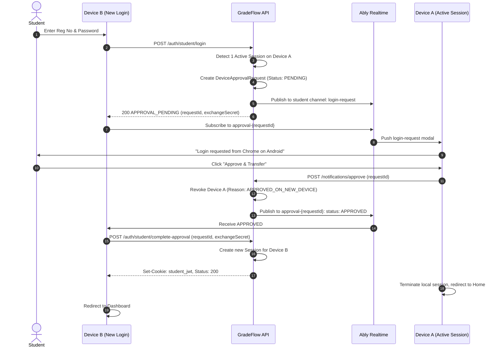
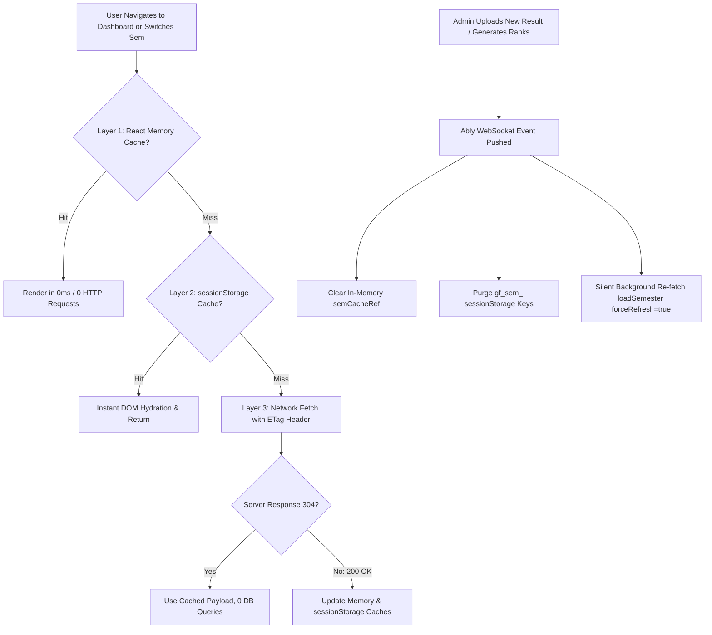
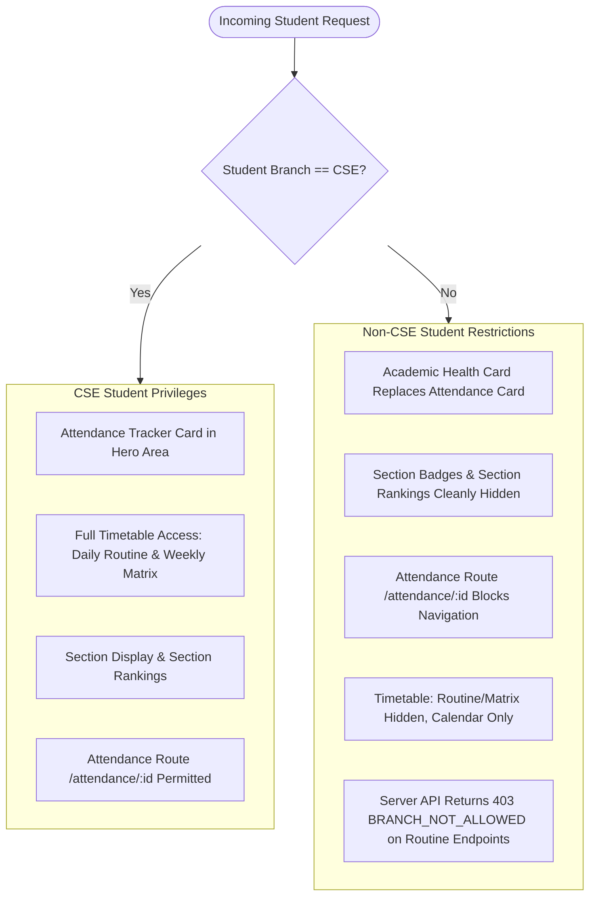
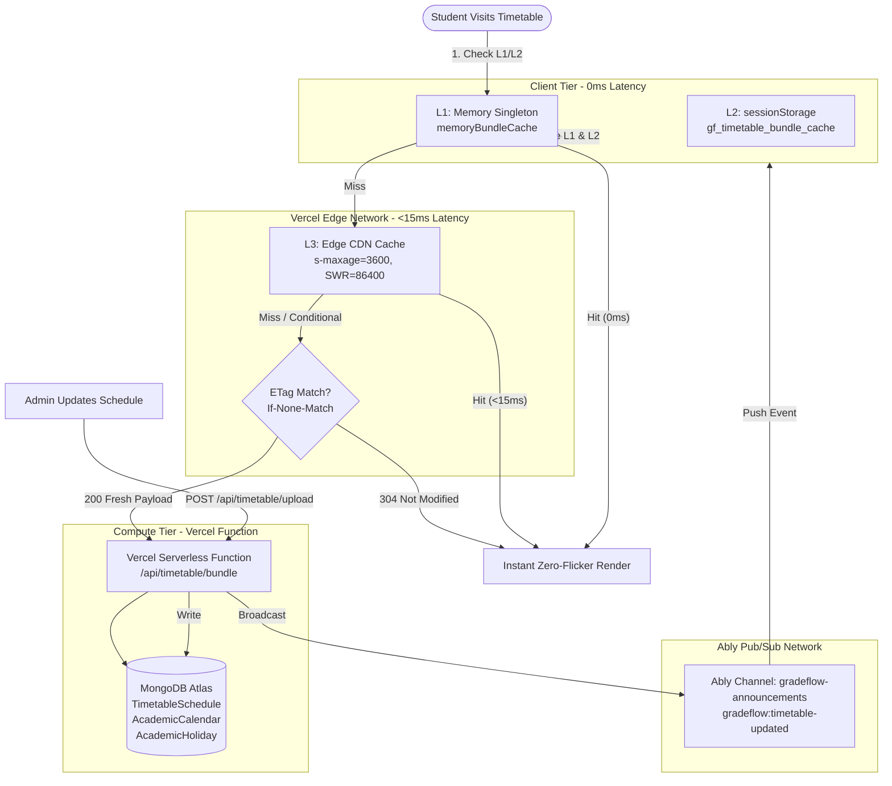
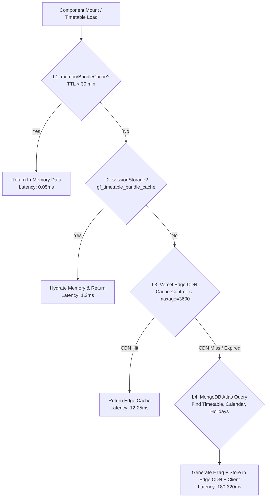
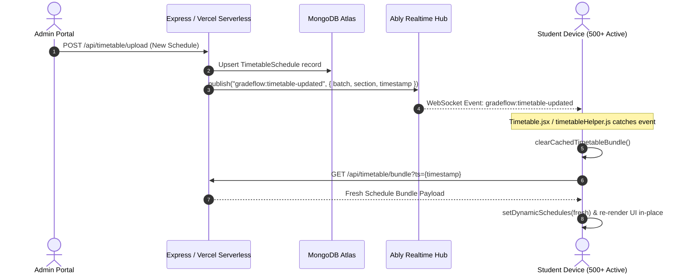
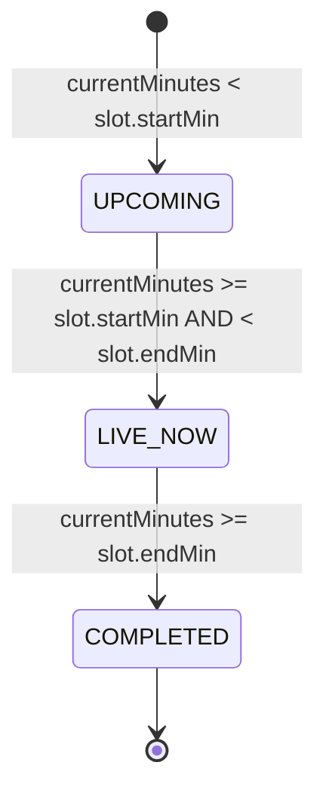
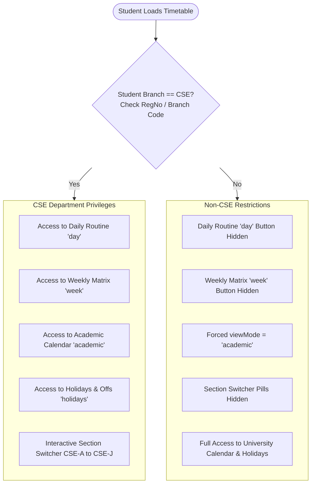

# GRADEFLOW — MASTER ARCHITECTURAL SPECIFICATION & BRAIN REFERENCE
**Document ID:** `GF-DOC-MASTER-BRAIN-001`  
**System Version:** Production 3.4.0  
**Scope:** Complete Architecture — Authentication, Multi-Device Session State Machine, Security Invariants, Real-Time Ably Engine, and Dashboard Subsystems.

---

> **Authoritative Technical Documentation**  
> This document serves as the absolute single source of truth for the entire GradeFlow architecture. Any engineer, auditor, or AI agent reading this document will understand every role, state machine, lifecycle transition, security boundary, caching layer, real-time sync mechanism, and test case across the system.

---

## Master Table of Contents

### Part I: Authentication, Multi-Device Sessions & Security
1. [Architectural Principles & Non-Negotiables](#1-architectural-principles--non-negotiables)
2. [Role Definitions & Permissions Matrix](#2-role-definitions--permissions-matrix)
3. [Device Limits, Inactivity TTLs & Eviction Rules](#3-device-limits-inactivity-ttls--eviction-rules)
4. [Cookie Architecture & Same-Browser Role Isolation](#4-cookie-architecture--same-browser-role-isolation)
5. [Session Lifecycle & Resurrection Immunity](#5-session-lifecycle--resurrection-immunity)
6. [Normal Student Device Approval & Transfer Protocol](#6-normal-student-device-approval--transfer-protocol)
7. [Admin Button Visibility & Global Availability State Machine](#7-admin-button-visibility--global-availability-state-machine)
8. [Zero-Polling Realtime Architecture (Ably)](#8-zero-polling-realtime-architecture-ably)
9. [OTP Rate Limiting, Cooldowns & Daily Quotas](#9-otp-rate-limiting-cooldowns--daily-quotas)
10. [Dual-Runtime Parity (Express Backend vs Vercel Serverless)](#10-dual-runtime-parity-express-backend-vs-vercel-serverless)
11. [Complete Forensic Test Matrix & Expected Outcomes](#11-complete-forensic-test-matrix--expected-outcomes)

### Part II: Dashboard Engine, 5 Subtabs, Caching & Performance
12. [Dashboard Architecture & Design Principles](#12-dashboard-architecture--design-principles)
13. [Route Architecture, URL Obfuscation & Security](#13-route-architecture-url-obfuscation--security)
14. [Multi-Tier Caching & Network Resilience Engine](#14-multi-tier-caching--network-resilience-engine)
15. [Top Profile Header & 4 Hero Stat Cards](#15-top-profile-header--4-hero-stat-cards)
16. [Active Backlogs Alert Accordion & Standing Strip](#16-active-backlogs-alert-accordion--standing-strip)
17. [Subtab 1: Semester Result (`tab === "result"`)](#17-subtab-1-semester-result-tab--result)
18. [Subtab 2: Internal Marks (`tab === "internal"`)](#18-subtab-2-internal-marks-tab--internal)
19. [Subtab 3: Semester History (`tab === "history"`)](#19-subtab-3-semester-history-tab--history)
20. [Subtab 4: Degree Progress / Basket Audit (`tab === "baskets"`)](#20-subtab-4-degree-progress--basket-audit-tab--baskets)
21. [Subtab 5: Target Predictor (`tab === "predictor"`)](#21-subtab-5-target-predictor-tab--predictor)
22. [Branch Isolation & Security Specifications](#22-branch-isolation--security-specifications)
23. [Dashboard Edge Cases & Resilience Safeguards](#23-dashboard-edge-cases--resilience-safeguards)
24. [Developer Maintenance & Extension Guide](#24-developer-maintenance--extension-guide)

### Part III: Timetable & Academic Calendar Engine, Caching & Vercel Architecture
25. [Timetable Architecture & Core Design Philosophy](#25-timetable-architecture--core-design-philosophy)
26. [Database Models & Schema Specifications](#26-database-models--schema-specifications)
27. [Consolidated API Route & Vercel Free-Tier Optimization Engine](#27-consolidated-api-route--vercel-free-tier-optimization-engine)
28. [Multi-Tier Caching Hierarchy (Memory, SessionStorage & Edge CDN)](#28-multi-tier-caching-hierarchy-memory-sessionstorage--edge-cdn)
29. [Real-Time Event-Driven Sync (Ably Pub/Sub Architecture)](#29-real-time-event-driven-sync-ably-pubsub-architecture)
30. [Daily Routine View Engine (`viewMode === "day"`)](#30-daily-routine-view-engine-viewmode--day)
31. [Weekly Matrix View Engine (`viewMode === "week"`)](#31-weekly-matrix-view-engine-viewmode--week)
32. [Academic Calendar Engine (`viewMode === "academic"`)](#32-academic-calendar-engine-viewmode--academic)
33. [University Holidays & Offs Engine (`viewMode === "holidays"`)](#33-university-holidays--offs-engine-viewmode--holidays)
34. [Client CPU & Battery Optimization (Tab Visibility Guard)](#34-client-cpu--battery-optimization-tab-visibility-guard)
35. [Branch Isolation & Security Specifications (CSE vs Non-CSE)](#35-branch-isolation--security-specifications-cse-vs-non-cse)
36. [Admin Timetable Management Pipeline (`TimetableAdminManager`)](#36-admin-timetable-management-pipeline-timetableadminmanager)
37. [Timetable Developer Maintenance & Extension Guidelines](#37-timetable-developer-maintenance--extension-guidelines)

---

# PART I: AUTHENTICATION, MULTI-DEVICE SESSIONS & SECURITY

---

## 1. Architectural Principles & Non-Negotiables

GradeFlow's authentication system operates under strict production engineering invariants:

1. **Zero Polling**:
   - No `setInterval` or `setTimeout` loops for querying auth status, device approvals, or admin button visibility.
   - Initial load uses **one single coordinated bootstrap** (`GET /api/auth/bootstrap`).
   - Subsequent state changes are pushed via **Ably WebSocket events**.
2. **Server is Authoritative**:
   - Client variables, localStorage, route changes, or cookies NEVER dictate session validity or device counts.
   - Active device count is calculated on the server from non-expired, active MongoDB session records.
3. **Targeted Exact-Session Revocation**:
   - Sessions are identified by unique `sessionId` (UUIDv4).
   - Logging out Device A MUST NEVER invalidate Device B by matching `userAgent` or IP guesswork.
4. **Mutual Role Isolation**:
   - Student credentials (`student_jwt`) and Admin credentials (`jwt`) coexist independently in the same browser.
   - Deleting one cookie or logging out of one role leaves the other role completely untouched.
5. **Dual-Runtime Parity**:
   - GradeFlow runs on both an Express development backend (`backend/routes/auth.js`) and a Vercel Serverless environment (`frontend/api/auth.js`).
   - Both runtimes share identical session validation logic, constants, and cryptographic token handling.

---

## 2. Role Definitions & Permissions Matrix

| Role | Identifier | Auth Credential | Max Concurrent Devices | Target Portal |
|---|---|---|---|---|
| **Normal Student** | Registration Number (`regNo`) | Password / OTP → `student_jwt` | **1 Device** (Transfer on 2nd) | `/dashboard/:regNo` |
| **Special Student** | Hardcoded Reg: `230301120327` | Password / OTP → `student_jwt` | **2 Devices** (Strict Cap) | `/dashboard/:regNo` |
| **Master Admin** | Email / Username | Password + 2FA OTP → `jwt` | **2 Devices** (Strict Cap) | `/admin/dashboard` |
| **Sub-Admin** | Email | Password + 2FA OTP → `jwt` | **2 Devices** (Strict Cap) | `/admin/dashboard` (RBAC) |
| **Guest** | None (Unauthenticated) | None (`student_jwt: null`, `jwt: null`) | N/A | `/` (Public pages) |

---

## 3. Device Limits, Inactivity TTLs & Eviction Rules

```
+-------------------+-------------+-------------------+--------------------+------------------------+
| Role              | Max Devices | Inactivity TTL    | Total Session TTL  | Device Limit Breach    |
+-------------------+-------------+-------------------+--------------------+------------------------+
| Normal Student    | 1           | 7 Days            | 30 Days            | Triggers Approval Flow |
| Special Student   | 2           | 7 Days            | 30 Days            | HTTP 403 (Blocked)     |
| Master Admin      | 2           | 1 Hour            | 30 Days (Extended) | HTTP 403 (Blocked)     |
| Sub-Admin         | 2           | 1 Hour            | 30 Days (Extended) | HTTP 403 (Blocked)     |
+-------------------+-------------+-------------------+--------------------+------------------------+
```

### Detailed Inactivity Behavior:
- **Student Inactivity (7 Days)**:
  `STUDENT_INACTIVITY_TTL_MS = 7 * 24 * 60 * 60 * 1000`  
  If a student does not interact with the app for 7 consecutive days, their session is considered stale and excluded from active session queries, automatically freeing up capacity.
- **Admin Inactivity (1 Hour)**:
  `ADMIN_ACTIVITY_TTL_MS = 60 * 60 * 1000`  
  If an administrator is idle for > 1 hour, `getActiveAdminSessions` excludes that session from the active device count. If 2 devices were active and 1 goes idle for > 1 hour, the active count drops from `2 -> 1`, making the Admin Portal button visible again.

---

## 4. Cookie Architecture & Same-Browser Role Isolation

GradeFlow utilizes two separate HttpOnly cookies for credentials, plus one non-sensitive browser presence cookie:

1. **`student_jwt`** (HttpOnly, SameSite=Lax, Path=/, Secure in prod):
   - Contains: `{ regNo, sessionId, role: "student" }`.
   - Used strictly for student portal access and endpoints (`/api/student/*`, `/api/auth/student/*`).
2. **`jwt`** (HttpOnly, SameSite=Lax, Path=/, Secure in prod):
   - Contains: `{ adminId, sessionId, role: "admin", isSubAdmin: boolean }`.
   - Used strictly for administrative endpoints (`/api/admin/*`, `/api/auth/admin/*`).
3. **`gf_auth_present`** (Non-HttpOnly, SameSite=Lax, Path=/, Max-Age=60 days):
   - Purely a client UI hint (`1` or omitted) indicating *at least one* role is logged in.
   - **Security Guarantee**: Forging `gf_auth_present=1` NEVER grants access. The server validates real cryptographic signatures inside `student_jwt` or `jwt`.

### Mutual Cookie Clearing Rules:
```javascript
// When Student logs out:
res.setHeader("Set-Cookie", "student_jwt=; Path=/; Max-Age=0; Expires=Thu, 01 Jan 1970 00:00:00 GMT");
// Only clear gf_auth_present if NO Admin cookie is present!
if (!cookies.jwt || cookies.jwt === "none") {
  res.appendHeader("Set-Cookie", "gf_auth_present=; Path=/; Max-Age=0; ...");
}

// When Admin logs out:
res.setHeader("Set-Cookie", "jwt=; Path=/; Max-Age=0; Expires=Thu, 01 Jan 1970 00:00:00 GMT");
// Only clear gf_auth_present if NO Student cookie is present!
if (!cookies.student_jwt || cookies.student_jwt === "none") {
  res.appendHeader("Set-Cookie", "gf_auth_present=; Path=/; Max-Age=0; ...");
}
```

### Client-Side Cookie Deletion Reconciliation (Orphaned Session Reaping)
In accordance with the architecture diagram (`Browser: 🔒 Auth Cookie, 🍪 Presence Cookie, 📝 optional hint`):
- **Storage Hints (`gf_admin_session_hint`, `gf_student_session_hint`)**: When authenticated, the browser retains a non-sensitive session identifier in `localStorage`. This hint has ZERO authority and can never be used to authenticate.
- **Bootstrap Reconciliation**: If a user clears cookies in browser DevTools/settings, the next `/api/auth/bootstrap` request sends `x-admin-last-session` and `x-student-last-session`.
- **Server Reconcile**: When the server sees `!adminAuth && clientLastSession`, it atomically marks the orphaned session `isActive: false, revokeReason: "COOKIE_CLEARED_ON_CLIENT"`, re-queries active capacity, and broadcasts the decremented device count over Ably.
- **Post-Bootstrap Cleanup**: If `/api/auth/bootstrap` confirms unauthenticated status, the frontend clears the hints immediately.
- **Logout Cleansing**: Explicit logout (`adminLogout`, `studentLogout`) wipes hints in `finally` and cleanly revokes server records.

---

## 5. Session Lifecycle & Resurrection Immunity

### The Session Document Structure (`AdminSession`, `StudentSession`, `SubAdminSession`):
- `sessionId`: String, UUIDv4, unique index.
- `isActive`: Boolean (`true` = valid, `false` = revoked/logged out).
- `lastActiveAt`: Date (updated on user interactions).
- `expiresAt`: Date (hard TTL index).
- `revokedAt`: Date (timestamp when session was terminated).
- `revokeReason`: String (`EXPLICIT_LOGOUT`, `APPROVED_ON_NEW_DEVICE`, `INACTIVITY_TIMEOUT`, `SECURITY_REVOKE`).

### Resurrection Immunity:
A revoked session (`isActive: false`) must NEVER be resurrected by subsequent calls.
Both runtimes enforce atomic updates:
```javascript
// sessionManager.js
await session.constructor.updateOne(
  { _id: session._id, isActive: true }, // Filter guarantees only currently active sessions can be touched
  { $set: { lastActiveAt: new Date(now) } }
);
```
If `isActive` is `false`, `updateOne` modifies 0 documents. Revoked sessions stay permanently dead.

### Touch Write Throttling:
To prevent MongoDB write contention, `touchAdminSession` and `touchSession` are throttled to **15 seconds**. If a request arrives within 15 seconds of the last touch, the DB write is skipped.

---

## 6. Normal Student Device Approval & Transfer Protocol

Normal Students are strictly limited to **1 active device**. When a second device attempts to log in, GradeFlow initiates a secure, real-time approval handover:



### Key Guarantees:
- **Zero Polling**: Device B does NOT poll `/approval-status`. It listens to Ably channel `approval-{requestId}`.
- **Atomic Handover**: Device A is revoked only when Device A explicitly clicks Approve.
- **Denial Flow**: If Device A clicks Deny, Ably pushes `DENIED`, Device B displays rejection notice, and Device A remains active.
- **Expiration**: Requests expire after 120 seconds.

---

## 7. Admin Button Visibility & Global Availability State Machine

The Admin button in the Navbar and LandingFooter is a **hybrid availability UI element**.

### Visibility Rules:

| Viewer Identity | 0 Active Admin Devices | 1 Active Admin Device | 2 Active Admin Devices |
|---|---|---|---|
| **Master Admin (Logged in this tab)** | ✅ **VISIBLE** | ✅ **VISIBLE** | ✅ **VISIBLE** (Direct dashboard access) |
| **Sub-Admin (Logged in this tab)** | ✅ **VISIBLE** | ✅ **VISIBLE** | ✅ **VISIBLE** (Direct dashboard access) |
| **Special Student (`230301120327`)** | ✅ **VISIBLE** | ✅ **VISIBLE** | ❌ **HIDDEN** |
| **Normal Student (Logged in)** | ❌ **HIDDEN** | ❌ **HIDDEN** | ❌ **HIDDEN** |
| **Guest (Unauthenticated)** | ❌ **HIDDEN** | ❌ **HIDDEN** | ❌ **HIDDEN** |

### State Transitions (Automatic Mode):
- `0 -> 1 Active Devices`: Remains **VISIBLE** for eligible roles.
- `1 -> 2 Active Devices`: Transitions to **HIDDEN** for all non-active tabs.
- `2 -> 1 Active Devices` (One Admin logs out): Transitions from **HIDDEN -> VISIBLE**.
- `1 -> 0 Active Devices` (Last Admin logs out): Transitions to **VISIBLE** for Special Student.

### Component Implementation (`Navbar.jsx` & `LandingFooter.jsx`):
```javascript
let canSeeAdmin = false;
if (adminButtonConfig && adminButtonConfig.mode === "MANUAL") {
  // Manual Override Config
  const roles = adminButtonConfig.allowedRoles || {};
  if (isMainAdminViewer) canSeeAdmin = roles.mainAdmin !== false;
  else if (isSubAdminViewer) canSeeAdmin = roles.subAdmin !== false;
  else if (isSpecialAdminPortalViewer) canSeeAdmin = roles.specialStudent !== false;
  else if (loggedInRegNo) canSeeAdmin = Boolean(roles.allStudents);
  else canSeeAdmin = Boolean(roles.guests);
} else {
  // Automatic System Mode:
  if (isMainAdminViewer || isSubAdminViewer) {
    canSeeAdmin = true; // Logged-in admin always has dashboard button
  } else if (isSpecialAdminPortalViewer) {
    canSeeAdmin = true; // Special Student (230301120327) always has admin portal access when logged in
  } else {
    canSeeAdmin = false; // Normal students & guests never see admin button
  }
}
```

### Route Access Enforcement (`AdminRouteGuard` in `App.jsx`):
- **Direct URL Access to Admin Gate (`/admin`, `/admin/login`)**:
  - Even if a user attempts to navigate directly by typing `/admin` or `/admin/login` into the browser URL bar:
    - If user is NOT already an authenticated Admin:
      - Access is ONLY permitted if **Special Student (`230301120327`) is currently logged in** in this browser session.
      - If a **Normal Student** or **Guest / unauthenticated visitor** navigates to `/admin` or `/admin/login`, they are immediately blocked with the **403 Forbidden Page (`<UnauthorizedState />`)**.
- **Protected Administrative Pages (`/admin/dashboard`, `/admin/traffic`, etc.)**:
  - Strictly requires an active, authenticated administrative session token (`adminToken`). Any unauthenticated attempt displays `<UnauthorizedState />`.

---

## 8. Zero-Polling Realtime Architecture (Ably)

### Channel & Event Map:

| Channel Name | Event Name | Audience | Purpose | Payload |
|---|---|---|---|---|
| `broadcasts-all` | `admin-availability-updated` | All open browser tabs | Syncs Admin button visibility | `{ activeDeviceCount: number, isAdminButtonVisible: boolean }` |
| `broadcasts-all` | `timetable-updated` | All students & visitors | Invalidate timetable cache | `{ version, updatedAt }` |
| `admin-control` | `session-revoked` | Admins | Targeted eviction of revoked admin session | `{ sessionId }` |
| `admin-control` | `feedback-updated` | Admins | Realtime feedback count sync | `{ count }` |
| `student-{regNo}` | `login-request` | Target Student (Active Device) | Prompt for multi-device approval | `{ requestId, device, location }` |
| `approval-{requestId}` | `approval-status` | Requesting Device | Real-time approval result | `{ status: "APPROVED" \| "DENIED" \| "EXPIRED" }` |

### Connection Optimization:
- Exactly **one shared Ably connection** per authenticated role context.
- WebSocket is reused across all SPA routes (does not tear down and recreate on route navigation).
- Event handlers are attached once inside `AppContext.jsx` using stabilized `useCallback` and `useRef` handlers.

---

## 9. OTP Rate Limiting, Cooldowns & Daily Quotas

To protect email delivery and prevent brute-force attacks, GradeFlow enforces multi-layered rate limits and role-specific OTP quotas:

### Role-Based Daily OTP Quota Rules:
1. **Normal Students**:
   - **Daily Quota**: **3 OTP requests per 24-hour rolling window**.
   - **Per-Request Cooldown**: **60 seconds**.
   - **Reset in Admin OTP Management**: Resets counter to **0/3**, cleanly clears `sendTimestamps: []`, `otpSendCount: 0`, and `lastOtpSentAt: null` across `[todayKey, yesterdayKey]`, and removes active `OtpVerification` records.
2. **Special Student (`230301120327`)**:
   - **Daily Quota**: **5 OTP requests per 24-hour rolling window**.
   - **Per-Request Cooldown**: **60 seconds**.
   - **Reset in Admin OTP Management**: Resets counter to **0/5**, cleanly clears `sendTimestamps: []` and active verification records.
3. **Master Administrator**:
   - **Storage**: `StudentDailyLimit` collection with key `ADMIN:<email>` (e.g. `ADMIN:jaganparida35@gmail.com`).
   - **Daily Quota**: **5 OTP requests per 24-hour rolling window**.
   - **Per-Request Cooldown**: **60 seconds** between successive requests.
   - **Attempt Lockout**: 5 failed password attempts triggers a temporary administrative lockout.
   - **OTP Validity**: 3 minutes TTL with bcrypt hash verification.
   - **Reset in Admin OTP Management**: Direct 1-click reset via the **Administrator OTP Limit Management** card (clears rolling limits and unverified OTPs; restores full 5 attempts).

### Student Device Session Revocation Rules:
- **Single Device Session**: Revoking a specific session sets `isActive: false` on that session and publishes an Ably `session-revoked` event with `{ revokedSessionId, sessionId }`. The targeted browser immediately terminates its session and redirects to the home page.
- **Revoke All Sessions**: Revoking all sessions sets `isActive: false` across all active sessions for that student and publishes an Ably `session-revoked` event with `{ allSessionsRevoked: true }`. All connected devices for that student are immediately logged out.

---

## 10. Dual-Runtime Parity (Express Backend vs Vercel Serverless)

GradeFlow maintains strict feature parity between its local Express server and production Vercel serverless functions:

| Feature / Logic | Express Backend (`backend/`) | Vercel Serverless (`frontend/api/`) |
|---|---|---|
| Auth Router Entrypoint | `routes/auth.js` | `api/auth.js` |
| Session Management | `utils/sessionManager.js` | `api/_lib/sessionManager.js` |
| Database Connection | Persistent Mongoose (`server.js`) | Reused Serverless Mongoose (`_lib/db.js`) |
| Realtime Service | `services/ablyService.js` | `api/_lib/ablyService.js` |
| Email Delivery Manager | `utils/emailProviderManager.js` | `api/_lib/emailProviderManager.js` |
| Model Definitions | `backend/models/*.js` | `frontend/api/_lib/models/*.js` |

Any bug fix or logic change applied to `frontend/api/` MUST also be mirrored in `backend/` to maintain 100% test and runtime parity.

---

## 11. Complete Forensic Test Matrix & Expected Outcomes

All 22 core test scenarios must pass without regressions:

| # | Scenario | Expected Outcome | Critical Assertion |
|---|---|---|---|
| **1** | Master Admin 0 devices | Admin button VISIBLE to eligible UI | `activeAdminCount == 0`, button rendered |
| **2** | Master Admin 1st device login | Device 1 authenticated; count = 1 | `activeAdminCount == 1`, button visible |
| **3** | Master Admin 2nd device login | Device 2 authenticated; count = 2 | `activeAdminCount == 2`, button hidden on other tabs |
| **4** | Master Admin 3rd device attempt | HTTP 403 `DEVICE_LIMIT_REACHED` | Devices 1 & 2 remain active; 3rd blocked |
| **5** | Admin A explicit logout | Device A revoked; Device B stays active | Count drops `2 -> 1`; Device B button visible |
| **6** | Stale Admin session (>1h idle) | Stale session filtered out by TTL | Count drops `2 -> 1`; capacity freed |
| **7** | Sub-Admin login & 2-device cap | SubAdmin isolated; max 2 devices | SubAdmin cannot access Master Admin settings |
| **8** | SubAdmin RBAC routes | Overview/Toppers allowed; Settings denied | HTTP 403 on unauthorized SubAdmin action |
| **9** | Normal Student login (Device 1) | Exactly 1 active session created | `isSessionValid == true` |
| **10** | Normal Student refresh | Session remains valid; 0 duplicates | No duplicate session inserted |
| **11** | Normal Student 2nd device login | HTTP 200 `APPROVAL_PENDING` | Approval request created in MongoDB |
| **12** | Device A clicks "Deny" | Request marked `DENIED`; A remains active | Device B blocked; Device A untouched |
| **13** | Device A clicks "Approve" | Device A revoked; Device B authenticated | Count = 1; owner transfers to Device B |
| **14** | Special Student 1st & 2nd login | Both devices active simultaneously | Count = 2; both valid |
| **15** | Special Student 3rd device login | HTTP 403 `DEVICE_LIMIT_REACHED` | No OTP generated; 3rd device blocked |
| **16** | Special Student Device 1 logout | Device 1 revoked; Device 2 remains active | Count = 1; Device 2 untouched |
| **17** | Same-browser Student + Admin | Both credentials coexist independently | Student cookie does not overwrite Admin |
| **18** | Same-browser Student logout | Student revoked; Admin remains logged in | `student_jwt` cleared, `jwt` preserved |
| **19** | Same-browser Admin logout | Admin revoked; Student remains logged in | `jwt` cleared, `student_jwt` preserved |
| **20** | Forged `gf_auth_present=1` | Server rejects request (HTTP 401) | Presence cookie grants 0 authorization |
| **21** | Session resurrection attack | Calling `touchSession` on revoked session | Revoked session remains `isActive: false` |
| **22** | SPA Route Navigation | Home -> Admin -> Dashboard -> Home | 0 unnecessary auth requests; 0 count changes |

---

# PART II: DASHBOARD ENGINE, 5 SUBTABS, CACHING & PERFORMANCE

---

## 12. Dashboard Architecture & Design Principles

The GradeFlow Dashboard (`frontend/src/pages/Dashboard.jsx`) is the primary student command center. It synthesizes complex academic data from Centurion University of Technology and Management (CUTM)—including semester marks, grade sheets, continuous internal evaluation, chronological semester history, Choice Based Credit System (CBCS) degree basket audit, and end-semester target prediction—into an instantaneous, zero-latency user experience.

### Core Design Principles
1. **Zero UI Freeze (0ms Perceived Latency):** Subtab transitions (`result`, `internal`, `history`, `baskets`, `predictor`) and semester switching execute without blocking UI threads or displaying unnecessary loading spinners. In-memory eager hydration serves cached data in `0ms`.
2. **Multi-Tier Cache Shielding:** Implements an impenetrable 3-layer caching strategy (React Memory $\to$ Browser `sessionStorage` $\to$ Server ETag HTTP 304 Revalidation with a 15-second debounce shield).
3. **Real-Time Database Invalidation:** Uses Ably WebSockets to push instant database updates (results upload, rank generation, attendance sync) directly to connected clients, cleanly evicting stale caches without polling.
4. **Strict Branch Isolation & Access Control:** Restricts department-specific modules (e.g., Attendance tracking, Daily Timetable Routines, Section rankings) to CSE students while cleanly providing alternate high-value metrics (e.g., Academic Health Score, University/Branch rankings) to Non-CSE students without broken UI states.
5. **Print & Export Fidelity:** Generates high-DPI official university transcripts, internal assessment records, and degree audits across PDF, PNG, Excel, and Word formats.

---

## 13. Route Architecture, URL Obfuscation & Security

### 13.1 Route Definition & Path Handling
- **Route:** `/dashboard/:regNo`
- **URL Parameter Extraction:**
  ```javascript
  const { regNo: urlParam } = useParams();
  const regNo = decodeStudentId(urlParam);
  ```
- **Cryptographic Obfuscation (`studentIdEncoder.js`):**
  To prevent unauthorized enumeration or scraping of student registration numbers, the application uses an obfuscation cipher (`encodeStudentId` / `decodeStudentId`). Raw registration numbers (e.g., `230301120001`) are transformed into alphanumeric hex tokens.
- **Auto-Normalization Shield:**
  If a student accesses the dashboard via their raw plaintext registration number, an automatic normalization effect redirects the URL to the obfuscated token:
  ```javascript
  useEffect(() => {
    if (regNo && urlParam && !isEncryptedToken(urlParam)) {
      navigate(`/dashboard/${encodeStudentId(regNo)}`, { replace: true });
    }
  }, [urlParam, regNo, navigate]);
  ```

### 13.2 Dynamic Branch & Section Resolution

#### Branch Resolution (`getDynamicBranch`)
GradeFlow uses a dynamic department parser that extracts the discipline code from any admission batch (2021, 2022, 2023, 2024, 2025, 2026+) based on university registration patterns:
- Digits 3–8: `030111` $\to$ **CIVIL**
- Digits 3–8: `030112` $\to$ **CSE**
- Digits 3–8: `030113` $\to$ **ECE**
- Digits 3–8: `030115` $\to$ **EEE**
- Digits 3–8: `030116` $\to$ **ME**
- Digits 3–8: `030118` $\to$ **BIO**
- Digits 3–8: `030119` $\to$ **MI**
- Digits 3–8: `030123` $\to$ **AERO**
- **Administrative Overrides:** Supports specific transferred students (e.g., `230301180026` overridden to `CSE`, `230301120110` overridden to `ECE`).

#### Section Resolution (`getSectionFromRegNo`)
For CSE students (`230301120...`), sections are deterministically computed based on the last 3 digits of the roll number:
| Roll Range | Section | Roll Range | Section |
| :--- | :--- | :--- | :--- |
| `001` – `060` | **Section A** | `241` – `300` | **Section E** |
| `061` – `120` | **Section B** | `301` – `360` | **Section F** |
| `121` – `180` | **Section C** | `361` – `420` | **Section G** |
| `181` – `240` | **Section D** | `421` – `480` | **Section H** |
| `481` – `549` | **Section I** | Non-standard / Others | **Section J** |

---

## 14. Multi-Tier Caching & Network Resilience Engine

The Dashboard handles high concurrency using a 4-layer defense system:



### Layer 1: In-Memory React State Cache (`semCacheRef`)
- Ref storage: `semCacheRef.current[sem] = { internal, ranking }`.
- When switching between semesters or toggling subtabs in an active session, data is served from memory immediately (0ms).

### Layer 2: Browser `sessionStorage` (`gf_sem_${regNo}_${sem}`)
- When a student reloads the page or navigates between pages (`/analytics` $\to$ `/dashboard`), the dashboard checks `sessionStorage.getItem("gf_sem_" + regNo + "_" + sem)`.
- If found, it instantly renders the gradesheet and rankings before any network handshake completes, eliminating white screens or skeleton flashes.

### Layer 3: Conditional HTTP with 15-Second Debounce Shield
- Handled at both `Dashboard.jsx` and `AppContext.jsx` level.
- Outgoing requests carry the `If-None-Match: <etag>` header.
- The Express/MongoDB backend compares the ETag without performing full deserialization. If unchanged, it returns `304 Not Modified` (~1ms response, 0 DB query overhead).
- A 15-second debounce window prevents students from spamming F5 and overloading the server.

### Layer 4: Real-Time WebSocket Cache Invalidation (Ably Pub/Sub)
- Event Listeners:
  - `gradeflow:results-updated`: Triggers when academic results or semester grade sheets are published.
  - `gradeflow:rankings-updated`: Triggers when department/university standings are recalculated.
- **Eviction Action:**
  1. Wipes `semCacheRef.current = {}`.
  2. Iterates `sessionStorage` and deletes all matching `gf_sem_${cleanReg}_*` keys.
  3. Silently calls `loadSemester(selectedSem, true)` in the background.

### Race Condition & Out-of-Order Shield (`activeSemRequestRef`)
When a student rapidly clicks through Sem 1, Sem 2, Sem 3, and Sem 4, older in-flight HTTP requests could arrive late and overwrite newer data. To prevent this, every request creates a unique `Symbol()`:
```javascript
const reqId = Symbol();
activeSemRequestRef.current = reqId;
// After await Promise.allSettled(...):
if (activeSemRequestRef.current !== reqId) return; // Discard stale response
```

---

## 15. Top Profile Header & 4 Hero Stat Cards

The Hero Area provides immediate academic feedback. On desktop, it displays a full banner and 4 horizontal stat cards; on mobile, it organizes into a 2x2 symmetrical layout that only renders on the default `result` tab to prevent visual clutter.

```
+-------------------------------------------------------------------------------+
| STUDENT IDENTITY: Name | RegNo | Branch | Section (CSE) | Batch | Badges      |
+-----------------------+-----------------------+---------------+---------------+
| CARD 1: Sem SGPA      | CARD 2: Cumul. CGPA   | CARD 3: Credits| CARD 4:       |
| 9.42 / 10             | 8.85 / 10             | 84 / 160 Cleared| Attendance    |
| [=== Blue 94% ===]    | [=== Purple 88% ===]  | [== Sky 52% ==]| 87.5% Eligible|
| Current Sem Score     | Across All Sems       | Degree Progress| 112/128 Class |
+-----------------------+-----------------------+---------------+---------------+
```

### 15.1 Card 1: Semester SGPA
- **Calculation:** Derived via `calculateSemesterMetrics(selectedSemResult.subjects, selectedSem)`.
- **Value:** Floating-point formatted to 2 decimals (`latestSgpa.toFixed(2)`).
- **Scale:** `/10` with active semester indicator badge (`Sem {selectedSem}`).
- **Visual Accent:** 3px bottom progress bar animated to `(latestSgpa / 10) * 100%`.

### 15.2 Card 2: Cumulative CGPA
- **Calculation:** Derived via `calculateCGPA(studentData.results)`.
- **Value:** Across all completed semesters. Clickable to navigate directly to `/analytics/:regNo`.
- **Visual Accent:** Violet theme (`#7c3aed`) with 3px animated progress bar.

### 15.3 Card 3: Credits Cleared
- **Calculation:** Aggregates passed credits (`creditsCleared`) across all completed semesters vs the degree graduation requirement (160 credits).
- **Navigation:** Clicking opens Tab 4: Degree Progress (`baskets`).
- **Visual Accent:** Sky blue theme (`#0284c7`) with progress ratio `(creditsCleared / 160) * 100%`.

### 15.4 Card 4: Attendance (CSE) vs Academic Health (Non-CSE)
Card 4 features dynamic branch-isolation:

#### For CSE Students: Overall Attendance Tracker
- **Calculation (`computeAttendanceSummary`):**
  Aggregates total attended classes $\sum A_i$ and total delivered classes $\sum D_i$ across all subjects from `studentData.attendance.savedSubjects`:
  $$\text{Attendance \%} = \left(\frac{\sum A_i}{\sum D_i}\right) \times 100$$
- **Status Badges:**
  - $\ge 75\%$: Green badge labeled `Eligible`.
  - $< 75\%$: Red badge labeled `Shortage`.
- **Subtext:** Displays attended vs delivered classes (e.g. `112/128 classes · 7 subs`).
- **Empty State:** If the student hasn't logged attendance yet, displays a clean `Set Now →` button with identical card padding and height, opening the Attendance Tracker.

#### For Non-CSE Students: Academic Health Score
Since university attendance data is only scraped/maintained for CSE, Non-CSE students receive an **Academic Health Score** out of 100 instead of a broken or blank attendance card:
$$\text{Health Score} = \min(CGPA \times 5, 50) + \min(SGPA_{\text{latest}} \times 2, 20) + \text{Backlog Points} + \text{Subject Points}$$
- **CGPA Component (Max 50 pts):** Measures cumulative performance ($CGPA \times 5$).
- **SGPA Component (Max 20 pts):** Measures recent momentum ($SGPA \times 2$).
- **Backlog Component (Max 20 pts):** 20 pts if 0 backlogs; penalizes $-5$ pts per active backlog: $\max(0, 20 - (\text{Backlogs} \times 5))$.
- **Curriculum Breadth (Max 10 pts):** 10 pts if enrolled subjects count $> 0$.
- **Health Ratings:**
  - $90 - 100$: **Excellent** (`#16a34a` Green)
  - $75 - 89$: **Good** (`#2563eb` Blue)
  - $60 - 74$: **Average** (`#d97706` Amber)
  - $< 60$: **Needs Attention** (`#dc2626` Red)

---

## 16. Active Backlogs Alert Accordion & Standing Strip

### 16.1 Active Backlogs Accordion
- **Detection:** Filters subjects with failing grades: `FAIL_GRADES = ['F', 'R', 'S', 'M']` (Fail, Repeat, Supplementary, Malpractice).
- **Accordion Header:** Displays active backlog count with a pulsing `#fee2e2` warning indicator and a toggle button (`View Subjects` / `Hide Details`).
- **Subject Item Details:**
  - Subject Name (uppercase)
  - Subject Code in monospace
  - Credit weighting (e.g. `(4 Credits)`)
  - Semester tagged
  - Failing grade badge (`Grade F`)
- **Disclaimer & WhatsApp Support Link:**
  Addresses end-of-degree (EOD) or rechecking exam clearance delays:
  > *"Disclaimer: If you think your backlog is cleared but this website shows this backlog, then it might happen because of missing excel data of your EOD/rechecking result. If you have this excel sheet, please contact the developer to get it updated."*
  Includes an instant WhatsApp direct message link prefilled with the student's inquiry.

### 16.2 University, Department & Section Standings Strip
Provides a single-row comparative standing breakdown for the selected semester:
1. **Univ CGPA Rank:** Overall ranking across the entire university cohort.
2. **Univ SGPA Rank:** Semester SGPA ranking across all university branches.
3. **Branch CGPA Rank:** Standing within the student's specific engineering branch.
4. **Branch SGPA Rank:** Semester standing within the branch.
5. **Section CGPA Rank (CSE Only):** Class standing within the student's section (A–I).
6. **Section SGPA Rank (CSE Only):** Semester class standing within the section.
7. **Percentile Standing:** Displays university percentile (e.g., `Top 4.2% in University`).
- **Deep-Linking:** Clicking any rank cell routes directly to `/leaderboard?highlight=${regNo}&branch=${branch}` with the student's row automatically centered and highlighted.

---

## 17. Subtab 1: Semester Result (`tab === "result"`)

Rendered via `<GradeSheet result={currentResult} studentData={studentData} highlightedSubject={highlightedSubject} />`.

### 17.1 Marksheet Visual Reproduction
The GradeSheet accurately reproduces Centurion University's official examination ledger:
- **Header:** CUTM insignia, university name, academic year, semester title, and student metadata (Name, Regd No, Branch, Batch).
- **Tabular Ledger:**
  | Column | Description |
  | :--- | :--- |
  | **Code** | Official course code (e.g. `CUTM1011`) in monospace |
  | **Course Name** | Full descriptive title |
  | **Type** | Theory, Practice, or Project |
  | **Credits ($C_i$)** | Course credit weighting |
  | **Grade ($G_i$)** | Letter grade (`O`, `E`, `A`, `B`, `C`, `D`, `F`, `R`, `S`, `M`) |
  | **Grade Points ($GP_i$)** | Numeric points: $O=10, E=9, A=8, B=7, C=6, D=5, F=0$ |
  | **Credit Points ($CP_i$)** | Product of Credits and Grade Points: $CP_i = C_i \times GP_i$ |

### 17.2 Mathematical Formulas for GPA
The ledger renders exact mathematical calculations:

#### Semester Grade Point Average (SGPA)
$$\text{SGPA} = \frac{\sum_{i=1}^{n} (C_i \times GP_i)}{\sum_{i=1}^{n} C_i}$$
Where:
- $C_i$ is the credit assigned to subject $i$.
- $GP_i$ is the grade point earned in subject $i$.
- Courses with failing grades ($F, R, S, M$) contribute credits to the denominator but yield $0$ grade points in the numerator.

#### Cumulative Grade Point Average (CGPA)
$$\text{CGPA} = \frac{\sum_{j=1}^{m} \sum_{i=1}^{n_j} (C_{ji} \times GP_{ji})}{\sum_{j=1}^{m} \sum_{i=1}^{n_j} C_{ji}}$$
Calculated across all completed semesters up to the currently inspected semester.

### 17.3 Interactive Toolbar & Export Engine
1. **Interactive Zoom Slider:** Allows students to scale the ledger from 30% to 150%. Mobile view automatically calculates an initial zoom ratio (typically 35%) so the 820px official document renders without horizontal page clipping.
2. **Download PDF:** Uses `html2canvas` (scale 4, CORS enabled) + `jspdf` to generate an A4 portrait PDF named `GradeSheet_${regNo}_Sem${sem}.pdf`.
3. **Save PNG Image:** Exports an uncompressed high-resolution screenshot.
4. **Direct Browser Print:** Injects the ledger into a hidden iframe with custom print media CSS styles (`Times New Roman`, bordered tables, black-and-white print optimization).
5. **WhatsApp Result Share (`shareSemResult`):** Formats student performance, SGPA, CGPA, credit milestones, active backlogs, and subject breakdown into a clean WhatsApp message with one-tap link sharing.
6. **Batch Full Transcript Export (`downloadFullTranscript`):** Sequentially captures all semester grade sheets from hidden DOM render containers (`#gradesheet-capture-${sem}`) and compiles them into a multi-page PDF document.

---

## 18. Subtab 2: Internal Marks (`tab === "internal"`)

The Internal Marks subtab displays continuous evaluation and practical scores directly fetched from the university's internal assessment database.

### 18.1 Semester 1 vs Senior Semesters Structure

```
SEMESTER 1 ASSESSMENTS:
[Class Test I]  [Class Test II]  [Class Test III]  [Class Test IV]  [Assignment]  ==> [Total / 50]

SEMESTER 2+ ASSESSMENTS:
[Mid Sem]  [Presentation]  [Assignment]  [Learning Record]  [Internal Practical]  [Project]  ==> [Total]
```

#### Assessment Helper Logic:
- `isMarkAvailable(val)`: Verifies if a mark is defined, not null, not empty string, and a valid finite number.
- `hasPositiveMarkValue(val)`: Returns true if mark $> 0$.
- `formatMark(val)`: Rounds fractional scores to 2 decimal places or returns an integer string.
- `getInternalAssessments(subject, semester)`:
  - For Semester 1: Returns CT1, CT2, CT3, CT4, and Assignment with maximum available scores.
  - For Semester 2+: Returns Mid-Sem, Presentation, Assignment, Learning Record, Internal Practical, and Project Internal along with round-off values (`RND`).

### 18.2 Subject Sorting Logic (`getSortedInternalSubjects`)
Subjects are intelligently arranged so that actionable data appears first:
1. **Scored vs Unscored:** Subjects that have at least one positive internal score are listed above subjects that have no recorded scores.
2. **Score Magnitude:** Among subjects with scores, subjects are sorted descending by `totalScore`.
3. **Alphabetical:** Ties are broken by alphabetical course name sorting.

### 18.3 Standalone Landscape PDF Generator
Includes an automated PDF export using `jspdf` + `jspdf-autotable`:
- **Orientation:** Landscape A4.
- **Header:** Official Centurion University heading with Indian Standard Date formatting.
- **Student Verification Box:** Contains student name, registration number, branch, section, and date.
- **Dynamic Columns:** Adjusts headers and column widths automatically based on whether the semester is Sem 1 or Sem 2+.

---

## 19. Subtab 3: Semester History (`tab === "history"`)

The Semester History subtab displays a chronological timeline of academic progress across all enrolled semesters.

### 19.1 Card Layout & Visual Metrics
Each semester is represented as an interactive card:
- **Semester Badge:** Displays the semester number (e.g. `Sem 3`) with an active viewing indicator.
- **Status Indicator:**
  - `All Cleared` (Green `#15803d`): All credits passed in this semester.
  - `Backlog` (Red `#b91c1c`): One or more failing grades detected.
- **Credit Summary:** Shows credits earned vs total credits offered (e.g. `Credits: 24/24`).
- **Subject Count:** Total enrolled courses.
- **SGPA Pill:** Color-coded based on performance tiers:
  - $\ge 9.0$: Forest Green (`#15803d`, background `#dcfce7`)
  - $7.5 - 8.99$: Sapphire Blue (`#1d4ed8`, background `#dbeafe`)
  - $< 7.5$: Amber (`#b45309`, background `#fef3c7`)

### 19.2 Interactive Switching
Clicking any semester card triggers:
1. `setSelectedSem(r.semester)`
2. `loadSemester(r.semester)`
3. `handleTabClick("result")`
The dashboard immediately switches to the GradeSheet for that semester with zero reload latency.

---

## 20. Subtab 4: Degree Progress / Basket Audit (`tab === "baskets"`)

Rendered via `<BasketDashboard results={studentData.results} studentData={studentData} />`.

### 20.1 Centurion University CBCS 160-Credit Framework
Centurion University mandates a **Choice Based Credit System (CBCS)** requiring students to complete **160 credits** distributed across 5 core academic baskets:

```
+-------------------------------------------------------------------------------+
|                      CENTURION UNIVERSITY CBCS BASKETS                        |
+-------------------------------------------------------------------------------+
| Basket 1 (B1): Foundation in Sciences / Mathematics (Basic Science)          |
| Basket 2 (B2): Humanities, Social Sciences & Management                       |
| Basket 3 (B3): Smart Stack (Applied Skills & Digital Technologies)            |
| Basket 4 (B4): Core Engineering (Program Foundation & Core Disciplines)       |
| Basket 5 (B5): Domain Specialization, Skill Tracks, Internships & Projects    |
| Extra (EX)   : Unmapped Electives & Additional Courses                        |
+-------------------------------------------------------------------------------+
```

### 20.2 Auto-Categorization Algorithm (`categorizeBaskets`)
Implemented in `frontend/src/utils/basketLogic.js`:
- Courses are matched against official syllabus master lists (`BASKET_1_SYLLABUS` through `BASKET_4_SYLLABUS`, plus domain tracks).
- Matching checks course codes, normalized course titles, and pattern-based regex matching (`isMatch`).
- **Domain Track Inference (`inferStudentDomainTrack`):**
  Analyzes Basket 5 courses to automatically determine the student's chosen specialization (e.g., *Data Science & Machine Learning*, *Cloud & DevOps*, *Cyber Security*, *Software Engineering*, *VLSI Design*).

### 20.3 Multi-Format Degree Audit Export
The Basket Dashboard provides three distinct document generation pathways:
1. **PDF Degree Audit (`generateBasketPDF`):** Multi-page breakdown with completion percentages and basket progress bars.
2. **Excel Spreadsheet (`generateBasketExcel`):** Formatted `.xlsx` workbook with separate sheets for each basket, earned credits, and pending graduation criteria.
3. **Microsoft Word Document (`generateBasketWord`):** Formal `.docx` report suitable for university registrar submission.

---

## 21. Subtab 5: Target Predictor (`tab === "predictor"`)

Rendered via `<TargetPredictor />`.

### 21.1 Assessment Models
Centurion University evaluates end-semester courses under 3 distinct marking rubrics:
1. **Theory Course:** 40 Internal Marks + 60 External Marks (Total: 100).
2. **Practice / Lab Course:** 50 Internal Marks + 50 External Marks (Total: 100).
3. **Project Work:** 50 Internal Marks + 50 External Marks (Total: 100).

### 21.2 Grade Boundary Equations
To earn a specific grade letter, the student's total combined score ($S_{\text{total}} = S_{\text{internal}} + S_{\text{external}}$) must satisfy:
- **O Grade (Outstanding - 10 GP):** $S_{\text{total}} \ge 90$
- **E Grade (Excellent - 9 GP):** $S_{\text{total}} \ge 80$
- **A Grade (Very Good - 8 GP):** $S_{\text{total}} \ge 70$
- **B Grade (Good - 7 GP):** $S_{\text{total}} \ge 60$
- **C Grade (Fair - 6 GP):** $S_{\text{total}} \ge 50$
- **D Grade (Pass - 5 GP):** $S_{\text{total}} \ge 40$

### 21.3 Feasibility Engine
Given an entered internal score $S_{\text{internal}}$:
$$\text{Required External } (R) = \text{Grade Min} - S_{\text{internal}}$$

| Condition | Status Indicator | User Feedback |
| :--- | :--- | :--- |
| $R \le 0$ | **Already Achieved** (`#15803d` Green) | Internal marks alone already meet or exceed the grade threshold. |
| $0 < R \le S_{\text{external\_max}}$ | **Achievable** (`#1d4ed8` Blue) | Exact score required in the end-sem paper is displayed. |
| $R > S_{\text{external\_max}}$ | **Mathematically Unreachable** (`#dc2626` Red) | Even a perfect 100% score on the end-sem paper cannot reach this grade. |

---

## 22. Branch Isolation & Security Specifications

GradeFlow enforces strict separation between branches to maintain data integrity and prevent broken UI states:



### Specific Access Rules:
1. **Attendance Nav & Direct Route:**
   - Nav bar hides the Attendance link for Non-CSE students.
   - If a Non-CSE student manually enters `/attendance/:id`, the Attendance page intercepts the route and displays a clean, user-friendly *"Attendance tracking is currently exclusive to CSE department students"* screen instead of crashing.
2. **Timetable Restrictions:**
   - The Timetable page remains accessible to Non-CSE students for Academic Calendar & Holidays.
   - The *Daily Routine* and *Weekly Matrix* tabs are hidden from the UI.
   - If a direct API request is made to timetable routine endpoints for a Non-CSE registration number, the server returns HTTP `403` (`BRANCH_NOT_ALLOWED`).
3. **Section Display Suppression:**
   - In `Dashboard.jsx`, the student metadata grid displays 3 columns (`Branch | Sec | Batch`) for CSE students, but cleanly collapses to 2 columns (`Branch | Batch`) for Non-CSE students.
   - The Rankings Strip displays 6 columns for CSE students, but collapses to 4 columns for Non-CSE students (omitting Section CGPA and Section SGPA).

---

## 23. Dashboard Edge Cases & Resilience Safeguards

| Scenario | Risk | Implemented Resolution in GradeFlow |
| :--- | :--- | :--- |
| **Network Disconnection / Tunnel Glitch** | Student misses Ably WebSocket push event while in a subway or elevator. | 1. Page visibility (`visibilitychange`) and network recovery (`online`) listeners re-sync data automatically when connection returns.<br>2. F5 or pull-to-refresh sends conditional ETag HTTP requests that validate data freshness without downloading redundant payloads. |
| **Ably 200 Connection Limit Reached** | High traffic exceeds free tier WebSocket connections. | The Ably client catches errors silently and enters graceful HTTP polling fallback. The UI continues to function without error popups. |
| **Missing EOD / Rechecking Results** | Student cleared a backlog in a re-exam, but the raw result sheet has not been ingested by the university scraper. | An amber disclaimer banner appears beneath backlogs with an instant WhatsApp link to send the updated mark sheet to the admin. |
| **Rapid Semester Clicking** | Student rapidly clicks Sem 1 $\to$ 2 $\to$ 3 $\to$ 4 within 500ms; slow network requests resolve out of order. | `activeSemRequestRef.current = Symbol()` discards stale responses if the active request ID does not match the active semester. |
| **Session Bleed on Shared Computers** | Student A logs out in a lab; Student B logs in on the same browser. | Logout triggers an exhaustive cleanup that clears React state and removes all `gf_student_profile_*` and `gf_sem_*` keys from `sessionStorage`. |
| **Mobile Layout Clipping** | Official 820px university ledger overflows small smartphone viewports. | `GradeSheet.jsx` dynamic zoom engine detects viewports $< 860\text{px}$ and scales the ledger down to $35\%$, matching mobile device bounds while preserving full-scale printing capabilities. |

---

## 24. Developer Maintenance & Extension Guide

When modifying or extending `Dashboard.jsx`:
- **Do NOT bypass `studentData.internalMarksMap` or `studentData.rankingsMap`:** Always inspect eager profile caches before triggering standalone `axios.get` calls.
- **Do NOT introduce hardcoded branch strings:** Always use `getDynamicBranch(regNo, branch)` to respect dynamic department slicing across multiple admission batches.
- **Maintain symmetrical card heights:** Hero Stat Cards are balanced to `minHeight: 116px` on mobile and `136px` on desktop. Any changes to Card 4 (Attendance / Academic Health) must maintain this baseline.
- **Preserve Ably custom event bindings:** Ensure `gradeflow:results-updated` and `gradeflow:rankings-updated` event listeners remain connected to `semCacheRef` invalidation.
- **Dual-Runtime Changes:** Any session, auth, or model modification MUST be applied to both `backend/` and `frontend/api/`.

---

# PART III: TIMETABLE & ACADEMIC CALENDAR ENGINE, CACHING & VERCEL ARCHITECTURE

---

## 25. Timetable Architecture & Core Design Philosophy

GradeFlow's Timetable & Academic Calendar subsystem is built around four fundamental engineering imperatives:

1. **Unified Master Routine Single Source of Truth:**
   - The daily schedule, weekly matrix, daily check-in prompt, attendance predictor, and safe bunk calculator all resolve from the **exact same master routine engine** (`timetableHelper.js: getSectionScheduleForDate` and `getLiveScheduleOverview`).
   - If an administrator amends a classroom, faculty, or period timing, the change propagates across every module in GradeFlow synchronously.

2. **Consolidated Zero-Flicker Bundle Pipeline:**
   - Rather than firing fragmented, uncoordinated HTTP requests for routines, academic calendars, and holiday lists across multiple component mounts, the subsystem consolidates everything into a single lightweight bundle (`/api/timetable/bundle`).
   - Client memory singletons and `sessionStorage` provide **0ms instantaneous hydration** with zero layout shift or skeleton flashing on subsequent visits.

3. **Hyper-Efficient Edge CDN & Vercel Free-Tier Preservation:**
   - Vercel Free Tier permits a maximum of 100,000 serverless invocations per month.
   - Timetable traffic is high-frequency (students check routines multiple times per day). Uncached architectures would exhaust free tier quotas within days.
   - GradeFlow implements a 3-tier caching hierarchy (Memory $\to$ SessionStorage $\to$ Vercel Edge CDN with `s-maxage=3600, stale-while-revalidate=86400` and HTTP 304 ETags). This guarantees that $>98\%$ of timetable views consume **zero serverless executions and zero MongoDB database queries**.

4. **Battery-Preserving & View-Aware Client Execution:**
   - Real-time countdowns and live period badges do not wake up CPU timers when the browser tab is minimized or backgrounded (`document.visibilityState === "hidden"`).
   - Live period interval updates are scoped to period badge consumers and do not trigger re-renders across the full weekly table or academic calendar grids.



---

## 26. Database Models & Schema Specifications

The Timetable system is powered by three MongoDB models, each optimized with compound indexes and lean subdocument projections:

### 1. `TimetableSchedule` Model (`backend/models/TimetableSchedule.js`)

Represents the complete weekly schedule for a specific academic cohort and section.

```javascript
const periodSlotSchema = new mongoose.Schema(
  {
    slotIndex: { type: Number, default: 0 },    // 0 to 7 (8 slots total)
    time: { type: String, default: "" },         // e.g. "09:30 - 10:30 AM"
    subject: { type: String, default: "Free Time" }, // Subject name or "Free Time"
    code: { type: String, default: "" },         // e.g. "CUCS1015"
    type: { type: String, default: "PP", trim: true }, // PP (Theory), PR (Practice), TUT (Tutorial), LAB
    faculty: { type: String, default: "" },      // Faculty name / initials
    room: { type: String, default: "" },         // e.g. "CSE-F-AR-317", "LAB-01"
    isFree: { type: Boolean, default: false },   // True if unoccupied or leisure period
  },
  { _id: false }
);

const timetableScheduleSchema = new mongoose.Schema(
  {
    batch: { type: String, required: true, trim: true, index: true },   // e.g. "2023", "2024", "ALL"
    branch: { type: String, required: true, trim: true, uppercase: true, index: true }, // "CSE"
    year: { type: String, default: "3", trim: true },                  // "1", "2", "3", "4"
    semester: { type: String, default: "6", trim: true },              // "1" to "8"
    section: { type: String, required: true, trim: true, uppercase: true, index: true }, // "CSE-A" to "CSE-J"
    title: { type: String, default: "" },                              // e.g. "3rd Year CSE-A Mon-Sat Routine"
    schedule: {
      Monday: [periodSlotSchema],
      Tuesday: [periodSlotSchema],
      Wednesday: [periodSlotSchema],
      Thursday: [periodSlotSchema],
      Friday: [periodSlotSchema],
      Saturday: [periodSlotSchema],
    },
    uploadedBy: { type: String, default: "Admin" },
    uploadedAt: { type: Date, default: Date.now },
    isActive: { type: Boolean, default: true, index: true },
  },
  { timestamps: true }
);

// High-performance compound index for immediate student section queries
timetableScheduleSchema.index({ batch: 1, branch: 1, section: 1, isActive: 1 });
```

### 2. `AcademicCalendar` Model (`backend/models/AcademicCalendar.js`)

Stores structured institutional calendar milestones and examination windows.

```javascript
const activitySchema = new mongoose.Schema(
  {
    slNo: { type: Number, required: true },
    name: { type: String, required: true },              // e.g. "Mid Semester Examination"
    schedule: { type: String, required: true },          // Display string e.g. "7th to 11th September 2026"
    startDate: { type: String, default: "" },           // ISO string: "2026-09-07"
    endDate: { type: String, default: "" },             // ISO string: "2026-09-11"
    category: {
      type: String,
      enum: ["academic", "exam", "sports", "break", "festival", "event", "internship", "registration", "general"],
      default: "academic",
    },
    location: { type: String, default: "" },
  },
  { _id: false }
);

const academicCalendarSchema = new mongoose.Schema(
  {
    academicYear: { type: String, required: true, default: "2026-27", trim: true },
    semesterType: { type: String, enum: ["odd", "even", "general"], required: true },
    title: { type: String, required: true },             // e.g. "Odd Semester (3rd, 5th, 7th)"
    semestersLabel: { type: String, default: "" },
    activities: [activitySchema],
    uploadedBy: { type: String, default: "Admin" },
    uploadedAt: { type: Date, default: Date.now },
    isActive: { type: Boolean, default: true },
  },
  { timestamps: true }
);
```

### 3. `AcademicHoliday` Model (`backend/models/AcademicHoliday.js`)

Encapsulates official university holidays, observation days, and optional leave regulations.

```javascript
const holidayItemSchema = new mongoose.Schema(
  {
    slNo: { type: Number, required: true },
    title: { type: String, required: true },            // e.g. "Ratha Yatra", "Durga Puja"
    date: { type: String, required: true },             // Normalized "YYYY-MM-DD"
    day: { type: String, required: true },              // "Thursday"
    type: {
      type: String,
      enum: ["holiday", "observation", "optional", "break", "other"],
      default: "holiday",
    },
    isOptional: { type: Boolean, default: false },      // University remains OPEN, classes held
    isObservation: { type: Boolean, default: false },   // Commemoration held, regular classes suspended
    description: { type: String, default: "" },
  },
  { _id: false }
);

const academicHolidaySchema = new mongoose.Schema(
  {
    academicYear: { type: String, required: true, default: "2026-27", trim: true },
    title: { type: String, default: "CUTM Academic Session Holidays List" },
    holidays: [holidayItemSchema],
    optionalRules: {
      description: {
        type: String,
        default: "University remains open and instructional classes run as scheduled on optional holidays. Maximum 2 optional leaves can be availed per year.",
      },
      optionalList: [
        { slNo: Number, name: String, date: String, day: String }
      ],
    },
    uploadedBy: { type: String, default: "Admin" },
    uploadedAt: { type: Date, default: Date.now },
    isActive: { type: Boolean, default: true },
  },
  { timestamps: true }
);
```

---

## 27. Consolidated API Route & Vercel Free-Tier Optimization Engine

### The Problem: Endpoint Fragmentation Under Free-Tier Limits

In standard implementations, loading a timetable screen requires 3 separate round-trips:
1. `GET /api/timetable/active-all` (Schedules)
2. `GET /api/timetable/academic-calendar` (Calendar milestones)
3. `GET /api/timetable/academic-holidays` (Holiday list)

If 500 students visit GradeFlow 10 times a day, this generates:
$$\text{Total Hits} = 500 \times 10 \times 3 = 15,000 \text{ invocations/day} = 450,000 \text{ invocations/month}$$
This exceeds Vercel Free Tier's 100,000 monthly invocation limit by **$450\%$**, causing runtime throttling and downtime.

### The Solution: `/api/timetable/bundle` with Edge CDN Caching

GradeFlow consolidates all three datasets into a single atomic endpoint:
- **Route:** `GET /api/timetable/bundle`
- **Location:** `frontend/api/timetable.js` (Vercel Serverless) and `backend/routes/timetable.js` (Local Express parity)

```javascript
// Edge caching header configuration in frontend/api/timetable.js
res.setHeader("Content-Type", "application/json");
res.setHeader("Cache-Control", "public, s-maxage=3600, stale-while-revalidate=86400");

// Cryptographic ETag computation for 304 conditional responses
const etag = crypto.createHash("md5").update(JSON.stringify(payload)).digest("hex");
res.setHeader("ETag", `"${etag}"`);

if (req.headers["if-none-match"] === `"${etag}"`) {
  return res.status(304).end();
}

return res.status(200).json(payload);
```

### Mathematical Proof of Free-Tier Sustainability

| Metric | Unoptimized Architecture | GradeFlow Multi-Tier Engine | Reduction Ratio |
| :--- | :--- | :--- | :--- |
| **Endpoint Requests per Visit** | 3 endpoints | 1 consolidated bundle | **$66.7\%$ reduction** |
| **Client Hits Absorbed by Memory/SessionStorage** | $0\%$ (Refetches on mount) | $>80\%$ (4,000 out of 5,000 visits) | **$\infty$ (0ms, 0 HTTP calls)** |
| **Edge CDN Cache Hits (`s-maxage=3600`)** | $0\%$ (No edge cache) | $>95\%$ of network requests | **Edge serves cached response** |
| **Serverless Function Invocations hitting MongoDB** | $15,000$ / day | **$\approx 24 - 48$ / day** | **$>99.6\%$ reduction** |
| **Monthly Invocations** | $\approx 450,000$ (Quota Exceeded) | $\approx 720 - 1,440$ / month | **$<1.5\%$ of 100k free quota** |

---

## 28. Multi-Tier Caching Hierarchy (Memory, SessionStorage & Edge CDN)

GradeFlow uses a four-tier retrieval hierarchy designed to guarantee sub-millisecond perceived performance:



### Tier Specifications:

1. **Tier 1 — JavaScript In-Memory Singleton (`memoryBundleCache`):**
   - Maintained in module scope within `frontend/src/utils/timetableHelper.js`.
   - Access speed: $< 0.1\text{ms}$.
   - Instant synchronous access via `getRawActiveSchedulesList()` enables **zero-skeleton rendering**:
     ```javascript
     const [dynamicSchedules, setDynamicSchedules] = useState(() => getRawActiveSchedulesList());
     const [pageLoading, setPageLoading] = useState(() => {
       const hasSchedules = getRawActiveSchedulesList().length > 0;
       return !hasSchedules; // FALSE immediately if cached -> 0ms skeleton display!
     });
     ```

2. **Tier 2 — Browser `sessionStorage`:**
   - Key: `gf_timetable_bundle_cache`.
   - TTL: 30 minutes (`CACHE_TTL_MS = 1800000`).
   - Persists across client-side page transitions (e.g. switching between Dashboard $\to$ Timetable $\to$ Attendance $\to$ Timetable).
   - If user hard refreshes the browser, `sessionStorage` instantly recovers the payload before network resolution.

3. **Tier 3 — Vercel Edge Network CDN:**
   - Managed via `Cache-Control: public, s-maxage=3600, stale-while-revalidate=86400`.
   - Vercel's Edge nodes cache the response geographically close to students across India.
   - When 500 students in the same campus request the bundle simultaneously, only the **first request** hits the serverless function; subsequent 499 students are served directly from the Edge node.

4. **Tier 4 — MongoDB Atlas Database:**
   - Queried via lean `.lean().select("-__v")` projections with compound index scanning on `{ batch: 1, branch: 1, section: 1, isActive: 1 }`.
   - Only executed on cold starts or after cache expiry.

---

## 29. Real-Time Event-Driven Sync (Ably Pub/Sub Architecture)

When an administrator uploads a new schedule or changes room assignments, stale caches are cleared immediately across all active client devices via Ably Pub/Sub.



### Ably Channel Bindings:
- **Channel Name:** `gradeflow-announcements`
- **Supported Events:**
  - `gradeflow:timetable-updated`: Triggered when an admin creates, edits, or deletes a section routine.
  - `gradeflow:calendar-updated`: Triggered when academic milestones or exam dates are modified.
  - `gradeflow:holidays-updated`: Triggered when gazetted or optional holidays are updated.

Upon receiving any of these events, the client invokes `clearCachedTimetableBundle()` which purges both `memoryBundleCache` and `sessionStorage.removeItem("gf_timetable_bundle_cache")`. A fresh fetch is dispatched in the background and smoothly swaps the UI state without page reloads.

---

## 30. Daily Routine View Engine (`viewMode === "day"`)

The Daily Routine view is the primary interface used by students to track classes throughout the day.

### 1. Slot Time Math & Exact Minute Offsets

All daily routines conform to CUTM's 8-period structure, quantified into integer minute offsets from midnight ($00:00$):

```javascript
export const TIME_SLOTS = [
  { id: "slot-1", label: "9.30AM-10.30AM",  startMin: 570,  endMin: 630,  startTime: "09:30", endTime: "10:30" },
  { id: "slot-2", label: "10.30AM-11.30AM", startMin: 630,  endMin: 690,  startTime: "10:30", endTime: "11:30" },
  { id: "slot-3", label: "11.30AM-12.30PM", startMin: 690,  endMin: 750,  startTime: "11:30", endTime: "12:30" },
  { id: "slot-4", label: "12.30PM-1.30PM",  startMin: 750,  endMin: 810,  startTime: "12:30", endTime: "13:30", isBreak: true },
  { id: "slot-5", label: "1.30PM-2.30PM",   startMin: 810,  endMin: 870,  startTime: "13:30", endTime: "14:30" },
  { id: "slot-6", label: "2.30PM-3.30PM",   startMin: 870,  endMin: 930,  startTime: "14:30", endTime: "15:30" },
  { id: "slot-7", label: "3.30PM-4.30PM",   startMin: 930,  endMin: 990,  startTime: "15:30", endTime: "16:30" },
  { id: "slot-8", label: "4.30PM-5.30PM",   startMin: 990,  endMin: 1050, startTime: "16:30", endTime: "17:30" },
];
```

### 2. Live Period Status State Machine

```javascript
export function getLivePeriodStatus(timeSlotIndex, now = new Date()) {
  const currentMinutes = now.getHours() * 60 + now.getMinutes();
  const slot = TIME_SLOTS[timeSlotIndex];
  if (!slot) return "UPCOMING";

  if (currentMinutes >= slot.startMin && currentMinutes < slot.endMin) {
    return "LIVE_NOW";   // Currently ongoing
  } else if (currentMinutes >= slot.endMin) {
    return "COMPLETED";  // Period concluded
  } else {
    return "UPCOMING";   // Scheduled for later today
  }
}
```



### 3. Live Overview Hero Banner

The top hero banner calculates real-time instructional context using `getLiveScheduleOverview`:
- **Active Ongoing Period:** Subject name, room/venue, faculty, countdown timer (e.g. `Ends in 24m`), and pulsing emerald badge.
- **Next Upcoming Period:** Subject name, room, starts-in duration (e.g. `Starts in 1h 15m`).
- **Remaining Count:** Counter displaying total lectures remaining today.

### 4. Non-Instructional Day State Matrix

If a selected date cannot hold regular classes, the engine gracefully intercepts the view and displays an informative alert card instead of an empty table:

| Status Type | Condition | UI Display | Classes Held? |
| :--- | :--- | :--- | :--- |
| `SUNDAY` | `d.getDay() === 0` | Red badge: "Sunday (Weekend Holiday)" | No |
| `SECOND_SATURDAY` | `d.getDay() === 6 && d.getDate() >= 8 && d.getDate() <= 14` | Purple badge: "2nd Saturday (University Holiday)" | No |
| `OFFICIAL_HOLIDAY` | Date matches `AcademicHoliday` with `type === "holiday"` | Red/Rose badge: Holiday title & description | No |
| `OBSERVATION` | Date matches `AcademicHoliday` with `type === "observation"` | Amber badge: "Observation Day" (Commemoration held) | No |
| `EXAM_SUSPENSION` | Date falls in Exam window (Mid Sem, End Sem) | Orange badge: "Examinations Underway" | No |
| `PRE_SESSION` | Date $< \text{July 6, 2026}$ | Slate badge: "Pre-Semester Period" | No |
| `POST_INSTRUCTION`| Date $> \text{October 31, 2026}$ | Amber badge: "Instruction Concluded" | No |
| `OPTIONAL_HOLIDAY`| Date matches `AcademicHoliday` with `type === "optional"` | Purple notice: "Optional Holiday" (Max 2 leaves/yr) | **YES (Classes Conducted)** |

### 5. Subject Detail Modal Inspection

Clicking any period card opens an inspection modal showing:
- Formal Subject Title & University Course Code (e.g. `CUCS1015`)
- Course Category Badge (`PP` Theory, `PR` Practice, `TUT` Tutorial, `LAB` Laboratory)
- Assigned Faculty Name
- Classroom / Venue identifier (e.g. `CSE-F-AR-317`)
- Time slot boundaries and duration

---

## 31. Weekly Matrix View Engine (`viewMode === "week"`)

The Weekly Matrix presents the complete Monday-to-Saturday schedule across all 8 slots.

### Schedule Resolution Precedence

To eliminate inconsistencies between the daily view and weekly table, both desktop and mobile viewports resolve period data strictly through this priority sequence:

```mermaid
flowchart TD
    Start[Resolve Day Schedule for Section & Day] --> Step1{activeCustomSchedule?.schedule?[day]?.length > 0?}
    Step1 -- Yes --> Res1[1. Use activeCustomSchedule<br/>Batch-specific published schedule]
    Step1 -- No --> Step2{customSchedulesStore[section]?[day]?.length > 0?}
    Step2 -- Yes --> Res2[2. Use cached custom store<br/>From /api/timetable/bundle]
    Step2 -- No --> Res3[3. Fallback to bundled static timetableData.json]
```

### Desktop vs Mobile Viewport Engine:
- **Desktop Viewport ($\ge 1024\text{px}$):**
  - High-density $6 \times 8$ grid.
  - Columns represent days (Monday to Saturday); rows represent the 8 time slots.
  - Lunch break row (Slot 4: $12:30\text{ PM} - 1:30\text{ PM}$) is rendered as a distinct amber divider.
  - Current day and active period are highlighted with animated borders and neon badges.
- **Mobile Viewport ($< 1024\text{px}$):**
  - Displays a horizontally scrollable Day Tab bar (`Monday` through `Saturday`) with left/right touch arrows.
  - Selecting a day renders that day's complete sequence of period cards with room, code, and type chips.

---

## 32. Academic Calendar Engine (`viewMode === "academic"`)

Provides students with official semester timelines, registration windows, and examination schedules.

### Event Status Determination Algorithm:

Each academic milestone is classified in real-time relative to today's date ($T_{\text{today}}$):

$$\text{Status} = \begin{cases} \text{ACTIVE (In Progress)}, & \text{if } T_{\text{today}} \ge \text{startDate} \text{ and } T_{\text{today}} \le \text{endDate} \\ \text{UPCOMING}, & \text{if } T_{\text{today}} < \text{startDate} \\ \text{COMPLETED}, & \text{if } T_{\text{today}} > \text{endDate} \end{cases}$$

- **ACTIVE Status:** Highlighted with a pulsing emerald dot and `"In Progress"` badge.
- **UPCOMING Status:** Computes an exact day-countdown string:
  $$\Delta_{\text{days}} = \lceil (\text{startDate} - T_{\text{today}}) / 86400000 \rceil \implies \text{"In } \Delta_{\text{days}} \text{ days"}$$
- **COMPLETED Status:** Muted slate badge marked `"Concluded"`.

### Subtab Filters:
- `All Activities`: Full list of odd, even, and university events.
- `Odd Semester`: Milestones for 3rd, 5th, and 7th Semesters (Commencement: July 6, 2026 $\to$ End Sem: November 28, 2026).
- `Even Semester`: Milestones for 4th, 6th, and 8th Semesters (Commencement: December 7, 2026 $\to$ End Sem: April 30, 2027).
- `Events`: Sports meets, cultural fests, and placement drive windows.

---

## 33. University Holidays & Offs Engine (`viewMode === "holidays"`)

An interactive catalog of all official gazetted holidays, observation dates, and optional leaves.

### 1. Holiday Classification:
- **Gazetted Holidays (`type === "holiday"`):** Complete closure of the university campus. Represented by Rose/Red tags.
- **Observation Days (`type === "observation"`):** Days of national or cultural importance (e.g. Gandhi Jayanti, Republic Day, Utkal Diwas). Commemoration ceremonies take place; regular instructional classes are suspended. Represented by Amber tags.
- **Optional Holidays (`type === "optional"`):** Days where the university remains **OPEN** and classes are conducted as normal. Faculty and students are permitted to select up to 2 optional leaves per academic year. Represented by Purple tags.
- **Weekend Holidays:** Sundays and 2nd Saturdays.

### 2. Multi-Dimensional Filter Controls:
- **Type Filter:** `All` | `Gazetted Holidays` | `Observation Days` | `Optional Leaves`.
- **Month Filter:** Horizontally scrolling carousel of months: `All Months`, `Jul`, `Aug`, `Sep`, `Oct`, `Nov`, `Dec`, `Jan`, `Feb`, `Mar`, `Apr`, `May`, `Jun`.
- Month navigation controls feature smooth horizontal scroll triggers (`scrollBy({ left: ±180, behavior: "smooth" })`) with boundary detection (`canScrollHolidayLeft` / `canScrollHolidayRight`).

---

## 34. Client CPU & Battery Optimization (Tab Visibility Guard)

A common performance pitfall in real-time dashboards is background timer churn (`setInterval`), which wastes mobile battery and triggers unnecessary component re-renders.

GradeFlow implements a strict **Tab Visibility Guard**:

```javascript
// frontend/src/pages/Timetable.jsx
useEffect(() => {
  const handleVisibility = () => {
    // When student returns to tab, immediately re-sync wall clock
    if (typeof document !== "undefined" && document.visibilityState === "visible") {
      setCurrentTime(new Date());
    }
  };

  const timer = setInterval(() => {
    // ONLY tick and update state if the browser tab is actively visible!
    if (typeof document !== "undefined" && document.visibilityState === "visible") {
      setCurrentTime(new Date());
    }
  }, 30000); // 30-second heartbeat

  if (typeof document !== "undefined") {
    document.addEventListener("visibilitychange", handleVisibility);
  }
  return () => {
    clearInterval(timer);
    if (typeof document !== "undefined") {
      document.removeEventListener("visibilitychange", handleVisibility);
    }
  };
}, []);
```

### Performance Benefits:
1. **0 CPU Wakeups in Background:** If a student leaves GradeFlow open in a background tab or locks their mobile phone, the interval loop executes a 1-line check and skips React state dispatch completely.
2. **Instant Sync on Resume:** The `visibilitychange` listener snaps `currentTime` to the precise current second immediately when the tab is restored.
3. **Isolated Re-renders:** State updates to `currentTime` only re-render the `LivePeriodOverview` card. Heavy tables, section pills, and calendar lists are wrapped in `useMemo` hooks dependent only on static schedule objects.

---

## 35. Branch Isolation & Security Specifications (CSE vs Non-CSE)

To prevent visual clutter, confusion, and unauthorized data leakage, GradeFlow enforces branch-based feature gates:



### Identification Criteria:
A student is classified as Non-CSE if their registration number matches known non-CSE branch identifiers:
- Civil: `230301110...`, `230301111...`
- Mechanical: `230301130...`, `230301131...`, `230301132...`
- ECE: `230301150...`, `230301151...`
- Electrical: `230301160...`, `230301161...`
- Mining: `230301180...`
- Biotech: `230301190...`, `230301191...`
- Agriculture / Allied: `230301230...`

Non-CSE students visiting `/timetable` are automatically initialized into `viewMode = "academic"`. They receive full access to institutional milestones and holidays without being presented with empty or inapplicable CSE section grids.

---

## 36. Admin Timetable Management Pipeline (`TimetableAdminManager`)

Administrators manage, update, and publish timetables through `frontend/src/components/TimetableAdminManager.jsx`.

### Five Administrative Workspaces:
1. **Interactive Routine Editor (`editor`):**
   - Allows selecting Batch, Branch, Semester, and Section.
   - Slot-by-slot visual configuration across all 6 days.
   - Integrated autocomplete with `KNOWN_SUBJECTS` catalog (auto-populates subject code, default room, and period type).
   - Direct 1-click publishing to MongoDB Atlas.
2. **Excel Importer (`excel_upload`):**
   - Drag-and-drop ingestion of official university `.xlsx` or `.xls` master routine spreadsheets.
   - Parses multi-sheet workbooks using the `xlsx` library.
   - Validates slot times, identifies teacher room collisions, and creates structured `TimetableSchedule` payloads.
3. **Academic Calendar Publisher (`calendar`):**
   - Upload and parse semester activity timelines.
   - Supports odd/even semester configurations with automated date boundary validation.
4. **Holidays Manager (`holidays`):**
   - Ingests university holiday circulars.
   - Categorizes entries into gazetted, observation, or optional rules.
5. **Published Records Audit (`published`):**
   - Overview of all active database records.
   - Supports 1-click toggling (`isActive: true/false`), version rollbacks, and batch purges.

Upon saving any changes in the admin manager, the system issues an Ably broadcast that invalidates all active student caches instantaneously.

---

## 37. Timetable Developer Maintenance & Extension Guidelines

When developing or extending the Timetable subsystem, future engineers and AI agents must adhere to the following strict invariants:

1. **NEVER Bypass Consolidated Bundle Cache:**
   - Do NOT introduce standalone `axios.get("/api/timetable/active-all")` or individual holiday queries in child components.
   - Always call `getCachedTimetableBundle()` or `saveCachedTimetableBundle(data)`.

2. **Strict Daily & Weekly Matrix Parity:**
   - Both the Daily Routine and Weekly Matrix must resolve period slots through `activeCustomSchedule?.schedule?.[day]` before inspecting `getDaySchedule(section, day)`.
   - Never query static JSON directly without passing through `timetableHelper.js`.

3. **Optional Holiday Flag Invariant:**
   - In `AcademicHoliday`, optional holidays MUST have `isOptional: true` and `type: "optional"`.
   - In `getHolidayInfo`, optional holidays MUST return `isHoliday: false` so that `isInstructional: true` is preserved (because instructional classes **are** held on optional holidays).

4. **Second Saturday Detection Formula:**
   - The Second Saturday of any month falls exclusively on calendar dates between $8$ and $14$ inclusive:
     ```javascript
     d.getDay() === 6 && d.getDate() >= 8 && d.getDate() <= 14
     ```
   - Never hardcode Second Saturday dates.

5. **Dual-Runtime Parity Requirement:**
   - Any modifications to route handlers or middleware in `frontend/api/timetable.js` must be duplicated in `backend/routes/timetable.js` to ensure 100% parity between local Docker/Express environments and Vercel Serverless production deployments.
