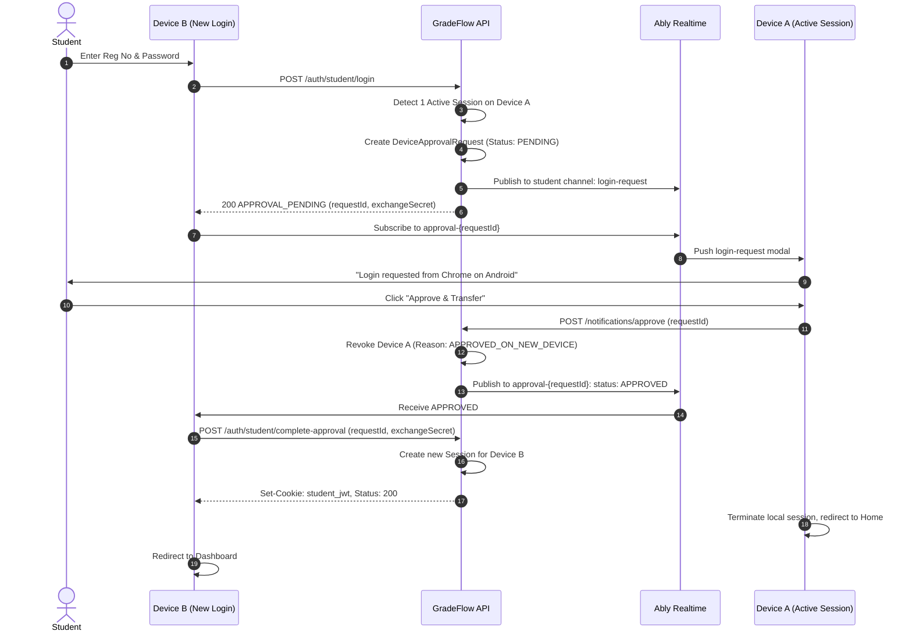

# GradeFlow — Master Authentication & Session Architecture Reference (`brain.md`)

> **Authoritative Technical Documentation**  
> This document serves as the single source of truth for the entire GradeFlow authentication system. Any engineer, auditor, or AI agent reading this document will understand every role, state machine, lifecycle transition, security boundary, and test case.

---

## Table of Contents

1. [Architectural Principles & Non-Negotiables](#1-architectural-principles--non-negotiables)
2. [Role Definitions & Permissions Matrix](#2-role-definitions--permissions-matrix)
3. [Device Limits, Inactivity TTLs & Eviction Rules](#3-device-limits-inactivity-ttls--eviction-rules)
4. [Cookie Architecture & Same-Browser Role Isolation](#4-cookie-architecture--same-browser-role-isolation)
5. [Session Lifecycle & Resurrection Immunity](#5-session-lifecycle--resurrection-immunity)
6. [Normal Student Device Approval & Transfer Protocol](#6-normal-student-device-approval--transfer-protocol)
7. [Admin Button Visibility & Global Availability State Machine](#7-admin-button-visibility--global-availability-state-machine)
8. [Zero-Polling Realtime Architecture (Ably)](#8-zero-polling-realtime-architecture-ably)
9. [OTP Rate Limiting, Cooldowns & Daily Quotas](#9-otp-rate-limiting-cooldowns--daily-quotas)
10. [Dual-Runtime Parity (Express Backend vs Vercel Serverless)](#10-dual-runtime-parity-express-backend-vs-vercel-serverless)
11. [Complete Forensic Test Matrix & Expected Outcomes](#11-complete-forensic-test-matrix--expected-outcomes)

---

## 1. Architectural Principles & Non-Negotiables

GradeFlow's authentication system operates under strict production engineering invariants:

1. **Zero Polling**:
   - No `setInterval` or `setTimeout` loops for querying auth status, device approvals, or admin button visibility.
   - Initial load uses **one single coordinated bootstrap** (`GET /api/auth/bootstrap`).
   - Subsequent state changes are pushed via **Ably WebSocket events**.
2. **Server is Authoritative**:
   - Client variables, localStorage, route changes, or cookies NEVER dictate session validity or device counts.
   - Active device count is calculated on the server from non-expired, active MongoDB session records.
3. **Targeted Exact-Session Revocation**:
   - Sessions are identified by unique `sessionId` (UUIDv4).
   - Logging out Device A MUST NEVER invalidate Device B by matching `userAgent` or IP guesswork.
4. **Mutual Role Isolation**:
   - Student credentials (`student_jwt`) and Admin credentials (`jwt`) coexist independently in the same browser.
   - Deleting one cookie or logging out of one role leaves the other role completely untouched.
5. **Dual-Runtime Parity**:
   - GradeFlow runs on both an Express development backend (`backend/routes/auth.js`) and a Vercel Serverless environment (`frontend/api/auth.js`).
   - Both runtimes share identical session validation logic, constants, and cryptographic token handling.

---

## 2. Role Definitions & Permissions Matrix

| Role | Identifier | Auth Credential | Max Concurrent Devices | Target Portal |
|---|---|---|---|---|
| **Normal Student** | Registration Number (`regNo`) | Password / OTP → `student_jwt` | **1 Device** (Transfer on 2nd) | `/dashboard/:regNo` |
| **Special Student** | Hardcoded Reg: `230301120327` | Password / OTP → `student_jwt` | **2 Devices** (Strict Cap) | `/dashboard/:regNo` |
| **Master Admin** | Email / Username | Password + 2FA OTP → `jwt` | **2 Devices** (Strict Cap) | `/admin/dashboard` |
| **Sub-Admin** | Email | Password + 2FA OTP → `jwt` | **2 Devices** (Strict Cap) | `/admin/dashboard` (RBAC) |
| **Guest** | None (Unauthenticated) | None (`student_jwt: null`, `jwt: null`) | N/A | `/` (Public pages) |

---

## 3. Device Limits, Inactivity TTLs & Eviction Rules

```
+-------------------+-------------+-------------------+--------------------+------------------------+
| Role              | Max Devices | Inactivity TTL    | Total Session TTL  | Device Limit Breach    |
+-------------------+-------------+-------------------+--------------------+------------------------+
| Normal Student    | 1           | 7 Days            | 30 Days            | Triggers Approval Flow |
| Special Student   | 2           | 7 Days            | 30 Days            | HTTP 403 (Blocked)     |
| Master Admin      | 2           | 1 Hour            | 30 Days (Extended) | HTTP 403 (Blocked)     |
| Sub-Admin         | 2           | 1 Hour            | 30 Days (Extended) | HTTP 403 (Blocked)     |
+-------------------+-------------+-------------------+--------------------+------------------------+
```

### Detailed Inactivity Behavior:
- **Student Inactivity (7 Days)**:
  `STUDENT_INACTIVITY_TTL_MS = 7 * 24 * 60 * 60 * 1000`  
  If a student does not interact with the app for 7 consecutive days, their session is considered stale and excluded from active session queries, automatically freeing up capacity.
- **Admin Inactivity (1 Hour)**:
  `ADMIN_ACTIVITY_TTL_MS = 60 * 60 * 1000`  
  If an administrator is idle for > 1 hour, `getActiveAdminSessions` excludes that session from the active device count. If 2 devices were active and 1 goes idle for > 1 hour, the active count drops from `2 -> 1`, making the Admin Portal button visible again.

---

## 4. Cookie Architecture & Same-Browser Role Isolation

GradeFlow utilizes two separate HttpOnly cookies for credentials, plus one non-sensitive browser presence cookie:

1. **`student_jwt`** (HttpOnly, SameSite=Lax, Path=/, Secure in prod):
   - Contains: `{ regNo, sessionId, role: "student" }`.
   - Used strictly for student portal access and endpoints (`/api/student/*`, `/api/auth/student/*`).
2. **`jwt`** (HttpOnly, SameSite=Lax, Path=/, Secure in prod):
   - Contains: `{ adminId, sessionId, role: "admin", isSubAdmin: boolean }`.
   - Used strictly for administrative endpoints (`/api/admin/*`, `/api/auth/admin/*`).
3. **`gf_auth_present`** (Non-HttpOnly, SameSite=Lax, Path=/, Max-Age=60 days):
   - Purely a client UI hint (`1` or omitted) indicating *at least one* role is logged in.
   - **Security Guarantee**: Forging `gf_auth_present=1` NEVER grants access. The server validates real cryptographic signatures inside `student_jwt` or `jwt`.

### Mutual Cookie Clearing Rules:
```javascript
// When Student logs out:
res.setHeader("Set-Cookie", "student_jwt=; Path=/; Max-Age=0; Expires=Thu, 01 Jan 1970 00:00:00 GMT");
// Only clear gf_auth_present if NO Admin cookie is present!
if (!cookies.jwt || cookies.jwt === "none") {
  res.appendHeader("Set-Cookie", "gf_auth_present=; Path=/; Max-Age=0; ...");
}

// When Admin logs out:
res.setHeader("Set-Cookie", "jwt=; Path=/; Max-Age=0; Expires=Thu, 01 Jan 1970 00:00:00 GMT");
// Only clear gf_auth_present if NO Student cookie is present!
if (!cookies.student_jwt || cookies.student_jwt === "none") {
  res.appendHeader("Set-Cookie", "gf_auth_present=; Path=/; Max-Age=0; ...");
}
```

---

## 5. Session Lifecycle & Resurrection Immunity

### The Session Document Structure (`AdminSession`, `StudentSession`, `SubAdminSession`):
- `sessionId`: String, UUIDv4, unique index.
- `isActive`: Boolean (`true` = valid, `false` = revoked/logged out).
- `lastActiveAt`: Date (updated on user interactions).
- `expiresAt`: Date (hard TTL index).
- `revokedAt`: Date (timestamp when session was terminated).
- `revokeReason`: String (`EXPLICIT_LOGOUT`, `APPROVED_ON_NEW_DEVICE`, `INACTIVITY_TIMEOUT`, `SECURITY_REVOKE`).

### Resurrection Immunity:
A revoked session (`isActive: false`) must NEVER be resurrected by subsequent calls.
Both runtimes enforce atomic updates:
```javascript
// sessionManager.js
await session.constructor.updateOne(
  { _id: session._id, isActive: true }, // Filter guarantees only currently active sessions can be touched
  { $set: { lastActiveAt: new Date(now) } }
);
```
If `isActive` is `false`, `updateOne` modifies 0 documents. Revoked sessions stay permanently dead.

### Touch Write Throttling:
To prevent MongoDB write contention, `touchAdminSession` and `touchSession` are throttled to **15 seconds**. If a request arrives within 15 seconds of the last touch, the DB write is skipped.

---

## 6. Normal Student Device Approval & Transfer Protocol

Normal Students are strictly limited to **1 active device**. When a second device attempts to log in, GradeFlow initiates a secure, real-time approval handover:



### Key Guarantees:
- **Zero Polling**: Device B does NOT poll `/approval-status`. It listens to Ably channel `approval-{requestId}`.
- **Atomic Handover**: Device A is revoked only when Device A explicitly clicks Approve.
- **Denial Flow**: If Device A clicks Deny, Ably pushes `DENIED`, Device B displays rejection notice, and Device A remains active.
- **Expiration**: Requests expire after 120 seconds.

---

## 7. Admin Button Visibility & Global Availability State Machine

The Admin button in the Navbar and LandingFooter is a **hybrid availability UI element**.

### Visibility Rules:

| Viewer Identity | 0 Active Admin Devices | 1 Active Admin Device | 2 Active Admin Devices |
|---|---|---|---|
| **Master Admin (Logged in this tab)** | ✅ **VISIBLE** | ✅ **VISIBLE** | ✅ **VISIBLE** (Direct dashboard access) |
| **Sub-Admin (Logged in this tab)** | ✅ **VISIBLE** | ✅ **VISIBLE** | ✅ **VISIBLE** (Direct dashboard access) |
| **Special Student (`230301120327`)** | ✅ **VISIBLE** | ✅ **VISIBLE** | ❌ **HIDDEN** |
| **Normal Student (Logged in)** | ❌ **HIDDEN** | ❌ **HIDDEN** | ❌ **HIDDEN** |
| **Guest (Unauthenticated)** | ❌ **HIDDEN** | ❌ **HIDDEN** | ❌ **HIDDEN** |

### State Transitions (Automatic Mode):
- `0 -> 1 Active Devices`: Remains **VISIBLE** for eligible roles.
- `1 -> 2 Active Devices`: Transitions to **HIDDEN** for all non-active tabs.
- `2 -> 1 Active Devices` (One Admin logs out): Transitions from **HIDDEN -> VISIBLE**.
- `1 -> 0 Active Devices` (Last Admin logs out): Transitions to **VISIBLE** for Special Student.

### Component Implementation (`Navbar.jsx` & `LandingFooter.jsx`):
```javascript
let canSeeAdmin = false;
if (adminButtonConfig && adminButtonConfig.mode === "MANUAL") {
  // Manual Override Config
  const roles = adminButtonConfig.allowedRoles || {};
  if (isMainAdminViewer) canSeeAdmin = roles.mainAdmin !== false;
  else if (isSubAdminViewer) canSeeAdmin = roles.subAdmin !== false;
  else if (isSpecialAdminPortalViewer) canSeeAdmin = roles.specialStudent !== false;
  else if (loggedInRegNo) canSeeAdmin = Boolean(roles.allStudents);
  else canSeeAdmin = Boolean(roles.guests);
} else {
  // Automatic System Mode:
  if (isMainAdminViewer || isSubAdminViewer) {
    canSeeAdmin = true; // Logged-in admin always has dashboard button
  } else if (isSpecialAdminPortalViewer) {
    canSeeAdmin = Boolean(isAdminButtonVisible); // Special student follows availability
  } else {
    canSeeAdmin = false; // Normal students & guests never see admin button
  }
}
```

### Route Access Enforcement (`AdminRouteGuard` in `App.jsx`):
- **Direct URL Access to Admin Gate (`/admin`, `/admin/login`)**:
  - Even if a user attempts to navigate directly by typing `/admin` or `/admin/login` into the browser URL bar:
    - If user is NOT already an authenticated Admin:
      - Access is ONLY permitted if **Special Student (`230301120327`) is currently logged in** in this browser session, AND **`isAdminButtonVisible` is true** (active devices < 2).
      - If a **Normal Student** or **Guest / unauthenticated visitor** navigates to `/admin` or `/admin/login`, they are immediately blocked with the **403 Forbidden Page (`<UnauthorizedState />`)**.
- **Protected Administrative Pages (`/admin/dashboard`, `/admin/traffic`, etc.)**:
  - Strictly requires an active, authenticated administrative session token (`adminToken`). Any unauthenticated attempt displays `<UnauthorizedState />`.

---

## 8. Zero-Polling Realtime Architecture (Ably)

### Channel & Event Map:

| Channel Name | Event Name | Audience | Purpose | Payload |
|---|---|---|---|---|
| `broadcasts-all` | `admin-availability-updated` | All open browser tabs | Syncs Admin button visibility | `{ activeDeviceCount: number, isAdminButtonVisible: boolean }` |
| `broadcasts-all` | `timetable-updated` | All students & visitors | Invalidate timetable cache | `{ version, updatedAt }` |
| `admin-control` | `session-revoked` | Admins | Targeted eviction of revoked admin session | `{ sessionId }` |
| `admin-control` | `feedback-updated` | Admins | Realtime feedback count sync | `{ count }` |
| `student-{regNo}` | `login-request` | Target Student (Active Device) | Prompt for multi-device approval | `{ requestId, device, location }` |
| `approval-{requestId}` | `approval-status` | Requesting Device | Real-time approval result | `{ status: "APPROVED" \| "DENIED" \| "EXPIRED" }` |

### Connection Optimization:
- Exactly **one shared Ably connection** per authenticated role context.
- WebSocket is reused across all SPA routes (does not tear down and recreate on route navigation).
- Event handlers are attached once inside `AppContext.jsx` using stabilized `useCallback` and `useRef` handlers.

---

## 9. OTP Rate Limiting, Cooldowns & Daily Quotas

To protect email delivery and prevent brute-force attacks, GradeFlow enforces multi-layered rate limits and role-specific OTP quotas:

### Role-Based Daily OTP Quota Rules:
1. **Normal Students**:
   - **Daily Quota**: **3 OTP requests per 24-hour rolling window**.
   - **Per-Request Cooldown**: **60 seconds**.
   - **Reset in Admin OTP Management**: Resets counter to **0/3**, cleanly clears `sendTimestamps: []`, `otpSendCount: 0`, and `lastOtpSentAt: null` across `[todayKey, yesterdayKey]`, and removes active `OtpVerification` records.
2. **Special Student (`230301120327`)**:
   - **Daily Quota**: **5 OTP requests per 24-hour rolling window**.
   - **Per-Request Cooldown**: **60 seconds**.
   - **Reset in Admin OTP Management**: Resets counter to **0/5**, cleanly clears `sendTimestamps: []` and active verification records.
3. **Master Administrator**:
   - **Storage**: `StudentDailyLimit` collection with key `ADMIN:<email>` (e.g. `ADMIN:jaganparida35@gmail.com`).
   - **Daily Quota**: **5 OTP requests per 24-hour rolling window**.
   - **Per-Request Cooldown**: **60 seconds** between successive requests.
   - **Attempt Lockout**: 5 failed password attempts triggers a temporary administrative lockout.
   - **OTP Validity**: 3 minutes TTL with bcrypt hash verification.
   - **Reset in Admin OTP Management**: Direct 1-click reset via the **Administrator OTP Limit Management** card (clears rolling limits and unverified OTPs; restores full 5 attempts).

### Student Device Session Revocation Rules:
- **Single Device Session**: Revoking a specific session sets `isActive: false` on that session and publishes an Ably `session-revoked` event with `{ revokedSessionId, sessionId }`. The targeted browser immediately terminates its session and redirects to the home page.
- **Revoke All Sessions**: Revoking all sessions sets `isActive: false` across all active sessions for that student and publishes an Ably `session-revoked` event with `{ allSessionsRevoked: true }`. All connected devices for that student are immediately logged out.

---

## 10. Dual-Runtime Parity (Express Backend vs Vercel Serverless)

GradeFlow maintains strict feature parity between its local Express server and production Vercel serverless functions:

| Feature / Logic | Express Backend (`backend/`) | Vercel Serverless (`frontend/api/`) |
|---|---|---|
| Auth Router Entrypoint | `routes/auth.js` | `api/auth.js` |
| Session Management | `utils/sessionManager.js` | `api/_lib/sessionManager.js` |
| Database Connection | Persistent Mongoose (`server.js`) | Reused Serverless Mongoose (`_lib/db.js`) |
| Realtime Service | `services/ablyService.js` | `api/_lib/ablyService.js` |
| Email Delivery Manager | `utils/emailProviderManager.js` | `api/_lib/emailProviderManager.js` |
| Model Definitions | `backend/models/*.js` | `frontend/api/_lib/models/*.js` |

Any bug fix or logic change applied to `frontend/api/` MUST also be mirrored in `backend/` to maintain 100% test and runtime parity.

---

## 11. Complete Forensic Test Matrix & Expected Outcomes

All 22 core test scenarios must pass without regressions:

| # | Scenario | Expected Outcome | Critical Assertion |
|---|---|---|---|
| **1** | Master Admin 0 devices | Admin button VISIBLE to eligible UI | `activeAdminCount == 0`, button rendered |
| **2** | Master Admin 1st device login | Device 1 authenticated; count = 1 | `activeAdminCount == 1`, button visible |
| **3** | Master Admin 2nd device login | Device 2 authenticated; count = 2 | `activeAdminCount == 2`, button hidden on other tabs |
| **4** | Master Admin 3rd device attempt | HTTP 403 `DEVICE_LIMIT_REACHED` | Devices 1 & 2 remain active; 3rd blocked |
| **5** | Admin A explicit logout | Device A revoked; Device B stays active | Count drops `2 -> 1`; Device B button visible |
| **6** | Stale Admin session (>1h idle) | Stale session filtered out by TTL | Count drops `2 -> 1`; capacity freed |
| **7** | Sub-Admin login & 2-device cap | SubAdmin isolated; max 2 devices | SubAdmin cannot access Master Admin settings |
| **8** | SubAdmin RBAC routes | Overview/Toppers allowed; Settings denied | HTTP 403 on unauthorized SubAdmin action |
| **9** | Normal Student login (Device 1) | Exactly 1 active session created | `isSessionValid == true` |
| **10** | Normal Student refresh | Session remains valid; 0 duplicates | No duplicate session inserted |
| **11** | Normal Student 2nd device login | HTTP 200 `APPROVAL_PENDING` | Approval request created in MongoDB |
| **12** | Device A clicks "Deny" | Request marked `DENIED`; A remains active | Device B blocked; Device A untouched |
| **13** | Device A clicks "Approve" | Device A revoked; Device B authenticated | Count = 1; owner transfers to Device B |
| **14** | Special Student 1st & 2nd login | Both devices active simultaneously | Count = 2; both valid |
| **15** | Special Student 3rd device login | HTTP 403 `DEVICE_LIMIT_REACHED` | No OTP generated; 3rd device blocked |
| **16** | Special Student Device 1 logout | Device 1 revoked; Device 2 remains active | Count = 1; Device 2 untouched |
| **17** | Same-browser Student + Admin | Both credentials coexist independently | Student cookie does not overwrite Admin |
| **18** | Same-browser Student logout | Student revoked; Admin remains logged in | `student_jwt` cleared, `jwt` preserved |
| **19** | Same-browser Admin logout | Admin revoked; Student remains logged in | `jwt` cleared, `student_jwt` preserved |
| **20** | Forged `gf_auth_present=1` | Server rejects request (HTTP 401) | Presence cookie grants 0 authorization |
| **21** | Session resurrection attack | Calling `touchSession` on revoked session | Revoked session remains `isActive: false` |
| **22** | SPA Route Navigation | Home -> Admin -> Dashboard -> Home | 0 unnecessary auth requests; 0 count changes |

---

### How to Run Automated Verification Suites:

```powershell
$env:NODE_PATH="D:\Important\Projects\Advanced\Gradeflow\backend\node_modules;D:\Important\Projects\Advanced\Gradeflow"

# 1. Full Cross-Role Audit (91 assertions)
node "C:\Users\jagan\.gemini\antigravity\brain\c1da42ae-8d1b-49c7-9cf8-27cc414c167a\scratch\test_cross_role_audit.js"

# 2. Same-Browser & Route Isolation (20 assertions)
node "C:\Users\jagan\.gemini\antigravity\brain\c1da42ae-8d1b-49c7-9cf8-27cc414c167a\scratch\test_same_browser_and_route_isolation.js"

# 3. Targeted Safe-Fix Suite (18 assertions)
node "C:\Users\jagan\.gemini\antigravity\brain\c1da42ae-8d1b-49c7-9cf8-27cc414c167a\scratch\test_targeted_safe_fix.js"

# 4. Presence & Auth State Suite (23 assertions)
node "C:\Users\jagan\.gemini\antigravity\brain\c1da42ae-8d1b-49c7-9cf8-27cc414c167a\scratch\test_presence_and_auth_state.js"
```
